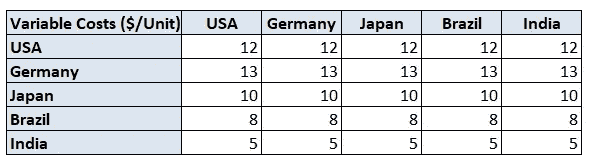

# 用 Python 优化供应链

> 原文：<https://towardsdatascience.com/supply-chain-optimization-with-python-23ae9b28fd0b?source=collection_archive---------3----------------------->

## 寻找制造工厂的最佳位置，以满足客户需求并降低生产成本


供应链网络优化问题—(图片由作者提供)

供应链优化充分利用数据分析，找到工厂和**配送中心**的最佳组合，以匹配**供应**和**需求。**

由于目前运输成本的飙升，公司开始挑战他们目前的足迹，以适应后 covid *“新常态”*。

在这篇文章中，我们将提出一个简单的方法使用线性规划的供应链优化考虑

*   您工厂的固定生产成本**(美元/月)**
*   每生产单位的可变生产成本**($/单位)**
*   运费 **($)**
*   客户需求**(单位)**

> 在过去 12 个月里运输成本增加了两倍的情况下，我们应该继续外包吗？

💌新文章直接免费放入你的收件箱:[时事通讯](https://www.samirsaci.com/#/portal/signup)

如果你喜欢看，你可以看看这篇文章的视频版本

# 一、如何用 Python 设计供应链网络？

## 问题陈述

作为一家国际制造公司的供应链管理负责人，考虑到最近**运输成本**的上涨和对未来需求的预测，您想要重新定义未来**5 年的供应链网络**。


你的供应链网络图—(图片由作者提供)

**你的供应链网络**

*   巴西、美国、印度、日本、德国的 5 个市场
*   **2 类** [**生产设施**](https://youtu.be/130AKb2DejM) **:** 低产能和高产能场所
*   运输成本**(美元/集装箱)**
*   客户需求**(单位/年)**

**制造设施固定成本**

*   设备的资本支出(机器、存储、..)
*   公用事业(电、水、..)
*   工厂管理人员、行政人员
*   空间租赁

这些费用取决于国家和工厂的类型。


制造场所固定成本—(图片由作者提供)

**生产可变成本**

*   生产线操作员
*   原材料



制造场所固定成本—(图片由作者提供)

例如，在德国生产的一个单位的可变成本是 13 美元/单位。

**运输可变成本**

*   每个集装箱的成本(美元/集装箱)
*   假设:1 个集装箱可以装 1000 个单位


海运运费(美元/集装箱)——(图片由作者提供)

例如，如果你想把一个集装箱从德国运到日本，费用是 1231 美元(每个集装箱)。

**按工厂划分的生产能力**


制造现场产能—(图片由作者提供)

例如，巴西的高产能工厂可以生产 1，500，000 台(台/月)。

**每个市场的客户需求**


制造现场产能—(图片由作者提供)

> 你可以在这个 Github 资源库中找到完整的代码:[链接](https://github.com/samirsaci/supply-chain-optimization)
> 我的作品集与其他项目: [Samir Saci](https://samirsaci.com/)

# **二。结果**

**让我们尝试三种场景**

*   场景 1:初始参数
*   情景 2:我们增加印度的产能(x2)
*   场景 3:集装箱短缺导致运输成本飙升

## **-场景 1:初始场景**

*   巴西工厂为当地市场和美国生产

```
**Facilities: 1 high capacity plant**
('Brazil','Brazil') = 145,000 **(Units/Month)**
('Brazil','USA') = 1,250,000 **(Units/Month)**
```

*   印度工厂为除巴西以外的所有国家生产产品

```
**Facilities: 1 high capacity plant and 1 low capacity plant**
('India','Germany') = 90,000 **(Units/Month)**
('India','India') = 160,000 **(Units/Month)**
('India','Japan') = 200,000 **(Units/Month)**
('India','USA') = 1,550,000 **(Units/Month)**
```

*   由于印度产能有限，日本需要在当地生产

```
**Facilities: 1 high capacity plant**
('Japan','Japan') = 1,500,000 **(Units/Month)**
```

*   诉讼结束时的全部

```
Total Costs = **62,038,000 ($/Month)**
```

## **-情景 2:外包到低成本地区**

*如果我们将印度的高产能工厂规模扩大一倍会怎么样？*

让我们试着将印度高生产能力工厂的规模扩大一倍，假设这将使固定成本增加一倍。

*   巴西工厂仍在为当地市场和美国生产

```
**Facilities: 1 high capacity plant**
('Brazil','Brazil') = 145,000 **(Units/Month)**
('Brazil','USA') = 1,250,000 **(Units/Month)**
```

*   印度工厂为除巴西以外的所有国家生产产品

```
**Facilities: 2 high capacity and 1 low capacity plants**
('India','Germany') = 90,000 **(Units/Month)**
('India','India') = 160,000 **(Units/Month)**
('India','Japan') = 1,700,000 **(Units/Month)**
('India','USA') = 1,550,000 **(Units/Month)**
```

*   日本不再在本地生产。

诉讼结束时的全部

```
-19.4(%) vs. Scenario 1
Total Costs = **51,352,000** ($/Month)
```

## **-场景 3:集装箱短缺导致运输成本飙升**

*如果我们把集装箱成本乘以 5 会怎么样？*

*   巴西只为当地市场生产

```
**Facilities: 1 low capacity plant**
('Brazil','Brazil') = 145,000 **(Units/Month)**
```

*   美国开始为当地市场和日本生产

```
**Facilities: 1 high capacity plant**
('USA','Japan') = 200,000 **(Units/Month)**
('USA','USA') = 1,300,000 **(Units/Month)**
```

*   印度关闭了其低产能工厂

```
**Facilities: 1 high capacity plant**
('India','Germany') = 90,000 **(Units/Month)**
('India','India') = 160,000 **(Units/Month)**
('India','USA') = 1,500,000 **(Units/Month)**
```

*   日本开始为当地市场生产

```
**Facilities: 1 high capacity plant**
('Japan','Japan') = 1,500,000 **(Units/Month)**
```

由于产能有限，日本和美国仍然依赖印度工厂。

诉讼结束时的全部

```
Total Costs = **92,981,000 ($/Month)**
```

# 三。构建您的模型

*关注我的 medium，了解更多与供应链数据科学相关的见解。*

我们将使用 python 的纸浆库。PuLP 是一个线性(LP)和整数规划(IP)问题的建模框架，用 Python 编写，由 COIN-OR Foundation(运筹学计算基础设施)维护。

## 1.声明您的变量、参数和模型

*   你的目标是最小化你的成本
*   下限=0:生产的单位不能为负值

## 2.定义目标并添加约束

## 3.求解模型并分析结果

# 三。结论和后续步骤

*欢迎随时关注我的 medium，获取更多与数据分析和供应链管理相关的文章*

## 结论

该模型允许您模拟影响运营和商业参数的几种情况。

*   如果印度的需求激增怎么办？
*   **如果我们不得不关闭在巴西的工厂怎么办？**
*   **如果我们把日本的产能增加两倍会怎么样？**

场景 3 显示的是运输成本飙升的一个例子，这可能会推动公司转向更多的本地足迹，工厂只为当地市场生产。

## 可持续采购


(图片由作者提供)

类似的方法可以用来选择你的供应商，考虑一个目标函数，将最大限度地减少[二氧化碳排放量](https://www.youtube.com/watch?v=ddthuvFQdGY)。

可持续采购是在选择供应商时整合社会、道德和环境绩效因素的过程。

这包括根据一套可持续性标准对供应商进行评估和评价，如劳工权利、健康和安全、环境影响、人权等。


基于环境因素的供应商评估—(图片由作者提供)

> *利用数据分析，结合经济和环境约束，自动选择最佳供应商*

在本文中，我们将了解如何使用数据分析来设计最佳供应链网络，以最小化成本和环境影响。

<https://www.samirsaci.com/what-is-sustainable-sourcing/>  

## 改进您的模型

这个简单的模型可以帮助你获得供应链网络优化的线性优化的潜力。我们可以通过添加约束来快速改进这个模型

*   存储成本
*   [碳排放限制](https://www.youtube.com/watch?v=ddthuvFQdGY) (CO2 = f(距离，重量))
*   [交货提前期](https://youtu.be/V6qnuZ-QcKE)
*   通关费
*   货币变化

请随意分享额外约束的建议，以改进模型并满足您所在行业的业务需求。

# 关于我

让我们在 [Linkedin](https://www.linkedin.com/in/samir-saci/) 和 [Twitter](https://twitter.com/Samir_Saci_) 上连线，我是一名供应链工程师，正在使用数据分析来改善物流运营和降低成本。

如果你对数据分析和供应链感兴趣，可以看看我的网站

<https://samirsaci.com>  

# 参考

[1]运筹学的计算基础设施，优化与纸浆(文档)，[链接](https://coin-or.github.io/pulp/)