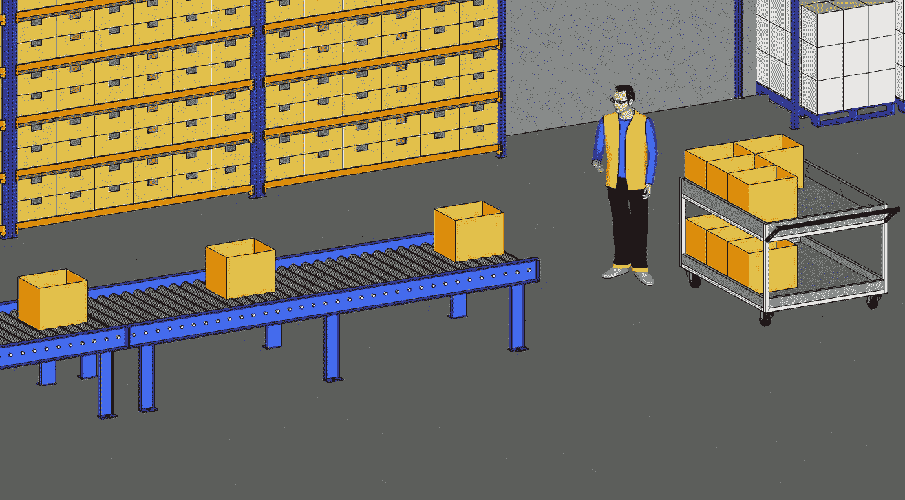
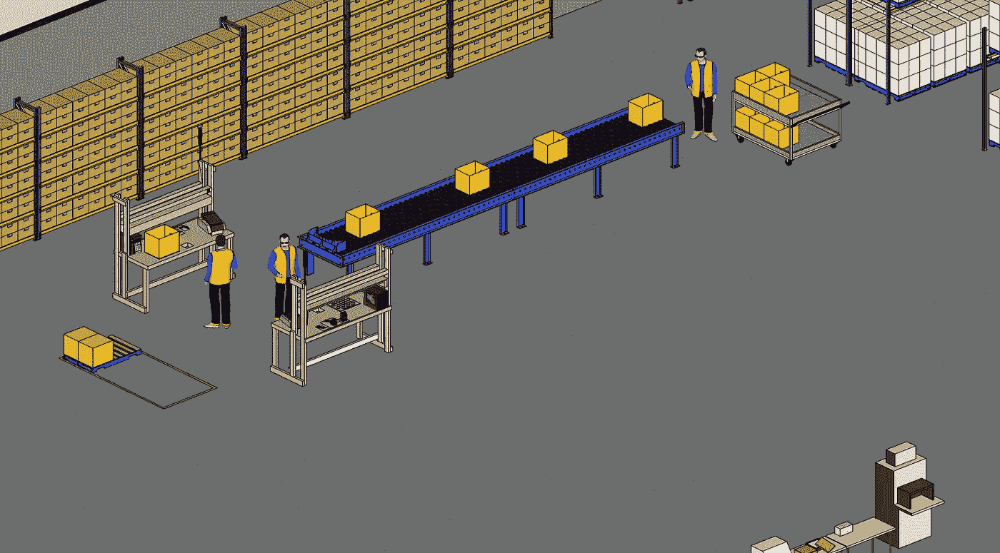

# 基于排队论的供应链流程设计

> 原文：<https://towardsdatascience.com/supply-chain-process-design-using-the-queueing-theory-2ad75e58d1f3?source=collection_archive---------17----------------------->

## 用 Python 应用**排队论的几个原理为**电子商务履行中心**设计**一个包裹打包流程****


用排队论设计一个包裹打包过程—(图片由作者提供)

供应链可以被定义为一个为向客户提供服务和商品而构建的流程和库存地点的网络。

这个网络通常支持你公司的商业战略；它的目标可以是多种多样的，如提供市场上质量最好的产品、最低的成本或最个性化的服务或产品。

作为供应链工程师，您的目标是设计最有效的流程，以确保为客户提供良好的服务水平和盈利能力。

本文将利用 Python 中的排队论原理来设计一个电子商务履行中心的包裹打包流程。

💌新文章直接免费放入你的收件箱:[时事通讯](https://www.samirsaci.com/#/portal/signup)

```
**SUMMARY**
**I. Problem Statement** What is the most efficient solution between single and multiple lines solutions?Scenario
You got the approval from your management for investing in a second packing station and you're wondering how should you design the layout.
**II. Optimal Solution using Queuing Theory** 1\. Introduction to Process Analysis
2\. The Little’s Law
3\. Introduction to the Queuing Theory
4\. How can we estimate this waiting time?
5\. Queueing Theory to estimate tq **III. Build a Simulation Model with Python
IV. Conclusion**
```

如果你喜欢看，可以看看这篇文章的视频版本

简短的讲解视频—(视频由作者提供)

# 一.问题陈述

## 方案

你是一家跨国服装零售公司的出境部经理，这家公司以男女老少的快速时尚服装而闻名。

你面临的一个主要问题是[外向生产力](https://www.youtube.com/watch?v=KR_ziEiPcDk)；在[提货](https://www.youtube.com/watch?v=XejgbF2m_8g)后，您的订单等待发货的时间过长。

根据现场观察和生产率分析，您知道包装过程是瓶颈。


具有单线包装站的出站区域—(图片由作者提供)

1.  仓库拣货员把包裹放在手推车上，放在传送带上



步骤 1 —(作者提供的图片)

**2。包装操作员从传送带上取走包裹，并进行数量检查和包装(放入填充材料，关闭箱子)**


步骤 2 —(作者提供的图片)

您的管理层批准您投资第二个包装站，您想知道应该如何设计布局。

## 解决方案 1:保持单线有两个平行站



解决方案 1 —(图片由作者提供)

## 解决方案 2:添加第二条带有专用站的线路


解决方案 2 —(图片由作者提供)

## 问题

> *最高效的*(包装生产率)*解决方案是什么？*

[](http://samirsaci.com) [## 萨米尔·萨奇

### 数据科学博客，专注于仓储，运输，数据可视化和机器人流程自动化…

samirsaci.com](http://samirsaci.com) 

# 二。使用排队论的最优解

排队论可以被定义为使用高级数学概念研究等待时间的科学。

如果你想了解更多，我强烈建议你看看华莱士·j·霍普写的《供应链科学》这本书。

## 1.过程分析介绍


简单的过程—(图片由作者提供)

在本文中，我们将通过一系列将输入转换为输出的操作来定义流程。

为了简化理解，让我们介绍一些符号:


符号—(作者提供的图片)

## 2.利特尔法则

过了很长一段时间，当你的系统变得稳定时，你可以使用这个法则来计算系统中的平均项目数(WIP)


符号—(作者提供的图片)

## 3.排队论导论

在此过程中，生产率问题的原因是包装前需要在传送带上等待包裹的时间。


有等待时间的简单流程—(图片由作者提供)

你的操作员的提货效率相当稳定；但是，当您可能会遇到会减缓流程的问题时:

*   提货错误:例如，提货人放错了商品数量
*   损坏:由于损坏，一些项目没有通过质量最终检查

在初始配置中，这些事件会增加包裹在 WIP 中的等待时间，并影响整体平均 ct。

## 4.我们如何估计这个等待时间？

让我们介绍一些符号:


到达参数—(图片由作者提供)


处理参数—(图片由作者提供)

我们希望改进的主要指标是平均周期时间，其定义如下:

```
**CT = tq + tp**with
tq: waiting time in the queue (min)
tp: effective process time
```

## 5.估计 tq 的排队论

利用排队论，我们可以近似地计算等待时间，


方程式—(图片由作者提供)

[](http://samirsaci.com) [## 萨米尔·萨奇

### 数据科学博客，专注于仓储，运输，数据可视化和机器人流程自动化…

samirsaci.com](http://samirsaci.com) 

# 三。用 Python 构建仿真模型

> *你可以在这个 Github (Follow Me)资源库中找到完整的代码:* [*链接*](https://github.com/samirsaci/central-limit) *我的作品集与其他项目:* [*萨米尔萨奇*](https://samirsaci.com/)

因素

```
**Arrivals,**
ra = 6 parcels/min
ta = 0.17 min/parcel
CVa: coefficient of variation of ta
**Processing,**
rp = 3 parcels/min
tp = 0.33 min/parcel
CVb: coefficient of variation of tp
```

## 1.两种解决方案的等待时间公式


方程式—(图片由作者提供)

*注*

> *我们有 u - > u/2，因为输入流通过两个包装站分流。*

## 2.模拟

方案

*   到达的确定性分布:CVa = 0
*   加工时间的随机分布:CVp in [0，2]

这种情况可以基于分批包装:您的提货操作员提前准备订单，并以恒定的时间间隔连续发送包裹。


场景 1 的模拟结果—(图片由作者提供)

评论

*   对于纯确定性场景(CVp = CVa = 0 ),我们没有区别，因为两种解决方案的排队时间都是零。
*   当我们引入处理时间的可变性(每个包裹要检查的物品数量、提货错误、质量问题)时，我们看到解决方案 1 优于解决方案 2。

## 3.结果的解释

1.  *如果您有一个有质量问题的包裹，如果您采取解决方案 2 (50%的输入流量),它将使整个生产线瘫痪。因此，如果处理时间的可变性很高，这种解决方案并不是最佳的。*
2.  *使用解决方案 1，我们可以确保第一批进来的包裹或多或少是第一批出去的包裹，而我们无法预测使用解决方案 2 的结果(假设您的一条生产线因为一个包裹而面临巨大的延迟)*

# 四。结论

*关注我，了解更多与供应链数据科学相关的见解。*

基于这些模拟结果，您可以估计对平均周期时间的影响*(通过将处理时间添加到队列中)*，并在设计中激励您的选择。

幸运的是，最高效的解决方案也是最便宜的，因为您不需要投资购买新的传送带。

## 将您的模型包含在数字双胞胎中

## 超出

如果你对**仓储流程改进**方法感兴趣，可以从下面的文章中获得更多启发。

[](https://www.samirsaci.com/optimize-warehouse-value-added-services-with-python/) [## 使用 Python 优化仓库增值服务

### 物流持续改进使用线性规划来增加您的最终装配的生产能力…

www.samirsaci.com](https://www.samirsaci.com/optimize-warehouse-value-added-services-with-python/) [](https://www.samirsaci.com/improve-warehouse-productivity-using-order-batching-with-python/) [## 使用 Python 的订单批处理提高仓库生产率

### 物流持续改进设计一个模拟模型来估计几个单拣货员路线的影响…

www.samirsaci.com](https://www.samirsaci.com/improve-warehouse-productivity-using-order-batching-with-python/) [](https://www.samirsaci.com/central-limit-theorem-for-process-improvement-with-python/) [## 用 Python 实现过程改进的中心极限定理

### 物流持续改进假设退货管理的工作量呈正态分布…

www.samirsaci.com](https://www.samirsaci.com/central-limit-theorem-for-process-improvement-with-python/) 

# 关于我

让我们在 [Linkedin](https://www.linkedin.com/in/samir-saci/) 和 [Twitter](https://twitter.com/Samir_Saci_) 上连线，我是一名供应链工程师，正在使用数据分析来改善物流运营和降低成本。

如果你对数据分析和供应链感兴趣，可以看看我的网站

[](https://samirsaci.com) [## Samir Saci |数据科学与生产力

### 专注于数据科学、个人生产力、自动化、运筹学和可持续发展的技术博客

samirsaci.com](https://samirsaci.com) 

# 参考

[1]供应链科学，华莱士·j·霍普