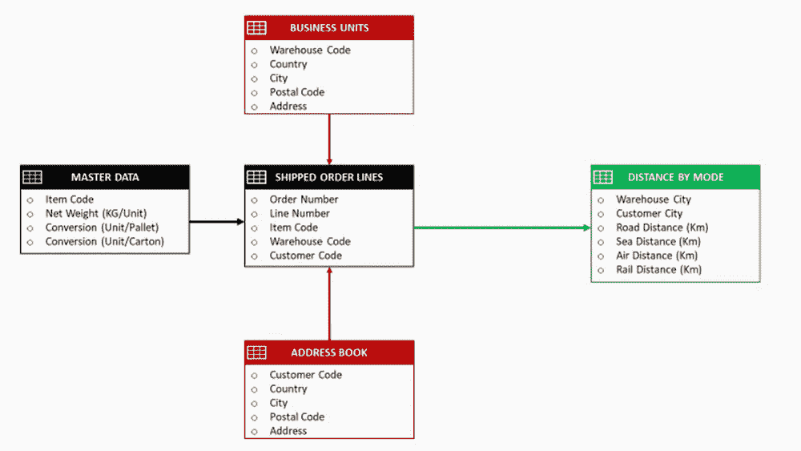
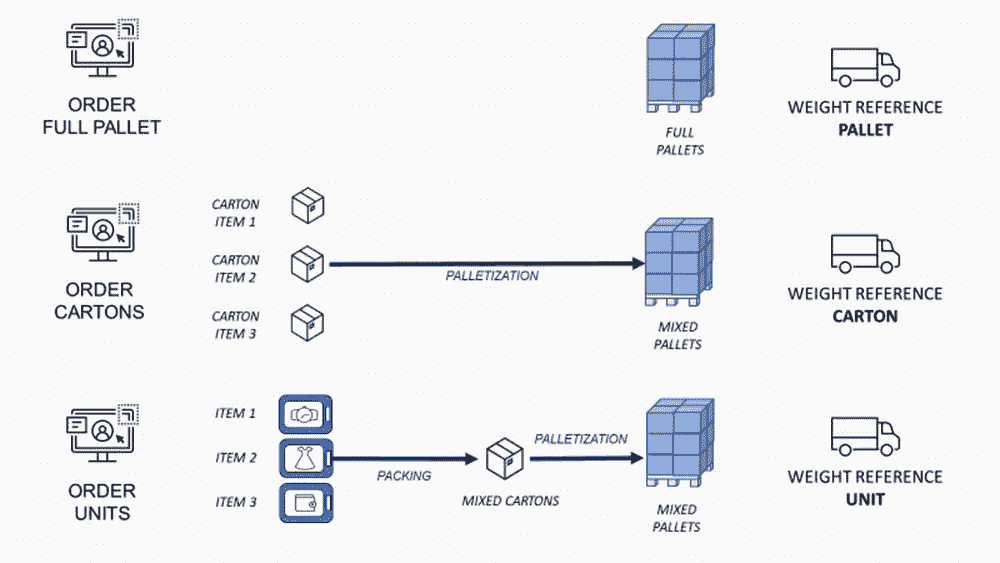
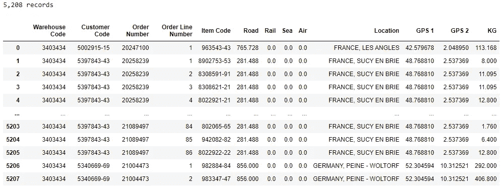
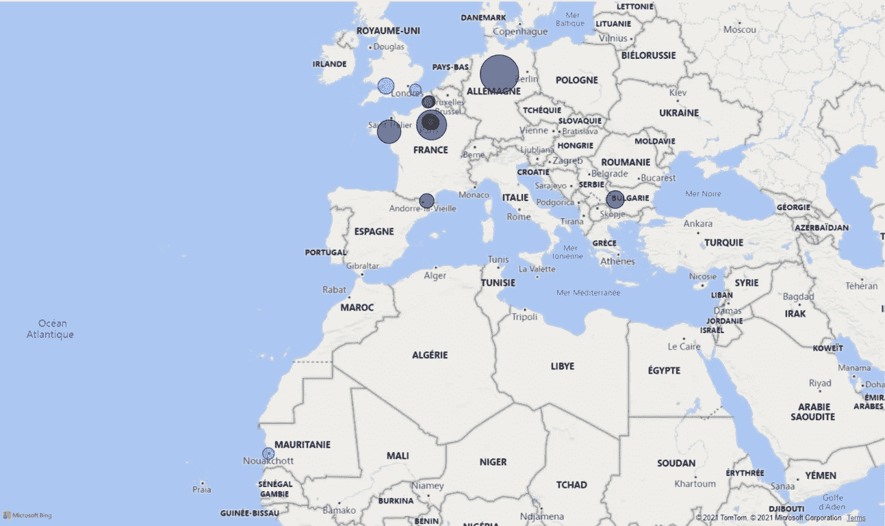
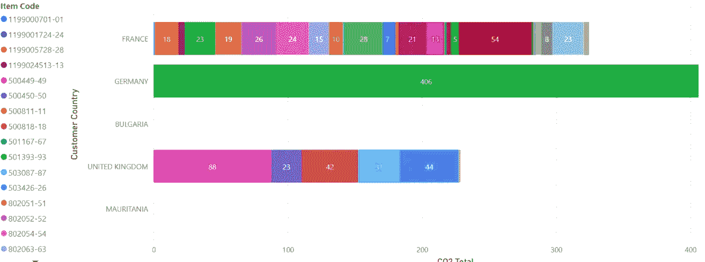
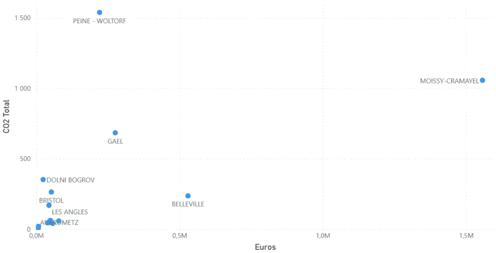

# 使用 Python 进行供应链可持续性报告

> 原文：<https://towardsdatascience.com/supply-chain-sustainability-reporting-with-python-161c1f63f267?source=collection_archive---------5----------------------->

## 构建侧重于分销网络二氧化碳排放的 ESG 报告的 4 个步骤


供应链可持续性报告—(图片由作者提供)

多年来，投资者和客户对可持续发展透明度的要求越来越高。

投资者在评估组织的价值和弹性时，越来越重视企业的可持续性。

因此，越来越多的组织投入资源建设可持续发展报告能力，并确定可持续供应链的最佳策略。

在本文中，我们将介绍一种简单的方法来使用 **Python 和 power bi**报告您的分销网络**的二氧化碳排放量。**

💌新文章直接免费放入你的收件箱:[时事通讯](https://www.samirsaci.com/#/portal/signup)

```
**SUMMARY****I. How to create a Supply Chain Sustainability report?** Calculate the CO2 emissions of multi-modal transportation ?
**II. Data Processing with Python** List of the datasets needed to build your report
**1\. Import Shipped Order Lines** All the purchased orders of your customers that have been shipped
**2\. Add Unit of Measure Conversions** Merge with Master Data to convert quantities in weight **3\. Distances Collections** Collect the distances by transportation mode
**III. CO2 Calculation** 1\. Final Calculation of the CO2 Emissions
2\. What can you do if you have missing data? **VI. Example of visualization using PowerBI**
```

如果你喜欢看，可以看看这篇文章的视频版本

# 一.**如何创建供应链可持续发展报告？**

## 定义

根据 GHG 协议公司标准([链接](https://ghgprotocol.org/sites/default/files/standards_supporting/FAQ.pdf))，温室气体排放分为三个范围:

*   **范围 1:由于公司的活动*(公司的设施，如制造厂/仓库、公司的车辆)*而释放到大气中的直接排放物**
*   **范围二:** **间接排放**来自发电的外购能源
    *(外购电、气、..)*
*   **范围 3:** **公司价值链中发生的所有间接排放** *(范围 2 之外)**(运输、运营浪费、出差……)*

在本文中，我们将关注与**下游运输**相关的**范围 3** 计算。

> 你的销售网络对环境有什么影响？

## 公式

根据法国环境署 Ademe 的协议([链接](https://www.bilans-ges.ademe.fr/en/accueil/contenu/index/page/user_guide/siGras/1))，估算运输二氧化碳排放量的公式为:


使用排放系数的公式—(图片由作者提供)

```
**With,**E_CO2: emissions in kilograms of CO2 equivalent (kgCO2eq)
W_goods: weight of the goods (Ton)
D: distance from your warehouse to the final destination(km)
F_mode: emissions factor for each transportation mode (kgCO2eq/t.km)
```

该公式提供了对二氧化碳排放量的粗略估计，而不需要高水平的运输数据粒度。

一种更准确的方法是，考虑车辆型号(卡车、集装箱运输船、飞机或火车)和装载率，估算每次运输的二氧化碳排放量。

<http://samirsaci.com>  

# 二。用 Python 处理数据

基于这个公式，我们现在可以开始收集数据来计算排放量。

> *我的 Github 资源库中带哑数据的完整代码:* [*链接*](https://github.com/samirsaci/supply-chain-sustainability) (跟随我的:D) *我的投资组合带其他项目:* [*萨米尔萨奇*](https://samirsaci.com/)



数据收集—(图片由作者提供)

## 导入已装运订单行

让我们首先从 ERP *(或 WMS)* 中提取**已发货订单行:**从您的仓库发货的您客户的所有采购订单。

该数据集包括

*   **订单信息:**订单号，行号
*   **项目代码:**主数据中项目的标识号
*   **仓库编码:**订单发货的业务单元*(配送中心、工厂)*
*   **客户代码:**订单交付的最终目的地*(商店、配送中心)*

**代码**

**结果**


已装运订单行数据框—(作者图片)

## 添加计量单位转换

下一步是将订购数量转换成重量(千克)。

**净重与总重** 在进入计算细节之前，我们需要解释一下**毛重**和**净重**的区别。


总重量—(图片由作者提供)

**包装**是用来覆盖你的成品**的容器。**在一些 [ERP 主数据](https://www.youtube.com/watch?v=StIshGrxuMc)中，你可能会找到净重(无包装)和毛重(有包装)。

对于这份报告，我们需要确保用毛重来估算包括包装在内的总重量。

**处理单位(纸箱、托盘)** 根据订单数量，您的客户可以按单位、纸箱(几个单位一组)或托盘(几个纸箱一组)订购。


总重量—(图片由作者提供)

如果你足够幸运，有纸箱或托盘的重量，你可以在你的客户订购整箱或全托盘时使用它们。

**混装纸箱的假设** 对于某些需要进行 [**拣件**](https://www.youtube.com/watch?v=XejgbF2m_8g) (奢侈品、化妆品、电商)的物流作业，每订单行的数量很少，很少会出货满箱。



重量参考—(图片由作者提供)

在这种情况下，使用全箱重量是没有意义的；只能靠单位总重量。

对于我们的例子，我们将假设我们处于这种情况。

**代码**

**结果**


具有转换率的已发运订单行—(作者图片)

**距离集合和 GPS 位置**

我们需要按模式收集距离:

*   航空运费
*   海运费率
*   公路运输:卡车
*   铁路运输:火车


使用排放系数的公式—(图片由作者提供)

我们还将为 PowerBI 报告添加目的地的 GPS 位置。



处理后的最终数据帧—(图片由作者提供)

**代码**

# 三。二氧化碳计算

## 1.二氧化碳排放量的最终计算

我们现在已经有了需要收集在单个数据框架中的所有信息。我们可以开始使用与您的交通网络相关的排放系数来计算二氧化碳排放量。

**按订单合计重量** 出于报告目的，让我们计算每个订单号的二氧化碳排放量(与客户和日期相关联)。

## 决赛成绩


最终报告—(图片由作者提供)

## 2.如果你没有 100%的距离呢？

这里的一个主要挑战是，如果你有几千个送货地点，你需要知道距离。

如果您无法从运营商处收集 100%的距离，您可以:

*   使用谷歌地图 API /或获取道路距离
*   使用哈弗辛公式/或估算距离
*   计算顶级客户的平均距离(以欧元为单位),并将平均值应用于没有距离的位置

## 3.如果没有 100%的重量转化怎么办？

在某些情况下，主数据不会更新，您无法获得所有物料的单位换算。

那样的话，你可以

1.  将您的数据收集工作集中在高跑步者身上**(营业额)**
2.  估计这些物品每欧元的重量**(公斤/欧元)**
3.  将平均比率应用于 c 个剩余项目，不进行换算，以获得它们的重量

<http://samirsaci.com>  

# 不及物动词使用 PowerBI 的可视化示例

## 尺寸= f(二氧化碳总量)的气泡图



泡泡地图—(图片由作者提供)

PS:如果您需要使用 GPS 坐标定位您的送货地点的支持。你可以在这个 Youtube 短片中找到一个免费而简单的方法

***视觉洞察***你可以通过运输方式的颜色编码来观察哪里的二氧化碳排放量最大(大气泡)。

## 按国家/地区目的地和项目代码划分



条形图—(图片由作者提供)

***产品组合洞察*** 对于每个市场，哪一项对环境的影响最高？

## CO2 = f(按城市目的地划分的营业额)



散点图—(图片由作者提供)

***财务洞察*** 对于 PEINE-WOLTORF 的客户来说，您未来减少二氧化碳排放的努力对盈利能力的影响可能会更大。

# 后续步骤

*关注我的 medium，了解更多与供应链数据科学相关的见解。*

## 可视化您的交通网络

测量完你的排放量后，下一步可能是使用下面文章中介绍的方法来分析你的分销网络。

<https://www.samirsaci.com/road-transportation-network-visualization/>  

这个想法是寻找机会

*   最大化卡车的装载率(占容积的百分比)
*   合并运输以减少车队中的卡车数量
*   最小化空载运行距离(回程)

## 用数字双胞胎模拟不同的计划

数字孪生是物理对象或系统的数字复制品。

供应链数字模型是一种计算机模型，代表供应链中涉及的各种组件和流程，如仓库、运输网络和生产设施。


基于 Python 的供应链数字孪生模型—(图片由作者提供)

在你测量了二氧化碳排放的基线并确定了减排目标后，你就可以开始绘制路线图了。

对于每个计划，您可以使用这个模型来估计对

*   二氧化碳排放量:减少的百分比
*   服务水平:交货提前期
*   成本:额外的资本支出和运营成本

并在遵守预算限制的同时，验证在不影响服务水平的情况下减少排放的计划。

倡议 1:你想**建立本地仓库**和**使用电动车**进行最后一公里的配送

*   **对运输成本会有什么影响？**
*   **仓储成本会有什么影响(地点越多)？**
*   我们能减少多少二氧化碳排放量？

倡议 2:你想停止空运，以减少二氧化碳排放量

*   **对商店的补货周期会有什么影响？**
*   **配送计划员需要提前多长时间创建补货订单？**
*   **对二氧化碳减排会有什么影响？**

倡议 3:你想建立更多的工厂，为所有市场进行本地生产

*   对生产成本会有什么影响？
*   **运输成本会有什么影响(工厂靠近仓库)？**
*   **我们能减排多少二氧化碳？**

对于每个计划，调整您的模型以包括该计划，并查看您的服务级别受到了多大影响。

然后，您可以调整其他指标(提高仓库容量、增加卡车数量等)，直到恢复服务水平。

这将向您展示实施这些计划所需的投资和额外运营成本。

<https://www.samirsaci.com/what-is-a-supply-chain-digital-twin/>  

## 考虑当地的倡议

本文中的例子着重于通过优化流程和仓库位置来减少运输网络的二氧化碳排放。

但是，可以实施更小的本地计划，如管理废物和减少耗材使用，以**减少仓库**运营的占地面积。


减少包装薄膜的使用量—(图片由作者提供)

您的 digital twin 还可以帮助您估计这些小举措对整个网络的影响(如果适用于所有仓库)。

1.  使用实际运行数据计算电流消耗
2.  将这些参数包含在您的数字孪生兄弟中
3.  概念验证后，估计节约目标
4.  推断整个网络(每个仓库)的节约

所有这些举措都与降低成本和优化运营的努力相一致。

您可以调整您的持续改进方法，以跟踪耗材使用情况，并找到不会影响您工作效率的替代方案。

# 关于我

让我们连接上 [Linkedin](https://www.linkedin.com/in/samir-saci/) 和 [Twitter](https://twitter.com/Samir_Saci_) ，我是一名供应链工程师，正在使用数据分析来改善物流运营和降低成本。

如果你对数据分析和供应链感兴趣，可以看看我的网站

<https://samirsaci.com>  

# 参考

[1] GHG 协议企业标准，温室气体协议，[链接](https://ghgprotocol.org/sites/default/files/standards_supporting/FAQ.pdf)

[2]法国环境署 Ademe，比兰·GES，[链接](https://www.bilans-ges.ademe.fr/en/accueil/contenu/index/page/user_guide/siGras/1)

[3]包含源代码和数据的 Github 知识库，Samir Saci，[链接](https://github.com/samirsaci/supply-chain-sustainability)