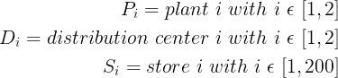

# 使用 Python 的线性规划进行供应计划

> 原文：<https://towardsdatascience.com/supply-planning-using-linear-programming-with-python-bff2401bf270?source=collection_archive---------5----------------------->

## 您需要将库存分配到哪里，以满足客户需求并降低运输成本？


供应计划的转运问题—(图片由作者提供)

**供应计划**是管理制造部门生产的库存以满足需求计划产生的需求的过程。

你的目标是**平衡供需**，以最低的成本确保**最好的服务水平。**

在本文中，我们将介绍一种简单的方法，使用**整数线性规划**来回答**一个复杂的供应计划问题**，考虑:

*   [从工厂到配送中心(DC)的入站运输成本](https://www.youtube.com/watch?v=PYkN24PMKd8)**(美元/箱)**
*   [从 DCs 到最终客户的外运成本](https://www.youtube.com/watch?v=PYkN24PMKd8)**($/箱)**
*   客户需求(**纸箱)**

💌新文章直接免费放入你的收件箱:[时事通讯](https://www.samirsaci.com/#/portal/signup)

```
**SUMMARY**
**I. Scenario** As a Supply Planning manager you need to optimize inventory allocation to reduce transportation costs.
**II. Build your Model
1\. Declare your decision variables**
*What are you trying to decide?* **2\. Declare your objective function** *What do you want to minimize?*
**3\. Define the constraints**
*What are the limits in resources?* **4\. Solve the model and prepare the results** What are the results of your simulation?
**III. Conclusion & Next Steps**
```

# 一、如何用 Python 优化供应计划？

## 问题陈述

作为一家中型制造公司的**供应计划经理**，您收到反馈称[分销成本](https://www.youtube.com/watch?v=aJnrEElPvvs) **过高**。

根据运输经理的分析，这主要是由于股票分配规则。

在某些情况下，您的**客户不会从**最近的配送中心**发货**，这会影响您的运费。

**您的分销网络**

*   **2 个生产无限产能产品的工厂** *注:我们将在后面看到如何轻松改进这一假设*
*   **2 个配送中心**，从两个工厂接收成品并交付给最终客户*注:我们将考虑这些仓库操作*[*X-Docking*](https://www.youtube.com/watch?v=CW0wJM-yJGc)*，以避免在我们的模型*中考虑库存能力的概念
*   **200 家店铺**(发货点)

为了简化理解，让我们介绍一些符号



符号—(作者提供的图片)

**门店需求** 每家店的需求是多少？


符号—(作者提供的图片)

你可以在这里下载数据集[。](https://gist.github.com/samirsaci/eccd1435aacf7589c21e928dc426b86d)

**运输费用**

我们的主要目标是降低总运输成本，包括入站运输*(从工厂到配送中心)*和出站运输*(从配送中心到商店)*。


符号—(作者提供的图片)


符号—(作者提供的图片)

**问题**

> 我应该选择哪个**工厂 i** 和**分销 n** 以最低成本生产 **100 件**并交付给**商店 p** ？


配送中心出库成本的箱线图—(图片由作者提供)

**评论**

> 我们可以在上面的方框图中看到，单位成本的 D1 分布的中值低于 D2。我们可以预期，该模型将引导通过 D1 的流量的主要部分。

[](http://samirsaci.com) [## 萨米尔 Samir 供应链组合的数据科学

### 🏭使用高级数学概念的供应链网络优化👨‍🏭仓储的持续改进…

samirsaci.com](http://samirsaci.com) 

# 二。构建您的模型

我们将使用 python 的纸浆库。PuLP 是一个线性(LP)和整数规划(IP)问题的建模框架，用 Python 编写，由 COIN-OR Foundation(运筹学计算基础设施)维护。

> 你可以在这个 Github 资源库中找到完整的代码:[链接](https://github.com/samirsaci/supply-planning)。

## 1.声明您的决策变量

你想决定什么？


符号—(作者提供的图片)

我们想决定进出运输的数量。

## 2.宣布你的目标函数

你想最小化什么？


符号—(作者提供的图片)

我们想决定最小化入站和出站运输成本。

## 3.定义约束

决定你的可行区域的资源限制是什么？


符号—(作者提供的图片)

*来自 DCs 的供应需要满足每个店铺的需求。*


符号—(作者提供的图片)

*我们不在*[*X-Docking*](https://www.youtube.com/watch?v=CW0wJM-yJGc)*平台建立任何股票。*

**包括可持续性约束**

如果您想在优化问题中包括环境影响，您可以计算您的分销网络的二氧化碳排放量。

[](https://www.samirsaci.com/supply-chain-sustainability-reporting-with-python/) [## 使用 Python 进行供应链可持续性报告

### 自动化和报告构建 ESG 报告的 4 个步骤，重点关注分销网络的二氧化碳排放 4 个步骤…

www.samirsaci.com](https://www.samirsaci.com/supply-chain-sustainability-reporting-with-python/) 

## 4.求解模型并准备结果

你的模拟结果是什么？

**结果**

该模型采用**最便宜的路线**入境，途径 P2 和 D1(分别为。P1 与 D2)。

正如我们预期的那样，超过 90%的出境流量通过 D1 ，以最大限度地降低**出境成本**。

```
**163** stores are delivered by D1
0 store is delivered by the two warehouses together
```

# 三。结论和后续步骤

*关注我的 medium，了解更多与供应链数据科学相关的见解。*

## 结论

这种方法为您提供了通过实现简单规则来执行大规模优化的可能性。通常情况下，您会避免商店没有通过最佳路线送货。

## **接下来的步骤**

此处给出的模型可以通过添加操作约束来轻松改进:

*   工厂生产成本**(美元/箱)**
*   配送中心的最大 X 停靠能力**(纸箱)**

还可以通过增加以下内容来改善成本结构

*   配送中心的固定/可变成本结构 **($)**
*   固定+可变运输成本**结构 y = (Ax +b)**

你会发现的唯一限制是约束和目标函数的线性。

**你不能**

*   实施非线性生产成本规则= f(例)来模拟生产过程中的规模经济
*   实施总装运量的非线性(按范围)运输成本规则

一旦你试图触及目标函数或约束的线性，你就离开了线性规划的美好世界，开始面对非线性优化的痛苦。

我们将在下一篇文章中探讨一个例子，并尝试测量对处理时间和算法复杂度的影响。

## 用数码相机模拟不同的场景

数字孪生是物理对象或系统的数字复制品。

供应链数字模型是一种计算机模型，代表供应链中涉及的各种组件和流程，如仓库、运输网络和生产设施。


(图片由作者提供)

模拟几种降低成本或物流网络脱碳的场景。

场景 1:您想要建立一个本地仓库来缩短最后一英里的配送距离

*   **对服务水平会有什么影响？**
*   **仓储成本会有什么影响(地点越多)？**
*   我们能减少多少二氧化碳排放量？

场景 2:您想要建立更多的工厂，为所有市场进行本地生产

*   **对生产成本会有什么影响？**
*   **运输成本会有什么影响(工厂靠近仓库)？**
*   **我们能减排多少二氧化碳？**

对于每个场景，您可以操作与计划相关联的参数，并查看您的整体性能会降低多少。

然后，您可以调整其他指标(仓库容量和位置、补货提前期等)，直到您重新达到初始目标。

这将向您展示供应链的改进，以获得适应这些新的绿色倡议的稳健性水平。

[](https://www.samirsaci.com/what-is-a-supply-chain-digital-twin/) [## 什么是供应链数字孪生？

### 供应链优化使用 python 创建一个代表供应链网络的模型，以优化您的…

www.samirsaci.com](https://www.samirsaci.com/what-is-a-supply-chain-digital-twin/) 

## 数字孪生模型的例子:绿色库存管理


(图片由作者提供)

绿色库存管理可以定义为以环境可持续的方式管理库存。

对于分销网络而言，这可能涉及一系列旨在减少订单传输、准备和交付的环境影响的流程和规则。


(图片由作者提供)

> *如果我们降低商场补货的频率，对二氧化碳排放会有什么影响？*

使用数据分析来模拟商店补货频率的变化，并衡量对整体环境影响的影响。

[](https://www.samirsaci.com/green-inventory-management-case-study/) [## 绿色库存管理-案例研究

### 可持续发展如何减少时尚零售物流运作的二氧化碳排放量？

www.samirsaci.com](https://www.samirsaci.com/green-inventory-management-case-study/) 

# 关于我

下面连线 [Linkedin](https://www.linkedin.com/in/samir-saci/) 和 [Twitter](https://twitter.com/Samir_Saci_) ，我是一名[供应链工程师](https://www.samirsaci.com/about/)利用数据分析改善物流运营，降低成本。

如果你对数据分析和供应链感兴趣，可以看看我的网站

[](https://samirsaci.com) [## Samir Saci |数据科学与生产力

### 专注于数据科学、个人生产力、自动化、运筹学和可持续发展的技术博客

samirsaci.com](https://samirsaci.com) 

# 参考

[1]运筹学的计算基础设施，优化与纸浆(文档)，[链接](https://coin-or.github.io/pulp/)