# 支持向量机(SVM)

> 原文：<https://towardsdatascience.com/support-vector-machine-svm-719e530a725f?source=collection_archive---------13----------------------->

资料来源:Unsplash.com

## 所有关于支持向量机(SVM)从推导到面试准备

最近，我有机会为一群数据科学领域的新人和有经验的人准备一个关于 SVM 的讲座。我准备了一个讲座，涉及到基础知识，甚至是对 SVM(向量法)推导的直觉，还有一些问题以及讨论部分的答案。我希望这次讲座能让更多的观众受益。请在评论区告诉我，你对未来的 ML 算法讲座还有什么期待。

# **SVM 背景**

SVM 群岛

*   监督机器学习算法
*   用于**分类**和回归

SVM 的真正优势在于分类，并且是高维向量(具有大量特征的数据点)的特定分类。虽然支持向量回归机(SVR)也使用与支持向量分类机相同的直觉和概念，但对于回归，线性或随机森林回归机也是 SVR 的强大竞争对手。我们将关注使用支持向量分类器的分类，而不是回归。

# SVM 的优化

优化取决于向量对的**点积**

*   推导(证明 SVM 分类器中的优化仅取决于向量对的乘积的事实)。

假设有一个如图 1 所示的二元分类问题，为了在 2D 区分两个类别，需要确定一个决策边界。如果划分类的边界是线性的，则称这些类是线性可分的。图 1 显示了两个不同类别+和-的向量(数据点)。

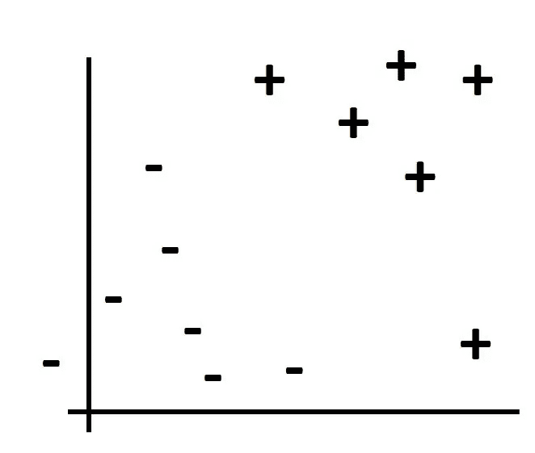

图 1

多行可以作为分隔两个类的判定边界(参见图 2)。蓝线、黄线或绿线中的任何一条都可以作为决策边界，因为这三条线都分隔了数据。我们将如何决定这些边界中的哪一个最好地分隔数据？这个决定会给我们一个条件，利用这个条件，我们可以在所有的可能性中拒绝除了一个决定边界之外的所有可能性。

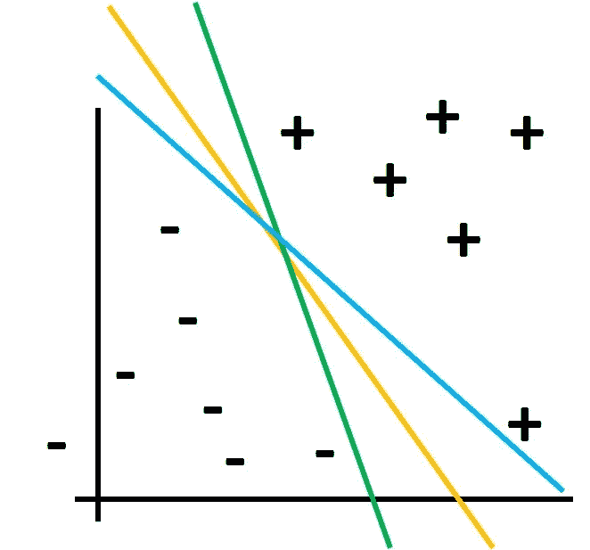

图 2

为了定义最佳决策边界，我们使用最大裕度原则。离两个类的最近成员距离最大的边界被选为最佳边界。在图 3 中，散列线下面显示的是通过+和-类的最近点的线。从黄线到虚线的距离被定义为边距。假设在分隔两个类别的所有可能的线中，如果黄线在页边空白之间具有最宽的间隔，则黄线是最佳决策边界。散列黄线所经过的两个类别的点被称为支持向量。可以有单个支持向量(对于+类)或者可以有多个支持向量(对于-类)，散列线的斜率将与决策边界相同。

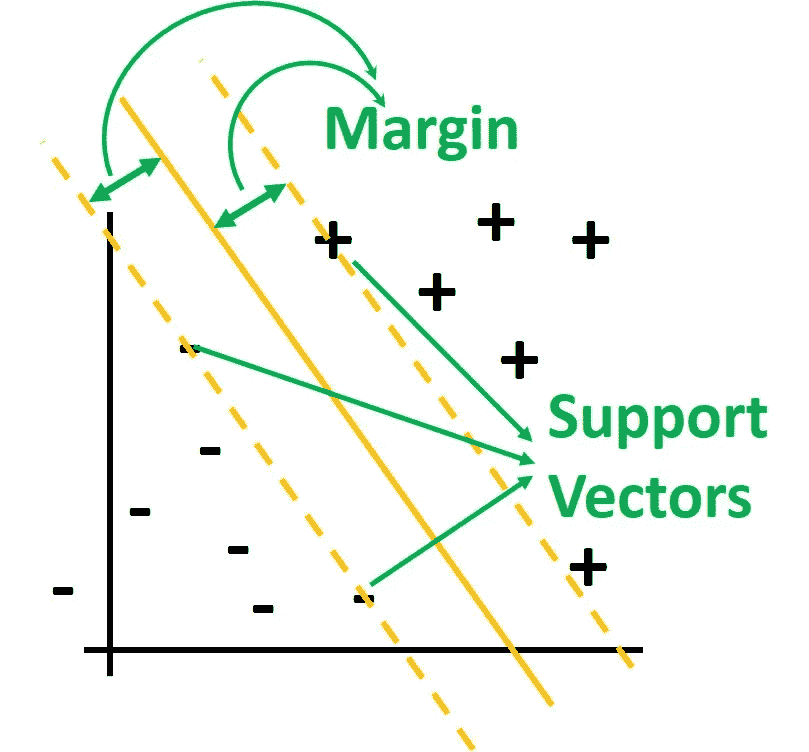

图 3

为了最大化两条散列线之间的边距或距离，我们需要创建一个表达式，并对其求导以找到最佳(极值)值。假设向量‘w’垂直于决策边界，向量‘u’未知，如图 4 所示。为了确定未知向量 u 位于-ive 还是+ ive 类的边上，我们测量 u 在 w 上的投影的长度，如果它大于某个长度，则它在+ive 类中，否则它属于-ive 类(或者位于边缘)。

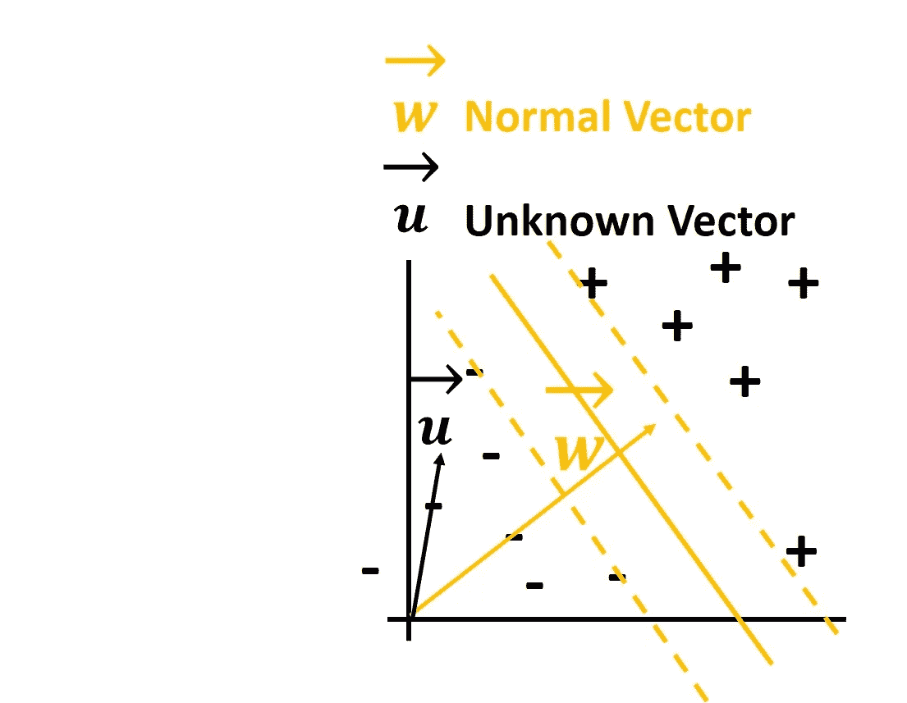

图 4

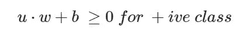

为了区分+类和-类，我们假设如果未知向量是来自+类(x+)的向量，它应该给出大于 1 的值，或者如果它是来自-类(x)的向量，它应该给出小于-1 的值。+1 和-1 值决定了两个类之间的清晰分隔。所以数学上的条件是:

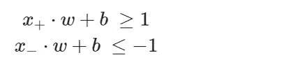

为了数学上的方便，我们引入一个变量 yi，对于+样本 yi = 1，对于-样本 yi = -1。将 yi 乘以上面的等式，我们得到:

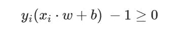

来自+类(x+sv)和-类(x SV)的支持向量位于边缘本身。因此，矢量(x+SV x SV)⋅w/|w|在法线 w 上的投影就是两个边距之间的距离。该距离应在上述限制条件下最大化。

*   最大化:

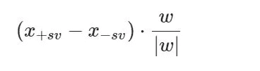

从上面的等式我们可以破译:

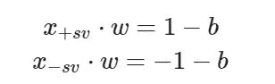

因此，最大化条件变成最大值 2/|w|,或者我们可以说最小值:

*   **最小化:**

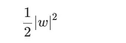

*   **约束:**

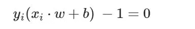

为了找到极值和约束，我们使用 Langrangian，

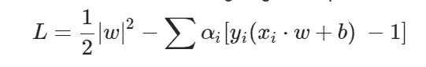

拉格朗日的最小值是:

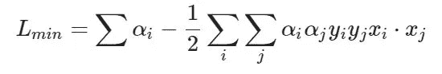

在上面的表达式中，您可以观察到最小值(我们的优化)取决于两个向量对(数据点)的点积。

# 如果类是线性不可分的

在这种情况下，添加额外的特征并将向量转换到更高维度可能有助于通过平面(超平面)分离向量。例如，假设有两个类 c1(蓝色)和 c2(橙色)，如下图 5 所示。这两类人似乎没有线性的决策界限。数据 x_2 = (x1) 增加一个新的维度怎么办？

非线性可分离数据:

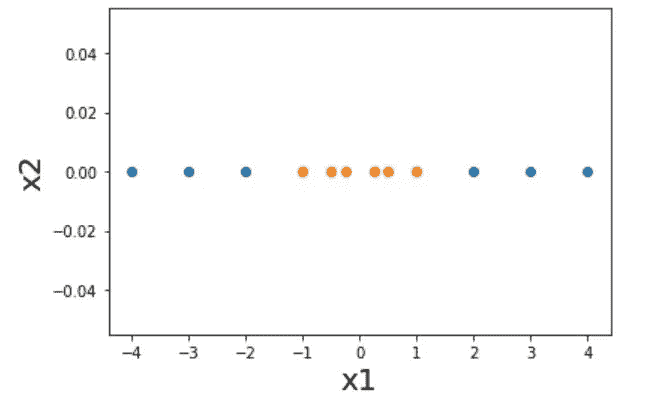

图 5

现在可线性分离的转换数据(如图 6 所示):

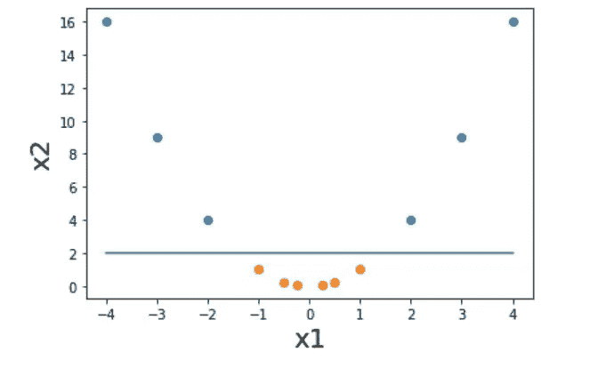

图 6

类似地，对于包含 x1 和 x2 维度的二维数据，可以创建像 **(x1)、(x2)、(x1)3** 这样的新维度，并且可以将数据转换到更高维度以分离类别。

我们有一些函数可以帮助将数据转换到更高的维度。这些函数被称为内核。

# SVM 一些受欢迎的果仁

*   **直线型**
*   多项式
*   高斯的
*   径向基函数
*   夸张的
*   乙状结肠的

# 讨论(面试 QnA)

1.  **任何算法通用问题:ADA？(优点、缺点和假设)**

**优点:**

*   交钥匙算法，需要优化的参数很少。
*   优化是在凸空间中进行的，因此可以达到全局最小值，这与神经网络不同，它不会遇到陷入局部最小值的问题。
*   内存高效
*   如果特征数很高(> 1000)，线性 SVM 比其他算法更有效

**缺点:**

*   特征缩放
*   随着示例数量的增加，速度会变慢
*   硬边界导致过度拟合

**假设:**

*   没有人

**2。结合 SVM 解释硬利润和软利润。**

*   **硬边界**不允许有任何误差
*   **软余量**允许误差，它减少了过拟合的机会

**3。为什么例子越多，SVM 越慢？**

计算成本取决于向量对的选择(nC2，如优化部分所述)。

4.与 SVM 相关的超参数有哪些？

*   核心
*   c:允许误差的数量。大 C 给出了一个狭窄的边界，反之亦然。

**5。为什么 SVM 算法被认为是内存高效的？**

不是所有的数据点都需要作出决定，一旦支持向量被决定，只有支持向量和超平面的方程需要作出决定。

**6** 。陈述以下陈述是对还是错:“SVM 判定边界是连接两个类的凸包的最近点的直线的垂直平分线”。

真实的陈述。几何解释:制作每个类别的凸包，尝试使用最近点连接凸包，分类边界将是垂直平分线。

7 .**。** **举一个 SVM 将被用于 RandomForest 的典型例子。**

文本分类:当特征数量很大时，SVM 是高维空间的一种算法选择。

**8。** **什么是正规化？SVM 算法是如何正则化的？本质上是 L1 还是 L2 正规化？**

' c 参数'实际上是**正则化参数**。C 参数乘以误差之和，因此正则化本质上是 L1。但是如果代价函数以这样的方式被修改，即 SVM 的代价是 C 乘以误差的平方和，则正则化本质上变成了 L2。

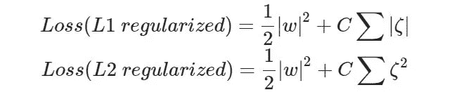

# 推荐读物

*   一定要寻找其他的推导方法(线性代数方法)
*   默瑟定理