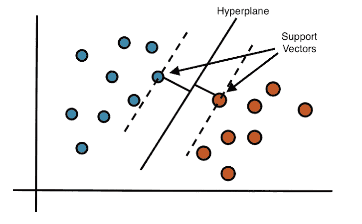
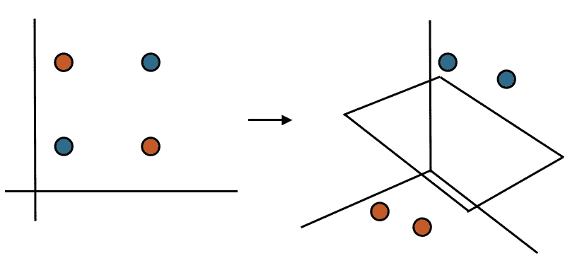

# 支持向量机(SVM)解释说

> 原文：<https://towardsdatascience.com/support-vector-machine-svm-explained-58e59708cae3?source=collection_archive---------28----------------------->

## 用 Python 解释和实现 SVM

图片来自[水花](https://unsplash.com/photos/xFjti9rYILo)

支持向量机(SVM)是数据科学家使用的核心算法。它可以应用于回归和分类问题，但最常用于分类。它的流行源于模型强大的准确性和计算速度(取决于数据的大小)。由于 SVM 通过核进行运算，它在解决非线性问题方面也很出色。SVM 如何工作的前提非常简单:给定绘制在平面上的数据，该算法将创建一条线/超平面来将数据分成不同的类。

作为我解释和实现机器学习中核心概念的系列文章的继续，这篇文章将着重于给出分类相关问题的 SVM 的概念性理解。

**目录**:

*   什么是 SVM
    -支持向量
    -超平面
    -余量
*   优势
*   不足之处
*   履行
*   结论
*   资源

# 什么是 SVM

支持向量机是一种监督学习算法，它识别最佳超平面来划分数据集。有两个主要术语会被重复使用，下面是它们的定义:

*   **支持向量** —最接近超平面的点
*   **超平面** —比其周围空间[ [1](https://en.wikipedia.org/wiki/Hyperplane) ]低 1 维的子空间。它用于将空间分成多个部分。
    给定一个三维空间，随后的超平面将是一个二维平面。类似地，在二维平面中，超平面将是一维线。
*   **Margin** —超平面与任一侧最近的数据点之间的距离[ [2](https://www.kdnuggets.com/2016/07/support-vector-machines-simple-explanation.html)
*   **内核** —用于将输入数据转换成不同形式的数学函数。常见的核函数有*线性、非线性、多项式等。*

对于给定两个特征的简单分类任务，您可以将超平面想象为分隔数据的线性(一维)线。这可以从下图中直观地看到。

图 1 : 2 维空间，1 维超平面将数据分成不同的类。虚线表示超平面和支持向量之间的边界。(图片由作者提供)

给定上图，你可以想象有许多方法来识别一个可以分割数据点的超平面。哪个超平面是最佳选择？我们希望选择一个超平面，该超平面和所有点之间的距离最大。这将产生新数据被正确分类的最大可能性[ [2](https://www.kdnuggets.com/2016/07/support-vector-machines-simple-explanation.html) ]。

图 2:由于没有逻辑方法用二维形式的超平面分割数据，从而将类别分段，因此将数据转换到三维空间并识别超平面(图片由作者提供)

当我们处理没有明显超平面的数据时(如图 2 所示)，我们需要将我们的观点转移到一个更高维的空间。这可以想象为数据点上升或下降，而飞机试图将它们分成适当的类别。SVM 允许用户选择最适合他们正在处理的数据的内核函数。使用核来映射高维视点中的数据将允许超平面分割数据。你可以在这里了解更多关于内核函数[的知识](https://scikit-learn.org/stable/modules/svm.html#svm-kernels)【4】。

# 优势

*   通用于用户特定的内核函数
*   内存高效
*   在维数大于样本数的情况下有效

# 不足之处

*   处理噪声数据时容易出错和过度拟合(例如，不同标签的重叠特征)
*   处理非常大的数据集时计算时间长
*   未能提供结果的概率解释[ [3](https://scikit-learn.org/stable/modules/svm.html)

# 履行

# 结论

SVM 是一种监督学习算法，它通过使用超平面将数据分成不同的类别。所选择的超平面是在该超平面和所有点之间具有最大余量的超平面，这产生了最大的准确分类的可能性。这是一种非常通用、内存高效的算法，但是它容易过度拟合，根据数据的大小计算开销很大，并且无法提供结果的概率解释。

# 资源

[1][https://en.wikipedia.org/wiki/Hyperplane](https://en.wikipedia.org/wiki/Hyperplane)

[2][https://www . kdnuggets . com/2016/07/support-vector-machines-simple-explain . html](https://www.kdnuggets.com/2016/07/support-vector-machines-simple-explanation.html)

[3][https://scikit-learn.org/stable/modules/svm.html](https://scikit-learn.org/stable/modules/svm.html)

[4][https://sci kit-learn . org/stable/modules/SVM . html # SVM-kernels](https://scikit-learn.org/stable/modules/svm.html#svm-kernels)

您可能会对我写的其他文章感兴趣:

 [## 兰登森林解释道

### 决策树和随机森林的理解与实现

towardsdatascience.com](/random-forest-explained-6b4849d56a2f)  [## k 最近的邻居解释说

### 在这篇文章中，我将给出一个概述，实现，缺点和相关的 K 最近…

towardsdatascience.com](/k-nearest-neighbours-explained-7c49853633b6)  [## 马尔可夫链解释道

### 在本文中，我将解释并提供马尔可夫链的 python 实现。这篇文章不会是一篇深刻的…

towardsdatascience.com](/markov-chain-explained-210581d7a4a9)