# 支持向量机、对偶公式、二次规划和序列最小优化

> 原文：<https://towardsdatascience.com/support-vector-machines-dual-formulation-quadratic-programming-sequential-minimal-optimization-57f4387ce4dd?source=collection_archive---------3----------------------->

## 这是一种面向数学的方法，研究支持向量机背后的直觉和用于求解它的优化算法。本文提供了一个一站式指南，帮助您揭开 SVM 内部工作的神秘面纱。

支持向量机(或最初由作者 Vladimir Vapnik 称为支持向量网络)采取了一种完全不同的方法来解决统计问题(在特定分类中)。这种算法已经被广泛应用于一些分类问题，如图像分类、词袋分类、OCR、癌症预测等等。SVM 基本上是一个二元分类器，虽然它可以修改为多类分类以及回归。与逻辑回归和其他神经网络模型不同，支持向量机试图最大化两类点之间的分离。作者用了一个绝妙的主意。

下面是我们将在本文中涉及的*概念，它们基本上一步一步地揭开支持向量机的神秘面纱，然后针对其缺陷增强算法。*

1.  [香草(平原)SVM &其目标函数](#a4bc)
2.  [软裕 SVM](#697a)
3.  [内核绝招](#6d0e)
4.  [附录 1-推导最大余量等式。&目标函数](#d326)
5.  [附录 2 —寻找目标 fn 的最佳值。利用拉格朗日、对偶公式化&二次规划](#401c)
    ∘ [求解极小值的一般方法](#fa6d)
    ∘ [存在约束时求解极小值](#1df9)
    ∘ [库恩—塔克条件](#b763)
    ∘ [对偶&互补松弛度](#6ef0)
6.  [附录 3 —推导软边际 SVM 的最优值](#0815)
7.  [结论](#7276)
8.  [参考文献](#bc1b)

# 香草 SVM 及其目标函数

让我们从维基百科中获取 SVM 的正式定义:

> 支持向量机在高维或无限维空间中构造一个超平面或一组超平面，可用于分类、回归或其他任务，如异常值检测。

等等，但是专业术语太多了！让我们简化它&只保留需要的信息！

首先，SVM 创建了一个超平面(*n 维中的一条简单的线*)。如下面的 GIF 所示，这个超平面需要以最好的方式将两个类一分为二。这就是支持向量机所做的一切……剩下的就是浇头了！(*无限维空间、回归、离群点检测等。*)

现在，为了构建*最优超平面*，它需要另外两个超平面的支持，这两个超平面在它的两边平行&并与之等距！

这两个支持超平面位于类别之间的最极值点，被称为**支持向量**。

因此，我们只需要找到支撑超平面(*为简单起见使用*)，它们之间的距离最大！由此我们很容易得到*最优超平面*。这被简单地称为**最大边缘超平面**。支撑超平面之间的距离称为**余量**。

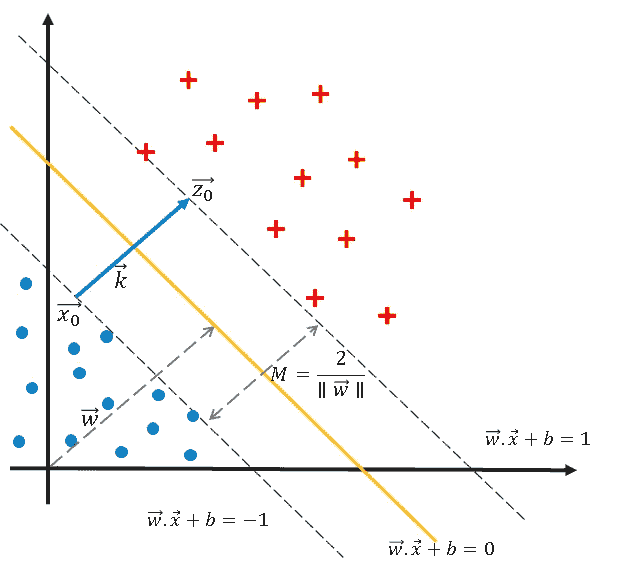

*来源:作者图片*

因此，我们的目标是简单地找到最大余量 m。使用向量运算，我们可以发现(给定*最优超平面(****w . x+b = 0****)*)，**余量**等于:

因此，**最大余量 M** :

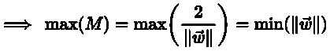

为了数学上的方便，**目标函数**变成(详细解释见附录 1):

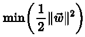

观察这里我们的目标已经推导到从方程 ***w.x+b=0*** 中寻找最优*！*

*然而，这也带来了一个约束，即一个类中的点不能位于两个支持超平面内！数学上可以表示为:*

*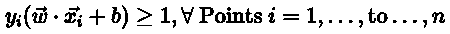*

*那么这些约束意味着什么呢？*

*这意味着在如下图所示的超平面内不能有点，这被称为 ***硬边界 SVM(香草 SVM)。****

*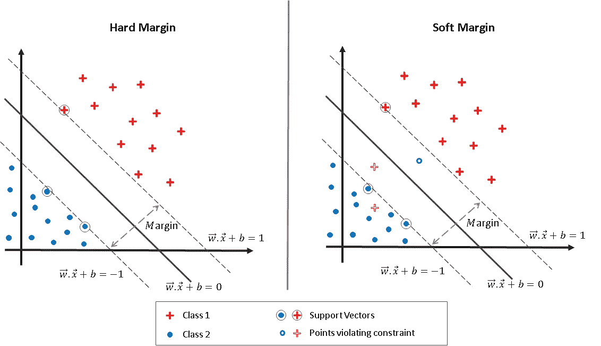*

*来源:作者图片*

*这就是支持向量机的大缺点！这两个类需要完全分离。现实世界的数据集中从来不会出现这种情况！这就是 ***软边际支持向量机*** 发挥作用的地方🎉😃！*

*在我们继续之前，只有一个问题！ ***支持向量机使用梯度下降寻找最小值*** ？不会吧！(大多数人未能认识到这一点)。通过求解*目标* *函数*的导数直接找到最小值。因为有约束，我们需要首先取目标函数的 *Langrangian 来求解最小值。你可以在附录 2 中找到完整的推导(我鼓励你去读！).**

# *软利润 SVM*

*如上所述，软间隔支持向量机可以处理具有不可分数据点的类。下图同样解释的很清楚！*

*因此，软利润背后的理念要点如下:*

> *允许 SVM 犯一些错误，同时保持尽可能大的差距。*

*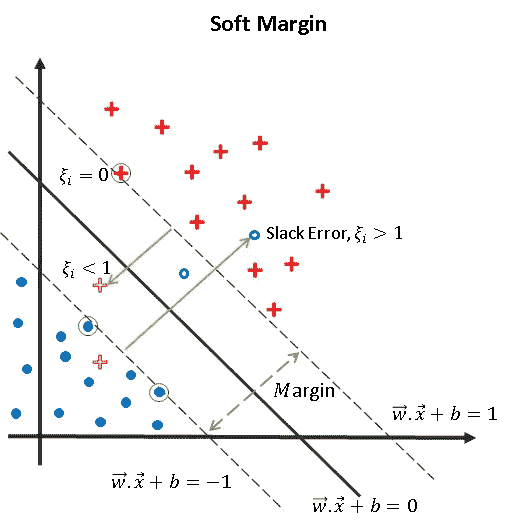*

*来源:作者图片*

*现在，它是如何做到这一点的，而不是普通的支持向量机？🤔*

*我们只是在目标函数中使用了一个额外的惩罚因子，叫做𝜉 *ᵢ* 。这个因子是一个数据点从相应的支持超平面到另一个类超过的距离。*

*因此，如果数据点在边界内(支持超平面)，惩罚因子𝜉 *ᵢ* 为 0。否则，如果数据点在另一边，这个因子𝜉 *ᵢ* 等于它在数据点和支持超平面之间的距离。因此，值𝜉 *ᵢ* 是非负数。*

*这可以用下面的等式来总结:*

*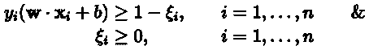*

*理想情况下，它应该代表 SVM 犯的“*错误*的数量。因此，我们新的目标函数是:*

*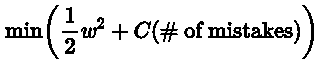**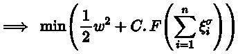*

*这里对于一个小功率的𝜎来说，函数 ***F*** 就变成了错误数！(求和用于说明数据集中所有点的𝜉 *ᵢ**

*就像支持向量机一样，最小值可以通过求解其导数(导数的拉格朗日函数)直接找到。*

# *内核技巧*

*现在回头看看我们所得到的，很明显我们只使用了 ***w.x+b*** 。这仅仅是一个线性方程。这意味着当你可以对数据进行线性分类时，SVM 工作得最好！*

*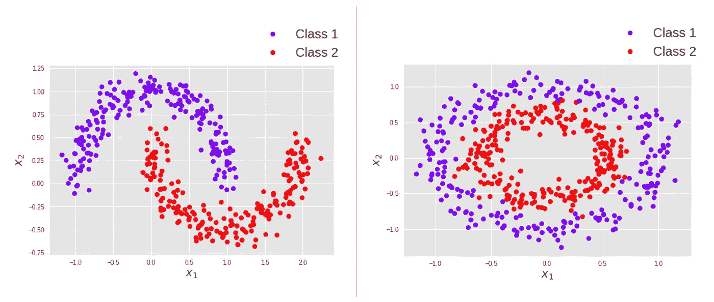*

***非线性数据。** *来源:图片由作者提供**

*这是另一个巨大的限制！然而，作者已经找到了一个解决方法💃！！这是内核技巧。简单来说:*

> *内核只是将非线性数据点转换成线性数据点，这样 SVM 就可以将两个类一分为二。*

*下图显示了同样的情况。*

*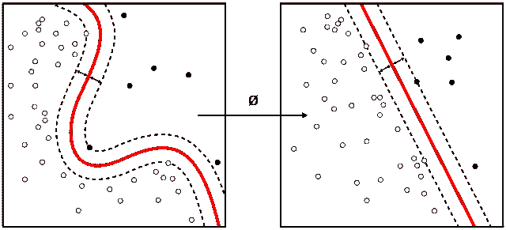*

***N 维到 N 维的转换。**来源:[维基媒体](https://commons.wikimedia.org/wiki/File:Kernel_Machine.svg)*

*因此，新的线方程将是*

*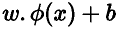*

*这里使用了一个巧妙的技巧将 N 维中的点转换为 N 维*中的点，其中 *N > n* 。**

*内核 **𝜑** 必须遵守以下条件:*

*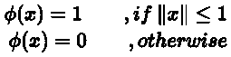**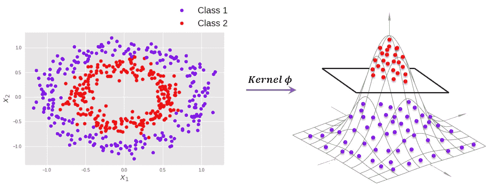*

*来源:作者图片*

*有几个用于支持向量机的核函数。一些受欢迎的是:*

*   ***高斯径向基函数**:*

*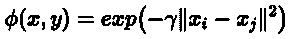*

*其中 **𝛾 > 0** 。*

*一个特例是 **𝛾 = 1/2𝜎***

*   ***高斯内核**:*

*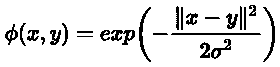*

*   ***多项式内核**:*

*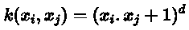*

*   ***乙状结肠内核**:*

*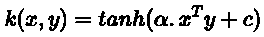*

# *附录 1-推导最大余量等式。&目标函数*

*为了推导目标函数，我们假设数据集是线性可分的。*

*我们知道两个支持超平面位于支持向量上，并且它们之间没有点。因此，我们可以首先考虑这两个支持超平面之间的中间超平面为:*

*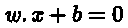*

*并且考虑到这个和支持超平面之间的距离是 1，我们得到*

*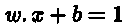**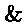**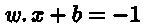*

*由于没有超过这两个超平面的点，我们可以推导出:*

*对于所有带有标签**的值***

***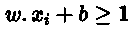***

***&对于所有带标签的值**，*****

**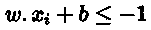**

**我们可以将两者结合起来，如下所示:**

****

**因此，这是我们的目标函数的约束条件(参见本文开头的内容)。**

**现在要找到最大余量，必须用超平面来表示。那么让我们推导边距 ***M*** 和超平面之间的关系。**

****

***来源:作者图片***

**在上图中，设向量**&***z***分别为直线上的平行向量***【w . x+b =-1****&****w . x+b = 1***。然后，****

**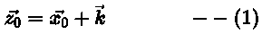**

**其中矢量 ***k*** 是垂直于矢量***x₀*******z*₀***的直线。****

*矢量的大小 ***k*** 是 ***M.****

*因此，*

*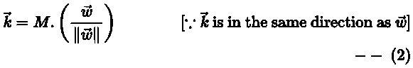*

*现在既然**z*₀****&****x₀***躺在***w . x+b = 1*******w . x+b =-1***，**

**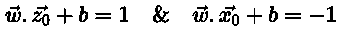**

**从上面的 eq。代替**z*₀*t83】，****

**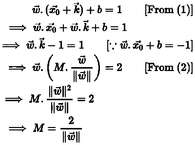**

**现在我们有了，我们需要最大化它，**

**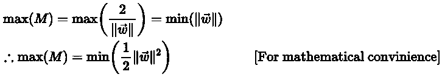**

**因此，新的目标，即目标函数是:**

**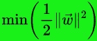****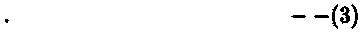**

**&不等式约束是:**

**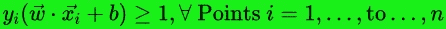****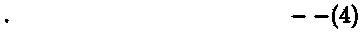**

# **附录 2 —寻找目标的最佳值 fn。使用拉格朗日，对偶公式和二次规划**

## **求解最小值的一般方法**

**为了找到曲线的最优解，我们可以**

1.  **取一阶导数，**
2.  **将导数等于 0(最大值或最小值)，得到一个微分方程。**
3.  **求解微分方程，找到最优点。**
4.  **二阶导数可以提供方向&因此我们可以推断出最优值是最小值还是最大值。**

## **存在约束时求解最小值**

**如果微分方程中有一些约束，就像我们在目标函数中的约束，我们首先需要应用拉格朗日乘数(老实说，这非常简单)！**

**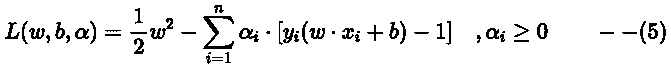**

**如果你观察上面的等式(5)，它只是目标函数，减去不等式约束！当约束是等式约束时，它必须仅满足标准***【αᵢ】0***。然而，上述方程是**不等式约束方程**。因此，还需要满足一组称为库恩-塔克条件的附加条件。我们稍后将讨论这些条件。**

**为了找到最优值，就像之前一样，我们取一阶导数并使其等于 0:**

**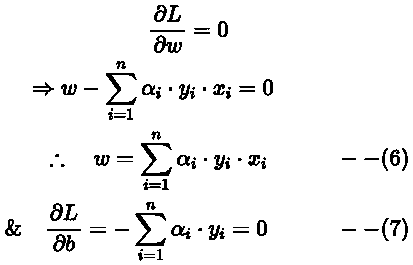**

**为了找到最佳值，我们可以简单地将这些值代入(5)，**

**扩展情商。(5)我们得到，**

**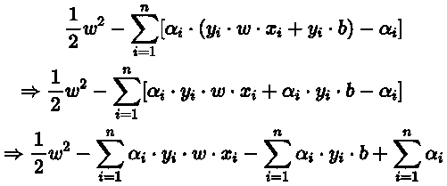**

**现在将(6)和(7)中的值代入上面，**

**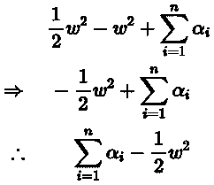**

**我们可以重新代入等式中 ***w*** 的值。(6)对于上面的等式，**

**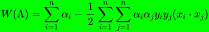**

**在这里，*称为*目标泛函* &它是所有的函数(***【αᵢ】……***到***……αₙ***)*表示为**【λ】**(大写λ)。****

***这种推导对于考虑不等式约束[等式]是必要的。(4)].既然现在考虑到了，目标泛函 ***W*** 就是需要优化的新函数，而不是 Eq。(3).这被称为*对偶公式*，因为初始目标函数已被修改！***

**而 *Eq。(3)***被最小化。****

**由于 ***W*** 是一个二次方程，所以它是一个[二次规划(QP)](https://en.wikipedia.org/wiki/Quadratic_programming) 问题&它可以通过一个叫做 [**序列最小优化(SMO)**](https://en.wikipedia.org/wiki/Sequential_minimal_optimization) 的算法来解决。如果您曾经使用过 LibSVM 包，它是 Scikit-Learn 和大多数其他 SVM 库中 SVM 的基础，您会发现 LibSVM 包实现了 SMO 算法来求解**最大余量**！**

**最后，讨论不等式约束需要满足的条件。**

## **库恩-塔克条件**

1.  ****双重可行性**:**

**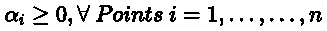**

**2.**互补可行性**:**

**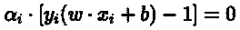**

**3.**静止状态**:**

****

**4.**初始可行性**(我们最初的约束):**

****

## **二元性和互补性松弛**

**当一个问题可以转化为另一个问题，而另一个问题的解更容易计算，并且也提供了原问题的解时，这两个问题被称为表现出**对偶性**，反之亦然。**

**然而，并非所有的对偶函数都必须有一个为另一个函数提供最优值的解。这可以从下面的*图 1* 中推断出来，在原始问题和对偶问题之间有一个*对偶缺口*。在*图 2* 中，对偶问题表现出很强的对偶性，据说具有**互补松弛**。此外，从下图可以清楚地看出，最小化问题转化为最大化问题。因此我们需要最大化 ***W*** 对抗*。***

***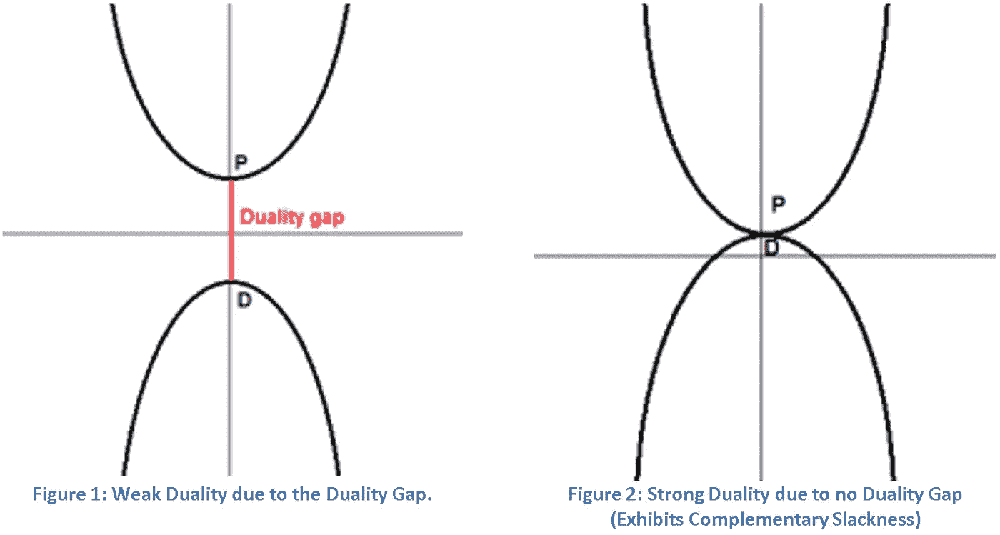***

***来源:作者图片***

# ***附录 3——推导软利润 SVM 的最优值***

***如前所述，软利润 SVM 的目标函数是，***

***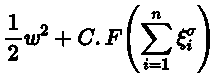***

***这里，函数 ***F*** 是单调凸函数& ***C*** 是正则化常数。***

**因此，上述目标函数的拉格朗日量是，**

**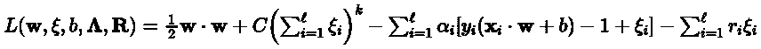**

**使用与硬边界 SVM 中相同的方法，我们得到*目标泛函* as，**

**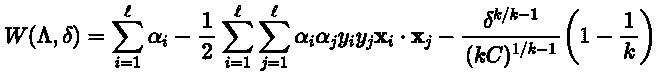**

**如果你观察，这里的额外术语是，**

**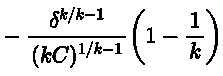**

**在哪里，**

**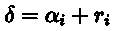**

**目标泛函的约束条件是:**

**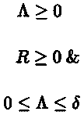**

**因此，求解目标泛函，我们可以获得最优的最大利润。**

# **结论**

**从以上各节，我们可以得出结论**

1.  **基本支持向量机或硬边界支持向量机是二元和线性分类器，只对可分离数据起作用。**
2.  **软间隔支持向量机可以处理不可分的数据。**
3.  **核可用于将非线性数据转换成线性数据，在此基础上，支持向量机可用于二元分类。**
4.  **支持向量机的组合可以用于执行多类分类。**
5.  **支持向量机是非常快速的算法，因为它们直接求解最大间隔，并且不使用像梯度下降这样的迭代过程来寻找最小值。**

# **参考**

1.  **[支持向量网络论文](https://link.springer.com/article/10.1007/BF00994018)。**
2.  **[https://www . SVM-tutorial . com/2014/11/SVM-理解-数学-部分-1/](https://www.svm-tutorial.com/2014/11/svm-understanding-math-part-1/)**
3.  **[https://www . SVM-tutorial . com/2014/11/SVM-理解-数学-部分-2/](https://www.svm-tutorial.com/2014/11/svm-understanding-math-part-2/)**
4.  **[https://www . SVM-tutorial . com/2015/06/SVM-理解-数学-部分-3/](https://www.svm-tutorial.com/2015/06/svm-understanding-math-part-3/)**
5.  **[https://www . SVM-tutorial . com/2016/09/unconstrained-minimization/](https://www.svm-tutorial.com/2016/09/unconstrained-minimization/)**
6.  **【https://www.svm-tutorial.com/2016/09/convex-functions/ **
7.  **[https://www . SVM-tutorial . com/2016/09/duality-la grange-multipliers/](https://www.svm-tutorial.com/2016/09/duality-lagrange-multipliers/)**
8.  **[亚历山大·科瓦尔茨克简洁的支持向量机](http://jermmy.xyz/images/2017-12-23/support_vector_machines_succinctly.pdf)**
9.  **[Ali Ghodsi，Lec 12:软间隔支持向量机(SVM)](https://www.youtube.com/watch?v=L8mpkmQqnyk)**
10.  **[https://www.ncbi.nlm.nih.gov/pmc/articles/PMC5822181/](https://www.ncbi.nlm.nih.gov/pmc/articles/PMC5822181/)**
11.  **[https://www.youtube.com/watch?v=JTTiELgMyuM](https://www.youtube.com/watch?v=JTTiELgMyuM)**

**11.[http://fourier.eng.hmc.edu/e161/lectures/svm/](http://fourier.eng.hmc.edu/e161/lectures/svm/)**

**12.[http://www . svcl . ucsd . edu/courses/ECE 271 b-F09/讲义/soft VMs . pdf](http://www.svcl.ucsd.edu/courses/ece271B-F09/handouts/SoftSVMs.pdf)**

**13.[第 70 讲——软间隔支持向量机|海量数据集挖掘|斯坦福大学](https://www.youtube.com/watch?v=8xbnLHn4jjQ)**