# 支持向量机，图解

> 原文：<https://towardsdatascience.com/support-vector-machines-illustrated-b48a32c56388?source=collection_archive---------15----------------------->

## 支持向量机背后的直觉和数学

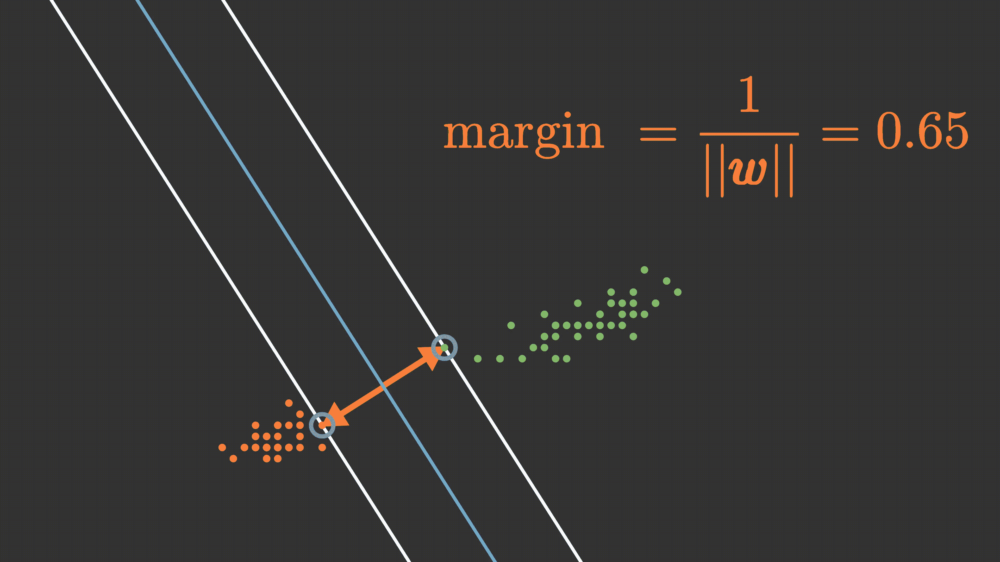

(作者 GIF)

# 介绍

支持向量机是数据科学中的一类技术，在数据科学界非常流行。它们主要用于分类任务，在训练数据很少的情况下表现非常好。

可悲的是，由于深度学习的广泛流行，支持向量机最近几乎被遗忘了。但我认为它们是每个数据科学家都应该拥有的工具，因为它们训练起来更快，有时甚至超过神经网络。

在这篇博客中，你将了解到支持向量机使用超平面来分离和分类我们的数据。我还会解释什么是超平面，如何用一个方程来描述它们。我们将会看到，支持向量机并不使用全部数据来寻找最优超平面，而是仅使用一些称为支持向量的数据点。你将学习如何计算超平面到一个点的距离。这将使我们能够找到与支持向量具有最大距离的超平面(该距离被称为余量)。

# 超平面

让我们以虹膜数据集为例。该数据集由 3 个类组成，代表鸢尾花的不同类和总共 4 个特征。由于支持向量机被设计成只对两个类的数据集进行分类，我们将放弃第三个类。我们使用数据集的两个特征。这些特征即花瓣长度和花瓣宽度。

花瓣长度与花瓣宽度(图片由作者提供)

支持向量机使用超平面来分离这两个类别。当我们得到一个未知类的新数据点时，我们必须预测它的类。根据新点位于超平面的哪一侧，我们将预测一个类或另一个类。

我们的数据有两个特征，因此我们说我们的数据是二维的。在二维中，超平面是一条直线。(在一维中，超平面是一个点，而在三维中是一个平面)

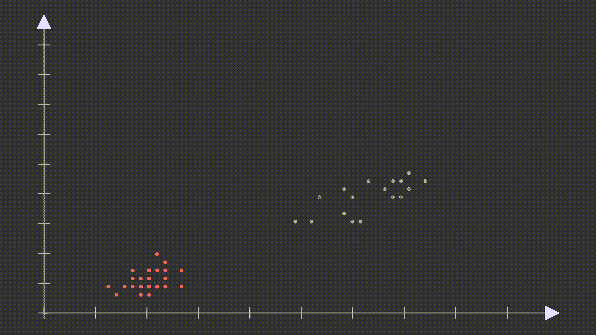

(作者 GIF)

问题是，有无限数量的可能超平面可以完美地对数据集进行分类。我们怎么知道该选哪一个？

(作者 GIF)

## 边缘和支持向量

在支持向量机中用来解决这个问题的方法是最大化超平面与两个类的数据点的距离。这个距离然后被称为**余量**。但是我们不使用所有的数据来计算边界，我们只使用最接近超平面的点。这些点被称为**支持向量**。

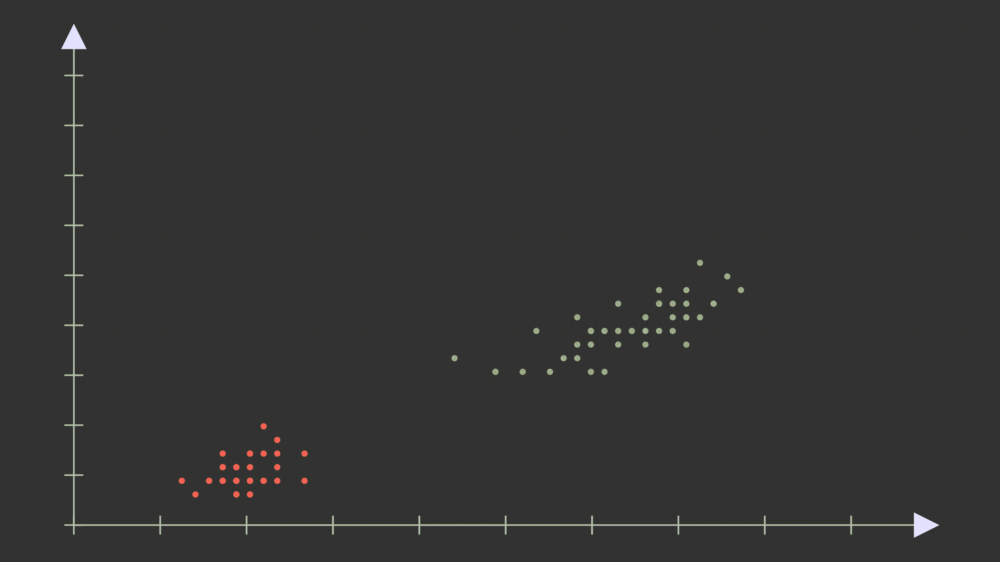

(作者 GIF)

在这个例子中，我们对于每个类只有 2 个支持向量，但是存在更多具有相等余量的支持向量也是可能的。

为什么支持向量叫做支持**向量**而不是支撑点？点和向量可以被同等对待。与一个矢量具有相同坐标的点将位于该矢量的尖端。因此，如果我们用向量或点来表示坐标，只是个人喜好的问题，SVM 算法的创造者把他们的数据视为向量。

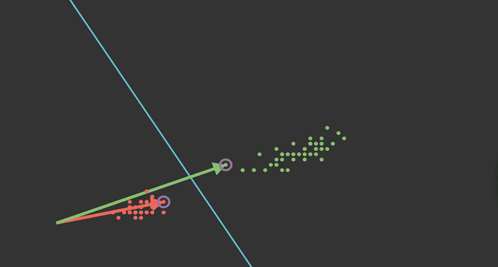

支持向量作为向量和点(图片由作者提供)

## 超平面方程

超平面有一个**权重** **𝑤** 来决定它的方向。𝑤垂直于超平面**。**它有一个偏差 **b.** 描述超平面的方程是:

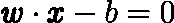

超平面和原点之间的距离是偏差的**值除以法向量**的**长度。**

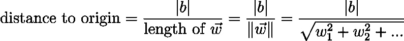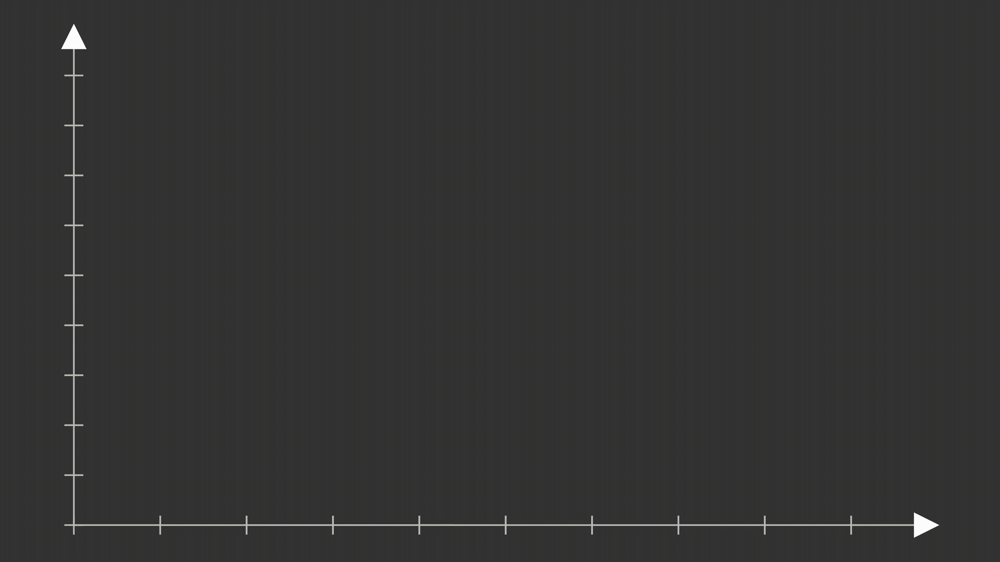

(作者 GIF)

任意一点 **𝑥** 到超平面的距离为:

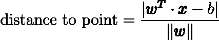

## 寻找最优超平面

我们的目标是利润最大化。但是我们不能让边缘任意大，因为不允许任何点到超平面的距离小于边缘。这个问题可以归结为:

*   最大化利润
*   距离不能小于边距。

## 利润最大化

我们可以使用一个简单的技巧，让**将**定义为等于 1/(𝑤**的长度**)。

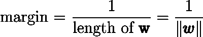

在下面的 GIF 中，你可以看到当页边空白减少时，向量 **𝑤** (用白色表示)的大小增加。

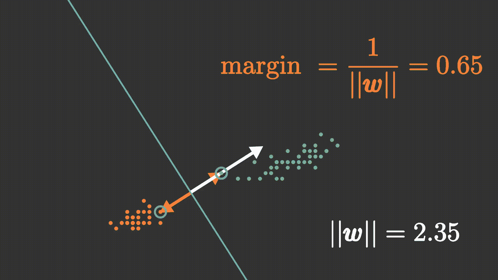

(作者 GIF)

因为除法在计算机上很慢，所以我们没有最大化边距，而是最小化 1/margin。

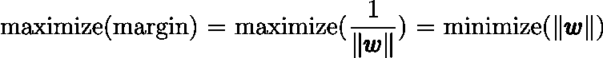

计算𝑤需要开平方根，这也是一项计算量很大的工作。相反，我们可以通过最小化𝑤来加快速度。

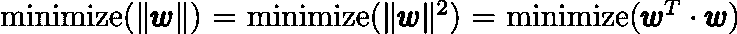

## 距离约束

我说过，每一个数据点到超平面的距离必须大于边缘。

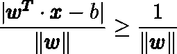

该约束简化为:

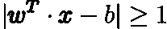

## 整体算法

所以整个算法看起来如下。

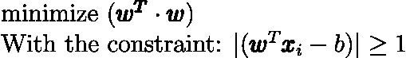

我们添加支持向量所在的两条线。它们到超平面有一个距离，这个距离等于边缘。

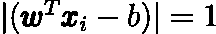

这两条线和超平面一起构成了“街道”。街道内不允许有任何数据点。

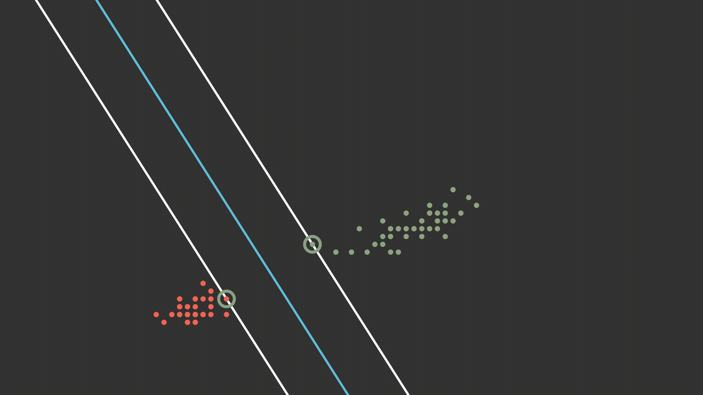

(作者 GIF)

你可以看到支持向量一接触到街道的边界就改变了。

(作者 GIF)

# 观点

大多数情况下，类不能用一条线分开。我在这篇博文中讨论的支持向量机被称为“硬边界”支持向量机。这些不能用于线性不可分的数据集。然而，当我们允许一些错误分类时，我们称之为软边际 SVM。通过使用软边界，我们再次能够在这些数据集上找到超平面。

也有可能使用核函数来转换空间，并完美地分离非常复杂的数据集。

此外，我们到目前为止看到的支持向量机只能用两个类对数据集进行分类，我们必须将问题分成多个二进制分类任务。但是存在直接使用具有两个以上类别的支持向量机的技术。

我将在以后的帖子中讨论所有这些对标准硬利润 SVM 的扩展。

# 摘要

支持向量机使用超平面来分离数据集中的两个类。为了实现对未来或测试数据的良好预测，我们希望找到一个与两类支持向量的距离最大的超平面。这个距离叫做边缘。

这个最佳超平面可以通过在没有数据点比边缘更靠近分离超平面的约束下最大化边缘来找到。这意味着支持向量是最接近超平面的点，并且它们的距离等于边缘。

## 想要连接吗？

领英
[https://www.linkedin.com/in/vincent-m%C3%BCller-6b3542214/](https://www.linkedin.com/in/vincent-m%C3%BCller-6b3542214/)
脸书
[https://www.facebook.com/profile.php?id=100072095823739](https://www.facebook.com/profile.php?id=100072095823739)
推特
[https://twitter.com/Vincent02770108](https://twitter.com/Vincent02770108)
中等
[https://medium.com/@Vincent.Mueller](https://medium.com/@Vincent.Mueller)
成为中等会员并支持我
[https://medium.com/@Vincent.Mueller/membership](https://medium.com/@Vincent.Mueller/membership)

## 作者相关文章

 [## 主成分分析中的特征值和特征向量

### 关于我们的数据，他们告诉了我们什么？

towardsdatascience.com](/eigenvalues-and-eigenvectors-378e851bf372)  [## 神经网络中的反向传播

### 从零开始的神经网络，包括数学和 python 代码

towardsdatascience.com](/backpropagation-in-neural-networks-6561e1268da8)  [## 数据科学家的矩阵演算

### 吃红色药丸，学习矩阵微积分！

towardsdatascience.com](/matrix-calculus-for-data-scientists-6f0990b9c222) 

## 作者撰写的其他文章

 [## 如何使用 GPT J

### GPT J 解释了 3 种简单的方法，你可以如何访问它

towardsdatascience.com](/how-you-can-use-gpt-j-9c4299dd8526)  [## 爱因斯坦指数符号

### 爱因斯坦求和、指数符号和数值

towardsdatascience.com](/einstein-index-notation-d62d48795378)  [## 深度 Q 学习不是火箭科学

### 用 pytorch 解释和编码的深度 Q 和双 Q 学习

towardsdatascience.com](/deep-q-learning-is-no-rocket-science-e34912f1864) 

## 资源

[https://stats . stack exchange . com/questions/440640/what-are-w-and-b-parameters-in-SVM](https://stats.stackexchange.com/questions/440640/what-are-w-and-b-parameters-in-svm)