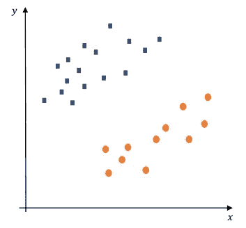
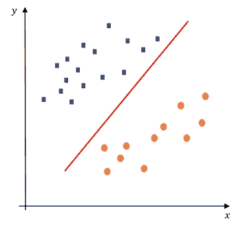
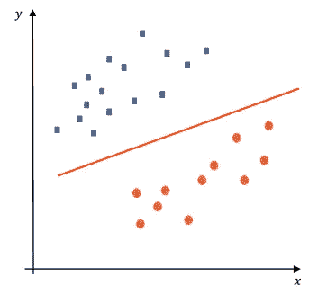
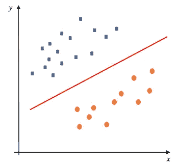
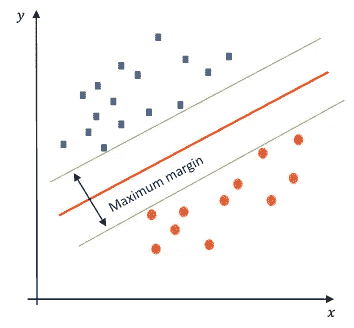
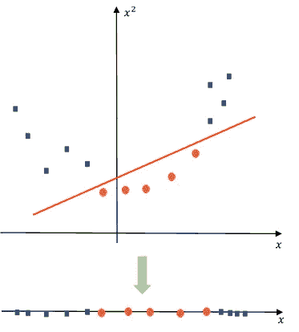
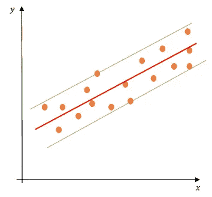

# 支持向量机不到 5 分钟

> 原文：<https://towardsdatascience.com/support-vector-machines-in-under-5-minutes-3074762a49bf?source=collection_archive---------22----------------------->

坦纳·博瑞克在 [Unsplash](https://unsplash.com?utm_source=medium&utm_medium=referral) 上拍摄的照片

## 关键概念简介

# 介绍

在本文中，我将通过一些直观的例子向您介绍支持向量机(SVM)的概念，尽可能将技术细节放在一边。

# 分类示例

## 线性情况

假设我们有以下两类数据点集—蓝色方块和橙色圆圈:

图 1

现在我们想确定划分数据的最佳决策边界。决策边界将位于上述两类数据之间，并且可以采取以下形式:

图 2

或者:

图 3

或者甚至:

图 4

哪一个可能是最佳的呢？请注意，当引入新数据时，没有优化的决策边界可能会导致大量的错误分类。

让我们看看上面的最后一个例子。假设我们在两个类别之间定义任意分隔线:

图 5

位于绿色分隔线上的点称为“支持向量”。它们是差值向上推的数据点，或者是最接近其他类的数据点。换句话说，我们只关心算法中的支持向量，其他所有训练数据点都不是主要关心的。准确地说，我们希望 SVM 算法能够查看接近另一类的极端数据点，而不是边缘。最大边缘是支持向量到决策边界超平面的最近距离的总和。请注意，对于 SVM 的情况，红线被称为超平面，因为 SVM 可以处理多维数据，其中数据点被称为向量，因为它们在多维数据空间中具有坐标。

但是，当数据点不像上面的例子那样是线性可分的(即非线性的)时，会发生什么呢？这时候非线性 SVM 就出现了。

## 非线性情况

考虑下面的例子，其中数据点具有某种二次(非线性)模式:

图 6

为了获得数据的线性映射，我们可以对超平面(红线)进行变换，从而得到上面的 1 维空间。超平面现在是一条抛物线。

但是，此类转换的计算开销可能很大，并且可能需要很长时间才能运行，尤其是对于大型数据集。幸运的是，有一种技术叫做“**内核技巧**”。这种方法的命名源于核函数的使用，该核函数允许在高维向量空间中操作，而不需要计算空间中数据点的坐标。相反，他们计算特征空间中向量的点积。使用这个“技巧”会导致所有点通过某种变换被映射到一个更高维度的空间。该方法的要点是将非线性空间转换成线性空间，仅此而已！

一些流行的核函数包括线性核、多项式核和径向基函数(RBF)核。支持向量机内核技巧的一个缺点是选择正确的内核并不简单，而且必须进行一些超参数调整。幸运的是，Scikit-learn 等流行的 Python 库已经实现了 SVM 和超参数调整模块，用于直观的集成。关于 Python 实现的大量文档可以在 Scikit-learn 的[这里](https://scikit-learn.org/stable/modules/svm.html#svm)找到，关于 SVM 的[这里](https://scikit-learn.org/stable/modules/grid_search.html)找到，关于超参数调优的找到。

# 回归案例呢？

要使用 SWMs 执行回归，需要做的只是颠倒目标，而不是尝试在分类中适应最大可能的裕度(图 5 ),对于回归，我们尝试在裕度定义的空间上适应尽可能多的实例:

图 7

# 下一步是什么

我将在以后的文章中介绍更多关于支持向量机的内容，陈述它们的优点和缺点，以及更多的实际例子。敬请关注！

# 参考

[1]t . Hastie，r . TiB shirani 和 j . h . Friedman(2009 年)。统计学习的要素:数据挖掘、推理和预测。第二版。纽约:斯普林格。

[2]超参数调整方法。检索自:[https://scikit-learn.org/stable/modules/grid_search.html](https://scikit-learn.org/stable/modules/grid_search.html)。

[3]sci kit-learn 中的支持向量机。检索自:[https://scikit-learn.org/stable/modules/svm.html#svm](https://scikit-learn.org/stable/modules/svm.html#svm)。

# 评论

*   图 1 到图 7 是我自己手绘的，就不用引用了。