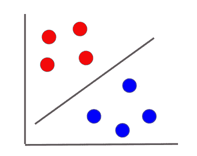
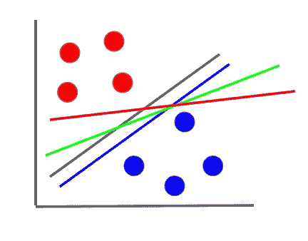
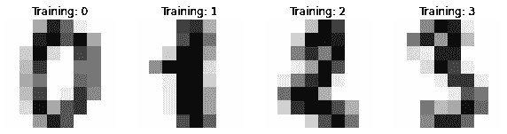
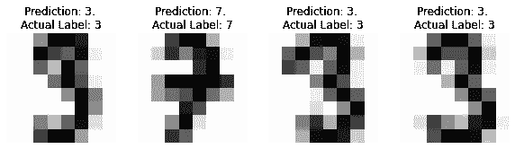
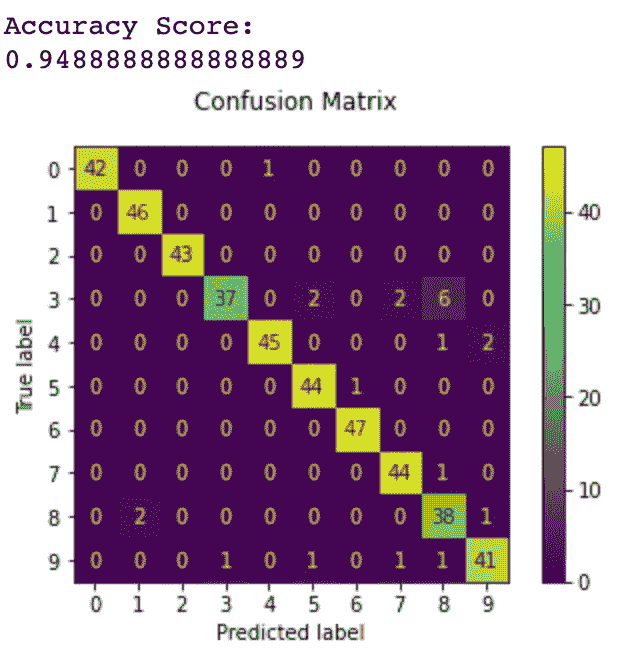

# 支持向量机——用 Python 实现的机器学习算法

> 原文：<https://towardsdatascience.com/support-vector-machines-machine-learning-algorithms-with-implementation-in-python-f4337941818?source=collection_archive---------43----------------------->

## 机器学习算法— 30 天挑战

## 在本文中，我们将研究支持向量机如何工作，以及如何使用 Python (Scikit-learn)实现它们

在本文中，我们将研究支持向量机，这是另一种重要的机器学习算法，主要用于分类目的，在您的 ML 算法工具箱中。

图片来自 [Unsplash](https://unsplash.com/photos/oZ61KFUQsus)

我们将从研究支持向量机做什么开始，然后继续使用`scikit-learn`来实现它，使用虚拟数据和真实世界的数据集。

*   什么是支持向量机
*   Python 实现(虚拟数据)
*   Python 实现(真实世界数据集)
*   应用程序
*   结论
*   你能做什么
*   其他 ML 算法

这是我 30 天文章写作挑战的一部分。请随意查看我的新人帖子上的文章:

 [## 让我们在 30 天内发表 30 篇文章

### 在这篇文章中，我将接受挑战，在未来 30 天内写 30 篇与数据科学相关的文章…

nouman10.medium.com](https://nouman10.medium.com/lets-publish-30-articles-in-30-days-a0b8111855bb) 

# 什么是支持向量机

支持向量机(SVM)是一种用于分类目的的机器学习算法。它通过定义一个最佳超平面来对不同的类进行分类，该超平面以这样一种方式将两个类分开，即它们离超平面的距离尽可能最大。让我们用形象化的方法来解释它。

假设我们有一些属于两个不同类别的二维数据，如下所示:

作者图片

支持向量机要做的是提出一个超平面，将数据分成两个独立的类，如下所示:

作者图片

现在对于分离超平面有很多选择。例如，像这样:

作者图片

注意，所有这些超平面都精确地划分了训练数据，但是所有这些都不是最佳的。对于一个最优的超平面，它应该在每个类的封闭实例之间有一个最大距离，这就是支持向量机的目标。

我们不会研究 SVM 的理论方面，因为它需要一篇自己的文章。但是你可以在这里阅读。

# Python 实现(虚拟数据)

为了更好地理解实现，让我们从在虚拟数据上实现 SVM 开始。为此，我们使用了`scikit-learn`。我们将使用`scikit-learn`库中的`SVC`模块，因为我们将它用于分类目的(SVC - >支持向量分类器)。

我们将模型与虚拟数据进行拟合，并做出预测。如果你查看数据，超平面可能会根据正或负的特征来区分实例。这就是为什么如预期的那样，预测属于类别 1。

# Python 实现(真实世界数据集)

让我们也在真实世界的数据集上实现 SVM。我们将使用`digits`数据集。它是包含灰度数字图像的图像数据集。我们将使图像变平，以便像素可以用作特征。

我们将从导入所需的库、加载数据集和绘制一些图像开始:

由于尺寸很小，图像会很模糊

作者图片

我们现在将从展平图像开始，将数据集分为训练和测试，初始化我们的模型，使我们的模型适合训练数据，最后对数据集进行预测。

现在，让我们绘制一些测试数据，以及预测和实际标签。

作者图片

这些预测看起来非常一致。但是，让我们计算分数，并绘制混淆矩阵，以获得更大的图片:

这给了我们大约 94%的准确度，这是相当好的，因为我们没有调整任何超参数。

作者图片

# 应用程序

1.  文本分类
2.  面部表情分类
3.  语音识别

在这里阅读更多关于[的信息](https://techvidvan.com/tutorials/svm-applications/)

# 结论

让我们总结一下本文所做的工作:

*   我们从支持向量机如何工作的一般解释开始
*   然后，我们用 Python 在一些虚拟数据上实现了它，随后在一个数据集上实现了它
*   最后，我们研究了 SVM 的应用

# 您可以做什么:

*   尝试从零开始实现支持向量机。为此，首先要理解支持向量机背后的数学原理。
*   将您的实现与`scikit-learn`中的实现进行比较
*   在各种其他数据集上测试上面的代码。

如果你有任何问题，请随时联系我。请继续关注我，因为我计划在未来讲述更多的机器学习算法

# 其他 ML 算法:

*   线性回归——用 Python 实现的机器学习算法

 [## 线性回归—从 A 到 Z

### 在本文中，我们将从数学上研究线性回归，以及如何使用 Python (Scikit-learn)实现它

medium.com](https://medium.com/mlearning-ai/linear-regression-a-to-z-2ab3d1b7277c) 

*   k-最近邻——机器学习算法及其 Python 实现

 [## k-最近邻-用 Python 实现的 A 到 Z

### 在本文中，我们将从数学上研究 k-最近邻，以及如何使用 Python 实现它…

nouman10.medium.com](https://nouman10.medium.com/k-nearest-neighbors-a-to-z-with-implementation-in-python-74630ffb79a2) 

*   决策树——机器学习算法及其 Python 实现

 [## 决策树——机器学习算法及其 Python 实现

### 在本文中，我们将研究机器学习算法“决策树”以及如何使用 Python 实现它…

nouman10.medium.com](https://nouman10.medium.com/decision-trees-machine-learning-algorithms-with-implementation-in-python-5bc034e67fc8) 

*   k-Means-机器学习算法及其在 Python 中的实现

 [## k-Means-机器学习算法及其在 Python 中的实现

### 在本文中，我们将研究 K-Means 以及如何使用 Python (Scikit-learn)实现它

towardsdatascience.com](/k-means-machine-learning-algorithms-with-implementation-in-python-ac1d48e90239) 

*   逻辑回归——用 Python 实现的机器学习算法

 [## 逻辑回归——用 Python 实现的机器学习算法

### 在本文中，我们将研究逻辑回归，一种机器学习分类算法，以及如何…

towardsdatascience.com](/logistic-regression-machine-learning-algorithms-with-implementation-in-python-7dd5778279fc) 

如果您觉得以上内容对您有用，请分享并随时支持我-->

*   [https://www.buymeacoffee.com/nouman10](https://www.buymeacoffee.com/nouman10)