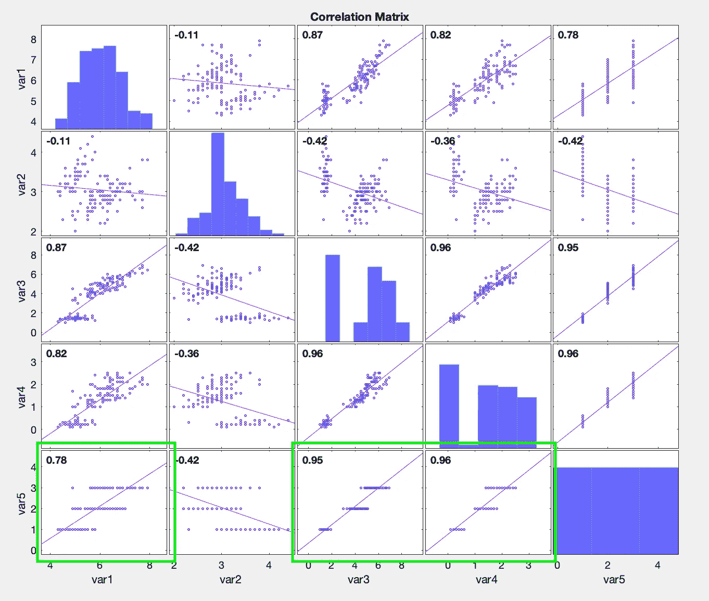

# 支持向量机——多项式示例

> 原文：<https://towardsdatascience.com/support-vector-machines-multinomial-example-8d9a86dde1d3?source=collection_archive---------23----------------------->

## SVM 非常适合对数据进行分类，你可以看到很多二项式的例子。这是一个很好的 Matlab 多项式例子…


Sani2C 2017

如果你刚到这里，对 SVM 还不是很了解，那么先看看这篇文章。

# 让我们从一个好的数据集开始。

Iris flower 数据集是由英国统计学家和生物学家罗纳德·费雪在其 1936 年的论文《分类问题中多重测量的使用》中引入的多元数据集。它有时被称为安德森虹膜数据集，因为埃德加·安德森收集的数据量化了三个相关物种的虹膜花的形态变化。该数据集由来自三种鸢尾(刚毛鸢尾、海滨鸢尾和杂色鸢尾)的每一种的 50 个样本组成。测量每个样品的四个特征:萼片和花瓣的长度和宽度，以厘米为单位。你可以从 [Kaggle](https://www.kaggle.com/arshid/iris-flower-dataset) 下载。


图 1:源 Kaggle

# 加载数据集

我们的第一步是加载数据集，并让归一化我们的特征以获得更好的性能。在创建 **y** 时，让我们使用 grp2idx 将物种转换成数字。

```
%% Loading our dataset
clear;
tbl = readtable(‘IRIS.csv’);
[m,n] = size(tbl);X = tbl{:,1:n-1};
[y,labels] = grp2idx(tbl{:,n});nl = length(labels);
[X_norm, mu, sigma] = featureNormalize(X);
```

# 分割训练和测试数据集

让我们把数据集分成一个训练集和一个测试集，确保随机进行。分成比例是 80/20。

```
%% split up train, cross validation and test set
rand_num = randperm(size(X,1));
X_train = X(rand_num(1:round(0.8*length(rand_num))),:);
y_train = y(rand_num(1:round(0.8*length(rand_num))),:);
X_test = X(rand_num(round(0.8*length(rand_num))+1:end),:);
y_test = y(rand_num(round(0.8*length(rand_num))+1:end),:);cv = cvpartition(y_train,’k’,5);
```

# 特征选择

我们需要决定哪些是我们最好的特性，所以让 sequentialfs 为我们做这项工作。然而，sequentialfs 需要一个代价函数，它被定义为一个名为' **costfun** '的内嵌泛函。该函数使用 [matlab 的**损失**函数](https://www.mathworks.com/help/stats/classreg.learning.classif.compactclassificationsvm.loss.html#d123e538439)来评估每个模型的分类误差。最后，删除不需要的列

```
%% feature selectionopts = statset(‘display’,’iter’);
costfun = @(XT,yT,Xt,yt)loss(fitcecoc(XT,yT),Xt,yt);[fs, history] = sequentialfs(costfun, X_train, y_train, ‘cv’, cv, ‘options’, opts); % Remove unwanted columns
X_train = X_train(:,fs);
X_test = X_test(:,fs);
```

运行特性选择后，您应该会看到它所选择的列[1 3 4]。这是一个小数据集，你可能会得到**不同的**结果，但我相信你已经明白了；-).如果你运行一个 corrplot([X y])，看看最下面一行，就能理解为什么 1，3 & 4 在 y 轴上有最好的结果。



图 2

# 火车 SVM

Matlab 有一个很棒的函数叫做[**fitcecoc**](https://www.mathworks.com/help/stats/fitcecoc.html#d123e295398)**代表我们适合 SVM 的多类模型。**

> **太好了。我们不需要做数学计算…**

**我们选择使用高斯核来评估我们的模型。如果你需要介绍的话，我会在这里解释高斯。然后让我们用损失函数来计算我们的准确度。**

```
%% check loss against test dataset
t = templateSVM(‘KernelFunction’,’gaussian’);
mdl = fitcecoc(X_train, y_train,’Learners’,t,’Coding’,’onevsone’);
L = loss(mdl,X_test,y_test) * 100
```

**如果选择了[1 3 4]列，那么您应该会看到 0%的损失。**

# **预测的**

**好，现在我们知道我们有 100%的准确率，因为损失是 0%。Matlab 还有一个方便的**预测**功能来帮助我们做预测。在下面，我们需要使用 featureNormalize 中的 **mu** 和 **sigma** 来确保我们的比例是正确的。当特征为[5.2 3.5 1.2 0.3]时，我们预测结果。**

```
%% Predict a resultpx = bsxfun(@minus, [5.2 3.5 1.2 0.3], mu);
px = bsxfun(@rdivide, px, sigma);predict(mdl,px([1 3 4]))
```

**一切顺利，你的结果是“1”，也就是“Iris-setosa”。**

# **结论**

**尽管我们在这里进行了更详细的讨论，多项式 SVM 在 Matlab 中使用起来并不复杂。一如既往，一切都与数据有关，因此拥有一个好的数据集是关键。**