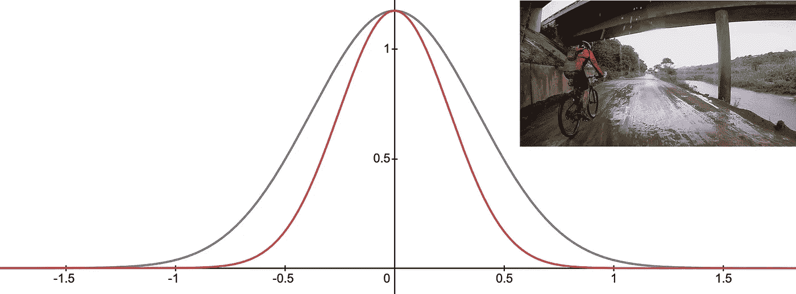
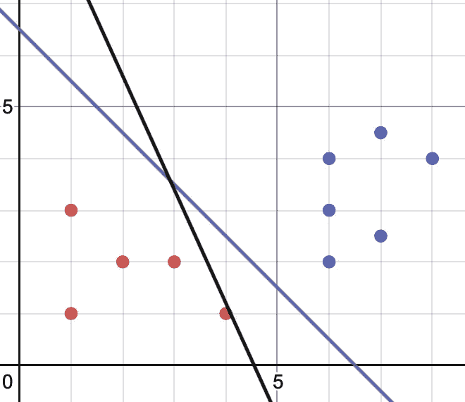
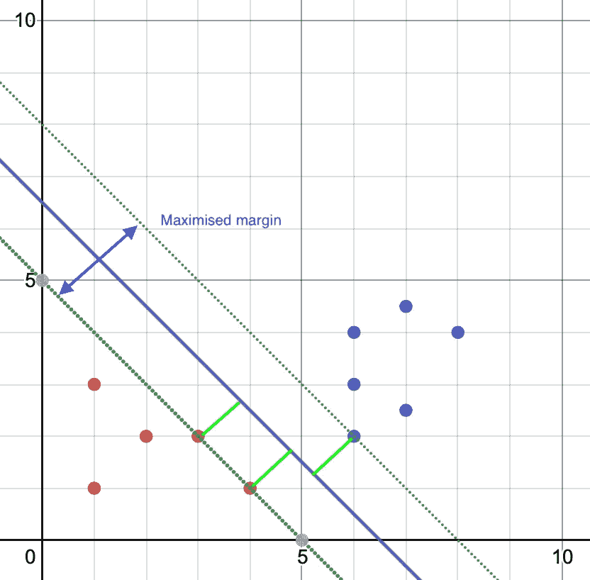
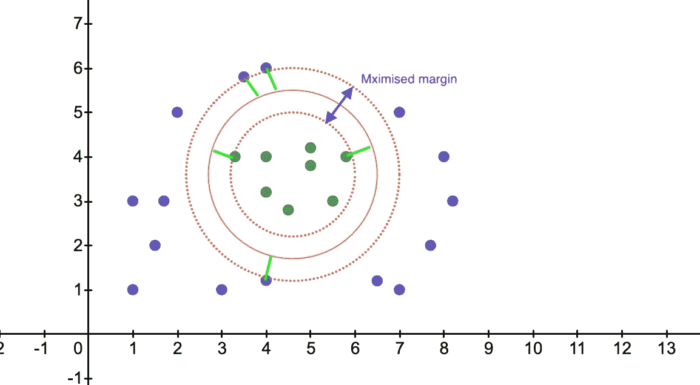
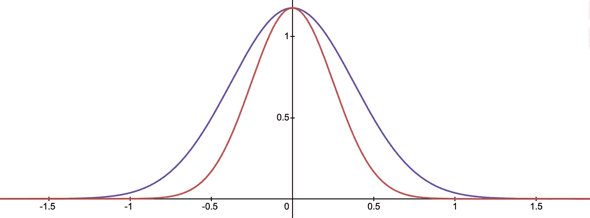
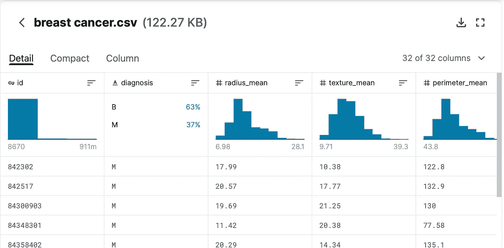
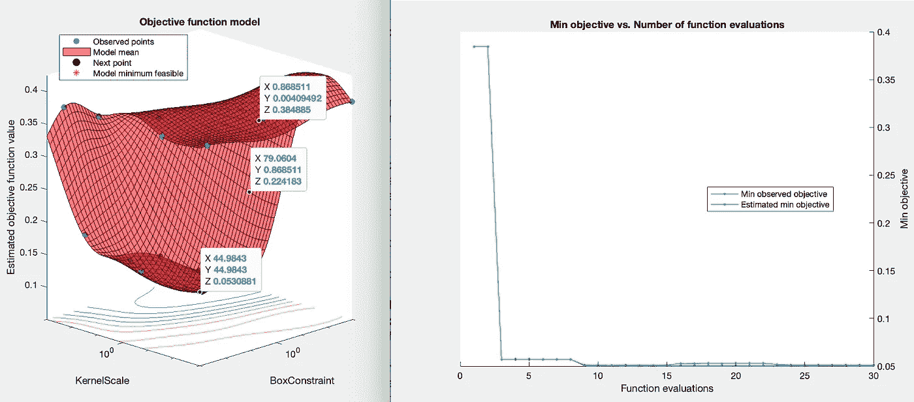

# 支持向量机:基础知识

> 原文：<https://towardsdatascience.com/support-vector-machines-the-basics-5a2acc0db450?source=collection_archive---------36----------------------->

## 对数据集进行分类时，SVM 是逻辑回归的一个很好的替代方法。它被用于线性和非线性分类，在 Matlab 和 Python 中都得到了很好的处理。



# 基础知识

SVM 执行的重要工作是找到一个决策边界来分类我们的数据。这个决策边界也被称为**超平面**。

让我们以一个例子来解释它。**视觉上**，如果你看图 1，你会发现紫线是比黑线更好的超平面是有道理的。黑线也可以完成这项工作，但是稍微滑动一点接近其中一个红点，使它成为一个好的决策线。

从视觉上看，这很容易发现。



图 1

# 线性分类

所以，问题依然存在，SVM 是如何证明这一点的呢？如果我们坚持将紫色线作为最佳超平面，那么 SVM 将寻找最接近它的点，计算这些点和超平面之间的距离。这个距离被称为余量，如图 2 中绿色虚线所示。

在图 2 中，超平面和我们的数据点之间的这些间隙(亮绿色)被称为支持向量。

一旦它找到了聚类之间具有最大间隔的超平面， **BOOM** - **BAM** ，我们就找到了我们的最优超平面。因此，SVM 确保集群之间的差距尽可能大。



图 2

# 非线性分类

非线性分类在 SVM 也是可行的，事实上，这是 SVM 的闪光点。这里，SVM 使用**K*ernels*’**将非线性数据映射到更高维度，使其成为线性数据，并找到最佳超平面。

事实上，SVM 总是使用核函数。不管它是线性的还是非线性的数据，但是当数据不是如图 1 所示的直线形式时，它的主要功能就开始发挥作用了。核函数为分类问题增加了维度。

图 3 示出了非线性情况下的 SVM 超平面的简化图示。



图 3

# 核

有几个核心选择，我们必须协助我们与 SVM。我发现你需要尝试一下，看看最适合你的数据。最流行的是**高斯**内核。[这里](http://pages.stat.wisc.edu/~mchung/teaching/MIA/reading/diffusion.gaussian.kernel.pdf.pdf)是对这个内核的详细解释。我们选择的参数决定了高斯曲线的形状。我不会去解释数学，因为我们有图书馆为我们做这些。可以说，你可以看到图 3 是图 4 的俯视图。曲线的**形状**取决于我们接下来将讨论的**参数**。



图 4

# 重要参数

**“C”**控制平滑决策边界和正确分类训练点之间的权衡。此参数表示 SVM 错误分类的错误惩罚。它保持了更平滑的超平面和错误分类之间的折衷。

*   一个**大的**值意味着你会得到更多正确的训练点，因为你会有一个较低的偏差和一个较高的方差。不要把它做得太小，否则你的数据会不足。
*   小的**值意味着较高的偏差和较低的方差。不要把它做得太小，否则你会使你的数据过多。**

**【Gamma】***方差*决定高斯核的*宽度*。在统计学中，当我们考虑高斯概率密度函数时，它被称为*标准差*，它的平方 s2 是*方差*。

# 我们何时使用 SVM、逻辑回归或神经网络？

如果 n =特征的数量，而 m=训练集的行数，则可以将此作为指导:

*   n =大(> 1000)，m =小(<1000)
    >)使用无内核的逻辑回归或 SVM
*   n =小(<1000), m=small (<10 000)
    >)SVM 与高斯核
*   n =小(<1000), m=small (> 50 000)
    >添加特性
    >物流回归或 SVM 无内核

神经网络在上述所有情况下都能很好地工作，但是训练起来比较慢。

# 让我们在 matlab 中编码

现在，我们有了基础，让我们开始编码，这样我们就可以看到它的工作。在开始之前，[从 kaggle 下载](https://www.kaggle.com/priyanka841/breast-cancer-diagnostics-prediction)数据集。了解数据，你会发现第一列是不需要的，而我们的分类在第二列。因此，我们的特征是第 3 列到第 31 列。



图 5: [来源](https://www.kaggle.com/priyanka841/breast-cancer-diagnostics-prediction)

我们将从加载数据开始，然后归一化特征。

```
%% setup X & Y
clear;
tbl = readtable(‘breast cancer.csv’);
[m,n] = size(tbl);
X = zeros(m,n-2);
X(:,1:30) = tbl{:,3:32};
[y,labels] = grp2idx(tbl{:,2});[X_norm, mu, sigma] = featureNormalize(X);
```

接下来，我们可以创建我们的训练和测试数据集。我们还将创建“cv ”,它将把训练集分成一个训练集和一个交叉验证集。“cv”将在 SVM 期间使用。

```
%% split up train, cross validation and test set
rand_num = randperm(size(X,1));
X_train = X(rand_num(1:round(0.8*length(rand_num))),:);
y_train = y(rand_num(1:round(0.8*length(rand_num))),:);X_test = X(rand_num(round(0.8*length(rand_num))+1:end),:);
y_test = y(rand_num(round(0.8*length(rand_num))+1:end),:);cv = cvpartition(y_train,’k’,5);
```

在运行 SVM 之前，让 sequencialfs 告诉我们哪些是最好的特性

```
%% feature selection
opts = statset(‘display’,’iter’);% create an inline function which will perform SVM on each column
classf = @(train_data, train_labels, test_data, test_labels)…
  sum(predict(fitcsvm(train_data, train_labels,’KernelFunction’,’rbf’), test_data) ~= test_labels);% fs will hold the most appropriate features
[fs, history] = sequentialfs(classf, X_train, y_train, ‘cv’, cv, ‘options’, opts);
```

现在，我们可以删除不适合假设的特征

```
%% retain columns from feature selection
X_train = X_train(:,fs);
X_test = X_test(:,fs);
```

最后，运行 SVM 并使用测试数据集来检查准确性

```
%% predict, try linear, gaussian, rbf
mdl = fitcsvm(X_train,y_train,’KernelFunction’,’rbf’,...
  ’OptimizeHyperparameters’,’auto’,...  
  ‘HyperparameterOptimizationOptions’,...
  struct(‘AcquisitionFunctionName’,...
  ‘expected-improvement-plus’,’ShowPlots’,true));
pred = predict(mdl,X_test);
accuracy = (mean(double(pred == y_test)) * 100)
```

您最终应该得到 98.24%的准确度，而结果图应该如下所示。



图 7:来自 Matlab

最后，在我们结束之前，这里是特征归一化函数

```
function [X_norm, mu, sigma] = featureNormalize(X)
  mu = mean(X);
  X_norm = bsxfun(@minus, X, mu);
  sigma = std(X_norm);
  X_norm = bsxfun(@rdivide, X_norm, sigma);
end
```

# 结论

对数据集进行分类时，SVM 是一个不错的选择。了解它何时是优于逻辑回归的好选择，以及何时使用高斯核或在没有核的情况下运行它是很有用的。

# 来源

*   图 1-6 是在 www.desmos.com 建造的