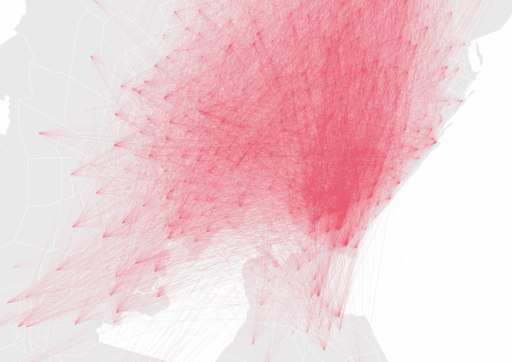
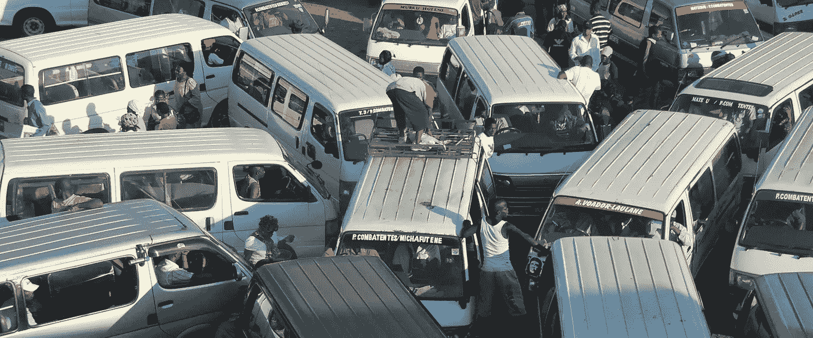
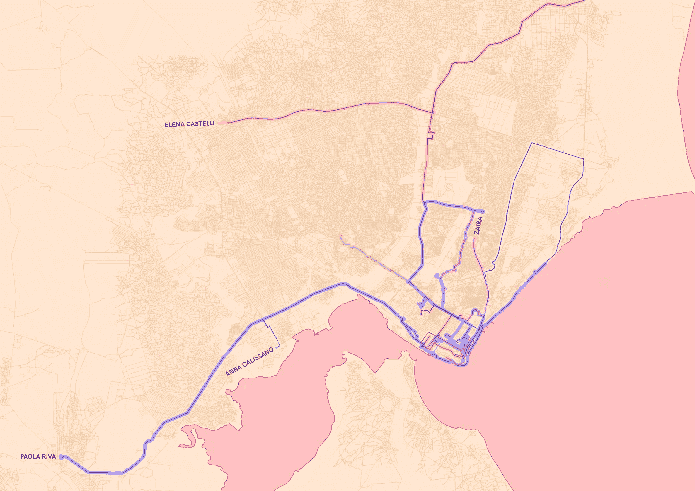
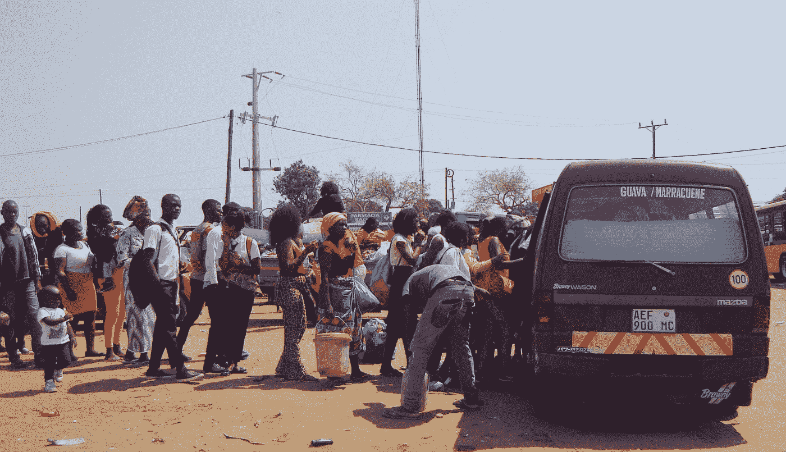
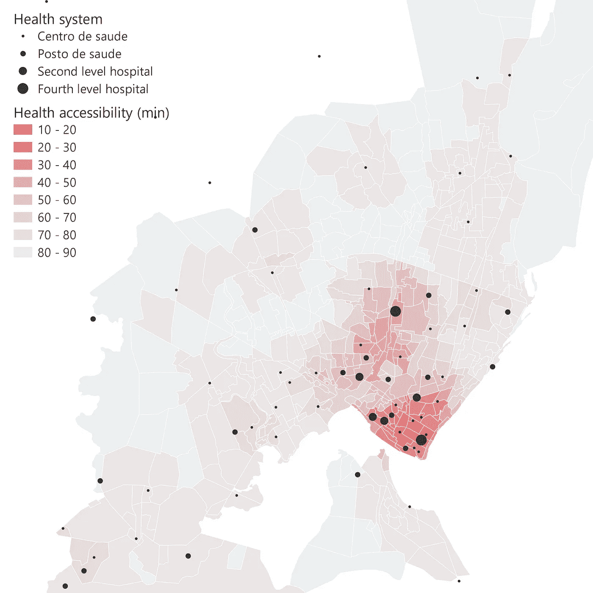
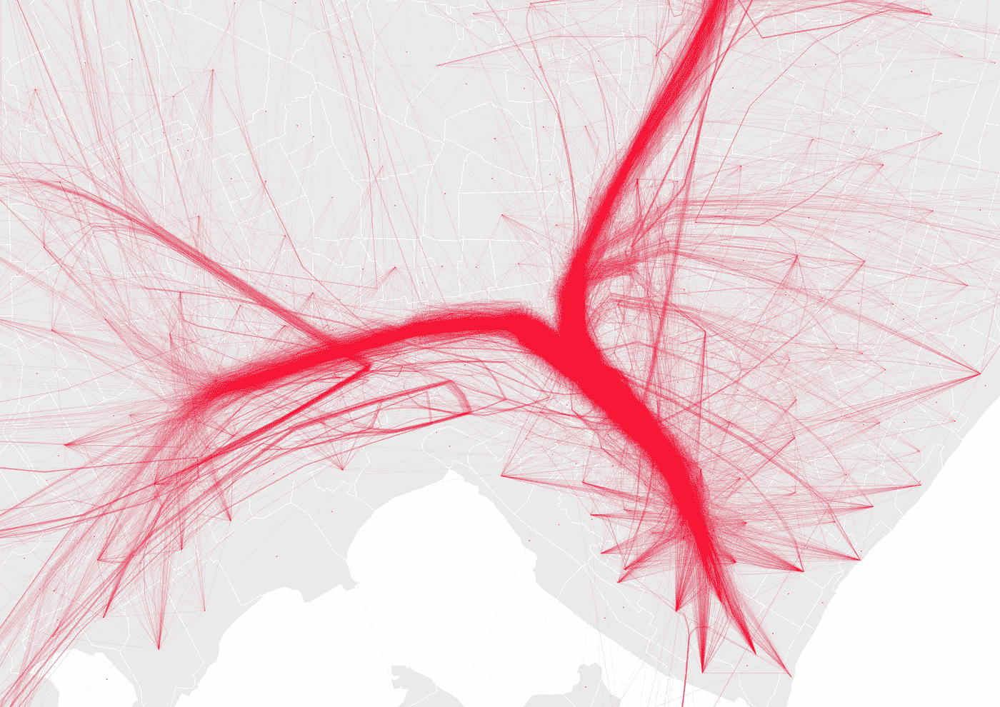
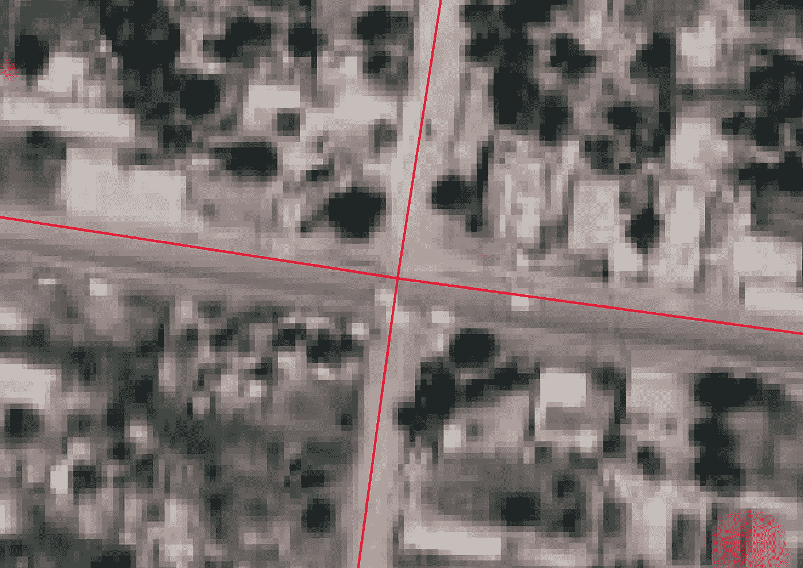
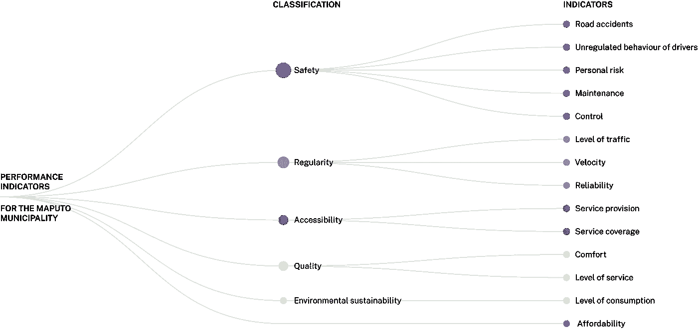

# 通过大数据分析支持非洲的准过境流动

> 原文：<https://towardsdatascience.com/supporting-para-transit-mobility-in-africa-through-big-data-analysis-7f3042a291b8?source=collection_archive---------21----------------------->

## 准备好狩猎 nje ma——一次斯瓦希里语的“美好之旅”

## 一个数据科学多学科项目，旨在研究和减少撒哈拉以南国家的“交通贫困”

莫桑比克大马普托地区的起点-终点矩阵。[图片由作者提供， [Safari Njema](https://www.safari-njema.polimi.it/)

在许多发展中国家，包括运输、食品供应和私人交通解决方案在内的基本服务和活动不能被视为理所当然。在世界许多地区，运输服务不是在有组织和有结构的基础上提供的。这意味着您不能期望公共汽车或火车按照官方时间表运行，连接预先定义的位置(即公共汽车站或车站)。

> “由于交通贫困，许多居民负担不起前往市中心或企业和机构所在地的费用，从而剥夺了他们享受城市化带来的全部好处”[联合国人居署——城市流动性，2019 年]

取而代之的是，基于自下而上的请求和私人主动倡议，一些类似的运输解决方案被创造出来，司机或公司的合作者建立了他们自己的解决方案。这就是所谓的**非正规流动或辅助转移**。

> "准运输类的服务是在没有官方许可的情况下提供的."[R. Cervero，A. Golub，非正规运输:全球视角]

在这种情况下， [**Safari Njema 项目**](https://www.safari-njema.polimi.it/https://www.safari-njema.polimi.it/) **是一项数据科学研究活动，旨在重新设计发展中国家当前的辅助运输流动系统。**该项目获得了米兰理工大学社会责任项目的 PoliSocial 奖。

该项目旨在实现以下目标:

*   测试**大数据支持辅助运输系统的潜力**；
*   开发一种方法，为**更有条理的报价和更高效、更安全的运输服务模式**奠定基础；
*   在**社会创新、组织设计和技术创新**之间的交叉点提出一个分析模型，该模型可以被当地机构和决策者应用和复制；
*   创建**数学和统计模型**应用于城市研究和城市政策，以开发合理的数据分析模型和算法；
*   在数据收集困难的情况下支持**快速决策**。

撒哈拉以南非洲的客运服务。photo BY[*A Verdade*](https://www.flickr.com/people/95731954@N02)*[*CC-BY 2.0*](http://creativecommons.org/licenses/by/2.0/)。*

*实际上，这意味着:*

*   ***研究辅助运输移动模型，整合 GPS 数据、手机网络数据和其他来源***
*   ***构建客运服务绩效指标***
*   ***通过可操作的信息和数据可视化提供见解以改进决策***
*   ***实现移动服务的实时调整***

*该项目实施了针对这些目标的方法、分析和实验。已经在莫桑比克马普托市进行了实验，整合了实地收集的数据集和合作伙伴的[数据集。](https://www.safari-njema.polimi.it/data/)*

*这些活动包括以下步骤。*

## *马帕森*

*Safari 研究人员组织了一次 mapathon 活动，亲身体验马普托市的移动系统，并将交通方式与移动用户的移动联系起来。在 2019 年 9 月由马普托大都会交通局(AMT)组织的第二届可持续移动周(Semana da Mobilidade sustentável daÁ大都会区)期间，一队 Safari 研究人员用正式和辅助运输方法探索了这座城市，跟踪路径并收集数据。*

**

*地图马拉松的结果。[图片作者， [Safari Njema](https://www.safari-njema.polimi.it/) group]*

## *无障碍和社会包容*

*文献证明**与城市隔离相关的社会成本与公共交通公平和效率相关**。该项目强调如何通过测量公共交通对以下资源的物理可达性来分析公平、包容、隔离和财富:医疗服务、教育服务、CBD(中央商务区)、水源和金融服务。*

**

*马普托的 Paratransit access。[作者照片，Safari Njema 集团]*

*例如，获得医疗保健设施至关重要，并对人们的生活产生重大影响。为了让每个人都有平等的机会，卫生设施必须分布合理。到医疗机构的步行距离至关重要，尤其是对于没有汽车的穷人来说。*

> *“两公里范围内没有卫生设施的贫困家庭的数量是非贫困家庭的三倍”。[世界银行关于马普托城市贫困的报告]*

*在我们的分析中，我们考虑了每个卫生机构产生的等时线及其水平，这是基于可用的护理服务。该指标适用于形态区域，即比现有行政区(区或区)更小的都市地区的详细和同质的细分。此处描述了其他可访问性结果[。](https://www.safari-njema.polimi.it/accessibility/https://www.safari-njema.polimi.it/accessibility/)*

**

*莫桑比克马普托卫生服务的可及性。[图片由作者 Safari Njema group 提供]*

## *非正式公交地图*

*在马普托的移动性设置中，通过 GPS 数据测量移动性可能会产生两方面的影响。一方面，地方交通部门可以利用分析结果更好地规划和优化公共交通系统。另一方面，市民也可以访问公共交通系统的更翔实的描述。**构建起点-终点矩阵是测量和理解这一现象的第一步。**实施的研究分析了市民移动的 GPS 轨迹，描述了城市内形态区域之间的每小时流量。*

*给定预处理 GPS 轨迹获得的一组轨迹，我们将它们聚集成每小时的起点-终点矩阵。马普托大都市区被划分为无障碍、公平和社会排斥等形态区域。起点-终点矩阵是这样的网络，其中每个节点是一个形态区域，两个区域之间的每条边计算从一个区域开始到另一个区域结束的轨迹的数量。边权重对应于某一小时内离开该区域的轨迹的数量。*

**

*莫桑比克马普托市中心的起点-终点矩阵。[图片由作者 Safari Njema group 提供]*

*这些分析能够:在一天的不同时间找到吸引人的区域；并在一天的不同时间找到孤立的区域。这两个输出可以帮助决策制定者根据实时测量的需求有意识地改进报价。*

## *自动路面检测*

**

*路面检测示例。[图片由作者 Safari Njema group 提供]*

*在像马普托这样的非洲大城市，道路状况严重影响着交通系统，阻碍了一些交通工具进入特定的道路，阻碍了沿特定路线的乘车，并使少数维护良好的走廊交通泛滥。自动道路路面检测包括基于路面的颜色及其特定位置开发旨在对路面进行分类的机器学习管道。*

## *绩效评估系统*

*该项目综合分析了(1)涉及正规和准运输流动系统的现有研究和项目，(2)关于绩效测量系统和指标的二手资料，以及(3)通过马普托行动研究方法收集的主要资料，为发展中国家的流动系统评估制定了一个理论框架。*

**

*非正规交通的绩效指标模型。[图片由作者 Safari Njema group 提供]*

*[进一步的结果和分析](https://www.safari-njema.polimi.it/outputs/)见项目网站:*

*<https://www.safari-njema.polimi.it/>  

您还可以在 YouTube 上观看该项目的介绍视频(意大利语音频):*