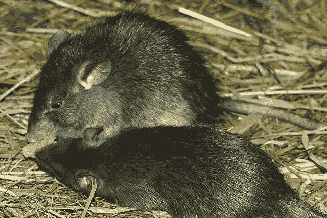
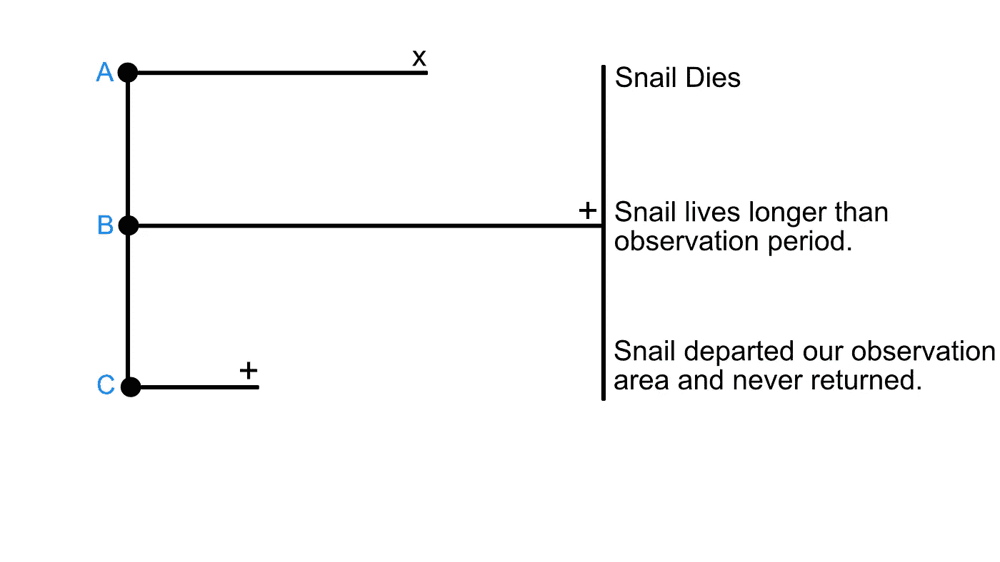
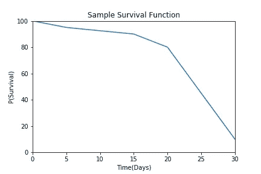
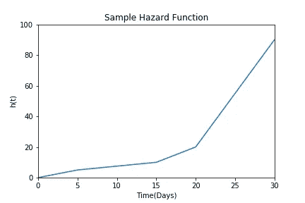

# 生存分析:删失，生存函数和风险函数。

> 原文：<https://towardsdatascience.com/survival-analysis-censoring-survival-functions-and-hazard-functions-35a3325ece40?source=collection_archive---------19----------------------->

塔尼娅·科托阿加在 [Unsplash](https://unsplash.com?utm_source=medium&utm_medium=referral) 上拍摄的照片

在最流行的机器学习和统计分析框架的实现中，经常被忽略的是生存分析。简单地说，生存分析是一个感兴趣的*事件*发生所需要的时间。虽然这看起来很简单，但现实要复杂一些。在本文中，我们将介绍一些在进行生存分析或决定它是否是解决您问题的正确工具时需要理解的高级概念。

## 生存分析解决什么问题？

正如你可能已经猜到的名字，生存分析在历史上一直被医学研究团体用来测量在各种情况下某些药物或治疗的存活率。这远不是它的唯一用途，因为它也常用于商业。你可以使用生存分析来预测你当前的一个客户何时会停止使用你的服务([流失](https://blog.hubspot.com/service/what-is-customer-churn))，或者你制造的一台机器何时会坏掉([故障时间分析](http://userwww.sfsu.edu/efc/classes/biol710/survival/surv-anal.htm))。社会学家使用生存分析来预测事件的发生和时间([事件历史分析](https://www.encyclopedia.com/social-sciences/encyclopedias-almanacs-transcripts-and-maps/event-history-analysis))。

你可能会问自己“难道没有其他工具，比如回归或分类，可以解决这个问题吗？”。答案是，没有，原因呢？审查。

## 审查

删截的受试者是那些在观察窗内没有经历过感兴趣的事件的受试者。让我们假设我们是被派往[小笠原群岛](https://en.wikipedia.org/wiki/Bonin_Islands)的研究人员，研究当地蜗牛种群的生存，对抗在岛上横行的[船鼠( *Rattus rattus* )](https://www.pestdetective.org.nz/culprits/ship-rat/) 。[研究显示](https://www.sciencedirect.com/science/article/abs/pii/S0006320710001436?via%3Dihub)岛上船鼠数量的增加导致了陆地蜗牛种类的减少(具体来说，是生活在地上/树上的壳更大的蜗牛)。我们到达这个岛，带着足够的资金和物资去观察更大的地上蜗牛一个月。

小笠原群岛无助的陆生蜗牛的凶手。鸣谢:克里桑，CC BY-SA 3.0<[https://creativecommons.org/licenses/by-sa/3.0](https://creativecommons.org/licenses/by-sa/3.0)>，通过维基共享

在我们的例子中，假设我们可以观察到 500 只上述提到的蜗牛，当它们进入我们的观察区域时，观察区域是森林中 1 英亩的土地。当蜗牛进入这个区域时，我们可以观察到它们。我们还神奇地拥有很多蜗牛的数据，比如:壳的直径，重量，在树上呆的时间，在地上呆的时间。现在我们要坐下来，等着记录我们被老鼠吃掉的蜗牛朋友，或者活着讲述这个故事。

一个月后，我们记录了所有蜗牛被老鼠吃掉的次数，但是我们的资金已经用完了，我们不得不离开。我们在一个月中观察到的 B:仍然活着或 C:离开观察区域的所有蜗牛都被认为是**正确审查的**。在观察期内未发生感兴趣的事件(他们的死亡)。

图片作者。

右删截是最常见的删截类型，也是我们的蜗牛示例中唯一有意义的类型。使用传统的分类和回归模型，所有属于 B 类和 C 类的观察值都必须被丢弃。通过生存分析，我们可以利用所有的观察结果来预测某一事件在特定时间发生的概率。

## 生存和危险函数。

图片作者。

生存函数 *S(t)，*通常用 x 轴上的时间和 y 轴上事件发生的概率来表示。如果上图中的蓝线是平坦的，随着时间的推移保持接近 100%，那么这对蜗牛来说是个好消息——这意味着许多蜗牛在观察期内存活下来。然而，在上面的例子中(图中使用了虚构的数据)，我们可以看到存活率逐渐下降，然后在第 20 天急剧下降。这表明蜗牛的存活率很低。

风险 *h(t)* ，是在时间 *t* 被观察的蜗牛在那个时间发生“事件”(被老鼠杀死)的概率。生存函数和风险函数之间的唯一区别在于，前者侧重于不发生事件，而后者侧重于事件发生。

随着日子一天天过去，死亡的概率越来越大。

## 结论

说到底，小笠原群岛上可怜的蜗牛的前景是暗淡的。但是通过生存分析，我们能够比其他方法更有效地预测蜗牛死亡的时间。这只是一个非常复杂的主题的皮毛，但是在进入更难的东西之前，掌握这些基本概念是很好的。以后打算再深入一点，用 [pysurvival](https://square.github.io/pysurvival/) 实现一些生存分析模型。

在那之前，编码快乐！

💻可以随意查看我的[网站](https://brendanferris.com/)。

来源:

 [## 生存分析导论

### 生存分析用于分析或预测一个事件何时可能发生。它起源于医学…

square.github.io](https://square.github.io/pysurvival/intro.html)  [## 生存/失败分析

### 当我们希望研究某一事件在一群受试者中的发生和时间时，使用生存分析。

userwww.sfsu.edu](http://userwww.sfsu.edu/efc/classes/biol710/survival/surv-anal.htm)  [## 生存分析基础

### 本章的目的是描述生存分析的基本概念。在癌症研究中，大多数存活率…

www.sthda.com](http://www.sthda.com/english/wiki/survival-analysis-basics)  [## 生存分析

### 丽莎沙利文，波士顿大学公共卫生学院生物统计学博士教授本模块介绍…

sphweb.bumc.bu.edu](https://sphweb.bumc.bu.edu/otlt/mph-modules/bs/bs704_survival/BS704_Survival_print.html)