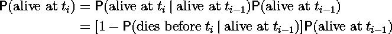
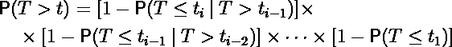
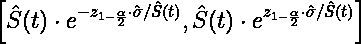

# 临床试验中的生存分析— Kaplan-Meier 估计量

> 原文：<https://towardsdatascience.com/survival-analysis-in-clinical-trials-f87b8cbc2b1a?source=collection_archive---------19----------------------->

## 药物功效建模及其背后的数学


照片由[在](https://unsplash.com/@halacious?utm_source=unsplash&utm_medium=referral&utm_content=creditCopyText) [Unsplash](https://unsplash.com/s/photos/pills?utm_source=unsplash&utm_medium=referral&utm_content=creditCopyText) 上的拍摄

从发现一种活性物质到确定其剂量、安全性和有效性，任何药物上市的过程都是漫长而昂贵的。最终，当局如何决定一种新的治疗方法对患者有益，并且应该从现在开始由医生来管理？

药物开发中最昂贵也可以说是最重要的部分是临床试验的后期阶段。在此期间，新的治疗方法被给予目标患者群体，并且(通常)还有一个对照组，给予安慰剂。病人不知道他们正在接受哪种治疗，医生也不知道。这被称为双盲，确保结果不受对新疗法的信任程度的影响。

# 数据格式

在评估临床试验数据时，第一个也是最常见的分析是用 Kaplan-Meier 估计量对生存函数进行非参数估计。我们将在来自 R 包`survival`的数据集`ovarian`上解释这个估计器。它来自于 1979 年发表的一项研究，包括对 26 名卵巢癌患者的观察。在研究开始时，一半的患者被随机分配到标准治疗组，另一半被分配到联合治疗组。在本文中，我们仅使用数据集中的以下变量:

*   *futime* :生存或审查时间
*   *fustat* :审查状态(0 =审查，1 =观察)
*   *rx* :治疗组(1 =单用环磷酰胺，2 =环磷酰胺加阿霉素)

现在让我们看看前六个观察结果。

```
library(survival)
data(ovarian)
head(ovarian)##   futime fustat     age resid.ds rx ecog.ps
## 1     59      1 72.3315        2  1       1
## 2    115      1 74.4932        2  1       1
## 3    156      1 66.4658        2  1       2
## 4    421      0 53.3644        2  2       1
## 5    431      1 50.3397        2  1       1
## 6    448      0 56.4301        1  1       2
```

对于存活的患者(fustat=0)，我们只知道他们存活到分析时，但没有关于他们存活时间的更多信息。函数`Surv()`在 R 中的输出是生存时间的数组，加上那些没有观察到死亡的患者的加号。

```
Surv(ovarian$futime, ovarian$fustat)## [1]   59   115   156   421+  431   448+  464   475   477+  563 
## [11]  638   744+  769+  770+  803+  855+ 1040+ 1106+ 1129+ 1206+
## [21] 1227+  268   329   353   365   377+
```

有了这些信息，我们如何去估计，比如说，这项研究中患者的中位存活时间？

# 关于生存函数的直觉

首先，我们估计所谓的生存函数。如果 *T* 是表示死亡时间的随机变量，生存函数 *S(t)* 定义为


这只是对死亡概率在 *t* 之前或之时的补充，是 *T:* 的累积分布函数 *F(t)*


那么 *S(t)* 怎么估计呢？让我们**首先只关注在随访期间死亡**的患者子集。您可以检查有十二个这样的患者(fustat=1)。基于这个数据集，我们如何估计一个病人在治疗开始后至少能活 10 个月的概率？

直觉上，答案很简单。我们计算存活时间超过 10 个月的患者比例，这将是我们对 10 个月生存函数的估计。在这种情况下，它是 8/12 = 2/3。

事实上，我们可以在我们选择的任何时间点重复这个练习。如果在 10 至 11 个月之间没有患者死亡，那么存活 11 个月的估计值将与存活 10 个月的估计值相同。

一般来说，只有在所讨论的时间点之间至少有一人死亡，答案才会不同。计算并绘制所有时间点的这种概率，我们得到以下曲线:


图 1:仅使用观察到死亡的患者的存活函数估计。

该函数的步长正好是死亡时间。

## 正确估计生存概率

显然，忽略仍然存活的患者会导致对真实存活概率的低估，因为根据定义，我们只分析了存活时间最短的患者子集。对于所有其他患者，我们不知道死亡时间，但我们有他们生存时间的下限。

假设我们想估计存活过去 20 个月的概率，但现在是以正确的方式，考虑到分析时还活着的患者。这一次，我们首先看一下我们使用`plot.survfit()`从 R 得到的图

```
km <- survfit(Surv(futime/30.42, fustat) ~ 1, data = ovarian)
```

曲线上的点出现在患者被审查的时候，即在此之后我们没有关于该患者存活时间的信息的时候。


图 2:r 中的生存函数估计。曲线上的点表示一个删失事件。

R 是怎么算出这些估计值的？直到第一次审查事件，我们可以用和上面一样的方法计算，除了现在我们有更多的病人。而且由于那些增加的病人都是幸存者，这样会让存活的概率更高。

现在，存活超过 10 个月的概率的(正确)估计是存活 10 个月或更长时间的所有患者的比例。这个比例是(26–4)/26，大概是 0.846。

# 推导卡普兰-迈耶估计量

为了计算首次删失事件后的生存概率，我们使用全概率法则。让我们用 *tᵢ.来表示第 *i* 个事件(死亡或审查)的时间*那么至少生存到 t *ᵢ* 的概率是



第一个被审查事件后的第一个死亡发生在 *t₁₀* (总共是第 10 个事件)*，*大约 14 个月。在图表上，活到 *t₇* 、 *t₈* 和 *t₉* 的概率似乎是相同的。直觉上，这是因为没有已知的死亡发生，所以我们不能相应地更新我们的估计。因此，上面的等式变成了


鉴于一名患者一直存活到 t₉.，仍需估计在 t₁₀死亡的概率这很容易做到，因为根据我们的数据，我们知道在 *t₁₀* ，在我们知道仍然活着的剩余 26–9 = 17 名患者中，有一名患者死亡(这被称为 *t₁₀* 的风险人数)。因此我们认为这个概率是 1/17。

但是现在我们有了一种方法来找出直到最后一次事件发生的所有时间的生存概率， *t₂₆* 。


我们刚刚推导了所谓的生存函数的 Kaplan-Meier 估计量 *S(t)，*生存时间长于 *t 的概率*通常，对于任何 *t* 和患者的生存时间 *T* ，我们可以将上面的详细等式改写为



t *ᵢ* 是小于 *t.* 的最大事件时间，更准确地说，卡普兰-迈耶估计量可写成


变量 *r* ***ᵢ*** 是在时间 *t* ***ᵢ*** 和 *d* ***ᵢ*** 是在 *t* ***ᵢ*** 发生的死亡人数(注意，在我们的方法中这总是等于 1)。

当事件数趋近于无穷大时，这个估计量收敛到真生存函数 *S(t)* ，为此它也被称为**乘积极限估计量**。

上式中计算卡普兰-迈耶估计量所需的所有项在 R 中很容易得到，如下所示。

```
summary(km)##   time n.risk n.event survival std.err lower 95% CI upper 95% CI
##   1.94     26       1    0.962  0.0377        0.890        1.000
##   3.78     25       1    0.923  0.0523        0.826        1.000
##   5.13     24       1    0.885  0.0627        0.770        1.000
##   8.81     23       1    0.846  0.0708        0.718        0.997
##  10.82     22       1    0.808  0.0773        0.670        0.974
##  11.60     21       1    0.769  0.0826        0.623        0.949
##  12.00     20       1    0.731  0.0870        0.579        0.923
##  14.17     17       1    0.688  0.0919        0.529        0.894
##  15.25     15       1    0.642  0.0965        0.478        0.862
##  15.61     14       1    0.596  0.0999        0.429        0.828
##  18.51     12       1    0.546  0.1032        0.377        0.791
##  20.97     11       1    0.497  0.1051        0.328        0.752
```

使用上面的公式计算第四列`survival`需要前三列。 *t* ***ᵢ'*** s 是列`time`，*r****ᵢ***s 是列`n.risk`， *d* ***ᵢ*** 是列`n.event`。标准误差和相应的置信区间将在后面讨论。

# 可视化治疗效果

我们希望与安慰剂或目前常用的治疗药物(称为“标准治疗”)相比，新疗法将延长预期生存期。

由于事件被删截，我们不能简单地比较两组间存活时间的样本均值，因为我们没有这个统计数据。在本文中，我将只展示如何可视化效果，而不是如何正式测试。这是现在真正容易的部分，因为我们简单地为两个不同的治疗组绘制了两条不同的曲线，再次使用`plot.survfit()`，与拟合

```
km_groups <- survfit(Surv(futime/30.42, fustat) ~ rx, data = ovarian)
```


图 3:两个治疗组分别估计的 Kaplan-Meier 曲线。

这种联合治疗似乎可以延长生存期，但是我们现在还不知道这种效果是否显著。

# 置信区间

到目前为止，我们还没有处理不确定性。但是由于只有少数患者，因此事件数量相对较少，曲线估计可能相当不准确。即使我们碰巧在其他研究中有更多的患者和事件，就像任何估计一样，评估精确度也很重要。使用`summary.survfit()`函数可以很容易地获得 R 中的逐点置信区间。本例中的配置项如下所示:


图 4:带置信区间的卡普兰-迈耶曲线。

请注意，曲线的右边部分具有相当大的置信区间，这是由后来观察到的少量事件给出的。但是这些置信界限从何而来呢？

为了计算置信区间，我们需要估计 KM 估计量的方差及其(渐近)分布。

## 格林伍德公式

r 在计算方差估计的置信区间时使用格林伍德公式，即


然后，我们可以利用以下性质:在某些条件下，KM 估计值的分布收敛于正态分布，格林伍德方差为渐近方差:


这允许我们在任何 *t，*使用公式得到逐点置信区间


具有标准正态分布的分位数。然而，R ( `conf.type=log`)中的默认`conf.type`参数实际上是利用了 *S(t)* 估计的对数分布，置信区间具有以下形式:



最后，使用的另一种置信区间是对数减对数(`conf.type=log-log`)。它的边界总是位于(0，1)区间内，这是一个理想的性质，因为我们正在估计概率。

# 摘要

卡普兰-迈耶图显示了对生存函数的估计，通常是临床研究的第一个分析点。它可以用于可视化治疗效果，并且具有不依赖于关于数据分布的任何假设的优点。我们观察的事件越多，就越接近真实的生存函数。

因此，主要的总结点是，知识管理估计器

*   充当生存函数的估计量。
*   不依赖于任何分布假设(即非参数)。
*   通常用于可视化临床研究的结果。

一个主要的限制是我们无法用这种方法控制协变量。因此，我们无法可靠地比较治疗组，以防某些协变量的不平衡对存活时间产生显著影响。

## 限制

*   KM 估计值只是描述性的。例如，它不能用于测试治疗效果。这可以通过[对数秩测试](/survival-analysis-in-clinical-trials-log-rank-test-8f1229e7f0f0)来完成。
*   曲线的右边部分往往很不准确，在解释图表时应该考虑到这一点。
*   我们无法控制协变量。

# 参考

[1] J.H. Edmunson，T.R. Fleming，D.G. Decker，G.D. Malkasian，J.A. Jefferies，M.J. Webb 和 L.K. Kvols，晚期卵巢癌与微小残留病的不同化疗敏感性和影响预后的宿主因素(1979) *。* *癌症治疗报告*，63:241–47。

[2] M *。*格林伍德，《癌症的自然持续时间》(1926)。*关于公共健康和医疗主题的报告*，女王陛下办公室，伦敦，33，1–26。