# 临床试验中的生存分析——对数秩检验

> 原文：<https://towardsdatascience.com/survival-analysis-in-clinical-trials-log-rank-test-8f1229e7f0f0?source=collection_archive---------11----------------------->

## 我们如何模拟药物疗效？第二部分

在本系列的第 1 部分的[中，我解释了 Kaplan-Meier 生存曲线估计量背后的推理。虽然它是一种用于可视化临床试验结果的无处不在的工具，涉及到时间-事件分析，但它只是描述性的。为了能够得出结论并展示新疗法的益处，我们需要一个正式的测试程序。一个这样的程序是对数秩检验。](/survival-analysis-in-clinical-trials-f87b8cbc2b1a)

我将看看它是如何得到的，为什么它仍然被认为是药物疗效的最重要的指标之一。

我们从一个`survfit`对象的`ggplot`开始，使用与[第 1 部分](/survival-analysis-in-clinical-trials-f87b8cbc2b1a)相同的数据集:

```
library(survival)
library(survminer)
data(ovarian)fit <- survfit(Surv(ovarian$futime, ovarian$fustat) ~ rx, 
               data = ovarian, conf.type="log")p_fit <- ggsurvplot(
  fit, conf.int = TRUE, pval = TRUE
)
p_fit
```

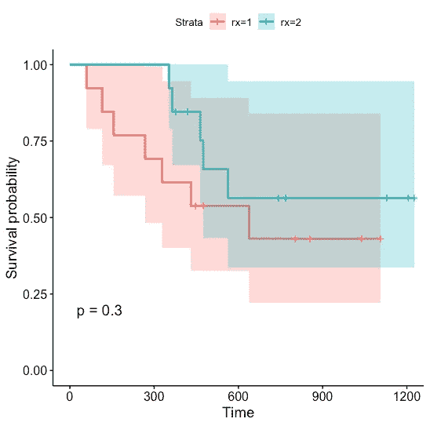

如何获得生存概率估计值和置信区间在[第 1 部分](/survival-analysis-in-clinical-trials-f87b8cbc2b1a)中描述。如果`pval`被设置为`TRUE`，该函数还打印出*p*-值 0.3，这是一个对数秩测试的结果。那么是怎么计算出来的呢？

# 费希尔精确试验

对数秩检验基本上是多个独立的 Fisher 精确检验汇集在一起。稍后我会解释我的意思。但是有必要首先了解费希尔精确测试是如何工作的。所以让我们从一个虚构的例子开始。

假设大学二年级有一门*统计学导论*课。他们可以在学期中参加辅导课，有些人参加，有些人不参加。期末考试后，我们想看看考试不及格是否与辅导课出勤有关。因此，对于每个学生，除了他们是否通过外，我们还记录他们是否至少有 75%的时间出席辅导课。我们得到了下面的图片:

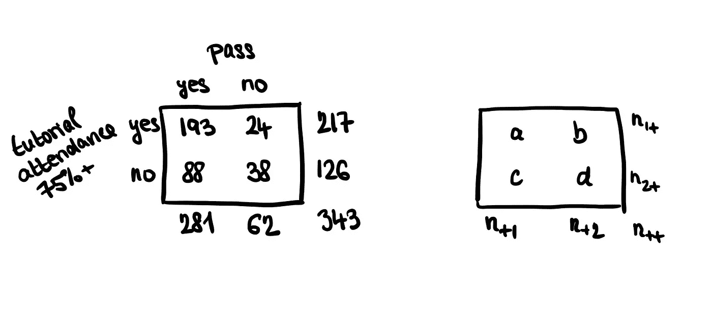

图:四个类别的学生人数。

现在要测试补习出勤和通过考试是否独立。概率表如下所示:


图:概率表。

例如，这意味着

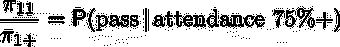

而我们要检验的假设是*h*₀:*π*₁₁/*π*₁₊=*π*₂₁/*π*₂₊.现在假设这个假设是真的。这意味着，我们预计辅导出勤率高的小组中不及格学生的比例与出勤率低的小组中不及格学生的比例相似。换句话说，

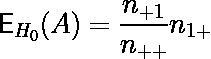

通过并参加了 75%以上辅导课的学生的期望值是整个样本中通过的学生的比例乘以参加了 75%以上辅导课的学生人数。

其中 *A* 是随机变量，其值是参加了 75%以上的辅导课并通过考试的学生人数。 *A* 的分布如何？

注意 *n++* 以及余量(失败/通过&出勤-是/否计数)是固定的。**在零假设**下， *A=a* 的概率(通过并参加 75%+辅导课的学生人数等于 *a* 的概率)是如果在 *n++=* 343 名学生中，其中 217 名参加了 75%+辅导课，我们随机挑选 281 名， *a* 将参加 75%+辅导课的概率。

这是因为我们假设这 281 名通过测试的学生和全部 343 名学生在去补习班的时间上没有什么不同。 *A* 的分布被称为**超几何分布**，人们可以从维基百科推导或复制其概率质量函数和方差:

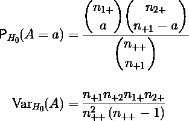

为这么大的样本计算精确的 *p-* 值是有问题的，但是我们可以使用以下统计的卡方近似值来代替:

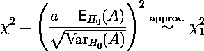

# 分析来自多个站点的数据

假设同样的实验在 12 所不同的大学进行。我们不想将这些合并到一个表中，因为各个大学之间可能会有差异。我们想检验以下假设:

*h*₀:*π*₁₁=*π*₁₂， *π* ₂₁ = *π* ₂₂，…， *πk* ₁ = *πk₂* ，其中 k 为站点数量(本例中为 12)。

这可以使用[**Mantel–Haenszel 统计**](https://en.wikipedia.org/wiki/Cochran%E2%80%93Mantel%E2%80%93Haenszel_statistics) **:** 来完成

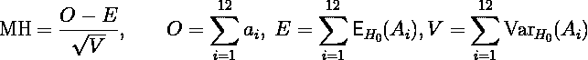

*i* 是组指数*，O* 是观察到的死亡的总和， *E* 是预期死亡的总和， *V* 是所有地点的人口 1 中死亡的方差的总和。我们将总和代入 MH，注意它的渐近分布:

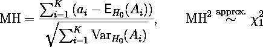

这是用来测试零假设通常的方式。现在，我们可以使用同样的统计数据，并将其应用于我们的审查数据。

# 对数秩检验

这与对数秩检验有什么关系？本质上，我们把死亡被观察的每个时间点看作上面例子中的“大学”,并为每个时间点创建一个列联表。

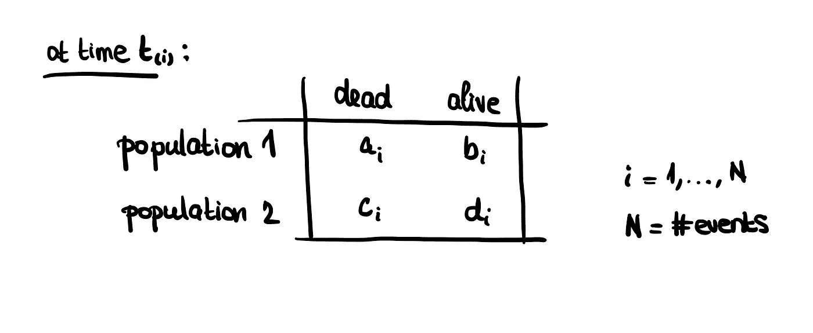

即使样本(“大学”)不是独立的，门泽耳-海恩斯泽尔统计量的渐近分布仍然是一个自由度的卡方分布。

实际上，我们测试了假设 *H₀: F₁ = F₂，*或者联合治疗和标准治疗组的生存曲线相等。

## 手工对数秩检验

现在让我们检查一下他们是如何从文章开头的图上获得*p*-值的。我们基本上为一个事件的每个时间点 t 创建一个列联表。

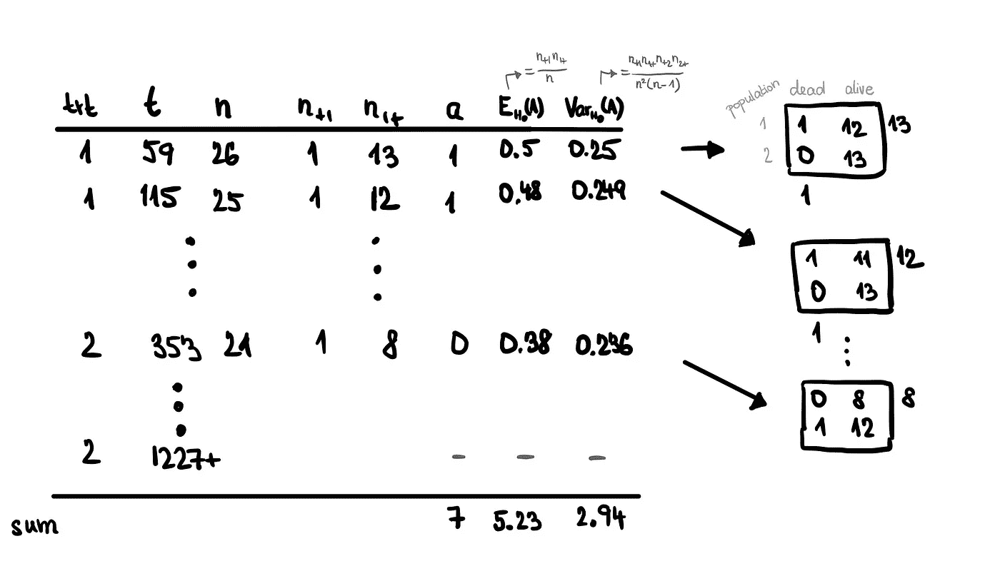

手工进行对数秩检验。仅显示了 4 个事件时间，但整行都是针对所有事件时间计算的。审查时间对统计数据没有贡献，但是如果将风险数据包含在表格中，就更容易跟踪这些数据。

从这个表中，我们可以计算出在零假设下每个 t *i* 的死亡数 *a* 以及 *A* 的期望和方差。剩下的就是将这些相加，并代入我们的测试统计量 MH 的表达式。在这种情况下，MH =(7–5.23)/2.94 = 1.066。

## 注意

*   请注意，事件时间不进入统计计算，只有他们的排名。

## R 中生存包的对数秩检验

在 R 中，可以使用包`survival`中的函数`survdiff()`进行对数秩测试。

```
logr <- survdiff(Surv(ovarian$futime, ovarian$fustat) ~ rx, 
                 data = ovarian)
logr## Call:
##   survdiff(formula = Surv(ovarian$futime, ovarian$fustat) ~ rx,
##            data = ovarian)
## 
##       N Observed Expected (O-E)^2/E (O-E)^2/V
## rx=1 13        7     5.23     0.596      1.06
## rx=2 13        5     6.77     0.461      1.06
## 
## Chisq= 1.1  on 1 degrees of freedom, p= 0.3
```

除了由于四舍五入造成的一些差异，测试给出的答案与上面手动计算的答案相同。特别是`(O-E)^2/V`是 1.06，这是 MH 统计。具有 1 个自由度的卡方分布变量大于该值的概率为 0.3，可以使用以下代码进行检查:

```
1 - pchisq(1.06, df = 1)## [1] 0.3032152
```

因此，我们不能拒绝联合治疗不比标准治疗更好(或更差)的无效假设。

# 控制协变量:分层

为了解释协变量，我们可以将样本分层。在这种情况下，数据集中有一个变量 *resid.ds* ，指示在研究开始时是否存在最小的残留疾病(resid.ds=1)，或者疾病是晚期的(resid.ds=2)。

分层的作用是对每一层的一系列列联表分别进行分析，然后汇总结果。这确保了如果患有轻微残留疾病的妇女与患有广泛残留疾病的妇女之间存在差异(这是可以预期的)，这将不会扭曲对治疗效果的估计。

## 协变量不平衡

在对照组中，患有广泛残留疾病的患者比患有轻微残留疾病的患者多(8 比 5)，而在治疗组中，这一比例更平衡(7 比 6)。

```
table(ovarian$resid.ds, ovarian$rx, dnn=c("resid.ds", "rx"))##         rx
## resid.ds 1 2
##        1 5 6
##        2 8 7
```

## survdiff()函数如何分层

为了确保我们测试的是治疗的差异，而不是晚期和非晚期疾病患者之间的差异，我们分别计算了每一层中的观察计数和预期计数及其方差(广泛残留疾病和微小残留疾病)。右上方列出了每个治疗组的事件时间(审查时间后有一个加号):

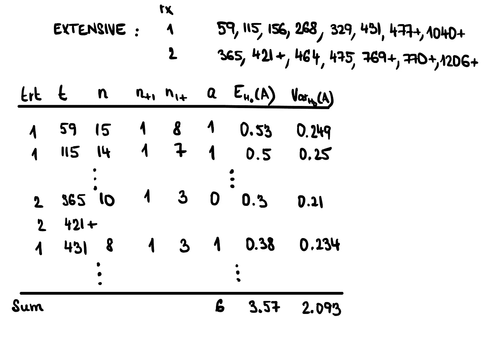

为有广泛残留疾病的组单独计算的对数秩检验值。

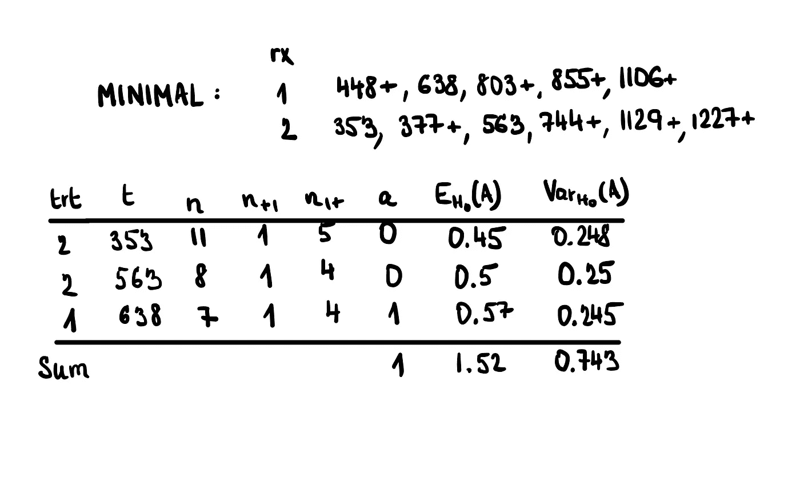

为残留疾病最少的组单独计算的对数秩检验值。

将结果汇总在一起(取两组的 *a* 、E( *A* )和 Var( *A* )之和，我们得到 MH =(7–5.09)/(0.743+2.093)= 1.286。现在，我们检查在公式中添加了`strata(resid.ds)`参数时`survdiff()`函数的输出:

```
logr_strat <- survdiff(Surv(ovarian$futime, ovarian$fustat) ~ rx + 
                         strata(resid.ds), data = ovarian)
logr_strat## Call:
##   survdiff(formula = Surv(ovarian$futime, ovarian$fustat) ~ rx + 
##              strata(resid.ds), data = ovarian)
## 
##       N Observed Expected (O-E)^2/E (O-E)^2/V
## rx=1 13        7      5.1     0.712      1.28
## rx=2 13        5      6.9     0.525      1.28
## 
## Chisq= 1.3  on 1 degrees of freedom, p= 0.3
```

同样，除了舍入误差之外，我们获得了 MH 的相同结果，即`(O-E)^2/V`是 1.28。

在这种情况下，*p*-值仍然是 *0.3* ，因此与分层前的值相比变化不大。请注意，对于预计对存活率有显著影响的重要协变量，**在随机化阶段(即设计实验时)进行分层至关重要**。这意味着，我们必须确保每个治疗组中来自各个阶层的患者比例大致相同，以便检测出足够有效的潜在治疗效果。

# 摘要

当我们想要确定**两组的生存分布是否不同时，使用对数秩检验。**这是证明药物具有积极治疗效果的最普遍和公认的方法之一。它是对 Fisher 精确检验的一种改编，或者更准确地说，是对删失数据的 Mantel Haenszel 检验。为事件的每个时间创建一个列联表，然后汇集结果以计算所需的统计数据。

如果我们想避免意外测试另一个组间不平衡的协变量，或防止治疗效果被协变量掩盖，我们可以使用**分层**。在这种情况下，为协变量的每个级别分别创建列联表，并将结果汇总在一起，如上所示。

# 关于对数秩检验的进一步说明

*   对数秩检验是非参数的:我们没有假设事件时间的任何分布。
*   然而，它是作为半参数 Cox 比例风险模型中的得分测试出现的(下一篇文章将详细介绍)。
*   请注意，在比较两条存活曲线的情况下,“检验显著的治疗效果”是一项任意的任务。[这里](https://web.stanford.edu/~lutian/coursepdf/unitweek3.pdf)很好地展示了所有具有积极治疗效果的不同场景。log-rank 面向这些场景中的一种。