# 组织病理学生存模型

> 原文：<https://towardsdatascience.com/survival-models-for-histopathology-b26efffdba1b?source=collection_archive---------18----------------------->

## [思想和理论](https://towardsdatascience.com/tagged/thoughts-and-theory)

## 从整张幻灯片图像预测患者结果的机器学习技术综述。

组织病理学图像的机器学习算法变得越来越复杂。从检测和分类细胞和组织到预测生物标志物和患者结果。更简单的任务依赖于病理学家对组织中特定特征的注释。但是生物标记和结果更加复杂。算法必须在事先不知道组织的哪些区域或其外观特征是重要的情况下解读大的整个载玻片图像。

已经可以使用癌症分期、分子特征或临床变量进行风险分层。然而，改善预后的洞察力是一个活跃的研究领域。预后是指患者接受标准治疗后的可能结果，例如，患者肿瘤复发、发生远处转移或死亡的可能性。

不管目标是什么，创建这样一个算法的挑战都是相似的。H&E 全片图像较大，组织外观多样。与寻找有丝分裂或分割组织类型的方法不同，病理学家无法注释组织的哪些区域与患者结果相关——至少没有任何高度的确定性。

肿瘤分级指定了细胞外观的测量，但并不总是预后的良好测量。病理学家对等级的观察也伴随着观察者之间的高度可变性。

结果预测模型的目标是根据风险对患者进行分层。本文将概述使用深度学习的组织病理学图像的结果预测模型的关键组件。我将概述选择图像块进行建模的策略、生存模型优化的损失函数选项、聚合图像块以形成整个幻灯片预测的技术，以及一些有趣的模型扩展。

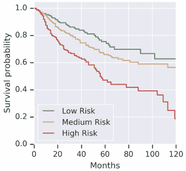

三个风险群体的卡普兰迈耶曲线[ [Wulczyn2020](https://journals.plos.org/plosone/article?id=10.1371/journal.pone.0233678)

# **选择图像补丁**

在 gigapixel 整张幻灯片图像上训练深度学习模型的第一个挑战是，图像太大，不适合 GPU，因此无法进行端到端训练。患者水平的存活时间适用于整张载玻片(或多张载玻片)。虽然病理学家可以在幻灯片中标注肿瘤区域，但他们无法准确识别哪些小块对模型有帮助，这是模型的工作。一些研究让病理学家注释肿瘤区域，深度学习模型仅使用这些区域。其他人训练 CNN 模型来区分肿瘤和非肿瘤，然后仅将肿瘤区域用于生存模型。还有一些包括模型中的所有组织区域。本节概述了这些策略。

**随机补丁**

Zhu 等人让病理学家注释每个肿瘤内图像区域。然后，他们从每个 ROI 中随机采样一个大块，并训练一个 CNN 生存模型[ [Zhu2016](https://ieeexplore.ieee.org/abstract/document/7822579) ]。Wulczyn 等人也随机对小块进行采样来训练他们的模型。

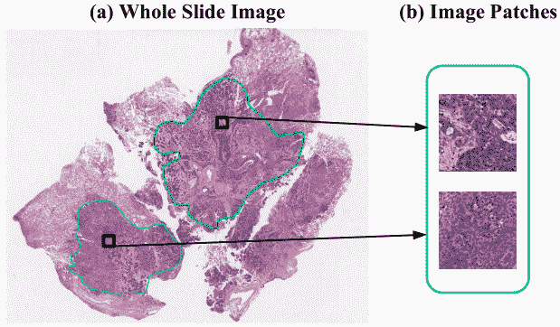

从由病理学家注释的感兴趣区域中随机取样的片[ [Zhu2016](https://ieeexplore.ieee.org/abstract/document/7822579) ]

**预测补丁**

其他方法不是随机抽取补丁，而是找出最有预测性的补丁。Courtiol 等人训练了一个 CNN 来预测每个图像斑块的风险[ [Courtiol2019](https://www.nature.com/articles/s41591-019-0583-3) ]。然后，该模型为每个患者选择最高和最低得分的补丁，以训练最终的生存模型。

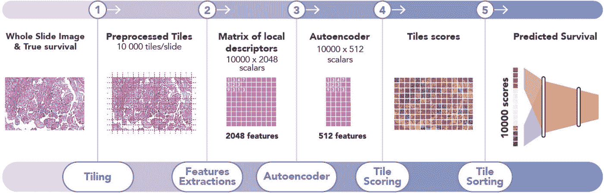

为生存模型训练选择最高和最低得分的图块[[court io 2019](https://www.nature.com/articles/s41591-019-0583-3)

检查最高和最低的生存补丁是特别有见地的。Courtiol 等人发现存活差的斑块主要位于基质区域，并让病理学家识别它们的共同特征。

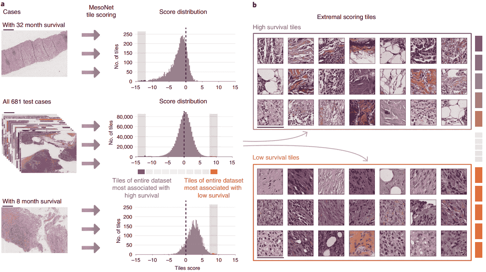

通过识别得分最高和最低的图块进行模型解释[[court io 2019](https://www.nature.com/articles/s41591-019-0583-3)

**补丁聚类**

在随后的工作中，朱等人对训练集中所有幻灯片的图像块进行聚类。然后，他们为每个集群训练了一个单独的 CNN 生存模型。几乎没有预测能力的聚类被丢弃。来自其余集群模型的特征在来自每个集群的补丁上聚集。另一个生存模型使用线性生存模型将聚集的特征转化为风险预测。

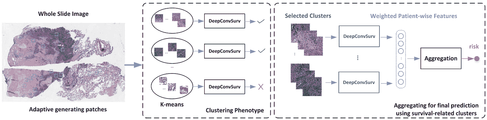

图像块聚类和聚集特征以预测风险[ [Zhu2017](https://openaccess.thecvf.com/content_cvpr_2017/html/Zhu_WSISA_Making_Survival_CVPR_2017_paper.html)

岳等人采用了相同的方法，对补丁进行全局聚类，并分别为每个聚类训练生存模型[ [岳 2019](https://arxiv.org/abs/1902.03582) ]。仅取被确定为有区别性的聚类，他们计算了斑块预测的归一化直方图，并使用 SVM 来学习聚类级别的预测。

Muhammad 等人同时学习了图像碎片的全局聚类和生存模型，该生存模型用来自每个聚类的一个图像碎片来表示每张幻灯片[ [Muhammad2021](https://arxiv.org/abs/2101.11085?utm_content=buffer9ddb1&utm_medium=social&utm_source=linkedin.com&utm_campaign=buffer) ]。

Yao 等人对每个患者的图像补片进行聚类，使他们能够选择具有不同外观的补片子集[ [Yao2020](https://arxiv.org/abs/2009.11169) ]。

聚类图像补片还可以实现组织的空间排列的测量。Abbet 等人对图像块进行聚类，并将每个图像的特征向量计算为聚类概率和聚类转移概率[ [Abbet2020](https://arxiv.org/abs/2007.03292) ]。根据这些特征，他们训练了一个线性生存模型。这些可解释的特征确定了与较差或较好结果相关的组织相互作用。

**组织分割**

其他技术为模型训练带来了更高层次的知识，特别是图像中存在的组织类型。病理学家或机器学习模型将组织分割成一组类别，使得每个类别都可以被适当地建模。

Yamashita 等人将图像斑块分类为肿瘤或非肿瘤，并选择最有可能是肿瘤的 100 个斑块[ [Yamashita2021](https://www.nature.com/articles/s41598-021-81506-y) ]。然后他们的生存模型只在这些小块上进行训练。

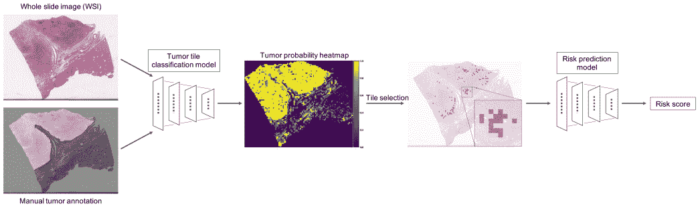

选择最可能的肿瘤块进行模型训练[ [山下 2021](https://www.nature.com/articles/s41598-021-81506-y)

Klimov 等人还训练了一个 CNN 模型来将图像分割成组织类别。癌症和间质斑块用于训练 CNN 来预测转移风险[ [克里莫夫 2021](https://www.frontiersin.org/articles/10.3389/fonc.2020.593211/full) ]。

更广泛的分割任务也有助于生存预测。Kather 等人分割了九种组织类型，并为每种类型训练了一个存活模型。他们选择了那些具有高风险比率的人，并在结合 CNN 特征时用这个比率对他们进行加权。

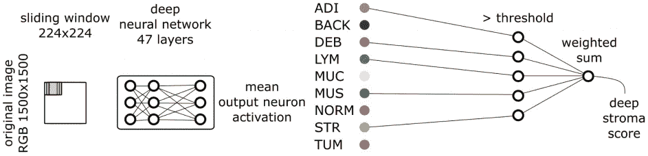

深层基质得分计算为最能预测患者结果的组织类型特征的加权和[ [Kather2019](https://www.ncbi.nlm.nih.gov/pmc/articles/PMC6345440/) ]

或者，组织分割可用于计算更多可解释的存活预测特征。王等人确定了淋巴结和肿瘤区域的面积，然后根据这两个组织面积的比值来预测患者的风险。

组织分割可以允许模型仅关注特定的组织类型。Bhargava 等人计算了肿瘤内间质的手工特征，以捕捉其形态[ [Bhargava2020](https://www.ncbi.nlm.nih.gov/pmc/articles/PMC7165025/) ]。特征包括间质结构，细胞核的连接性，以及细胞核的形状和方向。这个特征集使他们能够成功地预测非裔美国患者的结果；这些特征对白种美国人的预后预测性较差。可解释的特征是理解其模型的关键，并强调了基质形态学的重要性。

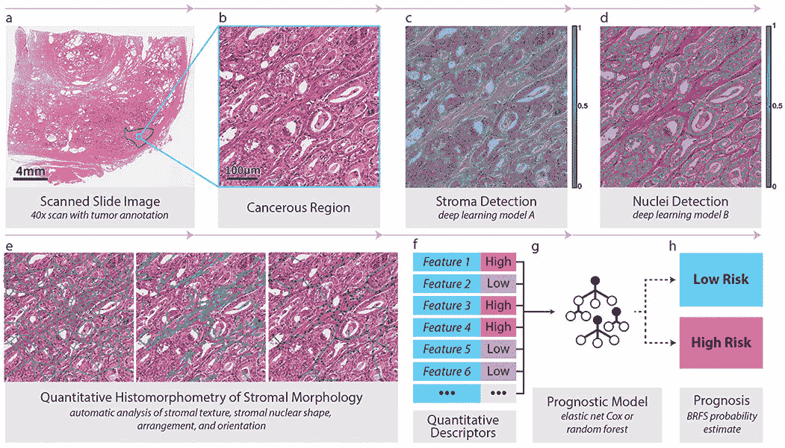

用于预测患者风险的肿瘤内基质特征[ [Bhargava2020](https://www.ncbi.nlm.nih.gov/pmc/articles/PMC7165025/)

# **度量和损失函数**

上一节讨论了为建模选择图像补片。下一个挑战是为事件时间数据创建一个模型，其中一些患者没有观察到事件。不是二元分类那么简单。患者可能在研究结束时没有死亡，或者他们可能在研究期间失去了随访。这些观察被称为右删失。

让我们将 Ti 定义为患者 I 的事件时间，将 Ei 定义为事件指示符。如果 Ei 为 1，则事件(例如死亡)发生在时间 Ti。如果 Ei 为 0，那么 Ti 是最后一次接触患者的时间——它们是右删截的。

时间-事件预测模型最常用的指标是一致性指数(C-index):一致性对的数量除以可能的评估对的总数。当算法正确地预测一个病人比另一个病人有更大的风险时，就是一致对。

然而，深度学习的损失函数需要是可微分的，以便利用基于梯度的优化器进行有效训练。标准回归模型是不合适的，因为右删失病例需要被丢弃，并且二元分类模型(例如，N 年后存活或死亡)不会利用实际存活时间。

**Cox 比例风险**

最常见的生存建模方法是 [Cox 比例风险](/the-cox-proportional-hazards-model-35e60e554d8f) (CPH)模型。

让我们将存活函数定义为在时间 t 存活的患者的比例:

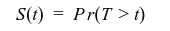

t 时刻的瞬时死亡概率为

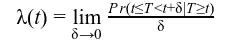

CPH 函数对一组协变量 x 的影响进行建模:

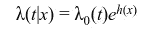

其中，λ₀(t)is 是基准风险函数，h(x)是风险函数。在线性 CPH 模型中，风险函数是 hᵦ(x)=βᵀx，可以预测给定这些协变量的特定患者的相对风险。训练这样一个模型是通过最大化似然性来完成的——或者等效地，部分对数似然性。

一些将生存模型应用于组织学的早期工作使用手工制作的特征作为协变量。深度学习模型通过应用一组非线性运算来利用相同的公式，以产生一组网络权重ᵠ.的输出 hᵩ(x

深度生存模型的第一次尝试使用了专家选择的少量特征，从临床变量预测心脏病发作风险，从基因和蛋白质表达预测乳腺癌风险[ [Katzman2018](https://bmcmedresmethodol.biomedcentral.com/articles/10.1186/s12874-018-0482-1) ]。为了将该模型应用于组织学图像，将 CPH 损失函数置于 CNN 之上。

CPH 模式的一个缺点是它是不可分的。在模型训练的每次迭代中，通过比较当前批次中患者的相对风险来估计其值。

**替代生存损失**

除了 CPH 损失之外，还有几个替代方案可以适应生存数据的右删失性质。迈耶等人对 Uno 损失和 logrank 损失进行了实验，Uno 损失基于一致性，log rank 损失使用非参数检验比较右偏和删失的生存数据[ [迈耶 2020](https://onlinelibrary.wiley.com/doi/full/10.1002/cjp2.170) ]。他们比较了 CPH 损失和 5 年二元分类器。与二元分类器相比，所有三个风险分数形成了更好的风险热图。Uno 和 logrank 的业绩在数量上优于 CPH。

另一种利用存活时间和右删失观测值的方法是将数据转换为多任务模型[ [Li2016](https://dl.acm.org/doi/abs/10.1145/2939672.2939857) ， [Fotso2018](https://arxiv.org/abs/1801.05512) ， [Vale-Silva2020](https://www.medrxiv.org/content/10.1101/2020.08.06.20169698v1) ]。时间轴被分成多个间隔，并且对每个间隔应用二元分类器来预测患者是否已经存活到该时间点。通常，添加一些额外的约束，以确保特定患者在时间间隔内的预测是非增长的和平滑的。针对其他形式的数据，提出了其他离散时间生存模型[ [Gensheimer2019](https://peerj.com/articles/6257/) ， [Zhong2019a](https://arxiv.org/abs/1909.11171) 。]

Wulczyn 等人比较了 cph(C 指数的指数下限)和使用交叉熵的多任务分类，发现后者表现最好[ [Wulczyn2020](https://journals.plos.org/plosone/article?id=10.1371/journal.pone.0233678) ]。

Muhammad 发现，将 CPH 损失与二进制分类术语相结合，比单独使用任何一种方法都能更好地将患者分为高风险和低风险，并极大地改善了测试集的结果[ [Muhammad2021](https://arxiv.org/abs/2101.11085?utm_content=buffer9ddb1&utm_medium=social&utm_source=linkedin.com&utm_campaign=buffer) ]。

什拉济等人采取了一种相关的方法，将时间轴分为 4 类:0-6 个月、6-12 个月、12-24 个月和> 24 个月。他们的模型显示了胶质母细胞瘤的巨大成功，但也显示了在整个幻灯片图像上训练的一些挑战。将每个患者的存活时间应用于载玻片内的每个贴片。这是弱监督问题的一个可能的解决方案，但是我们接下来将看一些在整个幻灯片图像上训练生存模型的替代方法。

# **从补丁到幻灯片**

不管选择的损失函数和选择哪个图像补片用于建模，它们都必须被组合成对患者的单个风险预测。最简单的方法是独立地在图像补片上训练模型，并对每个患者在所有补片上产生的分数进行平均。然而，在最终预测之前整合斑块特征的模型通常被认为是更好的。

本节将概述一些弱监督学习方法，这些方法已用于整个幻灯片的生存模型。可以使用其他弱监督或多示例学习方法来代替。参见我写的这篇关于该领域其他方法的[文章](/from-patches-to-slides-how-to-train-deep-learning-models-on-gigapixel-images-with-weak-supervision-d2cd2081cfd7)。

**独立补丁**

对整个幻灯片图像最简单的方法是独立地在图像小块上训练模型。Meier 等人用 IHC 和 H&E [ [Meier2020](https://onlinelibrary.wiley.com/doi/full/10.1002/cjp2.170) ]对来自组织微阵列的 160 x 160 像素图像块训练了 CNN。什拉济等人也对补丁进行了独立的训练，但他们对补丁预测进行了多数投票。

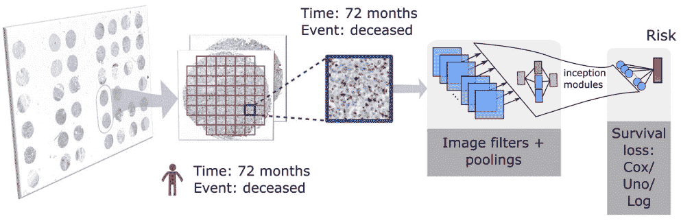

应用于图像补丁的深度生存网络

**补丁功能聚合**

Wulczyn 等人没有聚合补丁预测，而是聚合补丁特征[ [Wulczyn2020](https://journals.plos.org/plosone/article?id=10.1371/journal.pone.0233678) ]。在应用生存模型之前，他们计算了每个病人所有补丁的每个特征的平均值。

Yao 等人首先对每个患者的图像块进行聚类，然后将 CNN 应用于每个块，并使用注意力模型在各个聚类之间进行聚合。自注意机制学习每个特征向量的权重，并计算加权和。他们在顶部应用了一个完全连接的层，然后是生存模型。

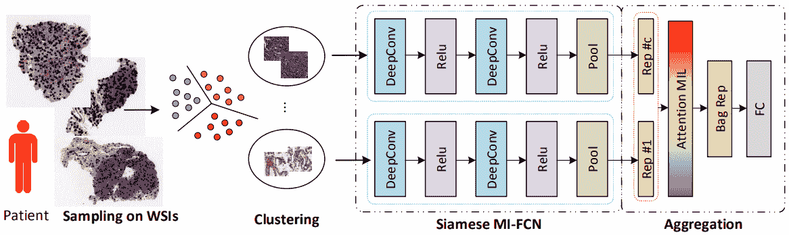

一种聚集图像斑块特征的注意力模型[ [姚 2020](https://arxiv.org/abs/2009.11169)

作为处理来自同一张幻灯片的多个补丁的另一种方法，比契科夫等人将递归神经网络应用于从组织微阵列核心图像补丁中提取的 CNN 特征[ [Bychkov2018](https://www.nature.com/articles/s41598-018-21758-3) ]。

# **其他型号扩展**

对上述生存建模方法也有多种扩展。

以上对整个幻灯片图像的应用都以某种方式使用 CNN 来模拟图像。陈等人还使用了一种图卷积网络，他们通过连接原子核来提取拓扑结构，以形成一个图[ [Chen2020](https://ieeexplore.ieee.org/abstract/document/9186053) ]。李等用图模拟组织拓扑 CNN [ [Li2018](https://link.springer.com/chapter/10.1007/978-3-030-00934-2_20) ]。

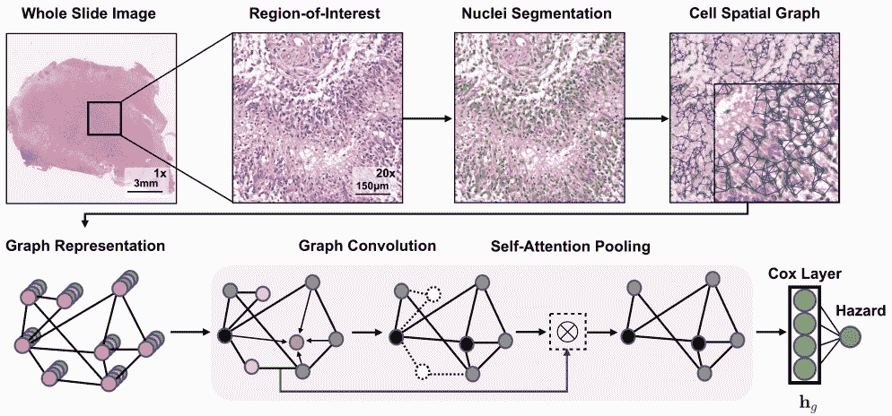

用于生存预测的图卷积网络

陆等人关注的不是组织拓扑结构，而是细胞形态学[ [Lu2020](https://www.sciencedirect.com/science/article/pii/S2589750020302259) ]。他们开发了一种细胞多样性的描述符，并发现它可以预测患者的结果。

**多模态模式**

其他形式如临床数据、基因组学和蛋白质组学也可以用于生存模型。Vale-Silva 等人训练了一个融合多种数据形式的模型，但发现组织学并没有改善仅使用临床特征的模型[ [Vale-Silva2020](https://www.medrxiv.org/content/10.1101/2020.08.06.20169698v1) ]。钟等人也研究了成像和基因表达特征[ [中 2019b](https://www.mdpi.com/2072-6694/11/3/361) ]。他们发现，以基因表达为条件，组织学特征的预测能力有限；然而，它们的图像特征仅限于手工制作的形态学特征。

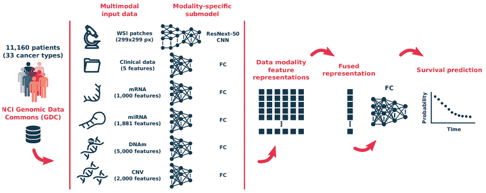

多模式生存模式[ [淡水河谷 2020 年](https://www.medrxiv.org/content/10.1101/2020.08.06.20169698v1)

Hao 等人还对整个载玻片图像和基因组数据的组合进行了实验，并发现该模型优于仅使用单一模态的模型[ [Hao2020](https://www.worldscientific.com/doi/abs/10.1142/9789811215636_0032) ]。陈等人也得出了类似的结论。他们测试了多种建模策略:基因组特征和整个幻灯片，CNN 和组织学上的图形 CNN 模型。

共识似乎是基于组织学的特征可以促进使用基因组或临床变量的生存模型。然而，成功可能取决于所使用的图像特征、模型类型和数据集等因素。

**泛癌建模**

生存模型也被同时应用于多种癌症。Wulczyn 等人训练了一个跨越 10 种癌症类型的生存模型，并评估了他们的模型在每种癌症类型中的预测能力[ [Wulczyn2020](https://journals.plos.org/plosone/article?id=10.1371/journal.pone.0233678) ]。Vale-Silva 等人训练了一个涵盖 33 种癌症类型的泛癌和多模态模型[ [Vale-Silva2020](https://www.medrxiv.org/content/10.1101/2020.08.06.20169698v1) ]。

# **总结和建议**

上面的一些方法使用了一个从头开始训练的小型 CNN。其他人将迁移学习应用于更大的 CNN 架构，如 VGG、ResNet 或 GoogLeNet。给定足够的训练数据和计算能力，较大的架构通常更优越。

上面讨论的建模方法都捕捉了肿瘤形态学的不同视角。我还没有看到关于最佳方法的一致意见。每一个都为影响患者结果的因素提供了不同的见解。

从整个幻灯片图像中模拟患者结果比仅仅[弱监督学习](/from-patches-to-slides-how-to-train-deep-learning-models-on-gigapixel-images-with-weak-supervision-d2cd2081cfd7)更复杂。解释导致好的或差的结果的因素对于增进我们对癌症的理解也是至关重要的。

可解释的模型已经揭示了一些重要的见解，消除组织类型的歧义是成功的关键。组织类型面积比[ [Wang2021](https://www.nature.com/articles/s41467-021-21674-7?error=cookies_not_supported&code=6e0b4d9d-9b12-48ac-abc4-a745f452956f) ]和连接性[ [Abbet2020](https://arxiv.org/abs/2007.03292) ]影响结果。与肿瘤本身相比，肿瘤内间质形态可能是一个更强有力的预后指标[ [Beck2011](https://stm.sciencemag.org/content/3/108/108ra113.short) ， [Bhargava2020](https://www.ncbi.nlm.nih.gov/pmc/articles/PMC7165025/) ]。

Bhargava 等人甚至表明，在一群患者身上成功的建模方法可能在另一群患者身上不成功[ [Bhargava2020](https://www.ncbi.nlm.nih.gov/pmc/articles/PMC7165025/) ]。虽然这为成功的生存模型提供了机会，但也证明了评估模型可推广性的重要性。

在开发新模型时，了解哪些因素已经与正在研究的癌症类型的结果相关可能是至关重要的。

或者，将弱监督模型应用于整个载玻片图像可以发现尚未与预后相关联的组织特性。但是，要将一个成功的模型转化为新的见解，一些解释能力的手段是必不可少的。

适应生存数据的正确删失性质的损失函数优于单个二元分类器。然而，将多个二元分类器或生存损失与二元分类器结合的多任务方法可能产生更好的风险分层。

生存建模的新领域包括多模态和泛癌方法。

当前模型的最大限制可能是训练数据量少。随着向数字病理学过渡的进展和新合作的建立，更大的训练集将变得可用。当数据隐私成为问题时，联合学习可以处理位于不同中心的数据集。

基于组织学图像的预后模型刚刚开始显示其潜力。但是，可能需要更大的数据集才能在这些千兆像素图像中找到最具预测性的模式。

**希望从您的图像和算法中获得最大的洞察力？**

Heather D. Couture 是 [Pixel Scientia Labs](http://pixelscientia.com/) 的创始人，该实验室提取最新的机器学习研究，以帮助研发团队抗击癌症。

联系她，了解如何实施更好的模式并产生影响。

**参考文献**

[Abbet2020] C. Abbet，I. Zlobec，B. Bozorgtabar，J.P. Thiran，[分而治之:结肠直肠癌生存分析的自我监督学习](https://arxiv.org/abs/2007.03292) (2020)，医学图像计算和计算机辅助干预国际会议

M. Andreux，A. Manoel，R. Menuet，C. Saillard，C. Simpson，[离散时间 Cox 模型联合生存分析](https://arxiv.org/abs/2006.08997) (2020)，arXiv 预印本 arXiv:2006.08997

[Beck2011] A.H. Beck，A.R. Sangoi，S. Leung，R.J. Marinelli，T.O. Nielsen，M.J. Van De Vijver，R.B. West，M. Van De Rijn，d .柯勒，[乳腺癌形态学的系统分析揭示了与生存相关的基质特征](https://stm.sciencemag.org/content/3/108/108ra113.short) (2011)，《科学转化医学》

[Bhargava2020] H.K. Bhargava，P. Leo，R. Elliott，A. Janowczyk，J. Whitney，S. Gupta，P. Fu，K. Yamoah，F. Khani，B.D. Robinson，T.R. Rebbeck，[通过计算得出的基质形态图像信号是非洲裔美国患者前列腺切除术后前列腺癌复发的预后指标](https://www.ncbi.nlm.nih.gov/pmc/articles/PMC7165025/) (2020)，临床癌症研究

[Bychkov2018] D .比契科夫，n .林德，r .图尔基，s .诺德林，P.E .科瓦嫩，c .韦里尔，m .沃兰德，m .伦丁，c .哈格伦德，j .伦丁，[基于深度学习的组织分析预测结肠直肠癌的结果](https://www.nature.com/articles/s41598-018-21758-3) (2018)，科学报告

[Chen2020] R.J. Chen，M.Y. Lu，J. Wang，D.F.K. Williamson，S.J. Rodig，N.I，F. Mahmood，[病理学融合:融合组织病理学和基因组特征用于癌症诊断和预后的综合框架](https://ieeexplore.ieee.org/abstract/document/9186053) (2020)，IEEE 医学成像汇刊

[Courtiol2019] P. Courtiol，C. Maussion，M. Moarii，E. Pronier，S. Pilcer，M. Sefta，P. Manceron，S. Toldo，M. Zaslavskiy，N. Le Stang，N. Girard，[基于深度学习的间皮瘤分类改善了对患者结果的预测](https://www.nature.com/articles/s41591-019-0583-3) (2019)，《自然医学》

【Fotso 2018】s . Fotso，[基于多任务框架的生存分析深度神经网络](https://arxiv.org/abs/1801.05512) (2018)，arXiv 预印本 arXiv:1801.05512

[Gensheimer2019] M.F. Gensheimer，B. Narasimhan，[神经网络的可扩展离散时间生存模型](https://peerj.com/articles/6257/) (2019)，PeerJ

[Hao2020] J. Hao，S.C. Kosaraju，N.Z. Tsaku，D.H. Song，M. Kang， [PAGE-Net:使用组织病理学图像和基因组数据进行生存分析的可解释和整合深度学习](https://www.worldscientific.com/doi/abs/10.1142/9789811215636_0032) (2020)，生物计算

[Kather2019] J.N. Kather，J. Krisam，P. Charoentong，T. Luedde，E. Herpel，C.A. Weis，T. Gaiser，A. Marx，N.A. Valous，D. Ferber，L. Jansen，[利用深度学习预测结肠直肠癌组织切片的存活率:一项回顾性多中心研究](https://www.ncbi.nlm.nih.gov/pmc/articles/PMC6345440/) (2019)，PLoS Medicine

[Katzman2018] J.L. Katzman，U. Shaham，A. Cloninger，a .等人， [DeepSurv:使用 Cox 比例风险深度神经网络的个性化治疗推荐系统](https://bmcmedresmethodol.biomedcentral.com/articles/10.1186/s12874-018-0482-1) (2018)，BMC 医学研究方法

[Klimov2021] S. Klimov，Y. Xue，A. Gertych，R. Graham，Y. Jiang，S. Bhattarai，S.J. Pandol，E.A. Rakha，M.D. Reid，R. Aneja，[使用深度学习图像分析预测胰腺神经内分泌肿瘤(PanNET)的转移风险](https://www.frontiersin.org/articles/10.3389/fonc.2020.593211/full) (2021)，肿瘤学前沿

[Li2016] Y. Li，J. Wang，J. Ye，C.K. Reddy，[生存分析的多任务学习公式](https://dl.acm.org/doi/abs/10.1145/2939672.2939857) (2016)，ACM SIGKDD 知识发现与数据挖掘国际会议

[Li2018] R. Li，J. Yao，X. Zhu，Y. Li，J. Huang， [Graph CNN 用于全切片病理图像的生存分析](https://link.springer.com/chapter/10.1007/978-3-030-00934-2_20) (2018)，医学图像计算与计算机辅助介入国际会议

[Lu2020] C. Lu，K. Bera，X. Wang，P. Prasanna，J. Xu，A. Janowczyk，N. Beig，M. Yang，P. Fu，J. Lewis，H. Choi，[早期非小细胞肺癌患者总生存期的预后模型:多中心回顾性研究](https://www.sciencedirect.com/science/article/pii/S2589750020302259) (2020)，The Lancet Digital Health

[Meier2020] A. Meier，K. Nekolla，L.C. Hewitt，S. Earle，T. Yoshikawa，T. Oshima，Y. Miyagi，R. Huss，G. Schmidt，H.I. Grabsch，[应用于胃癌肿瘤微环境的无假设深度生存学习](https://onlinelibrary.wiley.com/doi/full/10.1002/cjp2.170) (2020)，《病理学杂志:临床研究》

[Muhammad2021] H. Muhammad，C. Xie，C.S. Sigel，M. Doukas，L. Alpert，T.J. Fuchs，[EPIC-生存:生存分析的端对端部分推断聚类，以预后分层增强为特征](https://arxiv.org/abs/2101.11085?utm_content=buffer9ddb1&utm_medium=social&utm_source=linkedin.com&utm_campaign=buffer) (2021)，arXiv 预印本 arXiv:2101.11085

【shirazi 2020】a . z .扎德、e .福纳奇阿里、N.S .巴盖瑞等人 [DeepSurvNet:基于组织病理学图像的脑癌生存率分类深度生存卷积网络](https://link.springer.com/article/10.1007/s11517-020-02147-3) (2020)，医学&生物工程&计算

L. Vale-Silva，K. Rohf， [MultiSurv:使用多模态深度学习进行长期癌症生存预测](https://www.medrxiv.org/content/10.1101/2020.08.06.20169698v1) (2020)，medRxiv 2020 . 08 . 06 . 20020202005

[Wang2021] X. Wang，Y. Chen，Y. Gao，H. Zhang，Z. Guan，Z. Dong，Y. Zheng，J. Jiang，H. Yang，L. Wang，X. Huang，[使用深度学习从切除的淋巴结组织病理学图像预测胃癌结果](https://www.nature.com/articles/s41467-021-21674-7?error=cookies_not_supported&code=6e0b4d9d-9b12-48ac-abc4-a745f452956f) (2021)，自然通讯

[Wulczyn2020] E. Wulczyn，D.F. Steiner，Z. Xu，A. Sadhwani，H. Wang，I. Flament-Auvigne，C.H. Mermel，P.H. Chen，Y. Liu，M.C. Stumpe，[利用组织病理学图像对多种癌症类型进行基于深度学习的生存预测](https://journals.plos.org/plosone/article?id=10.1371/journal.pone.0233678) (2020)，PLoS One

[Yamashita2021] R. Yamashita，J. Long，A. Saleem，D.L. Rubin，J. Shen，[深度学习从数字组织病理学图像中预测肝细胞癌的术后复发](https://www.nature.com/articles/s41598-021-81506-y) (2021)，科学报告

[Yao2020] J. Yao，X. Zhu，J. Jonnagaddala，N. Hawkins，J. Huang，[利用注意力引导的深度多示例学习网络进行基于全幻灯片图像的癌症生存预测](https://arxiv.org/abs/2009.11169) (2020)，医学图像分析

[Yue2019] X. Yue，N. Dimitriou，O. Arandjelovic，[使用机器学习和自动推断的表型谱从 H & E 整片图像预测结直肠癌预后](https://arxiv.org/abs/1902.03582) (2019)，arXiv 预印本 arXiv:1902.03582

[Zhong2019a]钟超，S. Tibshirani，[作为分类问题的生存分析](https://arxiv.org/abs/1909.11171) (2019)，arXiv 预印本 arXiv:1909.11171

[Zhong2019b] T. Zhong，M. Wu，S. Ma，[检验癌症中基因表达和组织病理学影像特征的独立预后能力](https://www.mdpi.com/2072-6694/11/3/361) (2019)，癌症

[Zhu2016] X. Zhu，J. Yao，J.Huang，[用于病理图像生存分析的深度卷积神经网络](https://ieeexplore.ieee.org/abstract/document/7822579) (2016) IEEE 生物信息学和生物医学国际会议

[Zhu2017] Y. Zhu，J. Yao，F. Zhu，J. Huang， [WSISA:从全切片组织病理学图像进行生存预测](https://openaccess.thecvf.com/content_cvpr_2017/html/Zhu_WSISA_Making_Survival_CVPR_2017_paper.html) (2017)，IEEE 计算机视觉与模式识别会议