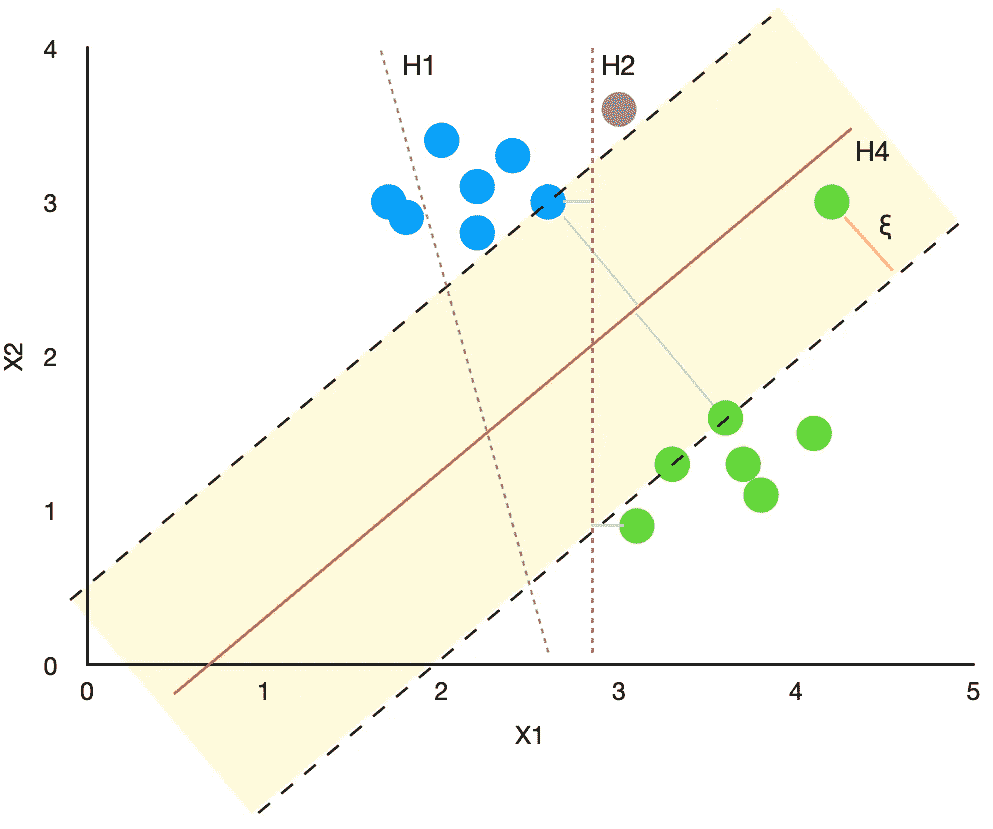

# SVM 分类器和 RBF 核——如何用 Python 制作更好的模型

> 原文：<https://towardsdatascience.com/svm-classifier-and-rbf-kernel-how-to-make-better-models-in-python-73bb4914af5b?source=collection_archive---------2----------------------->

## 机器学习

## 支持向量机(SVM)和径向基函数(RBF)核的内部工作的完整解释


具有 RBF 核和高伽玛的 SVM。在本文结尾的 Python 部分，您将看到它是如何创建的。图片由[作者](https://solclover.medium.com/)提供。

# **简介**

要想在数据科学项目中取得成功，了解不同的机器学习算法是非常重要的。

我写了这个故事，作为深入解释其机制的每个 ML 算法系列的一部分，并辅以 Python 代码示例和直观的可视化。

# **故事涵盖以下主题:**

*   SVM 分类所属的算法类别
*   对算法如何工作的解释
*   什么是内核，它们在 SVM 是如何使用的？
*   使用 Python 示例和图表深入了解 RBF 内核

# **支持向量机分类属于哪一类算法？**

支持向量机(SVMs)最常用于解决**分类**问题，属于监督机器学习范畴。

同样，通过使用支持向量回归算法(SVR ),支持向量机也可以用于**回归**。

</support-vector-regression-svr-one-of-the-most-flexible-yet-robust-prediction-algorithms-4d25fbdaca60>  

你可以在下面的**交互**图中找到这些算法的确切位置。确保点击👇对不同的类别进行**放大并揭示更多。**

机器学习算法分类。由[作者](https://solclover.com/)创建的互动图表。

***如果你也热爱数据科学和机器学习*** *，请* [*订阅*](https://bit.ly/3uZqsQA) *每当我发布新故事时，你都会收到一封电子邮件。*

# **SVM 分类算法——简要说明**

让我们假设我们有一组属于两个独立类的点。我们希望将这两个类分开，以便我们能够正确地将任何未来的新点分配给一个类或另一个类。

SVM 算法试图找到一个超平面，以尽可能高的裕度将这两个类别分开。如果类是完全线性可分的，可以使用一个**硬边界**。否则，它需要一个**软余量**。

> 注意，结束于页边空白的点被称为**支持向量**。

为了帮助理解，让我们回顾一下下图中的例子。

## **硬利润**


用 SVM 算法分离两类点。**硬利润**场景。图片由[作者提供。](https://solclover.medium.com/)

*   名为“ **H1** ”的超平面不能准确地分开这两个类；因此，这不是解决我们问题的可行办法。
*   “ **H2** ”超平面正确地划分类别。然而，超平面和最近的蓝点和绿点之间的差距很小。因此，很有可能对任何未来的新点进行不正确的分类。例如，当新的灰点(x1=3，x2=3.6)显然应该属于蓝色类时，该算法会将其分配给绿色类。
*   最后，“ **H3** ”超平面正确地将两个类分开，并具有最高可能的余量(黄色阴影区域)。找到解决方案了！

请注意，找到最大可能的余量可以对新点进行更准确的分类，从而使模型更加健壮。你可以看到，当使用“H3”超平面时，新的灰点将被正确地分配给蓝色类。

## **软利润**

有时，可能无法完全区分这两个类别。在这种情况下，使用**软边界**，允许某些点被错误分类或落入边界内(黄色阴影区域)。这就是“松弛”值的由来，用希腊字母ξ (xi)表示。



用 SVM 算法分离两类点。**软利润**场景。图片由[作者提供。](https://solclover.medium.com/)

使用这个例子，我们可以看到“H4”超平面将边缘内的绿点视为异常值。因此，支持向量是更靠近主绿点组的两个绿点。这允许存在更大的余量，增加了模型的稳健性。

请注意，该算法允许您通过调整超参数 C 来控制您对错误分类(和边距内的点)的关注程度。本质上，C 充当分配给ξ的权重。低 C 使决策表面平滑(更稳健)，而高 C 旨在正确分类所有训练示例，产生与训练数据更接近的拟合，但使其不那么稳健。

> 请注意，虽然为 C 设置较高的值可能会使模型在训练数据上有更好的性能，但存在过度拟合模型的高风险，从而在测试数据上产生较差的结果。

# **内核绝招**

上面对 SVM 的解释涵盖了蓝色和绿色类可线性分离的例子。然而，如果我们想将支持向量机应用于非线性问题呢？我们该怎么做？

这就是内核技巧的用武之地。一个**内核是一个函数**，它将原始的非线性问题转化为高维空间中的线性问题。为了解释这个技巧，让我们研究下面的例子。

假设您有两个类—红色和黑色，如下所示:


原始二维数据。图片由[作者](https://solclover.medium.com/)提供。

如你所见，红点和黑点不是线性可分的，因为我们不能画一条线将这两个类放在这条线的不同边上。然而，我们可以通过画一个圆来区分它们，这个圆里面是所有的红点，外面是黑点。

## **如何将这个问题转化为线性问题？**

让我们添加第三维，并使其成为 x 和 y 值的平方和:

```
z = x² + y²
```

使用这个具有 x、y 和 z 坐标的三维空间，我们现在可以绘制一个超平面(平坦的 2D 表面)来分隔红点和黑点。因此，现在可以使用 SVM 分类算法。

使用内核技巧转换数据。红色和黑色类现在是线性可分的。图表作者[作者](https://solclover.medium.com/)。

[](https://solclover.com/membership)[](https://www.linkedin.com/in/saulius-dobilas/)

# **径向基函数(RBF)内核和 Python 示例**

RBF 是 sklearn 的 SVM 分类算法中使用的默认核，可以用以下公式描述:


其中 gamma 可以手动设置，并且必须大于 0。sklearn 的 SVM 分类算法中 gamma 的默认值为:


简单来说:

```
**||x - x'||²** is the squared Euclidean distance between two feature vectors (2 points).**Gamma** is a scalar that defines how much influence a single training example (point) has. 
```

因此，根据上面的设置，我们可以控制单个点对整个算法的影响。gamma 越大，其他点必须越靠近才能影响模型。我们将在下面的 Python 示例中看到改变 gamma 的影响。

## **设置**

我们将使用以下数据和库:

*   [来自 Kaggle 的棋类游戏数据](https://www.kaggle.com/datasnaek/chess)
*   [Scikit-learn 库](https://scikit-learn.org/stable/index.html)，用于将数据拆分为[训练测试](https://scikit-learn.org/stable/modules/generated/sklearn.model_selection.train_test_split.html?highlight=train_test_split#sklearn.model_selection.train_test_split)样本，构建 [SVM 分类](https://scikit-learn.org/stable/modules/generated/sklearn.svm.SVC.html#sklearn.svm.SVC)模型，以及[模型评估](https://scikit-learn.org/stable/modules/generated/sklearn.metrics.classification_report.html?highlight=classification_report#sklearn.metrics.classification_report)
*   [Plotly](https://plotly.com/python/) 用于数据可视化
*   用于数据操作的[熊猫](https://pandas.pydata.org/docs/)和 [Numpy](https://numpy.org/)

让我们导入所有的库:

然后我们从 Kaggle 获得**国际象棋游戏**数据，你可以通过以下链接下载:[https://www.kaggle.com/datasnaek/chess](https://www.kaggle.com/datasnaek/chess)。

一旦你在你的机器上保存了数据，用下面的代码接收它。请注意，我们还派生了几个新变量供我们在建模中使用。


带有新派生字段的 [Kaggle 的国际象棋数据集](https://www.kaggle.com/datasnaek/chess)的片段。图片来自[作者](https://solclover.medium.com/)。

现在，让我们创建几个函数，以便在构建不同的模型和绘制结果时重用。

第一个功能是将数据分为训练和测试样本，拟合模型，预测测试集的结果，并生成模型性能评估指标。

以下函数将使用测试数据和模型预测表面绘制一个 Plotly 3D 散点图。

## **用 C 和 Gamma 的默认值建立一个模型**

让我们使用“rating_difference”和“turns”字段作为我们的独立变量(属性/预测值)并使用“white_win”标志作为我们的目标来构建我们的第一个 SVM 模型。

注意，我们在这里有点作弊，因为总移动次数只有在比赛后才知道。因此，如果我们想在比赛开始前生成模型预测，则“回合”将不可用。然而，这仅仅是为了说明的目的；因此，我们将在下面的例子中使用它。

因为我们使用了之前定义的‘fitting’函数，所以代码很短。

该函数打印以下模型评估指标:


SVM 模型性能指标。图片由[作者](https://solclover.medium.com/)提供。

我们可以看到，模型在测试数据上的性能类似于在训练数据上的性能，这再次保证了模型可以使用默认的超参数很好地概括。

现在，让我们通过简单地调用 Plot_3D 函数来可视化预测:

```
Plot_3D(X, X_test, y_test, clf)
```


具有默认超参数的 SVM 分类模型的预测平面。图片由[作者](https://solclover.medium.com/)提供。

注意，上面的黑点是实际 class=1(白棋赢了)，下面的黑点是实际 class=0(白棋没赢)。同时，表面是由模型产生的白胜的概率。

虽然概率存在局部变化，但决策边界位于 x=0 附近(即评级差异=0)，因为这是概率越过 p=0.5 边界的地方。

## **SVM 模型 2 —伽玛= 0.1**

现在让我们看看当我们为 gamma 设置一个相对较高的值时会发生什么。


伽玛=0.1 的 SVM 模型性能指标。图片由[作者](https://solclover.medium.com/)提供。

我们可以看到，增加 gamma 会导致模型在训练数据上表现更好，但在测试数据上表现更差。下图有助于我们了解这到底是为什么。


伽马=0.1 的 SVM 分类模型的预测平面。请注意所使用的特色图像 colorscale='Aggrnyl '。图片作者[作者](https://solclover.medium.com/)。

我们现在有一个非常“尖锐”的预测面，而不是像以前一样有一个平滑的预测面。为了理解为什么会发生这种情况，我们需要更仔细地研究一下内核函数。

当我们选择高伽玛时，我们告诉函数，近点比远点对预测更重要。因此，我们得到这些“尖峰”,因为预测很大程度上取决于训练示例的单个点，而不是它们周围的情况。

另一方面，减少 gamma 值会告诉函数，在进行预测时，不仅是单个点，它周围的点也很重要。为了验证这一点，让我们看另一个 gamma 值相对较低的例子。

## **SVM 模型 3—伽玛= 0.000001**

让我们重新运行这些函数:


伽玛=0.000001 的 SVM 模型性能指标。图片由[作者](https://solclover.medium.com/)提供。

正如预期的那样，随着模型在测试数据上的性能提高(精确度= 0.66)，降低伽马值会使模型更加稳健。下图说明了对较远的点赋予更多影响后，预测表面变得更加平滑。


伽马=0.000001 的 SVM 分类模型的预测平面。图片由[作者](https://solclover.medium.com/)提供。

## **调整超参数 C**

我决定在这个故事中不包括使用不同 C 值的例子，因为它以类似于 gamma 的方式影响预测平面的平滑度，尽管是由于不同的原因。您可以自己尝试一下，向“fitting”函数传递一个值，比如 C=100。

# **结论**

SVM 算法强大而灵活。虽然我只讲述了一个可用内核的基本用法，但我希望这已经让你理解了 SVM 和 RBF 的内部工作原理。这将使您能够自己探索所有其他选项。

如果你有任何问题，请给我打电话，感谢阅读！

干杯👏
T5【索尔多比拉斯】

***如果你已经花光了这个月的学习预算，下次请记得我。*** *我的个性化链接加入媒介是:*

<https://solclover.com/membership> 