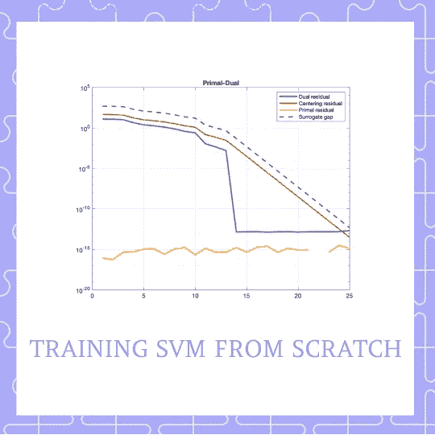

# SVM 说话算法:使用内点方法进行 SVM 训练

> 原文：<https://towardsdatascience.com/svm-talking-algos-using-interior-point-methods-for-svm-training-d705cdf78c94?source=collection_archive---------21----------------------->

## [实践教程](https://towardsdatascience.com/tagged/hands-on-tutorials)

## 使用优化方法从头开始训练支持向量分类器

好了，伙计们！我们已经讨论了约束优化的[预备知识](https://medium.com/@marialavrovskaya/svm-talking-maths-quadratic-programming-and-cholesky-factorisation-968a493db10b)和[将支持向量机分类问题公式化为二次规划](/svm-talking-maths-formulating-support-vector-machine-as-a-quadratic-programming-problem-ab5d30a8d73e) (QP)。今天我们学习如何数字训练支持向量分类器**。**

这篇文章可以分为两部分:理论和实践！如果你以前遇到过内点方法，你可以跳过理论部分，向下滚动到我们的实际例子！

首先，我们试图从障碍方法出发，给内点方法提供一些直观。第二，我们制定原始对偶方法，直接来自修改 KKT 条件。这可能现在没有意义，但是当你读的时候会明白的！最后，我们从头开始编写我们的分类器——这是之前学习的所有构建模块汇集的地方。

# 理论！支持向量分类器如 QP

我们从[开始，回忆](/svm-talking-maths-formulating-support-vector-machine-as-a-quadratic-programming-problem-ab5d30a8d73e)支持向量分类器可以通过它的对偶表示为二次规划

SVM 扮演 QP

在哪里

这是我们的优化问题！现在让我们学习如何用数字来解决它。

# 建立你的直觉:内点方法

内点法背后的重要思想是，它们试图通过将牛顿法应用于一系列的**等式**约束问题或一系列的**修改的**版本的 KKT 条件，来解决问题(上文所述)或 KKT 条件(为上文问题制定的)。两个自然的问题是:不平等约束在哪里消失，什么是 KKT 条件的修改版本？

前者可以很容易地通过屏障方法观察，帮助后者建立直觉。让我们直入主题吧🚀

## 不等式约束在哪里消失？

我们试图将不等式约束问题(如上所述)近似公式化为等式约束问题，牛顿的方法可以应用于该等式约束问题。我们的第一步是通过使不等式约束隐含在目标中来重写问题(让我们采用这里讨论的一般形式)。这是通过引入指示器函数来实现的。因此我们有

到目前为止一切顺利。这里唯一的问题是，这个目标不能是两次可微的，这意味着我们的假设被违反，我们不能对它应用牛顿的方法。那么我们能做什么呢？

我们再近似一次！现在我们想用可微的东西来近似指标函数。可能我们有一个！我们用另一个函数来近似指示函数

其中 *t* > 0 是设置近似精度的参数。

作者创建的图像。灵感来源于[1]

该图显示了不同的 *t=0.5，2，4，5 的近似精度。*蓝线( *t=5* )表明随着 *t* 参数的增加，我们有了更好的近似值。

这给了我们一个新的优化问题。通过将目标乘以 *t，*我们得到具有相同最小化器的等价最小化问题

新函数 *phi* 被称为对数障碍，它说明了不等式约束*。*

## 什么是修正的 KKT 条件？

我们现在考虑上面写的问题。对于每一个 *t > 0* 我们定义 *x*(t)* 为解。当我们应用[牛顿法](https://en.wikipedia.org/wiki/Newton%27s_method_in_optimization)时，我们有中心点，它们是 *x*(t)。*该**中心路径是**严格可行的，这意味着这些中心点也满足等式条件。我们记得在梯度为零的地方发现了最小值。我们写出了拉格朗日函数

想知道 nu 是哪里来的？如前所述，我们将最小化问题*全部写成拉格朗日形式的一个表达式*(这意味着用拉格朗日乘数为等式约束增加目标函数)。然后我们求导，让它等于零，我们记得这是最小的地方。我们陈述存在最优的 *nu* ，使得表达式书面打击成立。

从上面的表达式中，我们可以推导出中心路径的一个重要性质:每个中心点 *x*(t)* 产生一个对偶可行点，因此是最优解的下界 *p** 。回忆阅读此处？

如果我们将λ定义如下

这给了我们一个双重功能，通过插入我们的 lambda，我们有

然而在我们说二元性差距实际上为零之前，实际上我们表明它不完全是那样的。我们的二元差距等于 *-m/t.*

这就改变了我们所说的 KKT 条件的形式。新的**KKT 条件简称为**修正的** KKT 条件。因此，我们的最后一个条件被我们讨论过的二元差距所取代！**

因此，新的修改 KKT 条件，又名中心性条件，是

修正的 KKT 条件

到目前为止一切顺利！我们提供了修改的 KKT 条件从何而来的直觉，这有望帮助你更好地理解内点算法背后的思想。从这一刻起，你应该记住的是修正的 KKT 条件，我们正试图用牛顿法解决这个系统！:)

# 数值求解:原始对偶方法

本质上，我们将修改后的条件表示为

非线性方程 rt

我们定义的地方

并且 *f(x)* 是不等式约束的向量，而 *Df* 是它的导数。

一旦我们找到满足第一个方程的 x，λ，nu ，这意味着我们找到了最小化器！你知道这些方程矩阵是从哪里来的吗？这确实是我们修改后的 KKT 条件，所有条款都在左边！

现在应该怎么解决呢？我们考虑对于固定的 *t* 求解非线性方程 *r_t* 的牛顿步骤。我们将当前点和牛顿步表示为

分别是。牛顿步骤的特征在于非线性方程

所以根据 x，λ和 nu，我们有

最终系统

# 练习！翻译成代码

终于，我们到了！我们有最终的非线性方程，我们想用牛顿法数值求解。我们如何编码？在本教程中，我们使用 Matlab

## 关于我们数据的注释

我们使用合成生成的数据集，该数据集包含两个类，并且不容易被直线分开。这个数据集是使用 Python 代码生成的，可以在这里访问[。](https://github.com/MariaLavrovskaya/Nowearetalking/tree/main/svm/data)

## 第一步。从 CSV 文件中读取数据

## 第二步。将问题翻译成代码

还记得吗，在本文的开始，我们讨论了支持向量机的 QP？将它翻译成代码非常简单，因为我们 1)知道目标，2)知道我们的不平等和平等约束。让我们把它放在一起。

我们首先需要创建我们的三维矩阵。回想一下，它包含 x 和 y 的乘积，因此我们写 for loop 来找到它。一旦找到 D，我们就写出它的一阶和二阶导数。然后我们把不平等和平等约束以及它们的派生物放在一起。

第 33–38 行显示了问题设置。回想一下，我们正试图优化 *x，λ和 nu* ，所以我们应该从某个地方开始！我们如何选择一个起点？你真的可以从什么开始，唯一的要求:选择应该是可行的，这意味着在这一点上问题的约束没有被违反！

## 第三步。选择默认参数

之前，我们只讨论了参数 *t，*，然而，我们也可以默认选择其他参数。原始对偶算法假设在每次迭代中 *t* 都在变大，所以我们引入了 *m* 常数，我们在每次迭代中用它乘以 *t* (我们将在代码中进一步看到)。 *tol 和 maxIter* 是作为停止标准的两个参数。

*tol* 控制代理二元差距，所以我们只在代理二元差距非常非常小时停止。代理对偶间隙的引入是由于原始对偶方法不一定在每次迭代中都产生一定可行的点，这意味着在每次迭代中我们不一定计算对偶间隙并在它非常非常小时停止—因此，我们引入了代理对偶间隙。

maxIter 只是确保我们进行一定数量的迭代，这样我们就不会永远都在求解。

回溯选项允许确定步长。我们将看到它是如何在算法中使用的。

## 第四步。编写算法代码

首先，我非常感谢 Marta Betcke 博士，当我在 UCL 学习的时候，他给我介绍了数值优化。本节介绍的算法是受伦敦大学学院数值优化讲师 Marta Betcke 博士的启发。

我们创建一个单独的函数，它将上面定义的所有参数作为输入。

我们通过将 *r_t* 转换为*deltaY*【1】找到了我们的 *deltaY*

## 第五步。确定步长

我们找到了我们需要走的方向，但我们还没有朝这个方向迈出一步。我们应该如何确定我们的步长？我们使用[线搜索](https://en.wikipedia.org/wiki/Line_search),但是对其进行调整以适用于原始对偶算法。

基本线搜索应该通过考虑残差的范数和通过确保两个约束成立来修改。第一个约束是

回溯的第一个约束

为了简单起见，这里我们假设第一个约束永远不会被违反。因此我们设置 *s_max=1。*

第二个约束确保

回溯的第二个约束

为了确保第二个约束，我们需要开始回溯减少 s，直到满足约束。这就是我们之前介绍的 *optsBT* 选项发挥作用的地方！因为我们不希望在不满足约束的情况下永远回溯，所以我们希望确保在满足一定数量的迭代时停止。

我们一直做这个练习，直到我们的代理对偶间隙小于容许水平，或者达到最大迭代次数！最终三重奏 *x_k，lambda_k 和 nu_k* 将是我们的解！

## 第六步。行动呼吁

我们调用我们命名为 PrimalDual 的创建函数来工作！

## 第七步。绘制决策边界

我们到了！由于我们已经记录了迭代，我们现在可以找到大于某个阈值(我们使用 0.001)的支持向量！

作者图片

作者图片

回想一下，我们的 *infoPD* 结构还包含了每次迭代中代理对偶间隙的信息。通过将它绘制成迭代次数的函数，我们可以看到它在快速下降。它不会精确地归零，但它比我们一开始设置的 *tol=1e-12* 要小。

**参考文献:**

[1] V. L. Boyd Stephen，*凸优化*。2004.