# SVM 谈数学:将支持向量机公式化为二次规划问题

> 原文：<https://towardsdatascience.com/svm-talking-maths-formulating-support-vector-machine-as-a-quadratic-programming-problem-ab5d30a8d73e?source=collection_archive---------28----------------------->

## **从分离超平面的想法到最终的二次规划分 4 步**

作者 GIF

上周，我们[介绍了](https://medium.com/@marialavrovskaya/svm-talking-maths-quadratic-programming-and-cholesky-factorisation-968a493db10b)约束优化，但没有给你任何提示，说明这如何有助于在数值上解决支持向量机问题。这一次我们将通过把支持向量机公式化为 QP 问题来把一切放入上下文中！

在这篇文章中，我们引入了卡鲁克-库恩-塔克特(KKT)条件，将支持向量机问题公式化为一个凸优化问题，并引入了几个变换，使其更便于数值求解！

*让我们直入主题吧。*

# 这些 KKT 条件是什么，我们为什么要关心？

简单地说，KKT 条件是一阶导数**测试**，它允许我们检查是否**确实**达到了最优解**。**我们记得，假设目标函数、不等式和等式约束是可微的，我们的拉格朗日函数具有以下形式

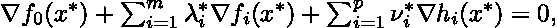

其中 x*是最优解。因此，我们有以下 KKT 条件

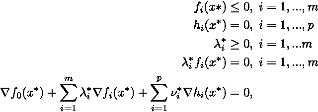

KKT 条件

所有这些符号对你来说都有意义吗？如果没有，让我知道我会提供更多的解释！

**这里有好消息！😃**如果我们假设目标是凸的，这些条件就变得必要和充分。换句话说，我们保证 *x*，lambda** 和 *nu** 是原始的和对偶最优的**，对偶间隙**为零。还记得[是什么意思](https://medium.com/@marialavrovskaya/svm-talking-maths-quadratic-programming-and-cholesky-factorisation-968a493db10b)吗？

所以现在，我们完全准备好了！我们有我们的拉格朗日和 KKT 条件，我们应该如何制定 SVM 作为一个约束优化问题？

# 作为二次规划问题的支持向量机

我们记得，支持向量机本质上是寻找一个最优超平面，其中“支持向量”是超平面的位置和边缘的宽度。

## 分离超平面的思想

如果我们在一个 *p-* 维空间中有向量 *x* ，超平面或仿射集 *L* 由以下等式定义

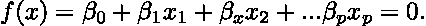

分离超平面

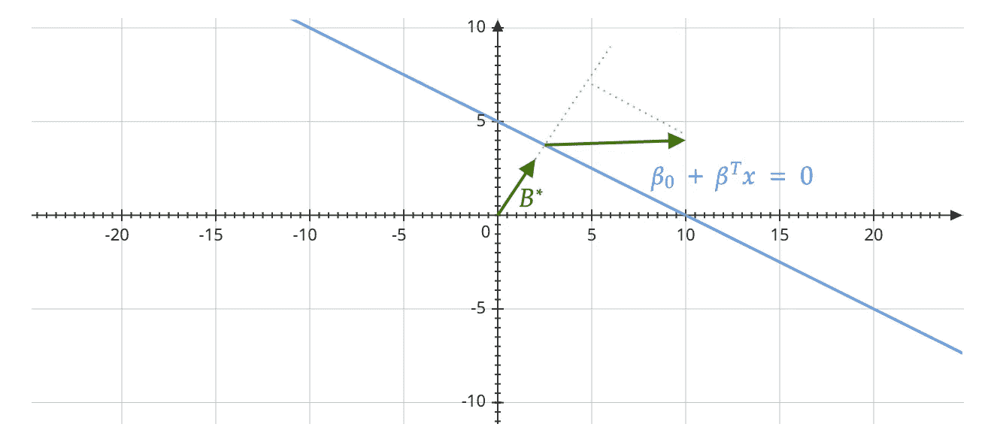

图片作者。灵感来源于[1]

那才是你心目中应该有的画面(*抱歉画的乱七八糟*)。**大主意！**🙂这些*贝塔*是控制线方向的——因此，我们希望通过最小化*贝塔*找到最佳分离！

我们现在列出一些重要的属性:

1.  对于位于 *L，*中的任意两点 x1 和 x2，我们有

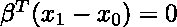

因此，我们可以构造曲面 l 的法向量 *B** 。因为我们在 2D，我们有一条线而不是曲面。*我们记得矢量法线是在给定点垂直于表面的矢量。*

2.对于 *L，*中的任意给定点 *x_0* ，我们有

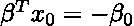

直接从上面分离超平面的定义

3.从 *x* 的任意点到 *L* 的**符号**距离由下式给出。*我注意到，我们在最终表达式的分母中有一个导数，因为对目标求一阶导数，我们将只剩下β。*

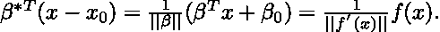

## 步骤 1——制定一个优化问题。

目标是通过**最大化到任一类中最近点的距离，找到分隔数据点的超平面。**如果 M 是一个带符号的距离，那么我们有如下优化问题

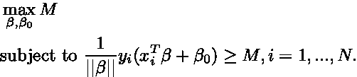

以下不等式条件确保所有点距离由*βas*定义的决策边界至少有符号距离 *M* 。

## 第二步——再想想！为方便起见重新表述。

现在仔细观察，我们应该对上述优化公式**进行三个重要的调整，以解决分类错误**和**的问题，从而使数值求解**稍微容易一些。我们引入了以下变化:

1.  任意设置

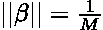

这允许我们以这样一种方式重写最初的问题，在将来我们将最小化平方范数，这样做纯粹是为了方便。

2.现实世界的问题通常是**不可分的**，因为它总是包括一些在未来空间重叠的观察。这叫做**软余量**。因此，我们需要允许一些点位于边缘的错误一侧。数学上，我们引入**松弛变量** *(* 字母 *xi)* **，**其总和不应超过指定的值 *C*

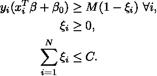

该约束以这样的方式公式化，以表达预测*f(x _ I)*在其余量的错误侧的比例量。

我们现在有以下优化问题。*我们注意到，在平方范数完成之前引入 1/2 纯粹是为了方便——回想一下，一旦我们求一阶导数，2 的幂将下降，因此 1/2 将抵消它。此外，我们将边界约束重写为“正则化”项，这本质上与我们惩罚错误分类是一回事！*

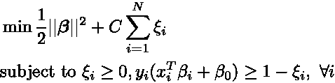

重写优化问题

## 第三步——写拉格朗日(我们快到了)。

前面提到的给了我们约束优化问题，现在我们把所有东西放在一起得到拉格朗日！

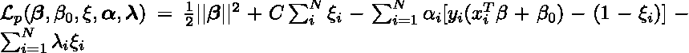

所以我们的新目标是最小化贝塔的矢量、*贝塔 _0* 、*阿尔法的矢量*和*Xi 的矢量*。你能看出这些术语是从哪里来的吗？如果没有，让我知道，我会分解它。

我们还遗漏了什么？对！我们仍然需要应用我们的一阶导数测试(KKT 条件)来看看我们试图找到的最优解是否是真正最优的。让我们现在把这些写下来。

我们先介绍**平稳性条件**。这就好像我们试图确定一个函数导数为零的驻点。由于我们是针对β的*向量*、*β_ 0*、*α、*和*Xi 的向量进行优化。*我们需要确保这三个都通过这些静态测试！因此，我们写道

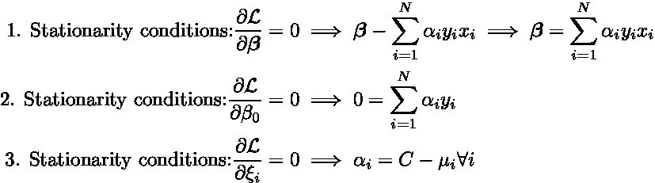

平稳条件

从问题的原始形式，我们有所谓的原始可行性条件。*可行性简单来说就是我们的最优点位于满足约束的可能区域！*

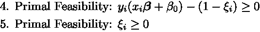

最初的可行性约束

更进一步，我们有乘数条件！因为这两个是直接来自 KKT 的条件。我们有一个等式约束的乘数和一个不等式约束的乘数。因此，我们写道

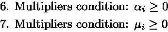

拉格朗日乘数条件

最后但同样重要的是，我们有互补的松弛条件。引入这些约束是因为我们有**零对偶间隙**，因此它们保证了原始和对偶的值是相同的！你可以在这里阅读更多关于这些条件是如何获得的[。](http://www.gatsby.ucl.ac.uk/~gretton/coursefiles/Slides5A.pdf)

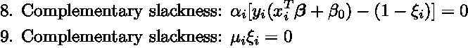

互补松弛条件

## 第四步——拉格朗日看起来有点吓人。我们来写对偶形式吧！

我们的拉格朗日看起来很吓人我们也有 9(！)要考虑的约束。我们已经知道我们有一个凸问题，因此我们可以找到全局最优解，即使我们通过写对偶形式来处理这个问题。

让我们试着把我们的原始问题转换成对偶形式。我们使用前三个平稳性条件，并将它们代入拉格朗日方程。我们写作

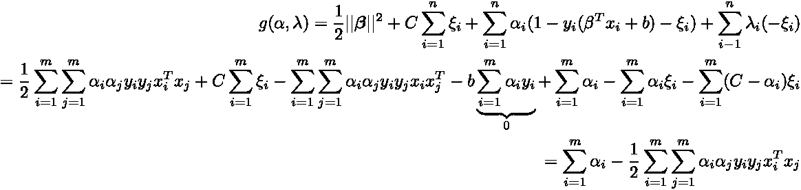

总而言之，我们有以下问题

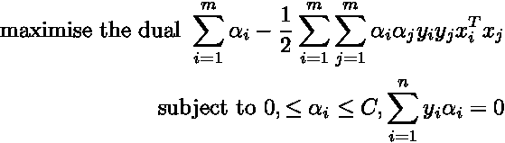

最终二次规划问题！

这比我们之前见过的拉格朗日简单多了。它也更加灵活，因为我们引入了允许错误分类的松弛变量！

仔细看这个表情。它让你想起了什么？完全正确，它具有二次规划的形式！

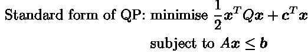

二次问题的标准形式

这意味着现在我们可以应用 QP 方法来数值解决这个问题🚀

## 最好的事情——来了一个内核函数！

关于对偶形式最好的事情之一是数据(我们的 *x* )以点积的形式出现。这意味着我们可以事先对我们的数据应用任何类型的转换！这非常方便，因为几乎没有真正的数据集可以线性分离！

**参考文献:**

[1] T. et。全部。哈斯蒂，“统计中的斯普林格系列统计学习的要素”，*数学。智能。*，2009 年第 27 卷第 2 期，第 83–85 页【在线】。可用:[http://www.springerlink.com/index/D7X7KX6772HQ2135.pdf.](http://www.springerlink.com/index/D7X7KX6772HQ2135.pdf.)