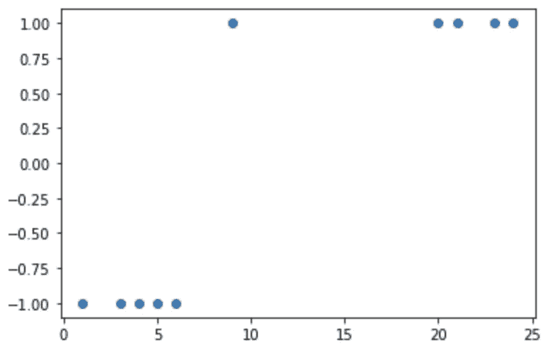
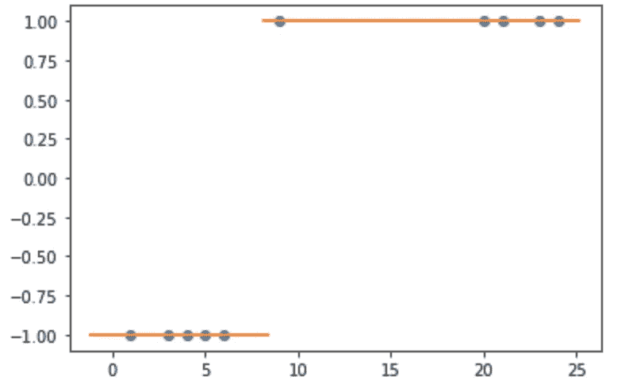
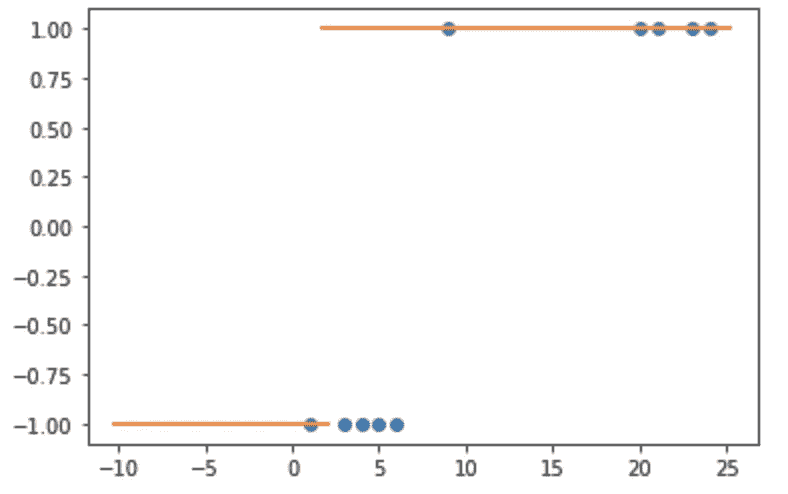
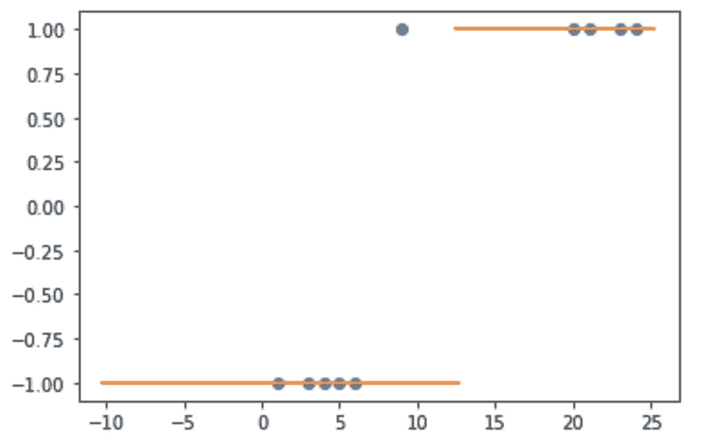
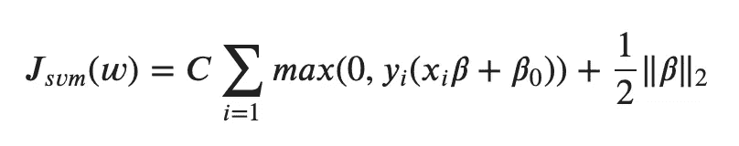
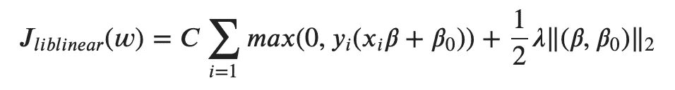
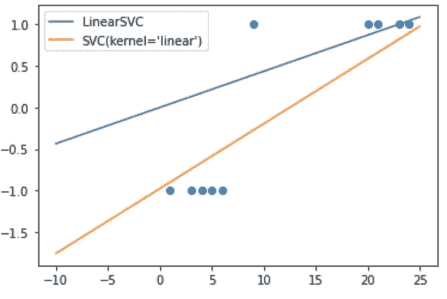

# SVM 与 Scikit-学习:你应该知道什么

> 原文：<https://towardsdatascience.com/svm-with-scikit-learn-what-you-should-know-780f1bc99e4a?source=collection_archive---------7----------------------->

## 为什么 LinearSVC 和具有线性核的 SVC 不是同一个函数？

为了在 scikit-learn 中创建线性 SVM 模型，有两个来自同一个模块`svm` : `SVC`和`LinearSVC`的函数。由于我们想要创建一个具有线性内核的 SVM 模型，并且我们可以在函数`LinearSVC`的名称中读取`Linear`，我们自然选择使用这个函数。但事实证明，我们也可以将`SVC`与参数`kernel='linear'`一起使用。

现在的问题是:`LinearSVC`和`SVC(kernel='linear’)`是同一个功能吗？如果不是，哪一个是真正的 SVM 模式？

(如果你不知道什么是 SVM，那么本文末尾有一个链接，可以非常直观地定义一个 SVM。)


乔纳森·博尔巴在 [Unsplash](https://unsplash.com?utm_source=medium&utm_medium=referral) 上拍摄的照片

# 经验方法

为了找出差异，可以有两种不同的方法:

*   理论方法:我们可以阅读文档，找出与这些函数相关的数学公式的不同之处
*   经验方法:我们可以对这两个函数做一些测试，我们可以看看它们的结果是否有任何不同

让我们从经验方法开始。

## 数据集

为了直观显示差异，数据应该简单。并且有必要测试数据中的不同行为。这里有一个将帮助我们:这个数据集有两个线性可分的类；然而，有一个异常点(与真实的类 1)实际上接近于类 1。让我们看看这两个函数将如何处理这个异常点。

```
X=np.array([1,3,4,5,6,9,20,21,23,24]).reshape(-1,1)y=np.array([-1,-1,-1,-1,-1,1,1,1,1,1])plt.scatter(X,y)
```



作者图片

## 线性模型

现在我们可以应用`LinearSVC`模型:

```
from sklearn.svm import LinearSVC
linsvc = LinearSVC(C=1)
linsvc.fit(X,y)
```

我们现在可以用橙色线来显示一些测试数据的预测:

```
X_test=np.linspace(-1, 30, 300).reshape(-1,1)
plt.scatter(X,y)
plt.scatter(X_test,linsvc.predict(X_test),marker="_")
```



作者图片

目前，我们看不到任何奇怪的东西:分类似乎是正确的。为了测试模型，让我们使用超参数`C`的一些极值。让我们回忆一下`C`的含义:

*   对于`C`的大值，误分类会被认为是大损失。在我们的例子中，`C=1`可以被认为是大的，因为异常点被(正确地)分类为 1，而它更接近于 1 类。
*   对于`C`的小值，错误分类将被容忍:理论上，异常点应被分类为-1…，让我们看看会发生什么

```
linsvc = LinearSVC(C=0.001)
svm_lin.fit(X,y)
```

我们得到以下结果:发生了什么？



作者图片

不是(理论上)错误分类异常点，而是很多-1 被错误分类。

也许我们对理论的理解是错误的？让我们用`SVC`做一些测试…

## 带 SVC 的模型

使用相同的数据集，我们可以拟合一个`SVC`模型:

```
from sklearn.svm import SVClinsvc = SVC(kernel = 'linear',C=0.01)
```

我们得到了:



作者图片

这更符合我们对超参数`C`在 SVM 模型中如何工作的理解。

# 理论方法

## 要验证的数学公式

既然我们可以从经验上看到这两个函数之间的差异，那么让我们更深入地从理论上寻找一些差异。

根据各种来源( [scikit-learn](https://scikit-learn.org/stable/modules/svm.html#mathematical-formulation) ， [Wikipedia](https://en.wikipedia.org/wiki/Support-vector_machine) ，[普林斯顿 SVM 讲座](https://www.cs.princeton.edu/courses/archive/spring16/cos495/slides/ML_basics_lecture4_SVM_I.pdf)，[斯坦福 SVM 讲座](https://see.stanford.edu/materials/aimlcs229/cs229-notes3.pdf))，损失函数如下(铰链损失):



我们可以注意到正则化超过了β项，即**不包括**截距。

由于`LinearSVC`函数来自`LIBLINEAR`库，我们可以阅读[文档](https://github.com/cjlin1/liblinear)中损失函数定义为:

```
min_w w^Tw/2 + C \sum max(0, 1- y_i w^Tx_i)^2
```

w 项包括截距，我们可以这样写



## 模型中的系数

现在，我们可以回到 python 代码，使用以下代码从两个模型中获取系数:

```
print(linsvc.coef_)
print(linsvc.intercept_)
```

对于`LinearSVC`，截距为零，而在`SVC`中，截距没有被规则化。我们可以通过这张图来比较它们



# 结论

由于各种包(python，R，spark)的出现，创建机器学习模型似乎变得越来越容易。然而，理解实现的函数背后的真正含义是很重要的。

在 SVM 的例子中，我们可以看到来自`LIBLINEAR`库的`LinearSVC`使用了一个损失函数，它不同于在来自`LIBSVM`库的`SVC`中实现的通常形式。对于高维，截距项的重要性会降低，但是对于小维，正则化截距项会导致不正确的结果。