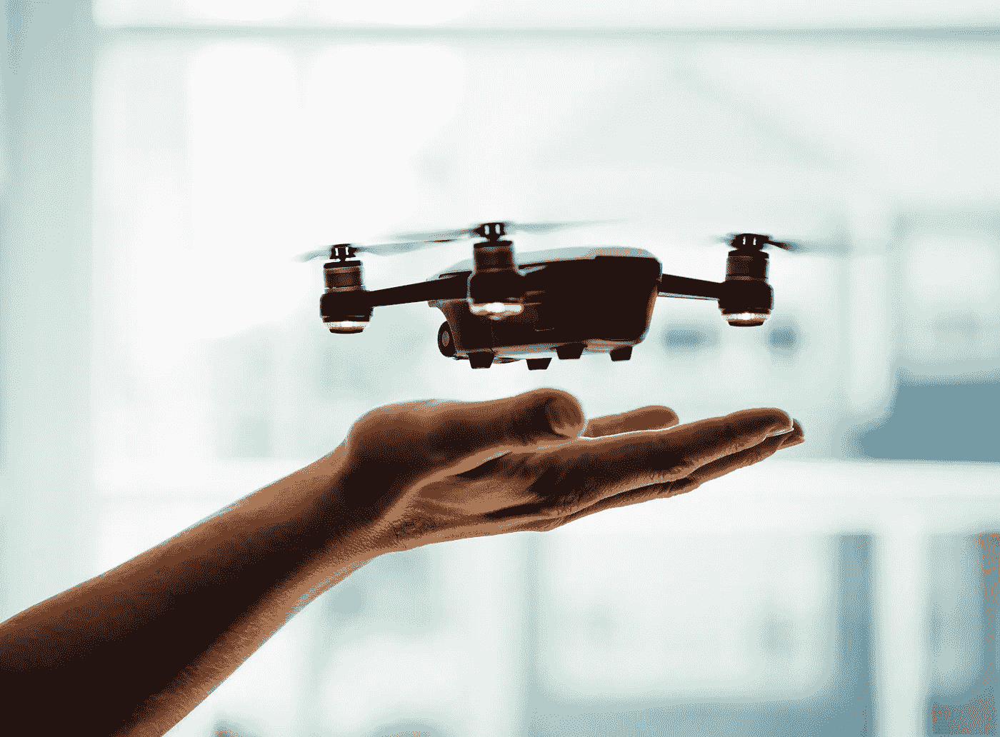
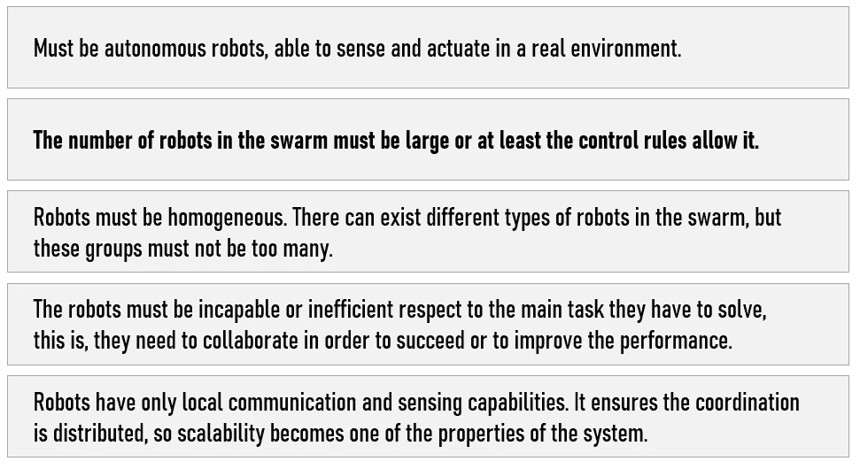
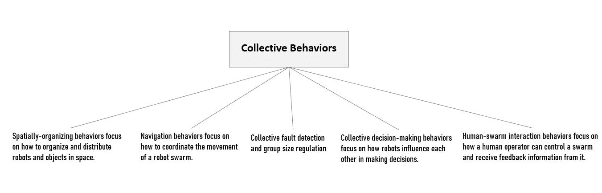
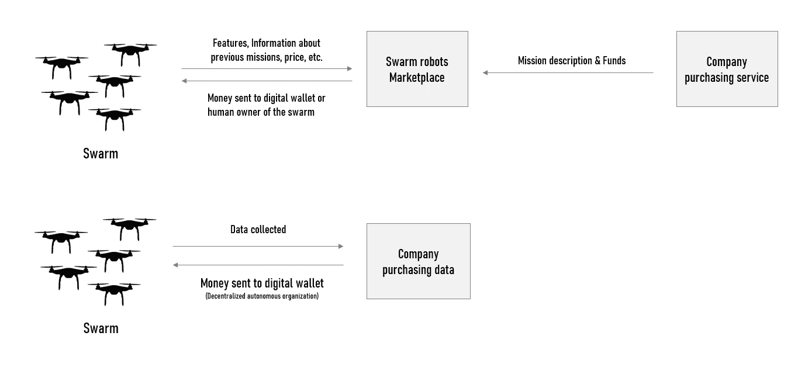

# 群体机器人:项目、新商业模式和技术挑战

> 原文：<https://towardsdatascience.com/swarm-robotics-projects-new-business-models-technical-challenges-d6fa845e56af?source=collection_archive---------19----------------------->

## 如何提高群体机器人应用程序、集体 AI 算法和硬件限制的可扩展性

在 [Unsplash](https://unsplash.com/s/photos/drones?utm_source=unsplash&utm_medium=referral&utm_content=creditCopyText) 上[剂量媒体](https://unsplash.com/@dose?utm_source=unsplash&utm_medium=referral&utm_content=creditCopyText)拍照

受群体智能和机器人学的启发，群体机器人学是一个很有前途的研究领域。目标是控制大量简单的机器人来完成复杂的任务。

尽管研究论文越来越多，可扩展的应用仍然很遥远，新的商业模式仍然需要在机器对机器经济的背景下找到(M2M)。

最近，我有机会与一个群体机器人团队合作。目标是利用一组小型机器人来识别大型设施中的漏水情况。

**在这篇文章中，我将解释群体机器人发展的主要问题，展示不同的用例，以及要使这项技术可扩展需要实现的目标。**

# 什么是群体机器人

有必要清楚地定义我们所说的“群体机器人”是什么意思。Erol Sahin [ [1](https://citeseerx.ist.psu.edu/viewdoc/download?doi=10.1.1.663.6979&rep=rep1&type=pdf) ]给出了一个完美的定义:

> “群体机器人学是研究如何设计大量相对简单的实体代理，以便从代理之间以及代理与环境之间的本地交互中产生所需的集体行为。”

iniaki Navarro 和 Fernando Matía 概述了将群体机器人与其他多机器人类型的系统区分开来的几个条件。

图片由作者提供，创意来自[伊尼基·纳瓦罗和费尔南多·马蒂亚](https://core.ac.uk/download/pdf/194193714.pdf)

# 集体行为和群体机器人

为了更好地理解当前的挑战，理解研究人员关注什么是至关重要的。群体机器人的大部分研究工作都是针对**集体行为** [ [3](https://en.wikipedia.org/wiki/Collective_animal_behavior) ]的分析。根据 Marco Dorigo 等人(2014) [ [4](http://www.scholarpedia.org/article/Swarm_robotics#Collective_behaviors) ]的说法，集体行为可分为五大类:

作者图片，来自 [Marco Dorigo 等人(2014)](http://www.scholarpedia.org/article/Swarm_robotics#Collective_behaviors)

# 今天的情况和使用案例

今天大多数关于群体机器人的研究主要是使用模拟软件进行的。这种情况可以用机器人平台的成本和硬件复杂性来解释。这种情况阻碍了可伸缩解决方案的开发。

在构建原型时，我意识到在机器人群体应用程序中对大量机器人的模拟是相当复杂的，并且由于外部条件的建模不良而经常不准确。

尽管有这些限制，群体机器人还是可以在几个领域找到应用:从环境监测到灾难恢复、基础设施维护、物流和农业。

*   **应用#1** 桑迪亚国家实验室开发的一个机器人搜索团队(被称为“雪机器人”)在雪地里定位雪崩受害者的速度比人类用狗快四倍。
*   **应用#2** 在军事工业中，通过利用无人机作为蜂群一起行动，可以达到更好的战场感知(测绘)。蜂群会自主行动，同时搜寻目标并将信息传递给所有的蜂群成员。
*   **应用#3** 群体机器人可用于检测化学品泄漏或污染。除了监测，蜂群可以定位源头，向该区域移动并采取快速行动。在紧急情况下，机器人可以聚集成一个补丁来阻断源头，作为临时解决方案[ [7](https://www.sciencedirect.com/science/article/pii/S221491471300024X) ]。
*   **应用#4**
    在发生自然灾害或事故的情况下，群体可以证明非常有用。机器人可以搜寻受害者，并为特定区域的未来研究提出建议。
*   **应用#5** 在维修中，群体机器人可以用来检查特定的元件。这种系统可以基于一群自主的微型机器人，只使用机载的本地传感器。
*   谈到污染，麻省理工学院的 Senseable 城市实验室开发了一组名为 Seaswarm 的低成本吸油机器人，用于掠海和除油。

# 商业模式

群体机器人将受益于机器对机器时代。**机器对机器**是设备之间使用任何通信信道的直接通信，包括有线和无线。在不久的将来，大多数公司将提供群体机器人解决方案，或者与他们直接竞争(安全、物流等)。).

同样有把握的是，大多数运营机器人群体的公司会将收集的数据出售给参与 M2M 经济的其他公司，作为额外的收入来源( ***感知*作为*服务*** *)* )。

例如，自动驾驶汽车可以从在附近工作的群体机器人那里购买与路况或交通信息相关的数据，这些机器人能够提前收集这些数据。

作者图片

我希望群体机器人也能从区块链中受益。由于 P2P 网络、智能合约和数字钱包，一群**人工智能代理**可以达成协议并记录下来，而不需要控制机构(公司)。

公司也可能决定在某种市场上将群体机器人“出租”给他人。例如，建筑经理可能决定租用群体机器人来分析建筑工地并寻找问题。因此，群体机器人可能最终成为分散的自治组织。

# 技术挑战

使群体机器人对许多未来用例(自主、分散等)具有战略意义的几个特征。)也限制了技术从学术机构向可扩展的工业解决方案的发展。

迄今为止，研究人员主要试图找到合作方案如何与现有的传感和计算能力相结合的答案。我们还需要精确地找出如何在一个数学模型中描述一个群体机器人系统，该模型可以预测个体和群体水平上的系统行为。

## 适应

根据我的经验，要开发可扩展的群体机器人，我们需要**找到离线资源限制的解决方案。**换句话说，完全在群体中运行计算密集型自动设计过程的能力。

我们还需要达到这样一种水平，即机器人群体可以在现实生活条件下自动发现合适的群体策略。不幸的是，大多数项目仍然缺乏这一关键能力。理想情况下，可扩展的机器人群体应该自主地、持续地调整它们的行为，以适应不断变化的任务和环境。

替代技术，如体现进化，已经被提出来允许机器人在群体中发展自主发现。不幸的是，这些方法非常耗时，因为可能的解决方案是在真实的机器人上测试的，而不是模拟的。此外，配备有缺陷控制器的真实机器人可能会对自身或外部元件造成损坏，使其不适合现实世界的条件。

## 沟通

第二个挑战与沟通有关。在某些情况下，如果**全局通信被阻断**，机器人群体就无法完成任务。

**虽然有几种现有的无线技术可用，但专门用于群体机器人的协议仍未被发现。**

## 感觉

机器人分析环境中的物体或目标，并完成必要的任务，如避障、目标搜索、群集等。**向**应谭和钟【 [9](https://www.sciencedirect.com/science/article/pii/S221491471300024X) 】、**表示:“该方案的主要问题是如何高效地整合群体中的所有传感器进行协作。”**关于这个元素，Cortes 等人[ [10](https://ieeexplore.ieee.org/abstract/document/1284411) ]实现了一个有趣的工作。他们探索了如何以自适应、分布式和异步的方式控制和协调一组自主车辆，这些车辆被视为带有传感器的代理。

更精确和频繁的通信需要更复杂的硬件和同步；随着群体变得越来越大，带宽、能源和所需处理时间的成本将会增长得非常快。**理想情况下，可扩展的机器人集群应该尽量简化通信部分，尽可能依赖感知。**

## 算法

除了上述挑战之外，群体机器人搜索算法是研究人员最关心的问题之一。

**大部分算法都是针对每一个遇到的应用而设计的。例如，可扩展的机器人群需要具有高可用性的算法。不幸的是，这样的算法还没有被发现。**

**以下要素可以解释这种情况:**

*   群体机器人系统和应用问题缺乏标准定义。
*   在群体机器人研究中抽象出各种各样的问题，有不同的问题定义、范围和设置。

## 安全性

机器人集群的另一个重要障碍是安全性。一些研究人员强调了开发系统的重要性，在这个系统中，群体成员可以发现并信任他们的同伴。

事实上，已经证明包含恶意的群体成员可能是群体目标[ [12](https://uwe-repository.worktribe.com/output/816919/towards-exogenous-fault-detection-in-swarm-robotic-systems) ]的潜在风险和安全漏洞。

## 不同的行为

如前所述，可扩展的机器人群体将需要处理许多不同的行为，例如，通过从一种控制算法转换到另一种控制算法来达到明确定义的目标。不幸的是，群体中不同行为的组合在现有的文献中还没有被深入研究。

**群机器人技术还远未被认为是一项成熟的技术，研究人员的主要关注点是一些“基本”任务，如编队控制、避障等。**

尽管商业应用和模型前景看好，但一些限制因素仍在阻止可扩展的现实世界群体机器人系统的发展。

从技术角度来看，需要在几个层面上进行进一步的研究。硬件缺陷限制了当前机器人系统的可扩展性，而更好的算法和通信系统对于提高群体机器人的自主性是必要的。

# 有关此主题的更多信息，我推荐以下链接:

*   [群体机器人简介](https://www.hindawi.com/journals/isrn/2013/608164/)
*   [群体机器人的研究进展](https://www.sciencedirect.com/science/article/pii/S221491471300024X)
*   [群体机器人的原理和应用](https://learn.g2.com/swarm-robotics)
*   群体机器人能被用来解决现实世界的问题吗？
*   [区块链:机器人群体系统的新框架](https://arxiv.org/pdf/1608.00695.pdf)
*   [群体机器人](http://www.scholarpedia.org/article/Swarm_robotics#Collective_behaviors)
*   [群体机器人——案例研究:蝙蝠机器人](https://www.sciencedirect.com/science/article/pii/B9780128197141000269)
*   [区块链:机器人群体系统的新框架](https://www.media.mit.edu/publications/the-blockchain-a-new-framework-for-robotic-swarm-systems/)
*   用于机器人群体应用的自主微型机器人
*   [群体机器人走向现实世界应用](https://www.advancedsciencenews.com/swarm-robots-move-toward-real-world-applications/)
*   [迈向群体机器人学的高级研究](https://www.ijsr.net/archive/v4i10/SUB158730.pdf)
*   [用警察局模型保护群体智能机器人](https://ieeexplore.ieee.org/abstract/document/7035906)