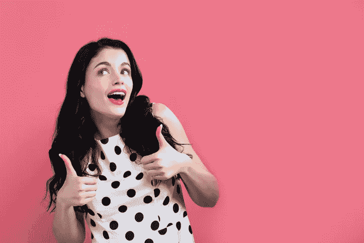
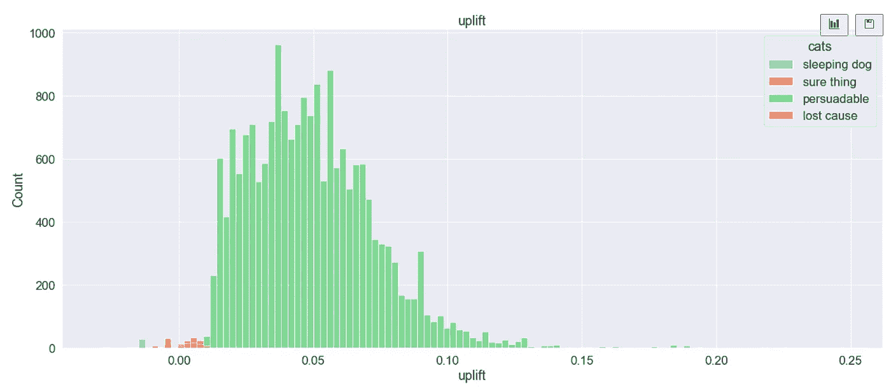

# 动摇说服力:预测 Python 中的营销提升

> 原文：<https://towardsdatascience.com/swaying-the-persuadables-predict-marketing-uplift-in-python-c5e9fd855b80?source=collection_archive---------7----------------------->

## 端到端示例:使用 sci kit-upgrade 模拟客户对营销活动的响应

[日落照片 Unsplash 上的自由湖蒂勒里图像](https://unsplash.com/photos/D16Ru7T7E7M)/Dottie Mabry

# 1.我们正在寻找的洞察力

我之前的一篇文章提到了客户流失:我们如何发现那些想去其他商店购物的客户？营销团队将接触他们，并试图对抗竞争对手的诱惑。

</buy-til-you-die-predict-customer-lifetime-value-in-python-9701bfd4ddc0>  

今天的文章超越了客户流失风险预测。

我们想确定营销活动的效果如何；并预测当我们将试点活动的范围从一小部分客户扩大到更大的群体时，我们可以期待哪些客户共鸣。哪些客户会对我们的促销活动做出积极回应？营销团队将寻找有说服力的**。**

传统上，在计划客户拓展活动时，营销人员会区分**四类** **客户**:

*   **确定的东西**或**购买者**会购买该企业的产品，无论我们是否针对他们采取促销行动。试图增加他们购买更多商品的倾向是一种浪费。相反，资源应该花在还没有成为目标受众的客户群上。如果促销活动提供了经济激励，例如折扣，即使顾客没有折扣也会购买商品，那么营销活动会给企业造成直接损失。

女孩向我竖起了大拇指。股票图片—立即下载照片—iStock(istockphoto.com)/Melpomenem 根据标准许可提供

*   **失败原因**或**从不购买者**不会购买更多的企业产品，无论营销团队是否接触他们。花费在营销沟通上的努力、时间和预算将是浪费。

一个表情恶劣的年轻女子在粉红色上排斥一些单独的东西。股票图片—立即下载照片—标准许可下的 iStock(istockphoto.com)/by master 1305<https://www.istockphoto.com/th/%E0%B8%A3%E0%B8%B9%E0%B8%9B%E0%B8%96%E0%B9%88%E0%B8%B2%E0%B8%A2/%E0%B8%AB%E0%B8%8D%E0%B8%B4%E0%B8%87%E0%B8%AA%E0%B8%B2%E0%B8%A7%E0%B8%97%E0%B8%B5%E0%B9%88%E0%B8%A1%E0%B8%B5%E0%B8%81%E0%B8%B2%E0%B8%A3%E0%B9%81%E0%B8%AA%E0%B8%94%E0%B8%87%E0%B8%AD%E0%B8%AD%E0%B8%81%E0%B8%97%E0%B8%B5%E0%B9%88%E0%B8%99%E0%B9%88%E0%B8%B2%E0%B8%A3%E0%B8%B1%E0%B8%87%E0%B9%80%E0%B8%81%E0%B8%B5%E0%B8%A2%E0%B8%88%E0%B8%82%E0%B8%B1%E0%B8%9A%E0%B9%84%E0%B8%A5%E0%B9%88%E0%B8%9A%E0%B8%B2%E0%B8%87%E0%B8%AA%E0%B8%B4%E0%B9%88%E0%B8%87%E0%B8%9A%E0%B8%B2%E0%B8%87%E0%B8%AD%E0%B8%A2%E0%B9%88%E0%B8%B2%E0%B8%87%E0%B9%81%E0%B8%A2%E0%B8%81%E0%B8%9A%E0%B8%99%E0%B8%AA%E0%B8%B5%E0%B8%8A%E0%B8%A1%E0%B8%9E%E0%B8%B9-gm1044676028-279591282>

*   ****睡狗、蔑视者、**或**勿扰者**对营销传播表现出强烈的厌恶。如果他们没有受到促销活动的困扰，他们会有更高的购买倾向。被广告纠缠会惹恼这些顾客；或者提高他们的意识，他们还不如取消他们几个月或几年前已经订购的服务。向他们传达营销信息不仅是浪费，而且会适得其反。**

****

**成年红发腊肠犬正躺在白色的床上休息，戴着粉色的眼镜睡觉。股票图片—立即下载照片—iStock(istockphoto.com)/Oksana Restenko 在标准许可下提供**

*   ****有说服力的人**积极响应推广行动。营销传播会增加他们购买企业产品的倾向。当有人联系他们时，他们可能会购买，但当他们独处时，他们不太可能购买。**

****

**[Alexas _ Fotos 在 Pixabay](https://pixabay.com/photos/i-beg-your-pardon-marriage-proposal-927744/) 上的免费照片**

**为了集中营销团队的努力和资源，我们需要确定活动中唯一重要的客户群:有说服力的人。**

**客户的分类不是一成不变的。这将取决于我们想要测试的具体营销行动。10%的折扣可以让顾客进入可说服的类别——而免费赠送电影《猫》门票的促销活动可能会让他成为输家——反之亦然。**

****提升建模**旨在确定处理对**目标**变量的**影响。如果治疗包括营销活动，那么**客户响应率**将是目标。回复率可以通过购买订单、网站访问或点击的频率来衡量。如果有一个控制数据集——营销活动没有接触到的客户——那么我们可以确定**提升**:治疗组和对照组之间的响应率差异。****

**治疗对顾客的因果影响通过结果的差异来表达。Y(1)表示客户接受治疗后的反应；Y(0)是没有接受治疗的结果。**

*   **治疗的因果效应= Y(1)-Y(0)**

**对于单个客户来说，因果关系无法衡量，因为两个操作数中的一个是未知的。客户在观察时间窗口内接受或不接受治疗。**

**因此，上升被定义为反应概率的差异，通过观察治疗组和对照组中的等效客户组得出。响应代表客户将采取的行动。**

*   **隆起= P(给予治疗的反应)-P(未给予治疗的反应)**

**我们希望估计每个客户的提升分数；然后总结整个治疗组的升高模式:**

****

**作者图片**

**根据定义，这些有说服力的人将会形成一类可以被这种治疗所左右的顾客。他们的反应将决定这场运动的整体提升。典型的确定的事情和失败的原因都会表现出零的提升，因为治疗不会改变他们的反应。睡狗的特点是负隆起。提升建模旨在从可说服的客户中挑选出高提升客户。**

**例如:一家在线零售商针对其部分客户投放广告或电子邮件，并以后续网站访问量来衡量其成功与否。企业记录显示，他们中有 18%的人登录了网站，而对照组中只有 11%的人在观察期内出现。因此，治疗组与对照组的反应率上升了 7%。**

**必须明确定义目标变量:例如，通过网站访问量来衡量，或者更严格地说，通过治疗开始后给定时间段内完成的购买交易来衡量。**

**提升分析在销售和营销之外的许多领域都有应用。每当需要预测治疗对目标变量的影响时，可以应用提升技术:在临床试验、政治运动或筹款活动中。**

**传统的反应模型将其范围限制在治疗组，而隆起分析建立了一个更全面的模型，包括治疗组和对照组。**

****

**[柏林电梯 Pixabay 上的免费照片](https://pixabay.com/photos/elevators-berlin-ludwig-erhard-haus-1598431/)3093594**

**让我们来解决一个上升问题。**

# **2.属国**

**除了我们的核心库，如 pandas 和 numpy，我们 pip-install 并导入 **Scikit-uplift** ，又名 **sklift。****

**我们还导入了 Scikit-learn 的 *train_test_split* 类和 *catboost* 分类器。除了 catboost，您可以使用任何替代的分类器，只要它的语法与 scikit-learn 的分类方法兼容，例如 xgboost。**

**[https://www.uplift-modeling.com/en/latest/install.htm](https://www.uplift-modeling.com/en/latest/install.html)**

# **3.数据争论**

**sklift 附带的 Hillstrom 数据集包含 64，000 名在营销活动开始前的 12 个月内从在线零售商处购买商品的客户。该公司向其中 2/3 的客户发送了促销电子邮件，其中“男性电子邮件”和“女性电子邮件”各占一半。邮件描述了治疗过程。64，000 人中的第三组作为控制组，不接收电子邮件。**

**在活动结束后的两周时间里，该公司追踪了哪些顾客——接受治疗的或未接受治疗的——访问了它的网站。它使用访问次数来衡量回复率。**

**零售商记录了以下客户特征:**

*   **最近=自上次购买以来的月数**
*   **history_segment =过去 12 个月的美元支出等级**
*   **历史=过去 12 个月花费的实际美元价值**
*   **男士=顾客购买了男士商品(该特征不表示顾客的性别)，二进制 1 或 0**
*   **女装=顾客购买了女装商品**
*   **邮政编码**
*   **新手=客户在 12 个月之前没有购买过任何商品**
*   **渠道=通过电话、网站或多渠道购买订单**
*   **细分=处理=男性电子邮件、女性电子邮件或无电子邮件**
*   **访问=目标=客户在促销电子邮件后访问零售商网站，二进制 1 或 0**
*   **或者，数据集可以加载两个备选目标变量之一:**
*   **— target_col = conversion —客户提交了采购订单，二进制 1 或 0**
*   **— target_col = spend —客户在两周观察期内花费的美元**

****

**作者图片**

***fetch_hillstrom()* 函数将数据集作为 sklearn 的 *bunch* 对象之一进行检索。bunch *db* 由几个字典、数据帧和系列组成，其中:**

*   **db.data =特性列，数据框架**
*   **db.target =客户访问次数，一个系列**
*   **db。治疗=拓展行动——男人发邮件，女人发邮件，或者不发邮件——一系列**

**对于数据探索和争论，我更喜欢 pandas 的工具包，而不是 bunch 相关的方法。因此，让我们将三个源元素组合在一个数据帧 df0 中。**

****

**作者图片**

**源数据不包含空值。**

****

**作者图片**

****

**作者图片**

**每个分类列都包含相对较少数量的唯一值，这将使提升模型更容易在它们之间找到模式。**

****

**作者图片**

****

**作者图片**

**“治疗”一栏的图表显示，营销实验将 64，000 名顾客分为三组，每组实力相当。**

****

**作者图片**

**为了更深入地了解源数据结构，笔记本为其他特性绘制了类似的条形图。**

****

**作者图片**

**通过应用 numpy 的 *setdiff1d()* 函数，我们隔离了特征列，排除了目标和治疗变量，并将它们组合在单独的数据帧 dfX 中。**

****

**作者图片**

**为了理解特性的相关结构，让我们将分类列转换成数字变量。我们使用 pandas 的 *get_dummies()* 函数进行一次性编码，然后将转换后的数字列放入新的数据帧 dfXn 中。**

****

**作者图片**

**相关矩阵显示了一些强关联:“男士(商品)”和“女士(商品)”之间的负关联——有一些重叠，但不是完全的负关联，因为一些顾客显然购买了这两个类别的商品。“channel_Web”和“channel_Phone”之间也存在负相关关系:很少有客户在购买订单时同时使用这两个渠道。**

****

**作者图片**

**当我们交叉列表处理和目标变量时，我们发现男性和女性的电子邮件活动明显增加了观察期内网站访问的频率。在这两个星期中，“没有电子邮件”的客户出现的比率为 11%。零售商统计邮件收件人的回复率较高，分别为 15%和 18%。我们将通过应用提价模型和估计每个客户的提价来确定这种假设的影响。**

****

**作者图片**

**为了隔离“男性电子邮件”活动的治疗效果，我们将“男性电子邮件”编码为 1；而“女性邮箱”和“无邮箱”均为 0。**

****

**作者图片**

**Scikit-learn 的 *train_test_split* 方法保留了数据集的 30%，相当于 19200 个随机抽取的行，用于验证。**

****

**作者图片**

**我们准备将数据集输入到第一个模型中。**

# **4.隆起模型**

## **4.1 阶级转化模式**

***类别转换*或*回复标签*方法由 Jaskowski 和 Jaroszewicz 于 2012 年设计，着眼于临床试验([隆起建模](https://people.cs.pitt.edu/~milos/icml_clinicaldata_2012/Papers/Oral_Jaroszewitz_ICML_Clinical_2012.pdf))。**

**它区分了四种情况:**

*   **对照反应者:没有接受治疗但有反应(访问网站)的个人**
*   **对照组无应答者:没有访问网站的对照组成员**
*   **治疗反应者:接受治疗后有反应的个体**
*   **治疗无反应者:接受治疗但无反应的个体**

**该模型背后的想法是，对照组中的无反应者可能包括一些可说服的人。这些患者没有接受治疗，因此没有被提示做出反应([隆起建模)](https://humboldt-wi.github.io/blog/research/theses/uplift_modeling_blogpost/)。为了考虑到这一点，模型定义了一个新的目标变量 z。如果客户属于治疗组并表现出目标行为，则它等于 1，Y = 1；如果顾客属于控制组并且没有表现出目标行为，则它也等于 1，Y=0。**

*   **Z = Y*W + (1 — Y)*(1 — W)，其中 W 表示处理，Y 表示响应**
*   **隆起= 2 * P(给定特征 X，Z = 1)—1(【gutierrez17a.pdf】T2)**

**该方法将上面列出的四个组分为两组。第一组包括所有的说服，一些失败的原因和肯定的事情。另一组包含所有不要打扰，剩余的失败原因和确定的事情。这种方法将问题转化为二元目标模型，任何机器学习技术都可以应用于该模型([提升](https://scholarspace.manoa.hawaii.edu/bitstream/10125/70805/0158.pdf))。**

****

**作者图片**

**训练完成后，我们在测试数据集上运行模型，然后检查其预测。**

**下面第 2 行中的函数 *predict()* 估计了对每个客户的提升效应:收到或未收到促销电子邮件时，响应(是否访问网站)之间的差异。**

**第 3 行计算了整个测试数据集的平均提升或治疗效果，5.39%，略低于上面建议的简单交叉表:治疗组和对照组的响应率之间的差异。**

**虽然了解所有客户的平均提升很好，但了解提升分数之间的差异会更有用。**

**第 7 行到第 10 行中的函数*upload _ by _ percentile()*根据客户的提价幅度从高到低对测试数据集中的客户进行排序。它分别计算治疗组和对照组的平均缓解率，然后将这些平均值的差异显示为给定百分位组中的提升效应。**

**我们在函数中选择 10 个箱。这将创建一个表，将客户分成 10 组。该表使我们能够辨别在最初几个十分之一的客户之后，提升效应是否会逐渐消失。在我们的例子中，情况并非如此。治疗组的缓解率并未显示出下降的模式，仍远高于对照组。**

**事实上，这不是我们想要的结果。80-20 法则的一个变种会更有效率。如果 20%的客户创造了 80%的总提升，我们可以得出结论，营销活动可以局限于最积极响应的客户。我们可以将反应最差的客户从我们的收件人列表中排除，以避免浪费时间、成本和精力。在我们的例子中，我们没有发现这样的分界点——所有十分之一的人对治疗反应积极，其中大多数人的反应程度适中。**

****

**作者图片**

**方法*plot _ upgrade _ by _ percentile()*将治疗组和对照组的缓解率可视化。除了少数例外，沿 x 轴方向上的抬升效应保持在 0.05 以上。**

****

**作者图片**

**希尔斯特罗姆的顾客似乎相当同质。如果他们表现出更强的差异，我们会看到:**

*   **有说服力的人会把红色上升曲线的左腿抬高到高于 0.0539 的平均水平；**
*   **其次是肯定的事情和失败的原因，谁会把上升曲线降低到零；**
*   **接下来是“请勿打扰”,他们会将上升曲线拉到最右边的零以下。**

**几乎所有的 Hillstrom 客户都属于可说服类，至少如果我们使用网站访问量作为目标回应变量的话。不同的目标，例如采购订单，会给出不同的答案。**

**跨客户十分位数的提升效果的幅度也可以显示在条形图中。**

****

**作者图片**

**知道营销活动增加了客户的兴趣，我们现在可以再跟进两个步骤:**

*   **就采购订单而言，我们可以期待哪种提升？事实上，Hillstrom 数据集包含一个可选的目标变量“conversion”(到采购订单)。自然，只有相对较少的一部分访问产生了采购订单，平均 10 次中有 1 次。这一替代目标的增幅仅为 0.5%。为了隔离一个更实际的效果用于演示目的，到目前为止我使用了目标变量“visits”。**
*   **我们可以用金钱来表达活动的结果:估计采购订单的平均利润率。然后将提升的增量利润与营销活动的成本进行比较。这将使我们能够计算 ROMI，营销投资的回报。**

## **4.2 单人模式**

**Solo 模型，又名 S-Learner 或虚拟治疗方法，基于卢大伟在 2002 年发表的一篇论文。它在处理样本和控制样本之间划分训练数据集。它的一个特征列由二进制治疗标志 0 或 1 组成:顾客是否接受了治疗。**

**Solo 模型的 Python 语法与类转换方法的语法相同，只是在设置上做了一些修改。**

****

**作者图片**

**平均涨幅为 5.43%。**

**Solo 模型，像下面的方法一样，提供了一组图表，这些图表对于类转换对象是不可用的:*plot _ upgrade _ preds*方法，它可视化了响应率的分布及其差异，即提升。属性 *trmnt_preds_* 和 c *trl_preds_* 将这些特定于客户的响应概率列表成数组。**

****

**作者图片**

****

**作者图片**

**另一个属性***feature _ importances _***，根据特性对目标变量的影响对其进行排序。这些重要性分数加起来是 1.0。上表强调了这种处理方式——男人的电子邮件活动——是第*第二*最重要的网站访问触发因素。新手往往比普通的电子邮件收件人更热衷于研究零售商的产品范围。这一结果提示了一个可能的后续项目:再次调查促销活动及其提升，但分别针对新手和老顾客。在今天的练习中，我们将在没有修改过的范围的情况下进行。**

**接下来，我们将分析**特定于客户的提价预测。****

****

**[热气球冒险 Pexels 在 Pixabay 上的免费照片](https://pixabay.com/photos/hot-air-balloons-adventure-balloons-1867279/)**

**我们可以使用 *predict()* 函数和 *trmnt_preds_* 和 *ctrl_preds_* 属性提供的数组将我们的客户分类。首先，我们创建一个新的数据帧 dfZ。它的三个数字列由所有客户的提升分数和计算这些分数的两个概率组成——被减数:如果治疗，响应概率；减数:如果不治疗，反应概率。然后我们插入一个新列——客户类别“cats”——并通过计算三个数字列来自动填充它。在第 9 行，我定义了对应于类别标签的提升间隔:**

*   **接近零的上升意味着肯定的事情或者失败的原因。在第 9 行到第 11 行中使用 pandas 的 *cut* 方法，我将它们都括在-0.01 和+0.01 之间的小区间中，并初步将它们都标记为“确定的事情”。**
*   **低于-0.01 的负上升表示睡着的狗。**
*   **那些正上升超过 0.01 的是可说服的。**

**失败的原因需要与确定的事情分开。失败的原因将减少访问网站的频率。由于缺乏精确的阈值，我们必须做出判断性的决定。在本例中，我定义低于 0.20 的概率将客户归入失败原因类别。其他客户在推广后没有改变他们的行为，但继续频繁地与网站互动，被标记为肯定的事情。当然，我们可以通过使用其他标准，而不是他们访问网站的倾向，来区分从不索取者和索取者。营销人员必须想出一个他们认为可行的信息标准。**

****

**作者图片**

**当我们回顾客户类别时，我们观察到睡眠狗的特征是负中值上升-1.3%；有说服力的，中位数为 4.7%。确定的事情和失败的原因徘徊在零左右。在 2 周的时间间隔内，失败原因访问网站的中值频率为 16%——尽管在这个例子中，确定的事情只是稍微活跃一些。**

****

**作者图片**

****

**作者图片**

**在测试数据集中的 19，200 个客户中，绝大多数属于可说服客户:其中 18，944 个客户的提价超过了我们设定的+1%的阈值。他们中很少有人对涨幅超过 7%的促销做出反应。Hillstrom 的客户很难通过电子邮件促销来说服。**

****

**作者图片**

**为了使营销团队能够做出更好的区分，我们可以标记最热切或最易被说服的人，例如那些涨幅高于 8%的人。可选地，我们还可以区分 1%到 8%之间的其他客户子集。然后，营销人员可以考虑类别列中的哪些子集应该包含在活动中。**

****

**作者图片**

## **4.3 两个独立的模型**

**双模型方法在治疗数据集上训练第一个模型，在对照组上训练第二个模型。通过从治疗模型分数中减去对照模型分数，我们获得提升效应([gutierrez17a.pdf](http://proceedings.mlr.press/v67/gutierrez17a/gutierrez17a.pdf)**

**拟合模型后，我们使用与 Solo 模型相同的 sklift 方法来获得预测。**

**平均提升效应达 5.34%。**

****

**作者图片**

****

**作者图片**

****

**作者图片**

## **4.4 两个非独立模型，控制组领先**

**依赖模型方法依次运行这两个模型。第二个模型接受第一个模型的结果作为附加的特征变量。**

**第一个模型，如果它的【方法】参数设置为" ddr_control "，训练分类器对数据进行控制。分类器预测具有特征简档 X 的顾客主动访问网站(目标结果 Y=1)而没有接受治疗的概率，W=0:**

*   **PC = P(Y = 1 | X；W=0)**

**第二个分类器接受这些控制组预测作为另一个特征变量:**

*   **pw = P(Y = 1 | X；w = 1；Pc)**

**Pw 和 Pc 之间的差异代表了所有客户的提升效应矢量。**

**这种方法预测平均上升 5.38%，同样非常接近于前两种方法(转换和 Solo 模型)的结果。**

****

**作者图片**

****

**作者图片**

****

**作者图片**

## **4.5 两个依赖模型，治疗组领先**

**我们可以颠倒模型的顺序，而不是将对照组模型的结果提供给治疗分类器。方法“ddr_treatment”建议该方法首先处理处理模型；然后将其结果用作控制组模型中的附加特征列。**

****

**作者图片**

**平均抬升效果比之前略有下降，5.33%。**

# **5.模型比较**

## **5.1 奇尼曲线和 AUUC 隆起曲线下的面积**

**该模型根据客户的提升分数从高到低对他们进行排名:从最热情的可说服者到最不喜欢打扰的人。然后绘制出治疗组和对照组的响应率之间的累积差异。由此产生的曲线被称为累积抬升、抬升增益或 **Qini** 曲线([抬升模型)](https://www.semanticscholar.org/paper/Using-control-groups-to-target-on-predicted-lift%3A-Radcliffe/147b32f3d56566c8654a9999c5477dded233328e?p2df)。**

**如果客户是随机抽取而不是排名，则直对角线衡量的是提升。**

****Qini 系数**测量 Qini 曲线(蓝色)和随机线(橙色)之间的面积。**

**典型地，Qini 曲线沿着 x 轴的前几个十分位数显示出稍微陡峭的上升。这些代表了那些反应提供最强提升增益的可说服者。稍后，如果客户子集包括失败原因和总是购买者，则曲线将变平，这些人对上升的贡献接近于零。如果它还包括“请勿打扰”(其提升分数将为负),则它可能会向下转，并降至随机线以下。**

*   **随机线的 Qini 系数为零。Qini ≤ 0 的模型不会增加任何有价值的见解。**
*   **最大 Qini 值取决于源数据。**
*   **在处理相同源数据的替代模型中，产生最高 Qini 值的方法是优选的。**

**在我们的例子中，我们没有观察到一群狂热的可说服者会在早期做出显著的提升:曲线没有显示陡峭的上升。但是在 16，000 个客户之后，Qini 曲线移动到随机线以下一个档次，这是一个信号，表明在曲线用尽 16，000 个可说服客户之后，存在失败的原因，这些原因贡献了零提升和一些不要打扰。**

****

**AUUC 分数(上升曲线下的面积)是另一个性能指标。**

**从 AUUC 开始，Qini 系数可推导如下( [hec.ca](https://biblos.hec.ca/biblio/memoires/m2018a603460.pdf) ):**

*   **奇尼差=模型 AUUC —随机 AUUC**
*   **Qini 比率= Qini 差/(最优 AUUC-随机 AUUC)**

**这篇[论文](http://ama.liglab.fr/~amini/Publis/UpliftPred-ICONIP2018)将 Qini 置于 AUUC 之上，声明 Qini 对群体选择效应更具鲁棒性。**

## **5.2 模型性能**

****

**作者图片**

****

**作者图片**

****

**作者图片**

****

**作者图片**

****

**作者图片**

**我们观察到最高的奇尼系数和 AUUC 评分的 2 个独立模型的方法。**

**蓝色的 Qini 曲线相对平坦，而不是明显的凹形，这表明 Hillstrom 的大多数客户，如果他们有反应的话，往往是适度可说服的。**

# **6.结论**

**我们已经了解到，我们可以预期“男士电子邮件”活动将提高客户参与度，根据网站访问量衡量，提高了 5.4%。**

**量化的提升将使我们能够做出明智的决策。**

*   **我们可以将增量网站访问量乘以平均转化率:每次访问的购买订单；**
*   **然后将额外订单量乘以平均订单价值，以获得增量销售收入的估计值；**
*   **接下来，将收入乘以平均利润率，以获得该活动将产生的增量利润。**
*   **这将把我们带到 ROMI，营销投资的回报:营销活动的利润除以营销活动的成本，减去 1。**

**货币价值将为决策者提出的问题提供答案:扩大我们试点活动的范围是否值得？或者，营销团队应该测试一种承诺更高提升的不同方法吗？**

**Jupyter 笔记本可从 GitHub 下载: [h3ik0th/sklift:用 sci kit-lift(github.com)进行隆起建模](https://github.com/h3ik0th/sklift)**

**<https://medium.com/subscribe/@h3ik0.th>  

数据集:Hillstrom，内置于各种 Python 包如 sklift、py upon、causalinfer，以及微软的 [ML Studio:使用样本数据集](https://docs.microsoft.com/en-us/previous-versions/azure/machine-learning/classic/use-sample-datasets)。可以单独从[下载 csv 文件。](https://blog.minethatdata.com/2008/05/best-answer-e-mail-analytics-challenge.html)**