# 宽松的运动裤——不光彩服装的数据科学

> 原文：<https://towardsdatascience.com/sweatpants-unleashed-the-data-science-of-an-ignominious-garment-2e0c006202b0?source=collection_archive---------24----------------------->

## 新冠肺炎如何解开宽松服装时间序列分析

我们将运行一个 SARIMA 模型及其诊断，进行 KPSS、ADF、OCSB、CH 和正态性检验。一步一步，用 Python，在文明磨损的接缝处。

运动裤是失败的标志。你失去了对自己生活的控制，所以你买了一些运动裤。”卡尔·拉格费尔德

迈克·冯，[u](https://unsplash.com/photos/rj8ohjW9RBA)nsplash.com

我们将分析从 2010 年到 2021 年 9 月的关键字“运动裤”的每月谷歌趋势数据；然后研究我们能从历史和人类文明的进程中获得哪些新的见解。

*(PSA:末日就要到了！)*

[运动裤—探索—谷歌趋势](https://trends.google.com/trends/explore?date=2010-08-25%202021-09-25&q=sweatpants)

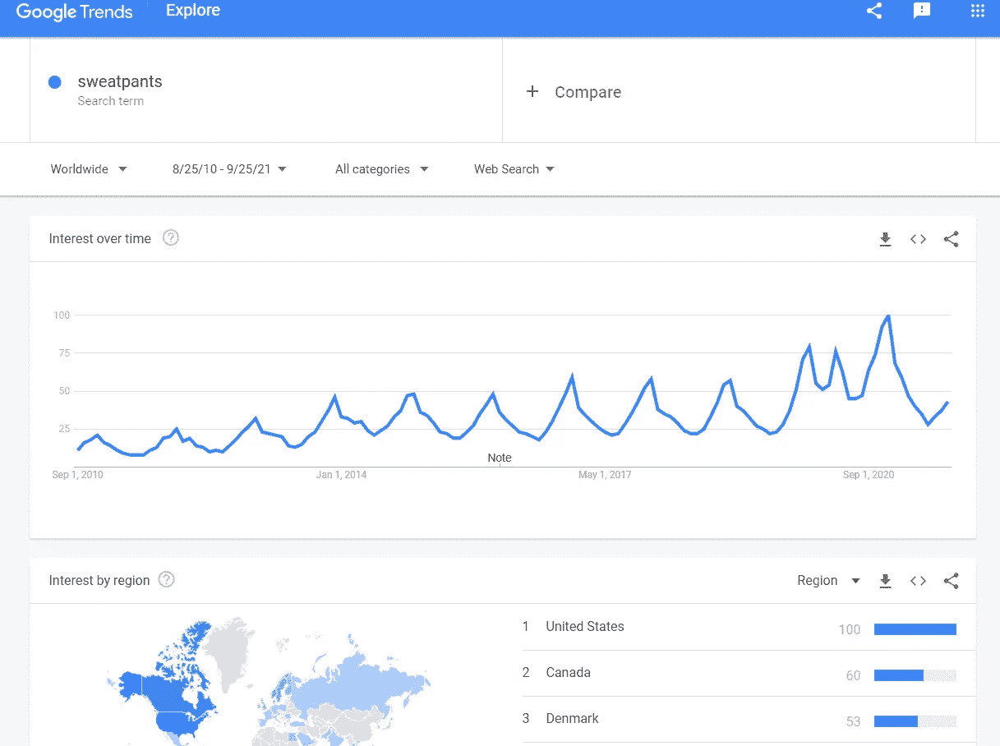

# 0.属国

# 1.数据处理

## 1.1 阅读和争论

从 Google Trends 下载 pants.csv 文件后，我们将其读入 Jupyter 笔记本。

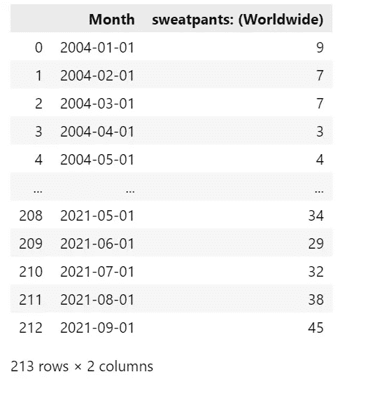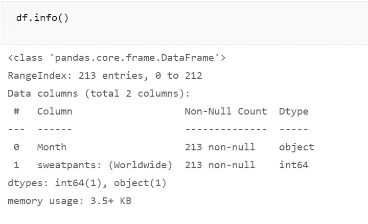

“Month”列已经作为对象/字符串导入，因此我们将其转换为 datetime，然后定义一个索引。

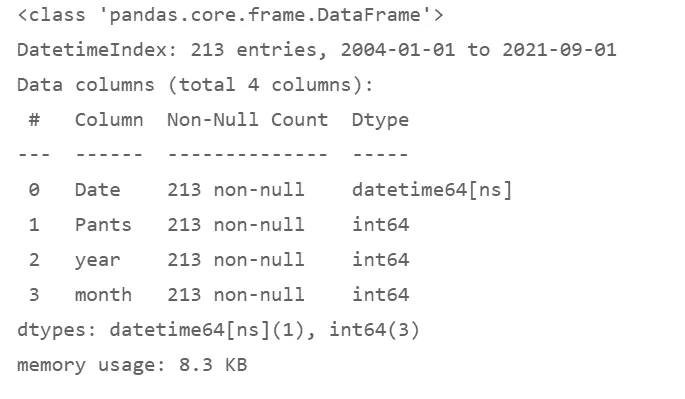

我们的分析仅限于 2010 年以来运动裤时尚的起伏。

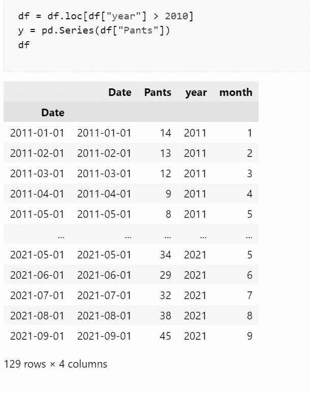

现在我们准备坐下来，开始一些严肃的数据争论，以了解运动裤时尚周期是由什么组成的。

迈克·冯，nsplash.com

## 1.2 视觉分析

**1.2a 图表原始数据**

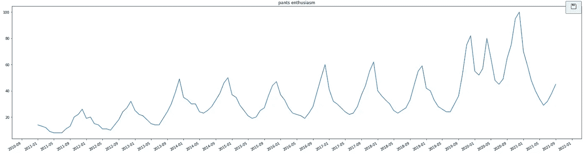

我们观察到一个上升的长期趋势。不可否认，在过去的十年里，文明一直在向悬崖边缘漂移。

我们看到稳定的季节性波动——一直稳定到最近。该模式显示每年都有一个单独的波峰和波谷。

我们还察觉到一种漏斗状的波动模式。峰值和谷值在接近时间线末端时表现出更高的振幅。这表明异方差:方差不是时不变的。

**1.2b 异常值、热图、趋势和季节性**

我们将创建一个数据透视表，从中我们将得到两个图表，这将使我们能够关注时间序列的不同方面。

数据透视表为我们提供了一种聚集、排序和过滤源数据的好方法。

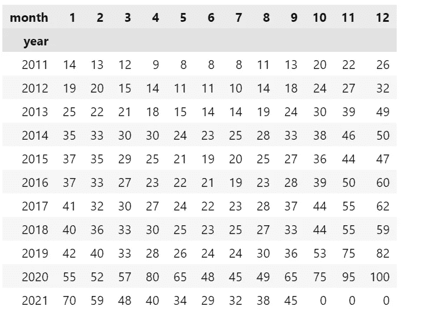

数据透视表显示，运动裤的受欢迎程度在接近年底时会飙升。让我们想象一下热图中宽松裤子的热区。

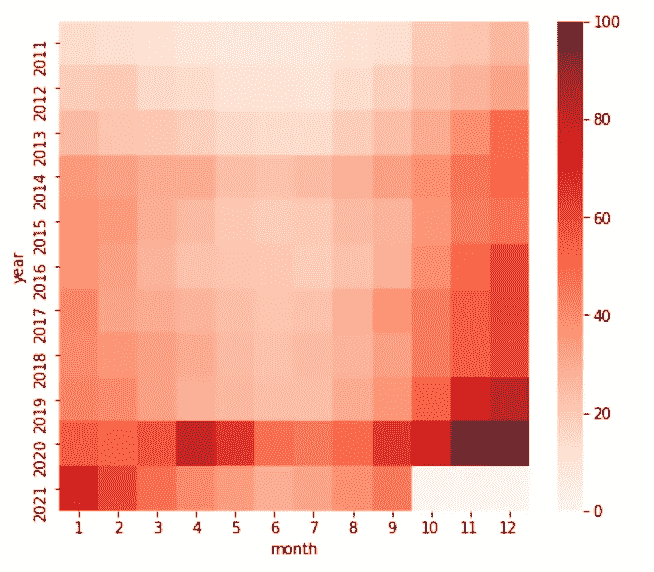

我们在每年 12 月观察到季节性高峰，搜索活动在 10 月和 11 月开始增加。

*   要么人们倾向于在寒冷的仲冬 1 月和 2 月前 3 个月，通过谷歌搜索舒适温暖但不太紧身的舒适服装，为寒冷的季节做好心理准备；
*   或者成堆的包装好的运动裤——不幸的是——真的把圣诞树下的地板弄得乱七八糟。

在 2020 年的热图中，我们可以辨别出运动裤出轨的时刻:2020 年 4-5 月和 2020 年 11/12 月。这些尖峰将成为我们分析的焦点。

让我们想象一下长期趋势。我们取我们的数据透视表，应用聚合函数‘mean’，选择*年*作为数据透视表中的‘index’；然后绘制年利息的逐年趋势。

巴黎时尚沙皇卡尔·拉格费尔德可能会惊呼“末日将至！”十多年来，如果卡尔是对的，我们的文明似乎一直在集体失去对我们生活的控制。

在经历了 2010 年以来不可阻挡的增长路径后，我们在 2020 年达到了裤子宽松的峰值，至少是暂时的。

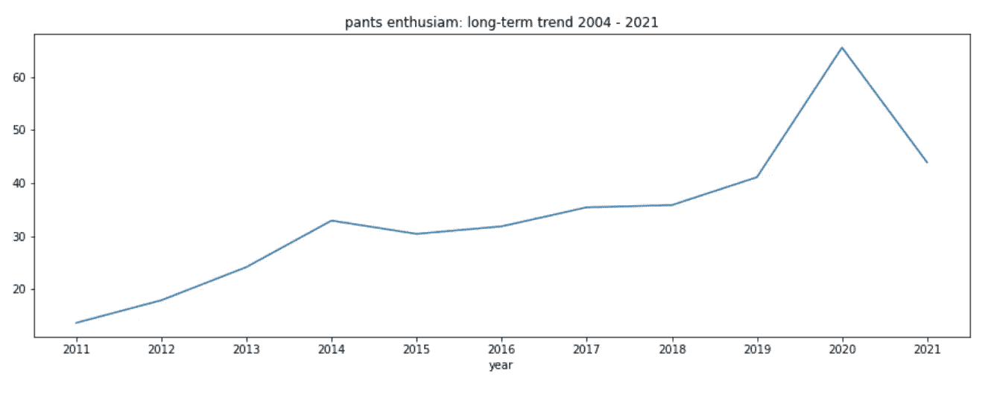

接下来，让我们更仔细地调查源数据中的季节性。我们选择*月*作为数据透视表中的索引，并让该表计算我们的时间序列中所有年份中每个月的平均值；然后画出 12 个月的曲线。

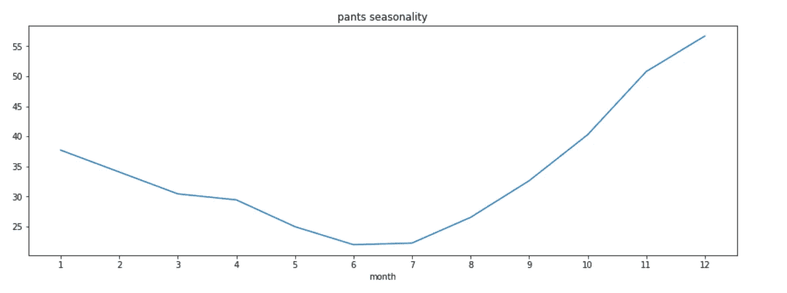

我们在每个第四季度末观察到一个季节性的裤子口袋高峰。该图表明，通常情况下，每年都会在 6 月/7 月出现一个低谷，然后在 12 月出现一个高峰。

总而言之，让我们将时间序列分解为趋势、季节性和残差，并在一个函数中加入相关图(ACF 和 PACF)。

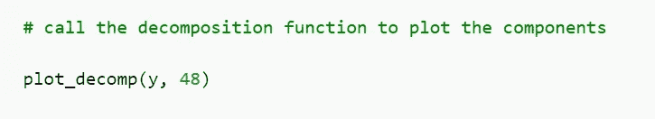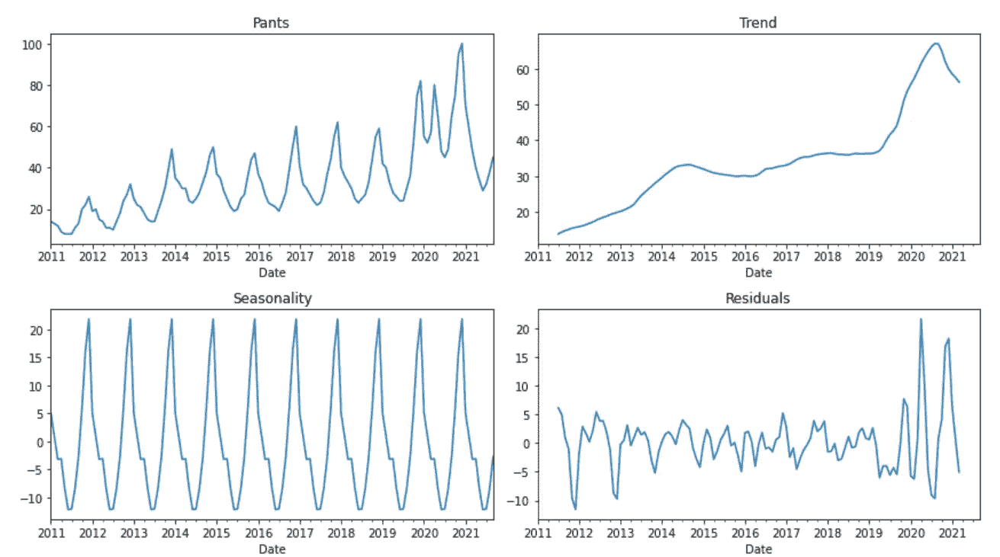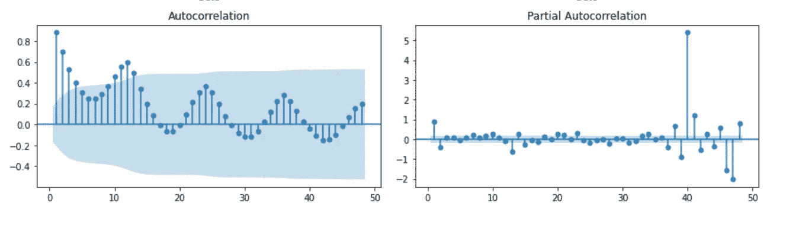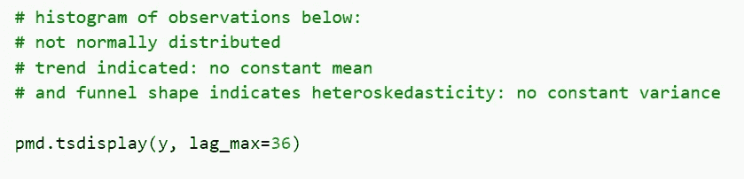

pmdarima 包提供了 tsdisplay 方法来可视化时间序列。除了我们上面创建的图表，tsdisplay 还显示了观察结果的直方图(右下角)。显然，观察值不是正态分布的；他们是左倾的。非正态性不会使我们想要开发的 SARIMA 预测模型无效。但是常态会给我们提供更可靠的预测和置信区间。

更令人担忧的是顶部观察曲线的漏斗形状。加宽的漏斗表明方差不是时不变的，这对于时间序列预测是强制性的。

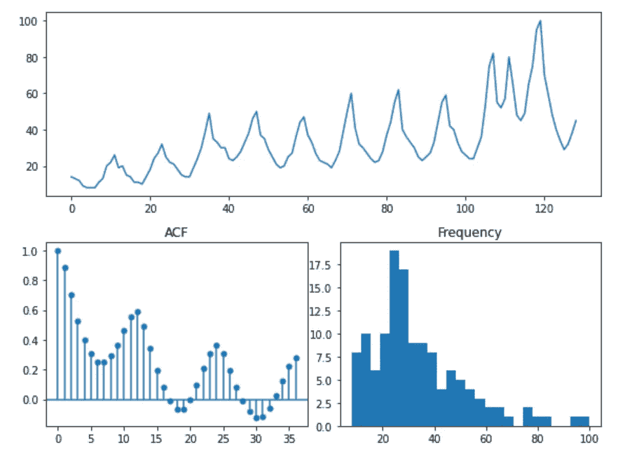

# 2.诊断和转换

## 2.1 同伦方差和正态性

直方图显示的观察值似乎不是正态分布的。让我们运行 scipy.stats 的*常规测试*

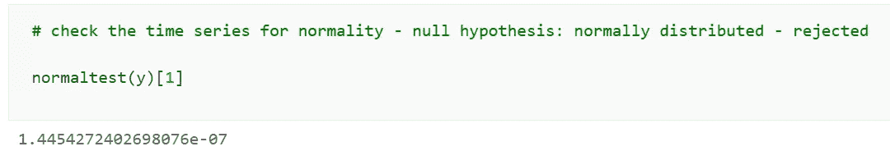

该检验证实了原始时间序列不是正态分布的，其 p 值小得几乎为零。

所以我们不得不坐下来，穿着时髦的黑色运动裤，思考我们的下一步。

迈克·冯，[u](https://unsplash.com/photos/rj8ohjW9RBA)nsplash.com

如果可能的话，我们决定尝试两种变换来解决这两个问题:非正态性和——更迫切的——异方差(非恒定方差)。

**2.1a 对数转换**

首先，我们对观察值进行对数变换。

转换的目的是以缩小其扩张漏斗(减少其异方差)的方式重塑观察曲线；并且理想地还通过调整它们分布的偏斜度和峰度来弯曲曲线，使得它与正态分布的数据更接近地对齐。

拟合预测模型后，我们将能够对预测值进行逆变换，使它们与原始的、未变换的时间序列数据具有可比性。

pmdarima 包提供了 LogEndogTransformer 方法。

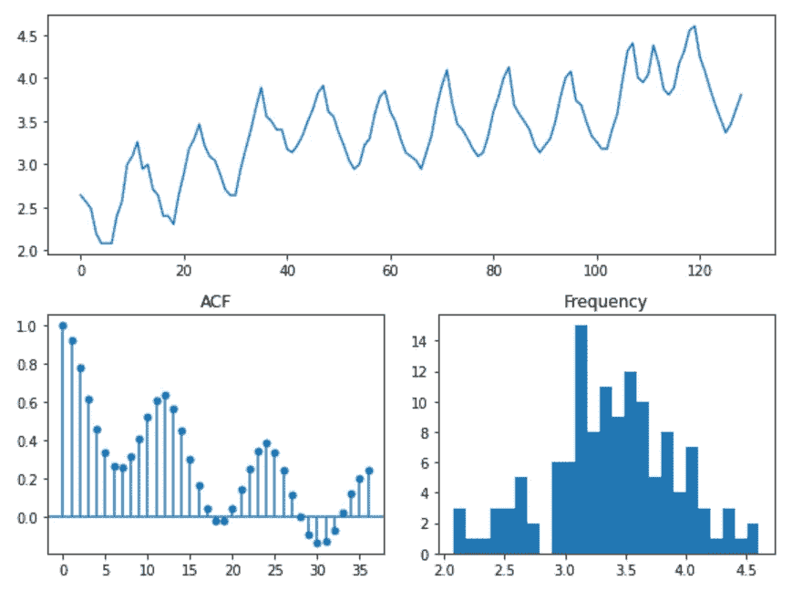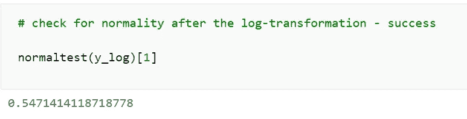

经过对数变换的折线图已经失去了它大部分有关的漏斗形状。方差似乎也是时不变的。直方图类似于正态分布，没有明显的向左或向右倾斜。正态性检验的高 p 值证实了这一点。

**2.1b Box-Cox 变换**

作为对数转换的替代方法，我们运行 Box-Cox 转换器，它通常比对数转换更有效。

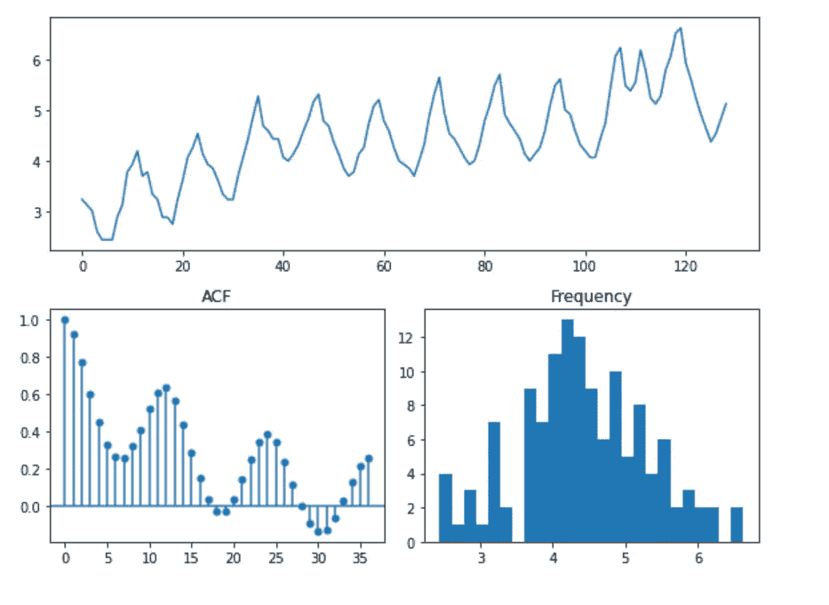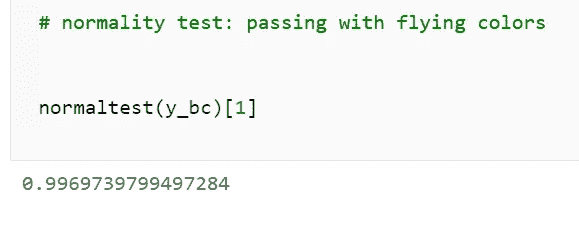

这些图表看起来类似于经过对数变换的序列。正态性检验返回一个更有利的 p 值。

我们将继续讨论 Box-Cox 变换系列。

## 2.2 自相关结构

接下来，我们研究 Box-Cox 变换序列的相关图。

我们在 ACF 中看到一个季节性的模式。因此，时间序列还不是静止的。

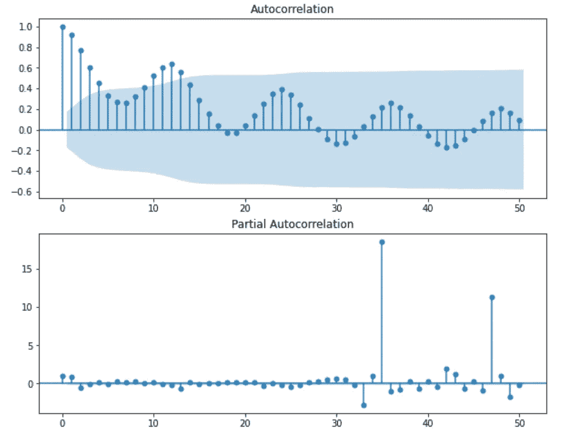

## 2.3 平稳性

如果时间序列的均值、方差和自相关结构不随时间变化，则时间序列是稳定的。如果它们不是时不变的，我们今天用来准备预报的属性将不同于我们明天观察到的属性。一个不稳定的过程会避开我们利用过去的观察来预测未来发展的方法。时间序列本身不需要在过去和未来期间保持平坦、恒定的直线才能被认为是平稳的，但决定其随时间变化的模式需要是平稳的，以使其未来行为可以预测。

时间序列需要展示:

*   非时变均值
*   非时变方差
*   非时变自相关

**变化无常的意思**

显示强劲上升或下降趋势的序列没有恒定的平均值。但是如果它的数据点在扰动后趋向于回复到趋势线，时间序列就是*趋势*-平稳的。通过*差分*时间序列——取观察值 y(t)和早期观察值 y(t-n)之间的差值——我们可以获得*变化*的平稳(均值回复)序列。

具有*季节性*的时间序列将显示出在恒定数量的周期之后重复的模式:一月份的温度与七月份的不同，但是一月份的温度将在几年之间处于相似的水平。*季节差异*是指一个观测值与其前一个观测值之间的差异，即消除了 S 个滞后，S 是一个完整季节的周期数，比如一年 12 个月或一周 7 天。

如果趋势和季节模式都是相对时间不变的，差分时间序列(相对于趋势的第一差分；和相对于季节性的季节性差异)将具有近似恒定的平均值。

在将预测模型拟合到数据之前，所需的差分阶数是应该预先确定的参数。“重要的是要注意，这些信息标准往往不是选择模型差分(d)的适当阶次的良好指南，而只是选择 p 和 q 的值。这是因为差分改变了计算似然性的数据，使得具有不同差分阶次的模型之间的 AIC 值不可比。所以我们需要使用一些其他方法来选择 d，然后我们可以使用 AICc 来选择 p 和 q”(hynd man， [8.6 估计和顺序选择|预测:原则和实践(第二版)(otexts.com)](https://otexts.com/fpp2/arima-estimation.html))。

为了确定是否需要差异，我们可以运行四个测试:

*   一阶差分的增广 Dickey-Fuller ADF
*   科维亚特科夫斯基-菲利普斯-施米特-申 first 获得第一名
*   Osborn-Chui-Smith-Birchenhall OCSB 季节性差异
*   卡诺瓦-汉森季节差异研究中心

**2.3a 一阶差分**

我们使用 pmdarima 的 ADF 和 KPSS 检验来获得建议的一阶差分。

我们有一个矛盾。KPSS 要求 1 阶差分，而 ADF 要求 0 阶差分。

*   如果 ADF 测试没有找到单位根，但是 KPSS 测试找到了，这个序列就是*差分*-平稳的:它仍然需要差分。
*   相反，如果 KPSS 检验没有找到单位根，但是 ADF 检验找到了，那么该序列将被认为是*趋势*-平稳的:它将需要差分(或其他变换，如去趋势)。
*   一般来说:如果测试不一致，我们需要取两个测试结果中较高的*(变量 *n_diff* )作为适当的差分顺序。只有当两个检验都认为数列是平稳的，我们才能避免求差。*

***2.3b 季节差异***

**

*我们对 Box-Cox 变换系列进行 OCSB 和 CH 检验。两种测试都认为不需要季节差异。*

***2.3c 转换后的检查***

*我们结合平稳性的测试结果，并计算一个不同的时间序列。*

*   *下面数据框中的“裤子”一栏包含了关于运动裤流行度的原始谷歌趋势数据。*
*   *列“y_bc”包含经过 Box-Cox 变换的值。*
*   *列“y_bc_diff”显示了差异值和转换值。*

*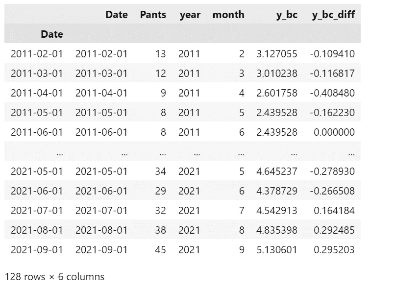**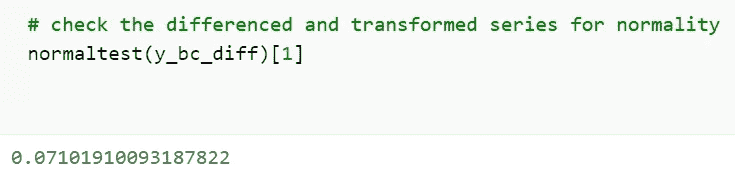*

*最后一轮诊断，现在是差异数据:*

*   *差异数据仍然通过了 p 值高于 0.05 的正态性检验*
*   *平稳性测试并不坚持额外的差分轮次*

*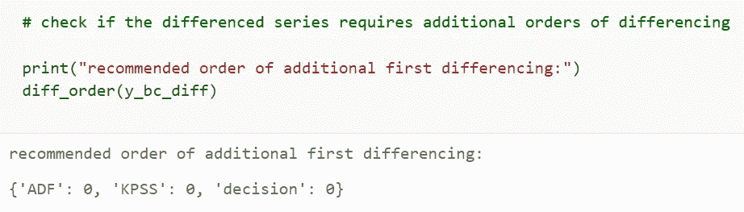*

## *2.4 训练和测试数据集的拆分*

*我们将 Google 趋势观察分为训练数据集和测试数据集。在持续的测试中，我们保留了最后的 24 个月用于测试。*

# *3.萨里玛*

## *3.1 训练:自动 ARIMA 搜索超参数*

*pmdarima 包的 AutoARIMA 方法对 SARIMA 模型中的自回归 AR 项和移动平均 MA 项运行超参数搜索。*

*我们选择逐步搜索，它使用 Hyndman 和 Khandakar 在 2008 年开发的算法([自动时间序列预测:R(r-project.org)](https://cran.r-project.org/web/packages/forecast/vignettes/JSS2008.pdf)的预测包)。该算法比全网格搜索快得多，因为它避免了在搜索空间中处理无意义的参数元组。*

*我们将 AutoARIMA 方法的输入公式化为所谓的管道。管道由我们的 Box-Cox 转换组成(但是如果我们想要包含它们的话，可以包含额外的转换)。管道语法将使我们能够在计算预测时对模型结果进行逆变换。*

*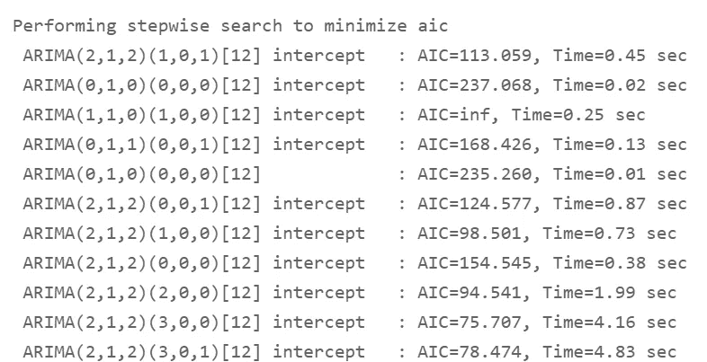**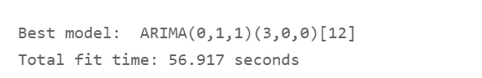**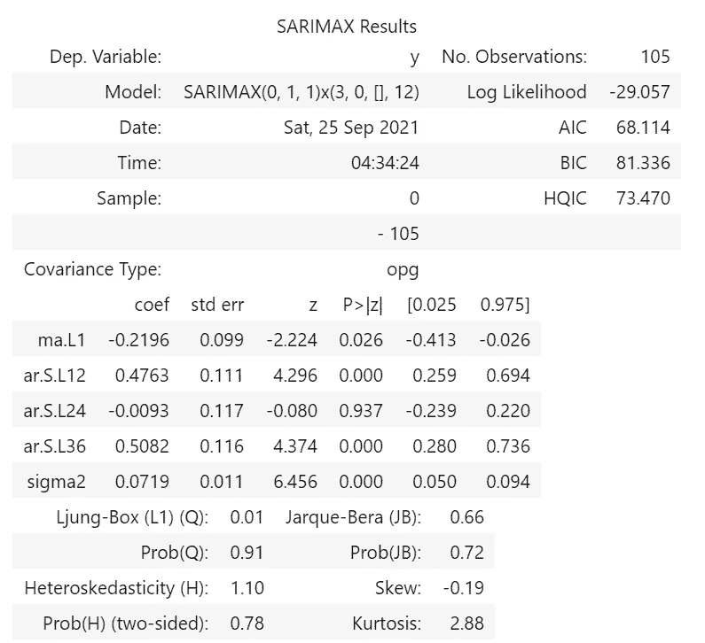*

***模型摘要**显示了优秀的诊断结果:*

*   ***Ljung-Box 测试**返回非常高的 p 值 0.91。所以残差代表*白噪声*。它们不包含萨里玛模型未能发现的信号，而这些信号本可以用来提高其预测的准确性。*
*   ***Jarque-Bera 正态性检验**得出非常高的 p 值 0.72。偏斜度接近 0，峰度接近 3，因为它们应该类似于标准的正态分布。因此，我们得出结论，残差是正态分布的。预测值和置信区间将比具有可疑正态性的残差更可靠。*
*   ***异方差测试**得出非常高的 p 值 0.78。我们得出结论，残差具有恒定的方差。*
*   *大部分的**萨里玛参数**都有远离零的系数，所以它们的影响是不可忽略的。第二个季节性 AR 术语 *ar 是个例外。S.L24* ，其系数接近于 0，具有跨越零的宽置信区间。它的 SAR 项也显示出非常高的 p 值。我们的结论是，第二个 SAR 术语可能应该跳过。它对模型的贡献不大。*

## *3.2 预测准确性指标*

*我们定义了一些预测准确性指标，这将使我们能够将我们刚刚准备的训练数据集的 SARIMA 模型与即将到来的样本外预测进行比较。*

*我们用公式来填充字典:*

*   *平均绝对误差(MAE)，*
*   *平均绝对百分比误差(MAPE)，*
*   *均方根误差(RMSE)和*
*   *预测值和观测值之间的相关性*

## *3.3 训练:样本内预测*

*pmdarima 的 *predict_in_sample* 方法将拟合的 SARIMA(0，1，1)x(3，0，0)(12)模型应用于我们培训期间的月份。*

*参数 *inverse_transform* 告知该方法以与原始时间序列相似的结构提供预测值及其置信区间:预测值不会被报告为 Box-Cox 变换值。*

*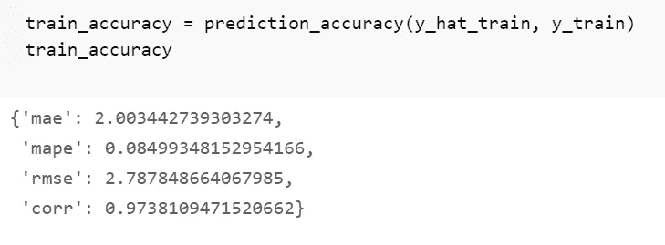*

*训练数据集的预测精度不会太差。*

*自动安装的 SARIMA 模型已经捕获了 ca。91.5%的历史运动裤流行度起伏:平均绝对百分比误差 MAPE 相当于预测值和实际值之间的 8.5%的差异。8.5 %由随机波动组成，模型无法提取稳定的模式。*

*均方根误差 RMSE 是残差的标准偏差。RMSE 讲述了预测与实际观测曲线的紧密程度。*

*预测值和实际值之间的(线性)相关性为 97%。*

## *3.4 测试:测试数据集的预测*

*接下来，我们在测试数据集中运行相同的 SARIMA 模型 24 个月。*

*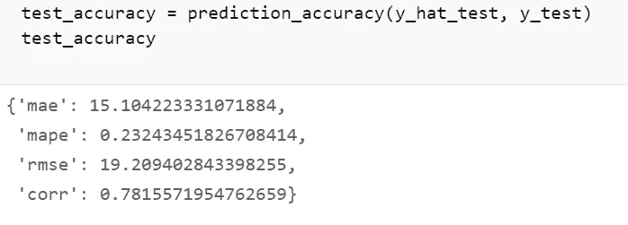*

*我们得到的预测准确度要差得多。MAPE 现在达到了 23%。预测和实际观测的相关性从 97%下降到 78%。*

*那么，在 2020-2021 年，是什么在困扰着我们的萨里玛模式呢？*

*训练和测试数据集之间预测准确性的巨大差异通常意味着*过度拟合*。*

*   **欠拟合*的模型在拟合的训练数据集和测试数据集中都会表现出较低的精度。*
*   **过度拟合*的模型将在训练数据集中呈现高精度，但是处理新数据(例如测试数据集中的数据)的能力很差。*

*在我们发布的*运动裤案例中，*一旦 2020 年 4 月在家工作月开始，时间序列在之前 10 年遵循的模式不再适用。这意味着一个过度拟合模型，但过度拟合是不可避免的，因为 2020 年的中断无法从训练数据集中的 2010-2019 年历史数据中分离出来作为一种可预测的模式。*

## *3.5 2020 年，过去的模式将不复存在*

*让我们回顾一下我们在源数据调查中创建的热图。我们注意到 2020 年是不同寻常的一年，*

*   *2020 年 4 月至 5 月，运动裤的谷歌搜索出现了不寻常的“非季节性”高峰；*
*   *另一个高峰出现在 2020 年 11 月/12 月，这与前几年的季节模式更相似，但作为一个热门时尚项目，它的*增幅远远高于前几个冬季。**

*我们不能仅从谷歌趋势数据中提取原因。但 2020 年的这种模式表明，4 月份对运动裤的兴趣飙升，当时许多人不得不挤在家里温暖的笔记本电脑屏幕周围，而不是继续早晚通勤去工作场所。显然，我们大多数人选择不穿正式的办公室服装，而是坐在餐桌旁敲键盘。*

*在 2020 年 11 月至 12 月，我们观察到运动裤欢呼的幅度高于往常，这可能是因为新冠肺炎病例在 2021 年初疫苗上市前的几个月里快速上升。在 2020 年的秋天，人们可能已经预料到不得不撤回到他们家的洞穴里度过一个漫长而可怕的冬天。*

*从我们的数据科学工具箱中，我们可以拉出用于*协整* & *格兰杰因果关系(* [格兰杰因果关系)的测试工具包。如果我们比较 2020 年在家工作和运动裤受欢迎的程度，我希望看到一些重要的格兰杰因果关系。](/sibling-rivalry-and-cointegration-in-the-game-of-thrones-8642466fa2f2)*

*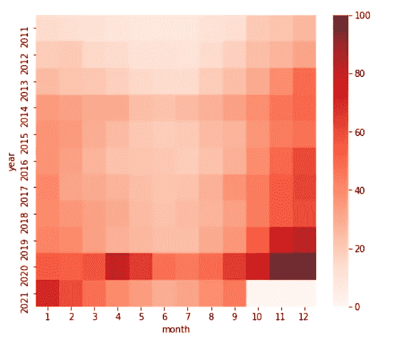*

*我们的下一步是什么？*

*让我们调查一下*在家工作*的突然兴起对过去十年一直有效的时间序列模式造成了多大的破坏。*

# *4.2020 年的可预测趋势与趋势突变*

## *4.1 将 SARIMA 模型训练到断点*

*从我们的谷歌趋势原始数据 2010 年至 2021 年，我们切下了一个训练数据集，该数据集于 2020 年 3 月结束，就在封锁和在家工作的惯例建立新的现实之前。*

*我们将新的 SARIMA 模型拟合到代表旧常态的训练数据集。*

*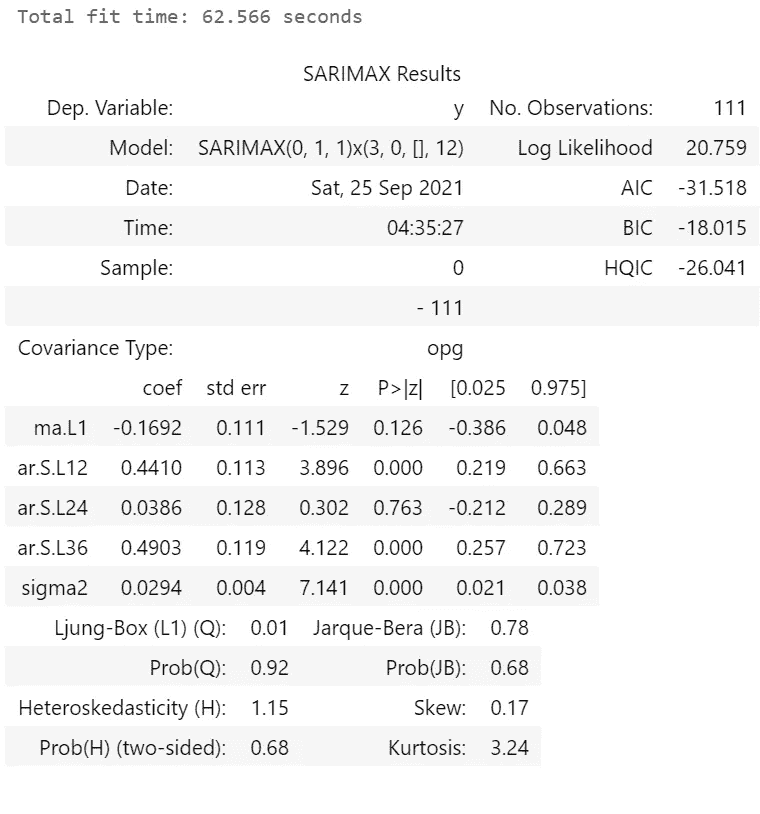*

*然后我们对 2020 年 4 月以来的几个月进行预测。*

*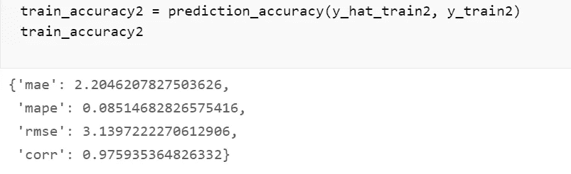*

*新的训练模型返回到 2020 年 3 月运动裤流行的预测。*

## *4.2 在 2020 年 4 月的转折点之后测试 SARIMA 模型*

*让我们看看运动裤在 2020 年 3 月后不受新冠肺炎影响的另一个宇宙中会如何发展。*

*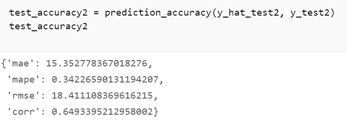*

*正如预期的那样，预测精度相当差，说明 Covid 的破坏从 2020 年 4 月开始将宽松裤趋势置于一条非常不同的、不可预见的道路上。*

## *4.3 自 2020 年 4 月以来不可预见的“在家工作”影响*

*为了辨别新冠肺炎对运动裤时尚角落的影响程度，让我们比较一下 2020 年 4 月后在那个替代宇宙中的预测和在我们的宇宙中发生的事情。*

*   *我们可以看到 2011 年至 2020 年第一季度间，萨里玛预测(橙色)与实际观测(蓝色)的接近程度。*
*   *在 2020 年第二季度初，运动裤突然出现了额外的蓝色尖峰，这在任何季节模式中都从未出现过。未预料到的 4 月/5 月峰值导致了我们预测指标报告的大部分不准确性。*
*   *SARIMA 模型确实预测了 2020 年 11 月+12 月的峰值。*
*   *然而，该模型没有预见到运动裤会在 2021 年，也就是新年伊始之后，突然流行起来；甚至在许多在家工作的安排被改变之前。*
*   *我们可以推测，家庭已经在 2020 年储备了运动裤。到 2021 年 1 月，他们在接下来的 2 到 3 年里都有宽松的裤装。所以对运动裤的寻找在 2021 年失去了紧迫性。*
*   *运动裤行业在 2020 年蓬勃发展，随后在 2021 年初陷入萧条。*

*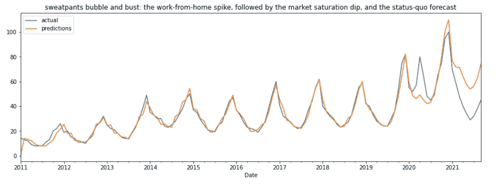*

*下一步可能是进行干预分析，分离出在家工作的影响，例如将其定义为外生变量*

*但我们今天不会这么做。相反，我们会把穿着宽松衣服的腿翘起来小睡一会儿。*

**

*迈克·冯，nsplash.com*