# 用于无监督任务解决的瑞士军刀

> 原文：<https://towardsdatascience.com/swiss-army-knife-for-unsupervised-task-solving-26f9acf7c023?source=collection_archive---------26----------------------->

## 伯特是从业者工具箱中的一个额外奖励

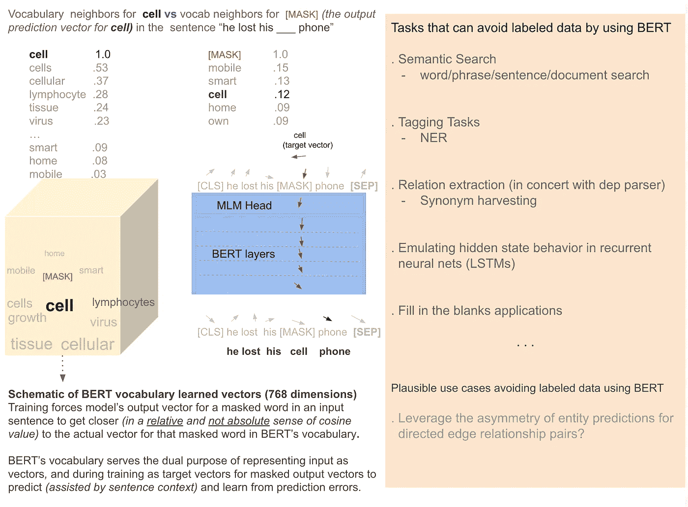

**图一。除了对下游任务进行微调这一众所周知的用途之外，BERT 成为从业者工具箱中一个有价值的补充的原因很少。** (1) BERT 学习的向量词汇(比如 768 维空间中)用作**目标**，屏蔽输出向量在训练期间预测并从预测误差中学习。在训练之后，这些移动目标被安置到**标志**中，这些标志可以被聚集和注释(一次性步骤),并用于在各种任务中对模型输出向量进行分类 After、关系提取等。(2)预训练足以实现低下一个句子预测损失(除了屏蔽词预测损失之外)的模型产生代表任何输入术语/短语/句子的高质量 CLS 向量。CLS 矢量需要从 MLM 头部获取，而不是从最顶层获取，以获得输入的最佳可能表示(如下图)。(3) MLM 头解码器偏差值是词汇表检索词的重要性的有用分数，并且相当于词汇表检索词的 TF-IDF 分数。(4)在大多数情况下，除了用于 NER 标记之外，BERT 间接通过该位置的词汇单词替换来预测句子中单词的实体类型的能力可以是非常方便的。偶尔，对位置的预测甚至可能是正确的实例，但是这对于任何实际应用通常都是不可靠的。(5)任何输入术语/短语(及其拼写错误的变体)的矢量表示，或者直接从 BERT 的学习词汇中获取，或者使用 CLS 创建，在很大程度上包含了先前模型如 word2vec、Fasttext 的上下文无关矢量，使得 BERT 成为获取上下文相关矢量和上下文无关矢量的一站式商店。唯一的例外是输入的表示涉及 BERT 词汇表中不存在的字符(例如，精心选择的自定义 BERT 词汇表，以避免来自应用领域之外的语言，如中文、泰米尔语等)。).获取这些好处的核心是如何在我们的应用程序感兴趣的特定领域语料库上使用自定义词汇表对模型进行预训练。**作者创建的图像**

# TL；速度三角形定位法(dead reckoning)

传统上需要标记数据的自然语言处理任务可以通过利用 BERT 模型的自监督学习来完全或部分地解决，而不需要标记数据，只要这些任务本身被完全或部分地视为相似性度量问题。

除了语义搜索*(这是固有的相似性度量)*之外，可以完全被视为相似性度量问题的任务的例子是像 NER 这样的序列标记问题。虽然某些种类的句子分类任务可以被视为相似性度量问题，但是情感分类不能利用相似性度量，给定的 BERT 模型不考虑概念的负面或正面情感而对其进行聚类，并且即使给定完整的句子上下文也不能可靠地将它们分开。收获一个不基于相似性度量*(例如依赖解析器)*的图，也在 [*的范围之外(尽管有可能收获一个具有监督学习的转换的依赖图)*](https://nlp.stanford.edu/pubs/hewitt2019structural.pdf) 。然而，与相似性度量*(用于检测实体类型，依赖解析器边缘链接)*一起使用的依赖解析器可以用于关系提取。

这篇文章回顾了一些任务，在这些任务中，BERT 的自我监督学习被用来完全或部分地解决一个任务。这些任务通常通过微调 BERT(它在 NLP 任务解决中的主要用途)使用标记数据来解决。

# 是什么让伯特成为了瑞士军刀？

一般来说，网上有关于 BERT 和 transformer 模型的优秀详细文章。

本节的重点是 BERT 的内部工作原理，它可以用来避免传统的监督 NLP 任务中的标记数据。

从头开始预训练 BERT 模型之前的关键步骤是选择最能代表用于训练的语料库的词汇。这通常是由字符、完整单词和部分单词*(子单词)*组成的大约 30，000 个术语，它们可以被拼接以组成完整的单词。模型的任何输入都将使用这大约 30，000 个术语*构建(如果输入包含一个不能分解成这 30，000 个术语的术语，它将被表示为一个特殊的未知标记，也是这个集合的一部分。一个例子是说一个在 30k 集合中不存在的汉字)*。

在训练期间，

*   该模型学习其词汇表中所有术语的向量表示。当每个句子被输入到模型中时，通过将输入训练语料库中的句子分解成词汇表中的术语*(标记化)*来促进这种学习。在训练之前，模型从其词汇表中的每个术语的随机向量表示开始，由于这些向量的高维度*(例如，768)* ，使得它们[几乎彼此正交](/maximizing-bert-model-performance-539c762132ab) *(本质上是一种密集表示，其行为类似于一个热点向量，其中每个词汇表术语被唯一地表示，并且几乎与所有其他术语正交)。*
*   该模型学习由 BERT 模型的所有层组成的转换。这个学习转换*(本质上是学习实现转换的权重)*，是一个函数，它接收表示输入句子*(前面提到的向量)*中每个符号化术语的向量，并为每个输入向量产生转换后的输出向量。在训练期间，大约 15%的那些输入向量被占位符向量或者被另一个单词*(从词汇表中随机选取)*的向量替换，并且强制转换以产生输出向量*(利用输入句子中其他向量提供的上下文)*，该输出向量可以相对于其他词汇表向量被评分，以预测被替换的相同原始向量。输出向量和被屏蔽/替换的原始向量之间的余弦距离是确定分数的关键因素。*与直觉相反，屏蔽/替换位置的最高得分输出向量和实际词汇向量(被预测的向量)之间的角度可以更接近正交而不是共线——即，相隔高达 80 度。然而相对于其他词汇向量，它仍然使输出向量成为最佳预测(图 5)* 。
*   一个关键事实是词汇项的向量表示和模型转换权重是同时学习的。乍一看，这似乎很奇怪，因为转换的学习依赖于词汇向量，这些词汇向量既作为输出端的参考向量，又在输入端表示句子，而这些词汇向量本身是不断变化的。这种同步学习方法是可行的，因为在训练过程中，句子中很少的标记被占位符/随机单词向量取代 *(~15%)* 。因此，通过从输入端参与替换向量的预测，每个词汇向量比其自身在输出端被用作参考向量以使变换后的替换向量向其靠拢的机会多得多。一旦训练完成，这些词汇向量就作为静态标志向量来推断输出向量的含义，这将在下面详细解释。
*   另一个有趣的事实是，即使单词的相同目标向量用于影响单词的上下文不同含义的学习，词汇表中捕捉上下文不同含义的单词向量也不一定在一个群集中混合在一起——这是一个有用的属性，在下面描述的无监督应用中被利用。例如，词汇向量空间中单词**细胞** *(在用生物医学领域语料库上的自定义词汇从头开始预训练的模型中)*的余弦邻域主要是生物学术语*(图 4)* 。术语捕捉到了另外的含义*(细胞* ***电话*** *，* ***监狱*** *细胞)*远离向量**细胞**。这与像 [word2vec](https://www.quora.com/How-does-word2vec-work-Can-someone-walk-through-a-specific-example/answer/Ajit-Rajasekharan) 这样的模型形成了鲜明的对比，在这种模型中，一个单词的所有义项*(含义)*将混合在顶部邻域中。然而，在某些情况下，词义的混合也可以在潜在的习得词汇中观察到，如 word2vec 模型。例如，学习词汇向量空间中的余弦邻域，对于术语 **her** 来说，是两种意义的混合——代词和基因——**his，she，hers，erbb，her2** *(图 2)* **。**这是一个事实的结果，即在一个未装箱的模型中，**HER**——一个基因，被转换成 **her，**增加了与代词 **her** 的歧义。然而，转换仍然根据句子上下文*(这是假设两个不同意思的句子上下文是不同的)*来分离这些意义。总之，对于输入句子中的每个术语，学习转换通过利用句子上下文，为屏蔽/替换的术语找到新的向量，相对于该向量，词汇向量空间中的余弦邻域由语义相似的术语组成，而不管屏蔽术语的语义不同的含义在词汇向量空间中被群集或分离的事实*(尽管在大多数情况下，在良好训练的模型中，词汇向量群集倾向于捕获单个实体意义，达到一定的粒度水平)*

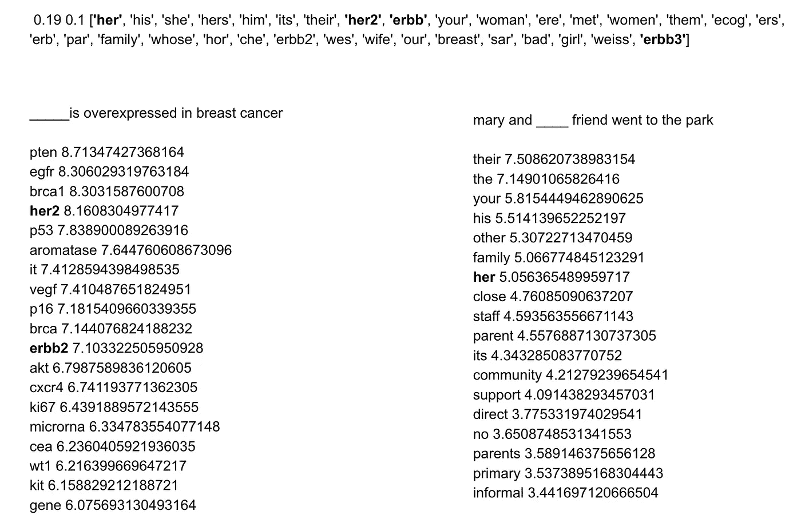

**图二**。根据从医学语料库创建的词汇表创建的聚类，并且根据在医学语料库上训练的模型创建其向量。聚类反映了实体类型的混合—代词和基因。这是因为“ **her** ”这个词——大写形式通常指的是基因。无案例模型增加了模糊性。尽管在词汇向量空间中存在这种实体类型的混合，但是所学习的转换在使用句子上下文的句子中的屏蔽位置的模型输出中清楚地分离了这些意义。例如，第一句中的空白位置在基因上下文中，第二句中的空白位置在代词上下文中。**作者创造的形象**

人们可以在一个句子中看到完整的转换，其中一个**单元**的所有不同含义都基于它在句子中的位置/上下文出现。注意力——转型的一个关键组成部分是实现这一目标的核心。通过对单元的每个出现执行句子*(其中权重不是静态学习的权重，而是作为句子中的单词的函数创建的动态权重)*中的特定术语的加权求和，捕获单词**单元**的不同上下文含义。

> 他带着一部**细胞**手机去监狱**细胞**从犯人身上抽取血液**细胞**样本

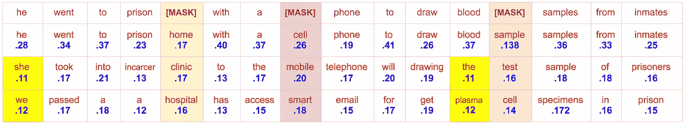

**图 3。**接近某个位置的模型输出向量的前三个词汇向量。请注意，余弦距离值非常小，向量更接近于正交，而不是共线。黄色突出显示的单元格反映了输出分数受到词汇向量偏差或词汇向量幅度影响的情况，如下图 13 所示。作者创造的形象

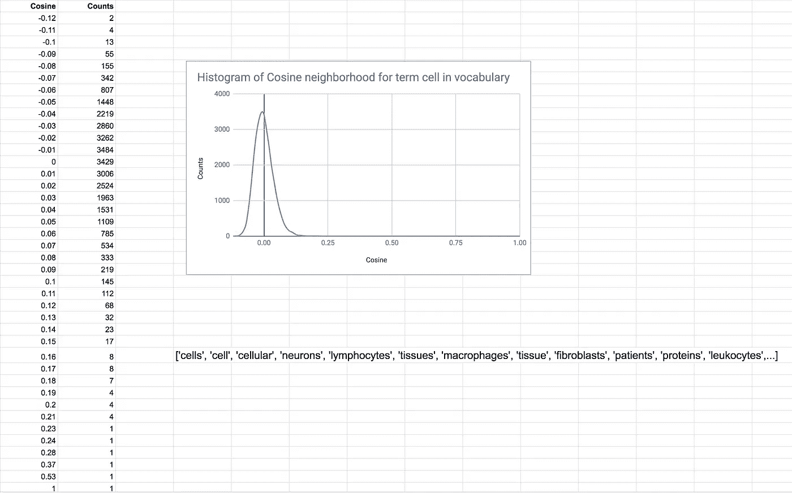

**图 4。**术语**单元格**与 BERT 模型词汇表中其他单词之间的余弦距离值直方图。对于**细胞**来说，最接近矢量的邻居很大程度上是由生物学术语组成的。一位数计数尾部从 0.53 的余弦距离(忽略 1)一直延伸到 0.16 的余弦距离(80 度)。**作者创作的图片**

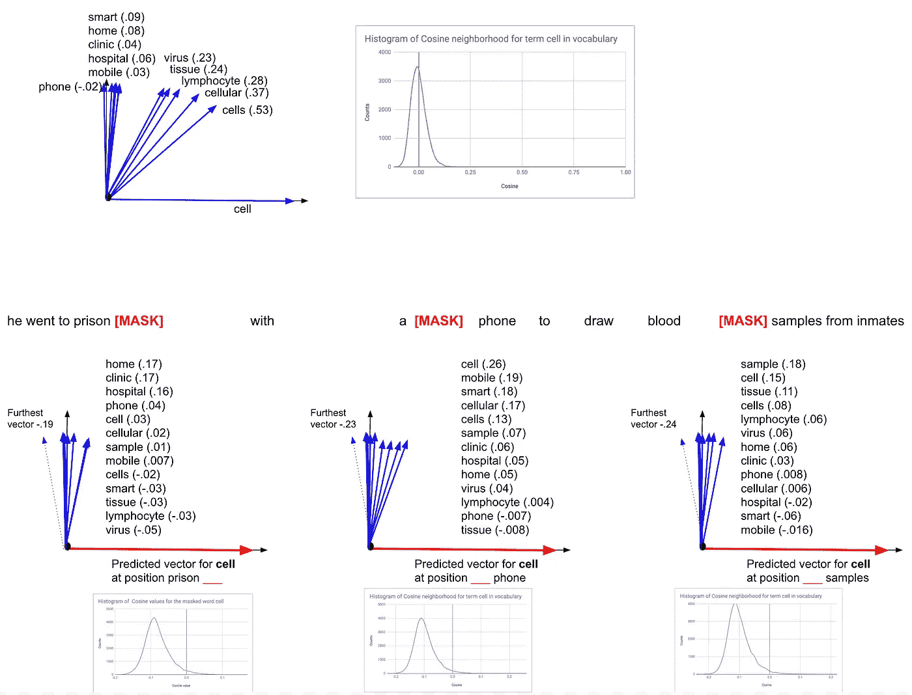

**图 5。**上半部分显示了与图 4 相同的词汇向量单元邻域的直方图。它还显示了捕捉单词 cell 的三种不同“感觉”的选择术语的余弦距离——生物感觉、“房间/位置”感觉和电话感觉。捕捉生物意义的术语在尾部，更接近于**细胞**的向量。**单元格**的向量沿着 x 轴。单词**细胞**的另外两个意义几乎与**细胞**向量正交，并且与生物学意义完全分离。下半部分示出了句子“他去监狱**细胞**用**细胞**电话从囚犯身上抽取血液**细胞**样本”中三个屏蔽位置的模型输出向量的顶部余弦邻居。请注意，尽管三个位置的最接近词汇向量反映了术语**单元格**的不同含义，但这些词汇向量几乎与输出向量正交(沿 x 轴显示为红色)。然而，所有位置的直方图分布具有明显的尾部，其中顶部预测与其余项分离得很好。尽管事实上所有的词汇向量都存在于大约. 19 到大约. 24 的小范围内。该模型的学习转换在词汇向量空间中找到有利点，在该空间中，捕获被屏蔽术语的含义的向量在相对意义上而不是余弦值的绝对意义上更接近于输出向量。**作者创建的图像**

上述使 BERT 成为瑞士军刀的训练过程的结果是，词汇向量在很大程度上形成实体特定的簇以及捕获句法相似性的簇。这些聚类的性质受到其被训练的语料库以及训练过程的超参数的影响，例如批量大小、学习速率、训练步骤的数量等。这些集群可以基于感兴趣的应用的*(集群的细节在下面的附加注释中)*进行标记——一次性过程。与学习转换结合使用，它们有助于将传统标记的数据问题转换为无监督的任务。

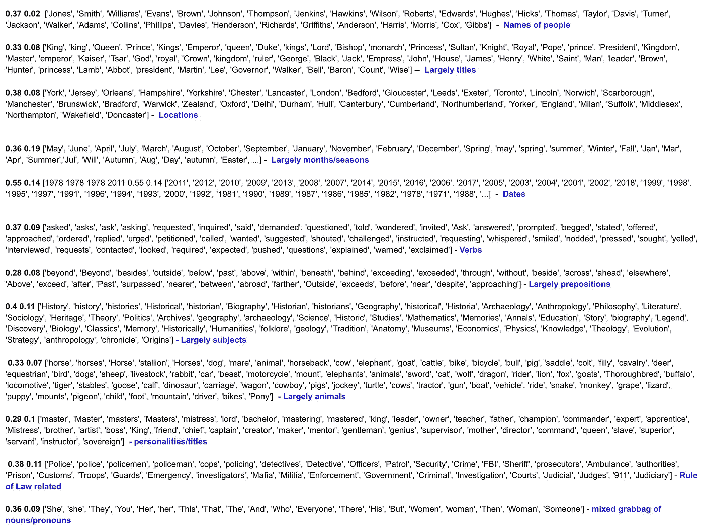

**图 6。**根据 BERT 大型案例模型和词汇创建的聚类。实体类型反映了模型被训练的语料库的性质。**作者创建的图像**

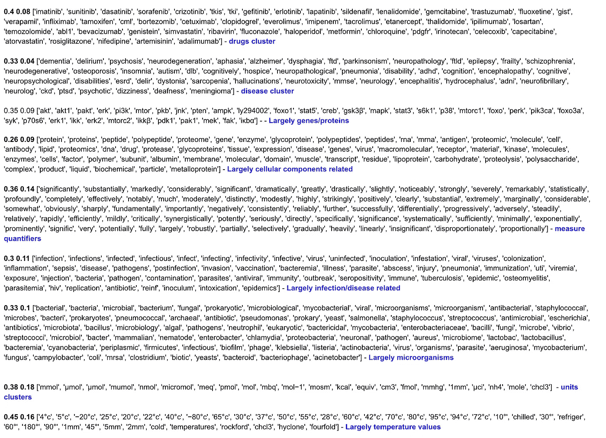

**图 7。**从词汇表创建的聚类，该词汇表是从医学语料库创建的，并且其向量是从医学语料库上训练的模型创建的。注释显示了生物性质的主要实体类型。**作者创造的形象**

# 句子中术语的无监督标注

无监督的 NER，[在本文](/unsupervised-ner-using-bert-2d7af5f90b8a)中详细解释，简单地利用经过训练的 BERT 模型词汇的聚类属性来标记模型对句子中术语的预测。

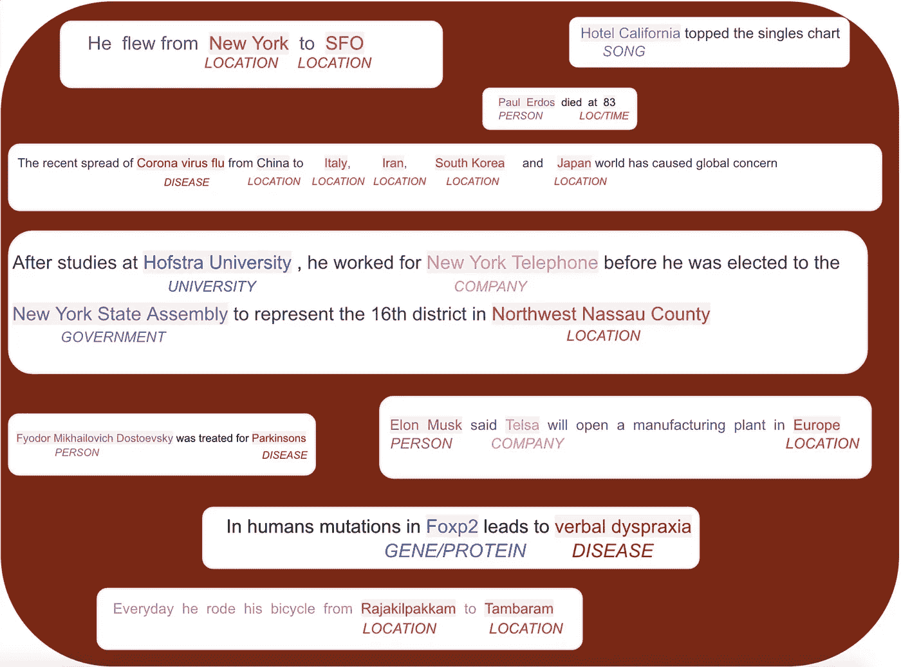

**图 8** 。[使用 BERT 的无监督 NER。](/unsupervised-ner-using-bert-2d7af5f90b8a) **作者创建的图像**

应该可以将相同的方法应用于无监督的位置，至少对于一些粗粒度的标记类型，可以通过 BERT 词汇表的不同集群来区分。标签的单数和复数版本将无法区分，因为它们将聚集在同一组中。在这种情况下，转换不能将它们分开，因为单数和复数版本的句子上下文几乎相同。

# 无监督短语/句子表示

在评估预训练模型的向量时，一个不可错过的关键细节是从获取模型输出向量的*。正确的地方是从蒙面 MLM 头*(在一个 PyTorch 垃圾场捕获的 cls.predictions)* 。这是因为在预测输出向量之前，在报头中还有一个变换。这种转换在随后的微调中被忽略，这是应该的，但对于评估或直接使用预训练的输出向量是关键的。本文中的无监督任务直接或间接利用来自 MLM 头*(对于包括【CLS】)的所有记号)*的矢量输出，而不是最顶层矢量。*

通常直接使用模型的预训练输出向量的一个任务是[CLS]向量。该向量通过预测输入*中的下一个句子来学习整个句子的表示(训练期间模型的所有输入都是句子对，带有指示两个句子是否相邻的标志)*。在给定上述 MLM 头中的额外变换的情况下，从 MLM 头而不是最顶层收获该向量来表示句子在性能上产生了差异。

在预训练之后从 MLM 头部，特别是从具有高下一句预测准确度的模型中收获的[CLS]向量可以用于表示单词、短语或句子。这有一些优点

*   它扩展了模型为无限词汇有效创建表示的能力*(注意将基本词汇中不存在的符号表示为特殊的[UNK]标记)*
*   与其他通常不透明的习得句子表示不同，这种表示在某种程度上是可解释的——我们可以通过检查伯特词汇中向量的邻域项(或伯特词汇的簇)来了解[CLS]表示正在捕捉什么。如下所述，学习的模型偏置权重对于加权这样的邻域来说很方便。

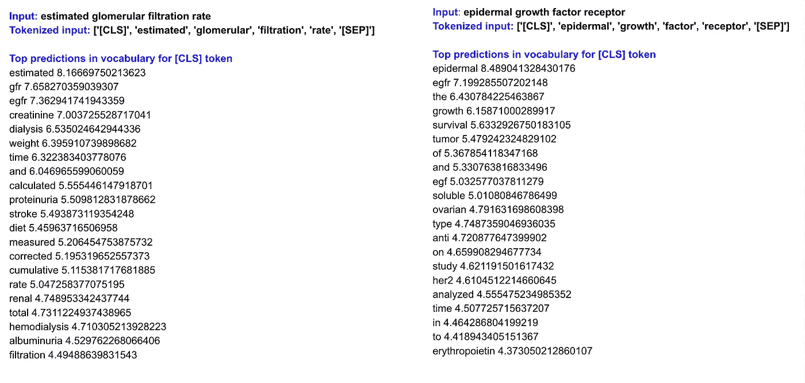

**图 9a。**在给定输入短语“估计肾小球滤过率”和“表皮生长因子受体”的情况下，【CLS】令牌的邻域术语。句子表示的质量反映在这些邻域中，第一个邻域将输入短语反映为度量，第二个邻域将输入短语反映为蛋白质。然而，这两个词在语义上都有**EGFR**——这是这两个短语共有的首字母缩写词。[CLS]代表是从 MLM 头上收获的。**作者创作的图片**

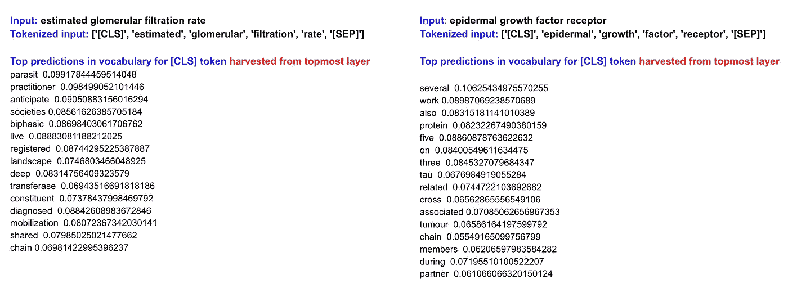

**图 9b。**对于图 9a 中的两个短语，从最顶层收获的[CLS]术语的邻域。邻域的质量是一个典型的例子，说明了当使用这个[CLS]向量时句子表示评估产生差的结果的原因。**作者创建的图像**

*顺便说一句，在创建句子表示时，与 MLM 头部相反，在少数论文和公开可用的实现(参考下文)中，CLS 的输出似乎过早地从最高层收获。这可能是[CLS]向量在此类评估中表现不佳的部分原因(这一说法需要通过用 STS 这样的基准测试来证实)。*当使用从头部获得的 CLS 表示时，我们可以原样使用它，而无需归一化来在底层词汇中寻找邻居。然而，*如果我们使用它来寻找句子邻居，为了更好的邻居质量，我们需要规范化它*。

# 其他应用

## 关系抽取

如果我们认为关系是短语的三元组 *(e1，relation，e2)* ，潜在地出现在三元组的任何排列中，则实体 e1 和 e2 的识别可以使用上述的无监督 NER 来完成。关系的识别可以通过选择词汇空间中表征特定关系的术语来完成——一次性步骤。需要依赖分析器来识别句子中的三元组并找到关系边界，特别是当关系出现在前缀*(关系 e1 e2)* 或后缀形式 *(e1 e2 关系)*中时。这种方法用于[收获同义词，如本文](/unsupervised-synonym-harvesting-d592eaaf3c15)所述。另一个看似合理的用例不一定是提取关系，而是识别句子中的关系类型，以便对句子进行分类。

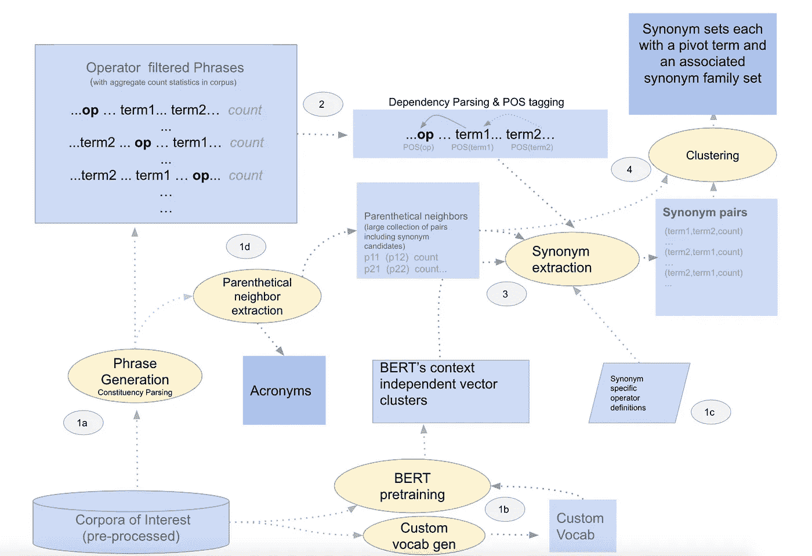

**图 10。** [作者创建的无监督同义词采集](/unsupervised-synonym-harvesting-d592eaaf3c15) **图像**

## 模拟 RNN 的隐藏状态行为

[CLS]向量可用于在每个时间步用 BERT 模拟 RNN 的隐藏状态，BERT 只是一个变换器编码器-当使用变换器时，该功能通常需要编码器和解码器*(例如在翻译中)*。这在具有时间输入流的应用中可能是有用的。这用下面的几个玩具句子的部分和完整版本来说明*(图 11a-11d)* ，其中【CLS】向量的邻域很大程度上反映了输入中重要实体的语义相关术语。然而，这可能只是粗略的近似，给定基于 RNN 的语言模型的自回归训练赋予其生成能力，而像 BERT 这样的自动编码器模型显然缺乏这种能力。

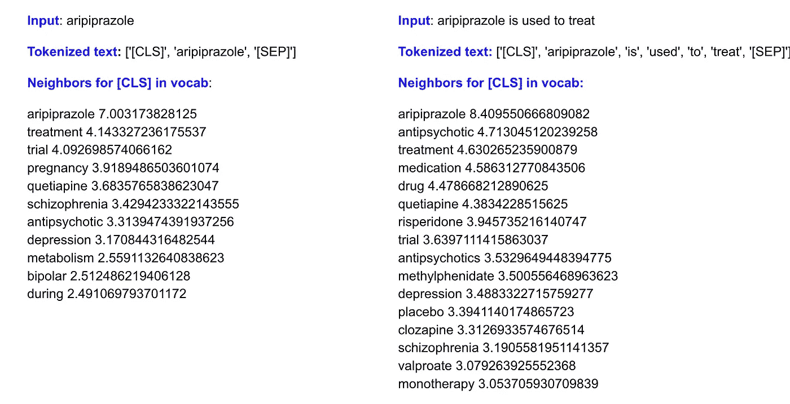

**图 11a。**用 CLS 为单个术语和部分句子模拟 RNN 的隐藏状态。作者创造的形象

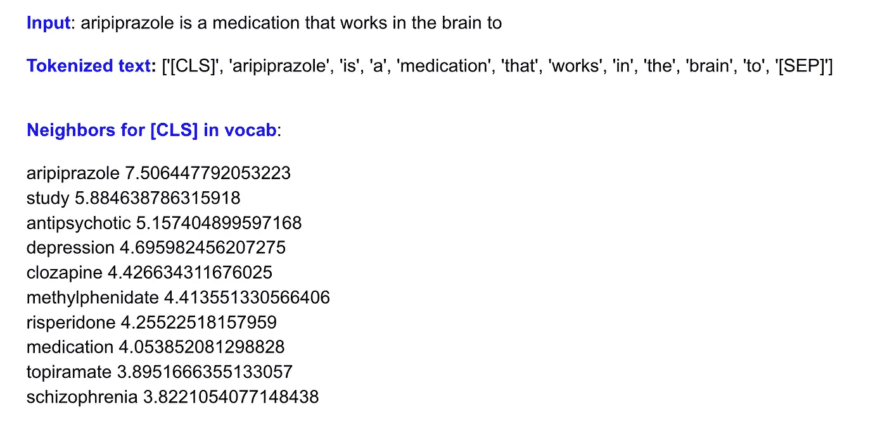

**图 11b。**以 CLS 为偏句效仿 RNN 的隐态。**作者创建的图像**

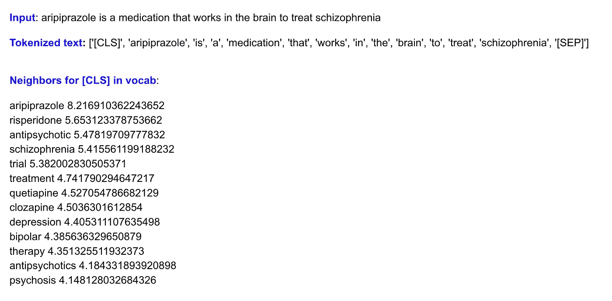

**图 11c** 。模仿 RNN 的隐藏状态，用 CLS 写一个完整的句子。**作者创作的图片**

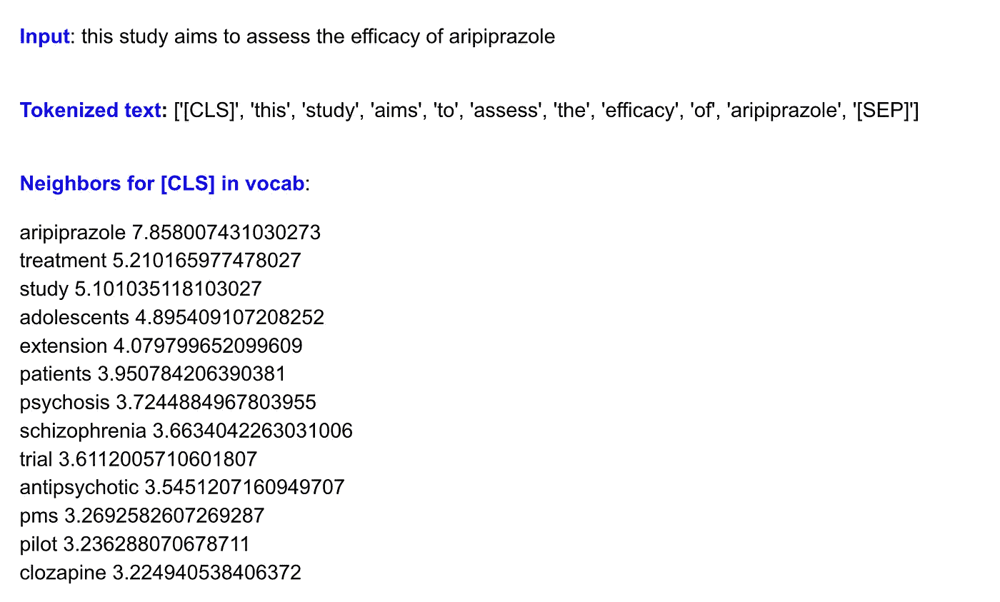

**图 11d。**用 CLS 模仿 RNN 的隐藏状态来完成一个句子。注意在上面的所有句子中，[CLS]的表示捕获了句子中关键术语的关键实体类型以及语义相近的实体类型。**作者创建的图像**

## 填空应用程序(用于实体猜测)

这是简单的直接使用 MLM 头，如上面的许多例子所示。尽管该模型在预测任何被屏蔽位置的实体类型方面表现得相当好，但是根据实体实例的事实正确性进行预测的准确性是不可靠的，不管在许多实例中，预测可能落在正确实例的范围内。比如上例 ***“阿立哌唑用于治疗”*** ，邻居反映的疾病很大程度上是精神障碍。这对于收集候选实例可能具有潜在价值，这些候选实例随后可被下游模型用来识别确切的实例。

## 可能有价值的其他模型属性

**利用 MLM 头部的学习偏差值**

屏蔽位置预测期间的输出分数是输出向量和词汇向量加上特定于每个词汇单词的偏差值的点积，偏差值是在训练期间学习的。像**、逗号**的符号**、**和**这样的术语是句子中许多位置的输出预测的一部分——它们的信息含量很低。这种习得的偏差对于为句子中的某个位置加权预测术语可能是有价值的——就像词汇术语的 TF-IDF 一样。**

**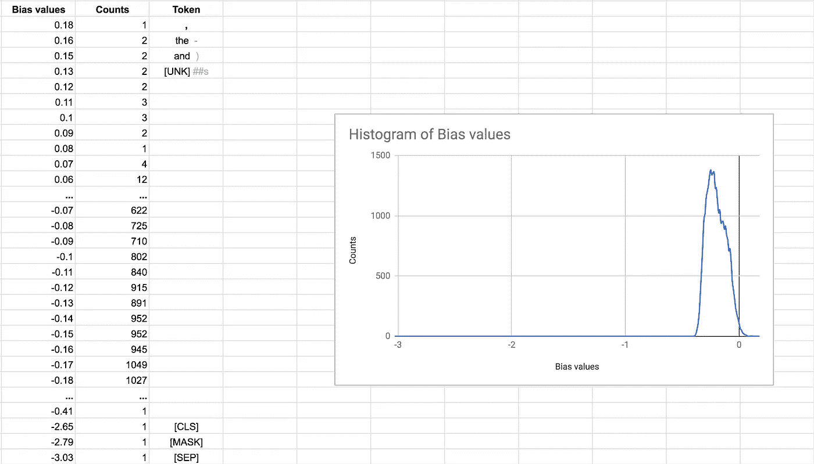**

****图 12。**直方图偏差值按数值的逆序排序。具有最高偏移值的标记是像逗号、the 和[UNK]标记这样的标记。具有负偏移值的令牌是[CLS]、[掩码]和[分离]。具有较大偏差值的标记对应于可能在句子中的许多位置频繁出现的标记——大致相当于停用词。**作者创建的图像****

**输出向量角度以及词汇向量的大小是确定某个位置的模型预测的主要因素，而习得的偏差起次要作用*(损失是使用非标准化向量计算的，其中大小对分数下降有影响，如果向量标准化，则不会有影响)。***

**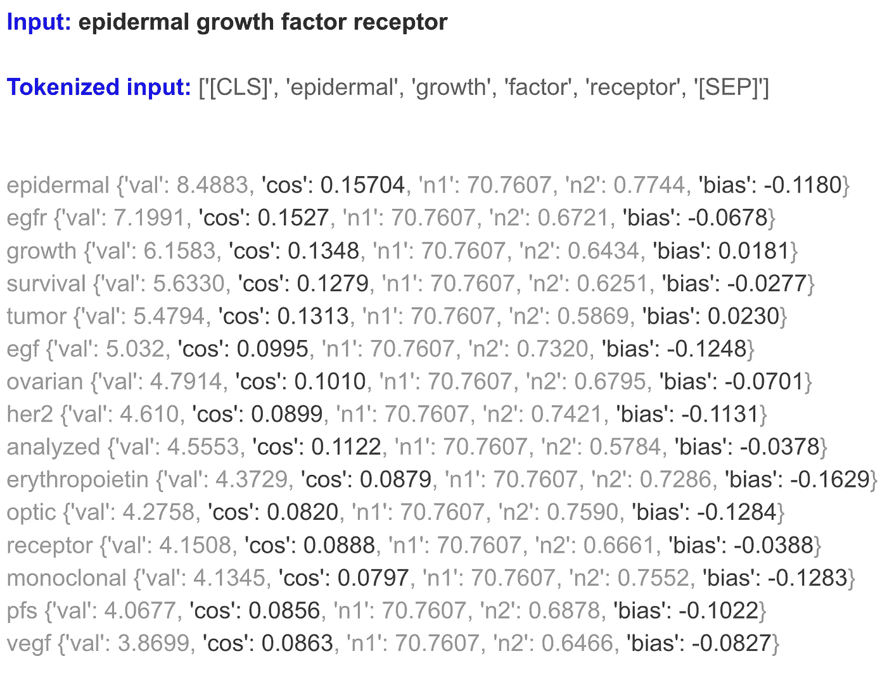**

****图 13。**MLM 头部模型预测得分的计算。关键字“ **val** ”是输出向量和词汇向量的点积。这只是“n1”、“n2”和“cos”键的乘积，其中 n1 和 n2 是矢量幅度。学习到的偏差值被加到点积上以产生最终得分。对最终得分起关键作用的是两个向量之间的角度和向量幅度，偏差值的作用最小。**作者创建的图像****

****表示对之间相对重要性的不对称****

**代替对位于词汇表检索词的邻域分布尾部的检索词进行聚类，可以创建一个有向图，该图的节点是词汇表检索词。由于分布尾部的不同长度，该图将是有向的。像**细胞**这样的名词，尾部可能有**白细胞**，但**白细胞**尾部可能没有**细胞**。然而，像**单元格**这样的术语将双向链接到**单元格**。这种有向知识图的节点既可以用符号访问，也可以用嵌入访问，对于某些应用程序来说，这可能会很方便。**

**有向知识图不仅可以用词汇向量术语来构建，还可以使用[CLS]表征来包括来自感兴趣领域的短语和句子。这种图的一个优点是所有嵌入都位于相同的 n 维空间中，这为潜在的有意义/有用的矢量算法开辟了范围，尽管迄今为止这种算法还没有被证明在实际意义上是有用的。**

****句子中相邻标记的输出向量的相似度****

**在预测得分中捕获的句子中每个位置的输出向量与句子中所有其他标记的相似性可能在应用中被利用。**

**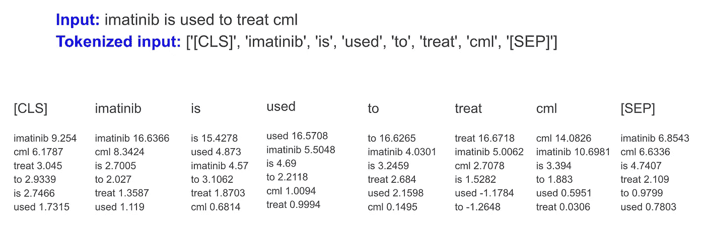**

**图 14。相对于输出向量的每个位置处的输入记号的基于预测分数的排序。在应用程序中，可能会利用一致的非统一评分。**作者创建的图像****

****限于总体实体层面理解的世界模型****

**该模型能够在实体类型粒度级别预测术语，而不是精确的实体实例*(尽管候选预测有时接近实体实例家族)*表明可以从纯文本序列中无监督地收集仅限于总体实体级别理解的“原始世界模型”。这可能对下游模型有一些用处，特别是当预测接近实体实例*时(之前检查的例子* ***阿立哌唑用于治疗*** *…)。*下图举例说明了模型执行此操作的能力。**

**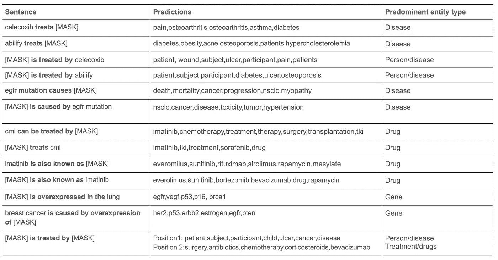**

**图 15。这些例子表明，原始世界模型可以在实体类型级别的粒度上仅从文本序列中学习。链接实体对的片段可以被仔细选择以收获候选关系。**作者创作的图片****

# **最后的想法**

**上述所有应用都利用了学习向量的相似性度量。具体地，相似性度量被应用于学习的分布式表示，以及那些分布式表示的学习的转换——这两种学习都是自我监督的。虽然对这些表示和转换中包含的语言的任何理解都仅限于从标记序列中收集的内容，但这种有限的理解仍然被证明有助于在没有监督的情况下解决各种 NLP 任务。**

***用于聚类和检查模型预测的代码是* [*此处可用*](https://github.com/ajitrajasekharan/bert_vector_clustering.git)**

# **附加注释**

*   **PyTorch 模型转储(1)说明模型 MLM 头部和内部学习的参数(2)主要学习的转换和(3)学习的词汇向量*(在底部以黄色突出显示)*。获取无监督任务求解的隐藏状态的正确位置是在最后一次变换*(在顶部以黄色突出显示)*之后的 MLM 头部内部，而不是最顶层输出。**

**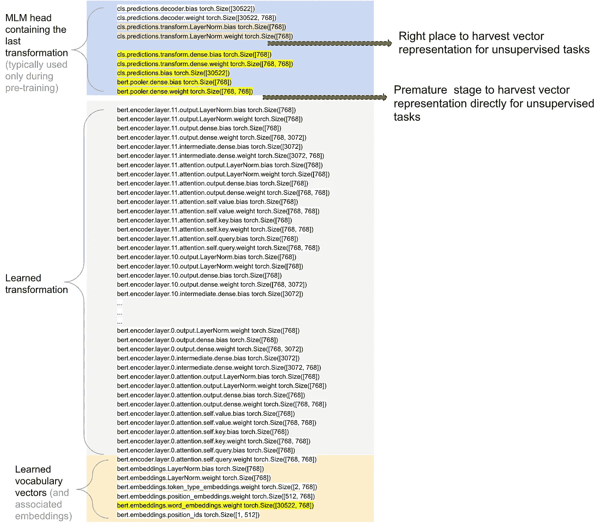**

****图十六。** PyTorch BERT 模型转储。**作者创建的图像****

*   **Huggingface 实现中的代码补丁在头中转换后从 MLM 头返回隐藏状态。**

**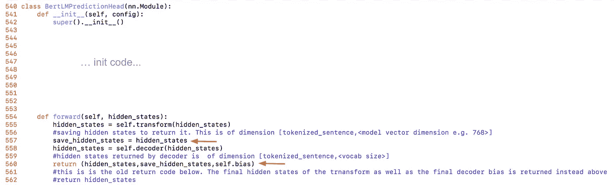**

****图 17。**修补[变压器代码](https://github.com/huggingface/transformers/blob/master/src/transformers/models/bert/modeling_bert.py)，从 MLMHead 返回最终隐藏状态。图片来自[变压器代码](https://github.com/huggingface/transformers/blob/master/src/transformers/models/bert/modeling_bert.py)。作者创造的形象**

**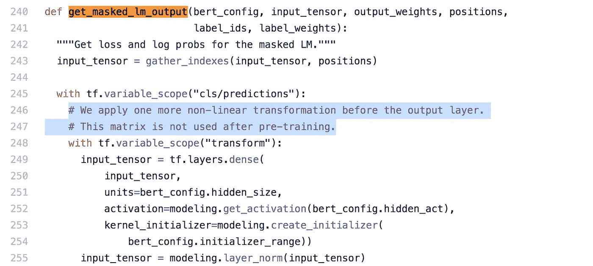**

****图 18。** [预训练的 Google Tensorflow 实现中的代码](https://github.com/google-research/bert/blob/master/run_pretraining.py)显示了在 MLM 头部中使用“cls.predictions”完成的最后一次转换(参见图 15)。**作者创作的图片****

**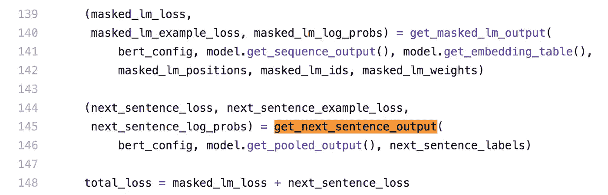**

****图 19。** [来自 BERT](https://github.com/google-research/bert/blob/master/run_pretraining.py') 的 Github 库的代码存根。[预训练的 Google Tensorflow 实现中的代码](https://github.com/google-research/bert/blob/master/run_pretraining.py)显示了总损失，该总损失是掩蔽 MLM 损失和下一句损失的总和。**作者创建的图像****

*   ****词汇向量聚类。** (1)对于词汇表中的每个术语，创建该术语与词汇表中所有其他术语的余弦分布直方图。从直方图尾部创建一个带阈值截断的聚类*(例如个位数或十几个点)*。(2)对词汇表中还没有在步骤 1 中挑选所有术语重复上述步骤。与固定余弦距离截止相反，直方图阈值截止产生高质量的聚类，因为直方图尾部在各项之间的长度不同。一些尾部很短*(余弦距离> .5)* 而一些尾部一直延伸到. 1。**

# **参考**

1.  **[无人监管的 NER](/unsupervised-ner-using-bert-2d7af5f90b8a)**
2.  **[同义词采集](/unsupervised-synonym-harvesting-d592eaaf3c15)**
3.  **[检查伯特的原始嵌入](/examining-berts-raw-embeddings-fd905cb22df7)**
4.  **[原始伯特纸](https://arxiv.org/abs/1810.04805)**
5.  **[最大化 BERT 模型性能](/maximizing-bert-model-performance-539c762132ab)**

**其中[CLS]向量似乎过早地从最上面的模型输出层(与 MLM 头部相反)获取句子表示的模型**

*   **[句子变形金刚](https://arxiv.org/pdf/1908.10084.pdf)用[伯特即服务](https://github.com/hanxiao/bert-as-service)用它的方法来评估【CLS】。“伯特即服务”使用最顶层进行收集[CLS]**
*   **在句子编码器中测量社会偏见。**
*   **[BERTSCORE:使用 BERT 评估文本生成](https://arxiv.org/pdf/1904.09675.pdf)**
*   **[了解伯特在排名中的行为](https://arxiv.org/pdf/1904.07531.pdf)**