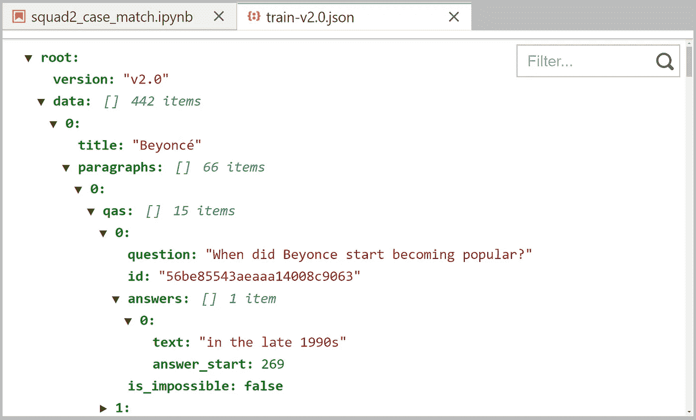

# Python 中出现了 Switch-Case 语句

> 原文：<https://towardsdatascience.com/switch-case-statements-are-coming-to-python-d0caf7b2bfd3?source=collection_archive---------0----------------------->

## 最新版本展示了新的逻辑


作者图片

ython 3.10 开始加入许多迷人的新特性。其中一个特别引起了我的注意——结构模式匹配——或者我们大多数人都知道的 switch/case 语句。

尽管 Switch 语句是大多数语言的共同特征，但 Python 中却没有。

早在 2006 年， [PEP 3103](https://www.python.org/dev/peps/pep-3103/) 被提出，建议实现 switch-case 语句。然而，在 PyCon 2007 上的投票没有得到对该特性的支持后，Python 开发者放弃了它。

快进到 2020 年，Python 的创造者[吉多·范·罗苏姆](https://medium.com/u/1ecea0006127?source=post_page-----d0caf7b2bfd3--------------------------------)提交了第一份展示新开关语句的文档，这些语句被命名为**结构模式匹配**，如 [PEP 634](https://www.python.org/dev/peps/pep-0634/) 所示。

然而，正如我们将很快看到的那样，我们这里所拥有的远不止一个简单的 switch-case 语句(因此 **match** -case)。

让我们来看看这个新逻辑是如何工作的。

```
**> Structural Pattern Matching**
  - Intro
  - Another Example
  - Real Use-Case With JSON
```

# 结构模式匹配

模式匹配在`match`之后取一个值，并允许我们写出几个潜在的情况，每个情况由`case`定义。当我们发现`match` - `case`匹配时，我们将执行各自的代码。

例如:

```
http_code = "418"**match http_code:
    case "200":**
        print("OK")
        do_something_good()
 **case "404":**
        print("Not Found")
        do_something_bad()
 **case "418":**
        print("I'm a teapot")
        make_coffee()
 **case _:**
        print("Code not found")
```

这里我们检查多个条件，并根据在`http_code`中找到的值执行不同的操作。


通过 match-case 语句的逻辑流。

很明显，是的，我们可以使用大量 if-elif-else 语句构建相同的逻辑:

```
http_code = "418"if http_code == "418":
    print("OK")
    do_something_good()
elif http_code == "404":
    print("Not Found")
    do_something_bad()
elif http_code == "418"
    print("I'm a teapot")
    make_coffee()
else:
    print("Code not found")
```

然而，通过使用 match-case 语句，我们删除了重复的`http_code ==`,当测试许多不同的条件时，它看起来更清晰。

## 另一个例子

我们可以在 [PEP 635](https://www.python.org/dev/peps/pep-0635/) 中找到一些使用 match-case 语句来提高代码可读性的很好的例子。其中之一就是这个例子，它向我们展示了如何使用 match-case 来检查我们的主题的类型和结构:

```
match x:
    case host, port:
        mode = "http"
    case host, port, mode:
        pass
```

在这里，我们希望接收元组格式的连接细节，并将给定值赋给正确的变量。

在这种情况下，如果连接`mode`没有在元组中定义(例如，只提供了两个值——`host`和`port`),我们假设连接模式是*“http”*。

然而，在其他情况下，我们可能期望模式是明确定义的。因此，我们可能会收到类似于`(<host>, <port>, "ftp")`的元组——在这种情况下，我们不希望将`mode`设置为*“http”*。

现在，如果我们想使用 if-else 语句编写同样的逻辑，我们会得到这样的结果:

```
if isinstance(x, tuple) and len(x) == 2:
    host, port = x
    mode = "http"
elif isinstance(x, tuple) and len(x) == 3:
    host, port, mode = x
```

哪个选项更受欢迎可能会有所不同，但对我来说，匹配用例实现看起来要干净得多。

## JSON 的真实用例

另一个有趣的用例是基于字典对象的结构不同地解析它们的能力。一个很好的测试用例是解析 SQuAD 2 数据集。

SQuAD 2 数据集是一组非常受欢迎的问答对，用于训练机器学习模型进行问答。我们可以通过以下方式下载数据:

如果我们看一下班的结构，显然有几个层次，这是我们在解析时需要考虑的:



班 2 训练集的 JSON 格式。

我们的问题是，并非所有的样本都使用相同的字典格式。

如果我们查看最后几个样本，我们会看到`qas`列表包含了`answers`和`plausible_answers`——而之前的样本只包含了`answers`:


SQuAD 2 训练集 JSON 中的最后一个条目显示了不同的字典格式(由整个文件中的几个条目共享)。

让我们尝试应用新的匹配情况语句来构建一个更简洁的替代方案，以取代处理这种情况所需的繁重的 *if-else* 逻辑。首先，我们加载数据:


我们使用 **json.load** 加载数据。

小队 JSON 包含多个层。访问`squad['data']`后，我们需要遍历每个`group`问题，然后遍历每个`paragraph`，然后遍历每个`qas`(问题-答案)——如下所示:

这就是事情变得有趣的地方。使用`if-else`逻辑，我们得到这样的东西:

不算漂亮，但很管用。现在让我们用一些`match-case`逻辑来重写这个:

它看起来肯定没那么忙了，是原始版本解析逻辑的一个很酷的替代方案。

以上是对 Python 3.10 中引入的新结构模式匹配的快速浏览！预计将于 2021 年 10 月初全面发布。

就我个人而言，我认为这个新语法看起来真的很好——尽管我现在对它有一半的兴趣。一旦更多的用户开始用 match-case 编码，我相信社区会很快建立共识和最佳实践。

但是现在，它看起来很酷——我很兴奋！

我希望你喜欢这篇文章。如果你有任何问题或建议，请通过[推特](https://twitter.com/jamescalam)或在下面的评论中告诉我！如果你对更多类似的内容感兴趣，我也会在 [YouTube](https://www.youtube.com/c/jamesbriggs) 上发布。

感谢阅读！

如果您有兴趣阅读 Python 3.10 的其他一些新特性，请查看我的另一篇文章，其中介绍了一些最好的特性:

[](/new-features-in-python-3-10-66ac05e62fc7) [## Python 3.10 中的新功能

### 看看 Python 最新版本中包含的最佳特性

towardsdatascience.com](/new-features-in-python-3-10-66ac05e62fc7) 

[🤖《变形金刚》NLP 课程 70%的折扣](https://bit.ly/nlp-transformers)