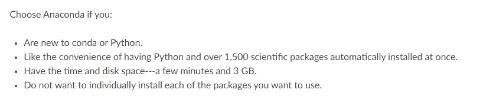
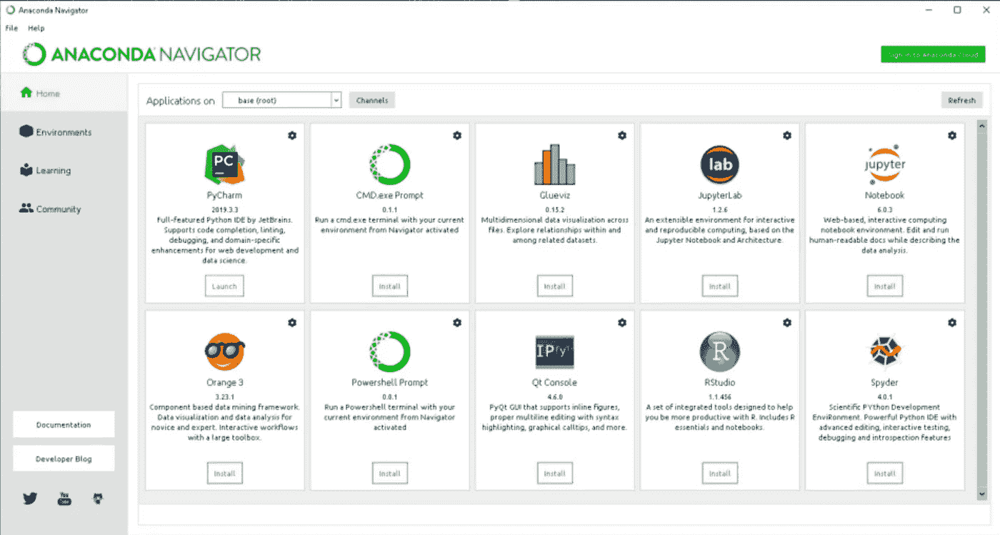
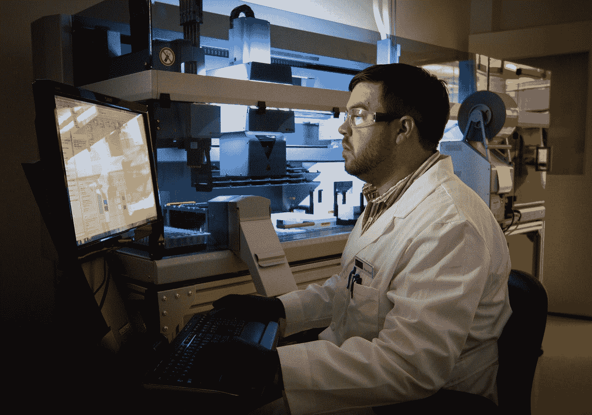

# 为您的数据项目环境从 Anaconda 切换到 Miniconda

> 原文：<https://towardsdatascience.com/switch-from-anaconda-to-miniconda-for-your-data-project-environment-8786c9e2dc95?source=collection_archive---------26----------------------->

## 意见

## 迷你可以完成任务，甚至比大蛇更好

照片由[坦纳·博瑞克](https://unsplash.com/@tannerboriack?utm_source=medium&utm_medium=referral)在 [Unsplash](https://unsplash.com?utm_source=medium&utm_medium=referral) 拍摄

当我第一次开始我的数据科学家生涯时，我一直被推荐的工具之一是 Anaconda。原始文件中也是这么说的。

为什么 Anaconda docs 说你应该选择它—作者提供的 [docs](https://conda.io/projects/conda/en/latest/user-guide/install/download.html#anaconda-or-miniconda) 截图

有一段时间，我也觉得 Anaconda 很酷。我的意思是，看看 Anaconda Navigator 的第一页，一旦你打开这个工具，你就会看到它。

Anaconda Navigator —图片来自[官方文件](https://docs.anaconda.com/anaconda/navigator/)

[国立癌症研究所](https://unsplash.com/@nci?utm_source=medium&utm_medium=referral)在 [Unsplash](https://unsplash.com?utm_source=medium&utm_medium=referral) 上拍摄的照片

在我第一次担任数据科学家期间，当我第一次看到那个登录页面时，我感觉就像一个孩子想象一个真正的科学家在他复杂而可怕的工具面前工作。

那时我需要的是一副眼镜来完成这一套。

我当时也同意为什么 Anaconda 如此推荐给数据科学家。所有的工具，包括额外的包、代码编辑器和 viz 工具，都已经提供了。

# **一两年后……**

在处理了几十个分析用例之后，每个用例都有其独特的挑战和需求，我对 Anaconda 越来越厌倦了。

总之，它成了我电脑上一个臃肿无用的应用程序。

1.  数以千计的包是总存储和内存消耗者。更糟的是，毫无用处。所有那些预装的软件包真的降低了我电脑的性能。占用的存储空间只有几 GB，这可能会产生很大的差异，尤其是在 Macbook Pro 128GB 的情况下。即使有了`conda clean --all`，它仍然占据了相当大的空间。我没有使用 Anaconda 附带的很多包，比如`pomegranate`、`proj4`、`pyopengl`等等。我不知道它们都是干什么用的。
2.  管理 Python 包变成了一个非常缓慢的过程。甚至用`conda update [some package]`更新一个包都感觉拖得太久了。我尝试过只从一个环境中使用(*，顺便说一下*，并不真正推荐)到不同的虚拟环境，这些虚拟环境具有针对不同用例的特定包(一个用于数据探索，一个用于数值分析和建模，另一个用于图像处理)。两者仍然很慢。
3.  导航器变得过时了。我可以从开始菜单/应用程序文件夹或通过命令提示符/终端打开我喜欢的代码编辑器应用程序。事实上，通过 Navigator 打开应用程序甚至更慢。通过命令提示符更新和管理软件包也更加方便。创建新的虚拟环境？打开命令提示符/终端，输入`conda`命令。为什么要为 Anaconda Navigator 中的环境页面费心呢？更有甚者，为什么要为此烦恼呢？
4.  让我的工作更加困难。一旦我的一些客户端/用户的部署时间表到达，我必须用相同的必需包和配置创建一个虚拟环境，以确保模型可以在他们的生产服务器中平稳运行。出于和我上面列出的完全相同的原因，我绝不会使用 Anaconda(或者可能永远不会)。

# 那么有什么选择呢…

米尼康达！

基本上就是 conda 包管理系统+ Python +它的基础包而已。

就是这样。

*   没有多余的(没用！)工具和装置。
*   需要一些特定用例/项目的包吗？您仍然可以创建虚拟环境，并在其中安装您需要的软件包。
*   需要安装一些代码编辑器吗？直接从官网下载就可以了。由开发人员直接管理，与通过 Anaconda Navigator 安装的一样好(甚至更好)。

有了 Miniconda，我真的很想做精益数据科学和分析项目。

# 结论

我并不是说 Anaconda 是一个过时的工具，任何数据科学家/分析师都不应该使用它。它仍然有潜力。甚至还有它的[企业版](https://www.anaconda.com/products/enterprise)。我认为第一次接触数据科学家/分析师可以从使用 Anaconda 开始他们的职业生涯/培训中受益。例如，了解什么是最适合您的数据项目的虚拟环境。他们甚至可能对那 1500 个额外的包裹有些用处。谁知道呢。

我是说，如果你已经牢牢掌握了你想用 Python 构建或使用的东西(例如，你想成为时间序列专家、深度学习工程师或数据驱动的营销专家)，Miniconda 是一个高效且值得推荐使用的工具。