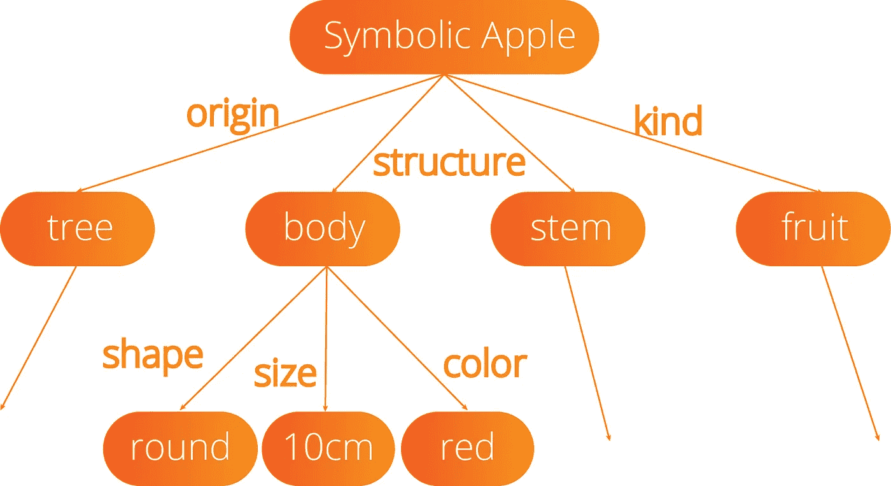
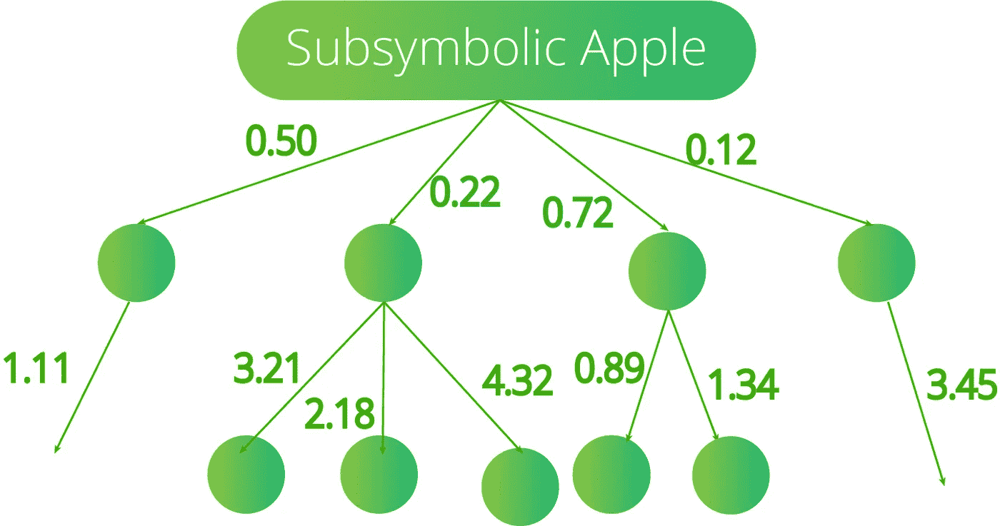
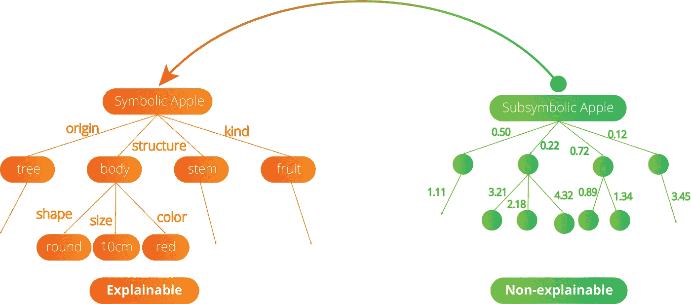

# 人工智能可解释性的符号与次符号人工智能范例

> 原文：<https://towardsdatascience.com/symbolic-vs-subsymbolic-ai-paradigms-for-ai-explainability-6e3982c6948a?source=collection_archive---------10----------------------->

## 第一部分 |可解释的人工智能—第二部分

## 自 80 年代以来，亚符号人工智能范式已席卷全球。但是，可解释人工智能的兴起可能会使符号人工智能从坟墓中复活，因为它具有不可替代的特性

图一。[附身摄影](https://unsplash.com/@possessedphotography?utm_source=medium&utm_medium=referral)在 [Unsplash](https://unsplash.com?utm_source=medium&utm_medium=referral) 上拍照

人工智能无疑是 21 世纪最具革命性的技术之一。人工智能专注于设计和制造具有推理、认知、学习、感知和交流等认知能力的机器。为了设计具有这些能力的机器，研究人员通常采用两种主要方法:(I)符号人工智能方法和(ii)统计人工智能(子符号)方法。

# 符号人工智能

S **符号 AI** 是人工智能的一个子领域，专注于问题的高级符号(人类可读)表示、[逻辑](https://en.wikipedia.org/wiki/Formal_logic)和[搜索](https://en.wikipedia.org/wiki/Search_algorithm)。在 50 年代和 80 年代之间，符号人工智能是占主导地位的人工智能范式。例如，如果你问自己，在头脑中有了象征性的人工智能范例，“苹果是什么？，答案将是苹果是*一种水果*，*有红色、黄色或绿色*，*有圆形*这些描述是象征性的，因为我们用符号(颜色、形状、种类)来描述苹果。

符号人工智能是面向推理的领域，它依赖于经典逻辑(*通常是单调的*)，并假设逻辑使机器变得智能。关于实现符号人工智能，一个最古老的，但仍然是最流行的，[逻辑编程](https://en.wikipedia.org/wiki/Logic_programming)语言是 Prolog 派上用场。Prolog 植根于[一阶逻辑](https://en.wikipedia.org/wiki/First-order_logic)，一种[形式逻辑](https://en.wikipedia.org/wiki/Formal_logic)，与其他许多[编程语言](https://en.wikipedia.org/wiki/Programming_language)不同。

图二。象征性的苹果例子(作者图)

Prolog 是一种声明性语言，程序逻辑用关系来表达，用事实和规则来表示。通过对这些关系运行查询来启动计算。因此，Prolog 可以用来表达图 2 所示的关系。这些关系可以用来定义一个苹果。

# 亚符号(连接主义者)人工智能

I 模型通常用于进行预测，这些模型可以显式表示(如在符号人工智能范例中)或隐式表示。隐式表示来自经验学习，没有规则和属性的符号表示。子符号范式的主要假设是，用有限的经验提取好模型的能力使模型成功。在这里，我们没有明确定义人类可读的关系，而是设计更难解释的数学方程来解决问题。

图 3。象征性的苹果例子(作者图)

神经网络，集成模型，回归模型，决策树，支持向量机是一些最受欢迎的子符号人工智能模型，你可以很容易地遇到，特别是如果你正在开发 ML 模型。

从 80 年代开始，子符号人工智能范式由于其高精度性能和灵活性而取代了符号人工智能作为人工智能主导子领域的地位。

# 比较符号人工智能和子符号人工智能

L et 对符号 AI 和次符号 AI 做一个简单的比较，了解这两大范式的异同。

## **轻松学习**

亚符号人工智能模型(如神经网络)可以直接从数据中学习，以达到特定的目标。像神经网络这样的模型甚至不需要预处理输入数据，因为它们能够自动提取特征。

## **易于并行化和扩展**

由于亚符号人工智能模型从数据中学习，它们可以很容易地重新调整用途，并针对不同的问题进行微调。它们可以扩展到更多的人群。另一方面，符号化的人工智能模型需要在新环境下进行复杂的重塑。

## **没有推理能力**

虽然亚符号人工智能模型擅长学习，但在推理方面往往不太令人满意。

## **数据饥渴模型**

子符号模型——尤其是神经网络——需要大量数据来实现合理的性能。

> 这里是符号人工智能和子符号人工智能范例的概览比较表，如表 1 所示:

表 1。符号和次符号人工智能范例的特性(见:[来源](https://www.researchgate.net/publication/228848818_A_hybrid_approach_for_Arabic_literal_amounts_recognition))

## **对手或同行**

虽然亚符号人工智能是因为符号人工智能范式的缺点而开发的，但它们可以用作补充范式。虽然符号人工智能更擅长逻辑推理，但子符号人工智能在特征提取方面优于符号人工智能。

图 4。将符号人工智能与子符号人工智能结合起来(作者提供图片)

# 从可解释性的角度评价人工智能范式

如上所述，符号人工智能范式提供了具有令人满意的推理能力的易于解释的模型。通过使用符号化的人工智能模型，我们可以很容易地追溯特定结果的推理过程。另一方面，即使在特定领域中表达整个关系结构也是很难完成的。因此，如果不付出极大的努力，符号化的人工智能模型无法捕捉所有的可能性。

另一方面，亚符号人工智能范式提供了非常成功的模型。与它们的精度性能相比，这些模型可以用相对较少的努力来设计和训练。然而，次符号模型的最大缺点之一是决策过程的可解释性。特别是在推理是结果不可或缺的属性的敏感领域(例如，法院裁决、军事行动、贷款申请)，我们不能依赖高性能但不透明的模型。

# 用于可解释模型的可解释人工智能(XAI)和神经符号计算(NSC)

一个可解释的模型是一个具有内在逻辑的模型，它可以用人类语言清楚地描述。因此，虽然符号人工智能模型可以通过设计来解释，但次符号人工智能模型通常不能通过设计来解释。有两个领域涉及创建具有推理能力的高性能人工智能模型，这通常需要结合符号和子符号范例的组件。虽然 XAI 的目标是通过开发本质上更容易为(人类)用户理解的模型来确保模型的可解释性，但 NSC 专注于寻找将子符号学习算法与符号推理技术相结合的方法。

# 最后的想法

在这篇文章中，我们讨论了两个主要的人工智能范例:

*   符号人工智能(Symbolic AI)→可解释性高但准确性低的范例
*   **亚符号人工智能** →可解释性低但准确性高的范例

在下一篇文章中，我们将更详细地介绍可解释的人工智能和神经符号计算，以了解它们在开发方面的重点:

*   具有**高解释能力**和**高精度**性能的机型。

# 订阅邮件列表获取更多内容

如果你想获得我在 Google Colab 上的其他教程文章的代码，并尽早获得我的最新内容，考虑[订阅邮件列表](https://medium.us4.list-manage.com/subscribe?u=bf0e9524ea3d765ba10131675&id=52221072de) :✉️

> [*现在就订阅*](https://medium.us4.list-manage.com/subscribe?u=bf0e9524ea3d765ba10131675&id=52221072de)

如果你对深度学习感兴趣，也可以看看我的人工智能内容指南:

 [## 我的人工智能内容指南

### 帮助您轻松浏览我的内容的指南。

blog.orhangaziyalcin.com](https://blog.orhangaziyalcin.com/a-guide-to-my-content-on-artificial-intelligence-c70c9b4a3b17) 

如果你正在阅读这篇文章，我确信我们有着相似的兴趣，并且正在/将要从事相似的行业。那么我们就通过[*Linkedin*](https://linkedin.com/in/orhangaziyalcin/)*来连线吧！请不要犹豫发送联系请求！* [*奥尔罕·g·雅肯—领英*](https://linkedin.com/in/orhangaziyalcin/)

# **参考文献**

Sovrano，F. (2021)，现代人工智能对可解释性的需求，博洛尼亚大学信息学院

明斯基(1991 年)。逻辑与类比，符号与联系，整洁与邋遢。*艾杂志*， *12* (2)，34–51。【https://web.media.mit.edu/~minsky/papers/SymbolicVs. Connectionist.html

定理，T. (2018)。*人工智能—维基百科*。[https://en . Wikipedia . org/wiki/Artificial _ intelligence # approach](https://en.wikipedia.org/wiki/Artificial_intelligence#Approaches)

Souici-Meslati，l .，& Sellami，M. (2004 年)。一种混合的阿拉伯文字量识别方法。*阿拉伯科学与工程杂志*， *29* (2 B)，177–194。[https://www . research gate . net/publication/228848818 _ A _ hybrid _ approach _ for _ Arabic _ literal _ amounts _ recognition](https://www.researchgate.net/publication/228848818_A_hybrid_approach_for_Arabic_literal_amounts_recognition)