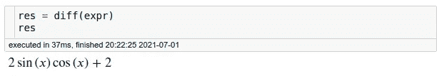

# SymPy:Python 中的符号计算

> 原文：<https://towardsdatascience.com/sympy-symbolic-computation-in-python-f05f1413adb8?source=collection_archive---------0----------------------->

## 用 Python 象征性地解一个方程和微积分


作者图片

# 动机

你曾经希望用 Python 解一个数学方程吗？如果我们可以用一行代码解决如下的代数方程，那不是很好吗

```
[-1/2, 0]
```

…或者只是使用数学符号而不是枯燥的 Python 代码？


作者图片

这就是 SymPy 派上用场的时候了。

# 什么是 SymPy？

SymPy 是一个 Python 库，允许你用符号计算数学对象。

要安装 SymPy，请键入:

```
pip install sympy
```

现在让我们回顾一下 SymPy 能做的一些令人惊奇的事情！

从导入 SymPy 提供的所有方法开始

```
from sympy import *
```

# 基本操作

通常，当计算平方根时，我们得到一个小数:


作者图片

但是使用 SymPy，我们可以得到平方根的简化版本:


作者图片

这是因为 SymPy 试图精确地而不是近似地表示数学对象。

因此，当使用 SymPy 将两个数相除时，我们将得到一个分数而不是小数。


作者图片

# 标志

SymPy 的真正力量是它处理符号的能力。要创建符号，使用方法`symbols()`:


作者图片

酷！我们可以用 x 和 y 创建一个表达式，如果我们给这个表达式加上一个数会发生什么？


作者图片

啊哈！+ 2 加到表达式中，表达式保持不求值。

为什么使用符号会有用？因为我们现在可以使用我们在学校学到的各种数学技巧，如扩展、分解和简化方程，以使我们的生活更容易。

# 方程式

## 扩展、分解和简化

我们知道左边表达式的展开等于右边的表达式。


作者图片

用 SymPy 能做到这一点吗？是啊！SymPy 允许我们使用`expand`扩展一个等式:


作者图片

酷！我们也可以通过使用`factor`来分解我们的表达:


作者图片

我们可以用 SymPy 做的另一件很酷的事情是使用`simplify`简化一个方程:


作者图片

很好，不是吗？

## 解方程

在处理数学符号时，我们最常见的问题之一是解方程。幸运的是，这也可以通过 SymPy 来实现。

要解方程，使用`solve`:


作者图片

## 代替

如果我们用 2 代替下面的等式，我们会得到什么？


作者图片

我们可以使用`eq.subs(x, 2)`来解决这个问题:


作者图片

我们也可以用另一个变量代替 x，得到如下表达式:


作者图片

不错！

# 三角法的

还记得我们高中学的那些好玩的三角恒等式吗？


作者图片

如果我们可以使用 SymPy 来为我们解决这个问题，而不是查找这些身份，这不是很好吗？

要使用三角恒等式简化表达式，请使用`trigsimp()`


作者图片

# 导数、积分和极限

有了 SymPy，还可以做微积分！下面表达式的导数是什么？


作者图片

如果你想不出来，不要担心。我们可以用 SymPy 来解决这个问题。



作者图片

现在让我们通过对导数进行积分，回到原来的表达式。


作者图片

当 x 接近无穷大时，我们也可以取极限。


作者图片


作者图片

或者 2:


作者图片

# 特殊函数

SymPy 还提供了特殊的功能:

*   求一个数的阶乘


作者图片

*   用另一种说法改写这个表达式


作者图片

# 印花乳胶

如果您喜欢这个输出，并且想要获得表达式的 LaTex 形式，那么使用`latex`:


作者图片

你可以把这个 LaTex 表格粘贴到你笔记本的 markdown 上，得到一个漂亮的数学表达式，如下图所示！


作者图片

# 结论

恭喜你！您刚刚学习了如何使用 SymPy 在 Python 中用符号计算数学对象。下次你解数学的时候，试着用 SymPy 让你的生活更轻松。

SymPy 还提供了许多其他有用的方法，我无法在这里一一介绍。我鼓励你查看[这份文档](https://docs.sympy.org/latest/tutorial/index.html)以获得更多灵感。

在 Github repo 中，您可以随意使用本文的代码:

<https://github.com/khuyentran1401/Data-science/blob/master/data_science_tools/sympy_example.ipynb>  

我喜欢写一些基本的数据科学概念，并尝试不同的算法和数据科学工具。你可以在 [LinkedIn](https://www.linkedin.com/in/khuyen-tran-1ab926151/) 和 [Twitter](https://twitter.com/KhuyenTran16) 上和我联系。

如果你想查看我写的所有文章的代码，请点击这里。在 Medium 上关注我，了解我的最新数据科学文章，例如:

</how-to-find-best-locations-for-your-restaurants-with-python-b2fadc91c4dd>  </how-to-solve-a-staff-scheduling-problem-with-python-63ae50435ba4>  </how-to-create-mathematical-animations-like-3blue1brown-using-python-f571fb9da3d1>  </maximize-your-productivity-with-python-6110004b45f7> 