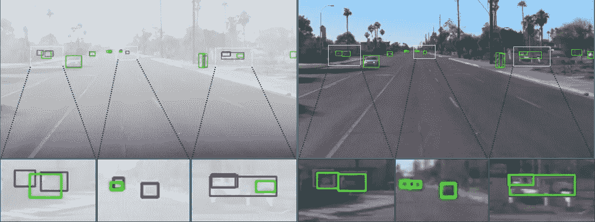
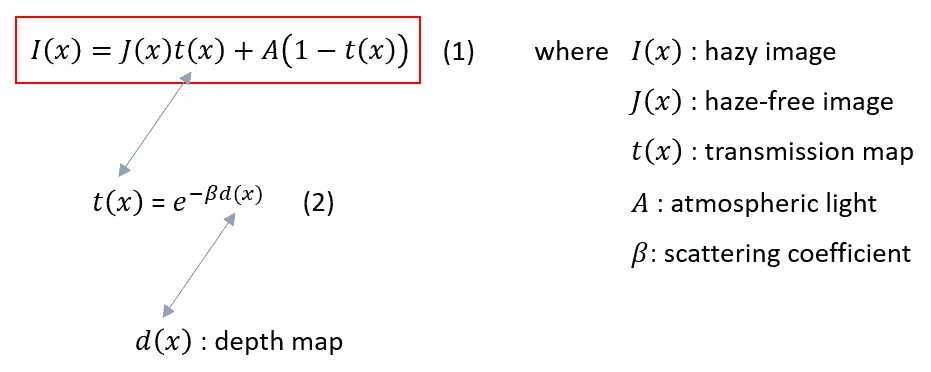
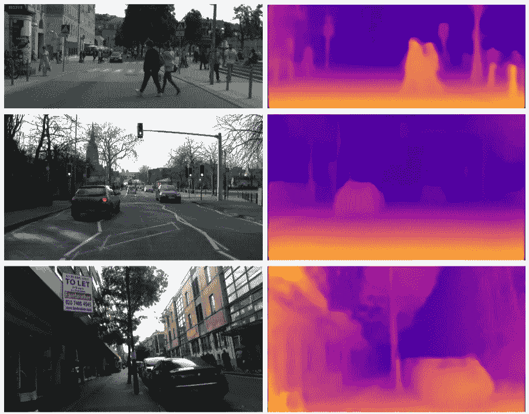
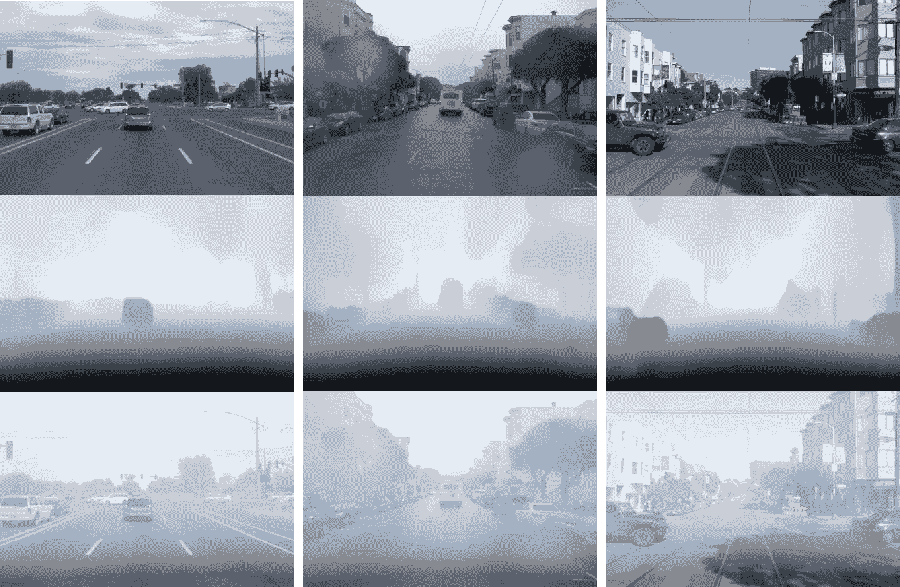
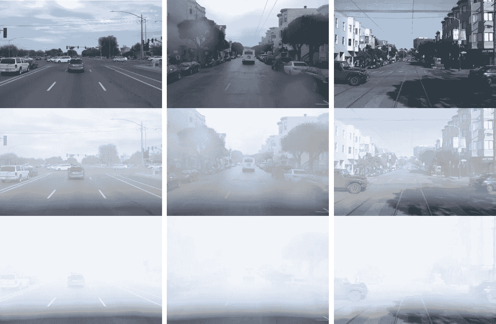

# 使用单深度和大气散射模型合成朦胧/多雾图像

> 原文：<https://towardsdatascience.com/synthesize-hazy-foggy-image-using-monodepth-and-atmospheric-scattering-model-9850c721b74e?source=collection_archive---------22----------------------->

## [思想和理论](https://towardsdatascience.com/tagged/thoughts-and-theory)

## 当雾是有益的。

最近的深度学习和计算机视觉时代导致了自动驾驶技术的快速发展，其中物体检测发挥了极其重要的作用。提出了 R-CNN 家族(R-CNN，Fast R-CNN，Faster R-CNN，Cascade R-CNN)，YOLO 系列(YOLOv1-v4)等各种物体检测器，丰富的驾驶物体检测数据集包括 BDD100K，WAYMO 等。也是可用的。然而，理论研究与现实部署之间仍存在巨大差距。目标检测器的性能在实践中通常会下降，尽管在离线训练期间被训练得很好，具有几乎 99.99%的准确度。那次意外事件最流行的原因之一是因为*域名转移*的问题。

当测试数据的分布与训练数据的分布不同时，就会发生域转移。例如，自主车辆的物体检测器被训练为在良好天气条件下捕获的有利训练数据上工作良好，而部署阶段期间的实际天气可能包括雨或雾。因此，为了带来更好的性能，对象检测器应该对域转移问题更鲁棒。下图显示了在应用基于原始干净数据(红色:地面真实，绿色:检测)训练的预训练 YOLOv4 模型时，模糊输入(左)和无模糊输入(右)之间的性能比较。从图中，我们可以清楚地看到磁畴移动对检测器性能的影响。

模糊输入(左)和无模糊输入(右)之间的性能差异(红色:地面实况，绿色:探测)(图片由作者提供)

一种简单而有效的解决方案是应用独立的环境条件分类器以及对象检测器来识别环境变化，如本文所述:[增强高级驾驶员辅助系统的对象检测模块的鲁棒性](https://ieeexplore.ieee.org/document/9537944) ( [阅读全文](https://www.researchgate.net/publication/353164873_Enhancement_of_Robustness_in_Object_Detection_Module_for_Advanced_Driver_Assistance_Systems))。或者已经提出了另一种称为[多尺度域自适应 YOLO (MS-DAYOLO)](https://arxiv.org/abs/2106.01483#) 的统一系统，其与最先进的一阶段对象检测模型 YOLOv4 和用于域不变特征学习的域自适应网络(DAN)相集成。

对于这样的研究，我们需要准备一个多样化的数据集，它可以帮助训练一个强大的对象检测模型来处理域转换问题。在这篇文章中，我将介绍一个强大的工具，使用单深度和大气散射模型从干净的图像中合成朦胧/有雾的图像数据。该项目的更多细节可以在这里找到[。](https://github.com/tranleanh/haze-synthesize)

# 大气散射模型

如上图所示，红框(等式(1))中显示了普遍用于描述模糊图像的大气散射模型，其中 *x* 是像素位置， *I(x)* 是我们旨在创建的模糊图像， *J(x)* 是我们已经拥有的干净图像， *A* 是通常设置为 1 的大气光， *t(x)* 是场景的媒介透射。基于等式(1)，为了获得 *I(x)* ，我们需要知道变速器 *t(x)* 。当大气光线均匀时， *t(x)* 可以表示为等式(2)，其中 *β* 表示大气的散射系数，因此，现在需要的是场景的深度图 *d(x)* 。一种使用单幅图像来估计场景深度图的现代方法是 Monodepth，这将在下一节中提到。

# 单一深度

单幅图像深度估计(单幅深度纸中的图像[ [来源](https://arxiv.org/abs/1609.03677) ])

使用单一 RGB 图像估计场景深度是计算机视觉中一个具有挑战性且长期存在的问题。最近 Monodepth ( [ver1](https://arxiv.org/abs/1609.03677) ， [ver2](https://arxiv.org/abs/1806.01260) )就是在这个课题上取得突破的方法，建立了单幅图像深度估计的新基线。由于版本 2 与版本 1 相比有几处改进，我想在本教程中使用 Monodepth2。Monodepth2 的可用源代码可以在这里找到[。](https://github.com/nianticlabs/monodepth2)

# 结果

下面的示例图像选自 WAYMO 数据集。WAYMO 数据集提供了驾驶员 5 个不同视角的驾驶场景图像。下图显示了使用本文介绍的方法合成的朦胧图像的几个结果。在图中，第一行:原始图像，第二行:使用 Monodepth2 估计的深度图，第三行:合成的模糊图像。

第一行:原始图像，第二行:估计的深度图，第三行:合成的模糊图像(图像由作者提供)

我们可以通过配置不同的大气散射系数β值来设置合成的雾霾图像中雾霾的厚度。在以下结果中，当使用β=1.2 时，第 2 行中的图像是具有稀疏薄雾的合成薄雾图像，而第 3 行中的图像是β=2 的合成密集薄雾图像。

第一行:原始图像，第二行:具有稀疏薄雾的合成朦胧图像，第三行:具有密集薄雾的合成朦胧图像(图像由作者提供)

# 结论

在这篇文章中，我介绍了一种合成模糊/多雾图像数据的方法，该方法可以作为训练的数据扩充步骤来实现，以提高对象检测模型对域偏移问题的鲁棒性。完整的实现可以在[这里](https://github.com/tranleanh/haze-synthesize)找到。

欢迎读者访问我的脸书粉丝页，这是关于机器学习的分享:[投入机器学习](https://www.facebook.com/diveintomachinelearning)。我在[约洛夫 4——5D 评论](/yolov4-5d-an-enhancement-of-yolov4-for-autonomous-driving-2827a566be4a)、[达克拉斯](/darkeras-execute-yolov3-yolov4-object-detection-on-keras-with-darknet-pre-trained-weights-5e8428b959e2)和 [EFPN](/efpn-extended-feature-pyramid-network-for-small-object-detection-980af794a093) 发表的关于物体探测的更值得注意的帖子。

感谢您抽出时间！