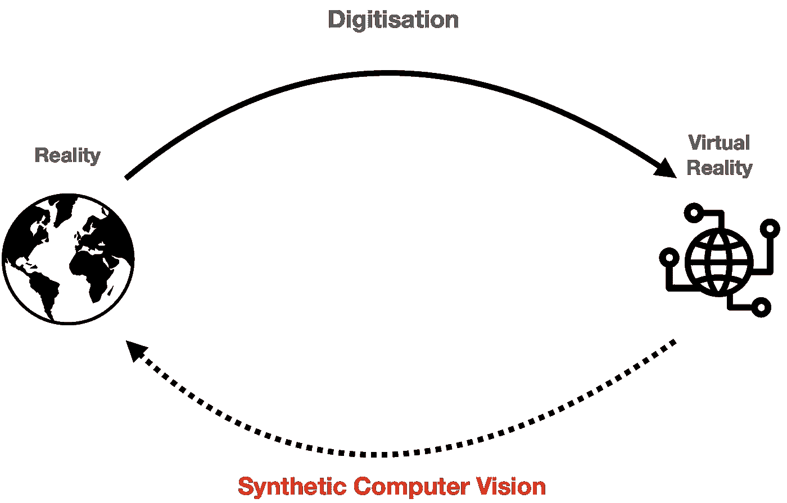
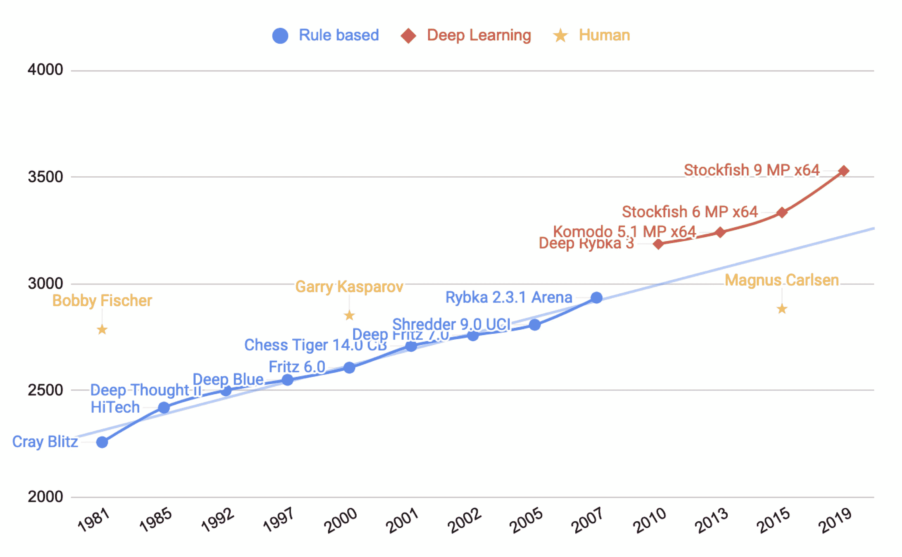
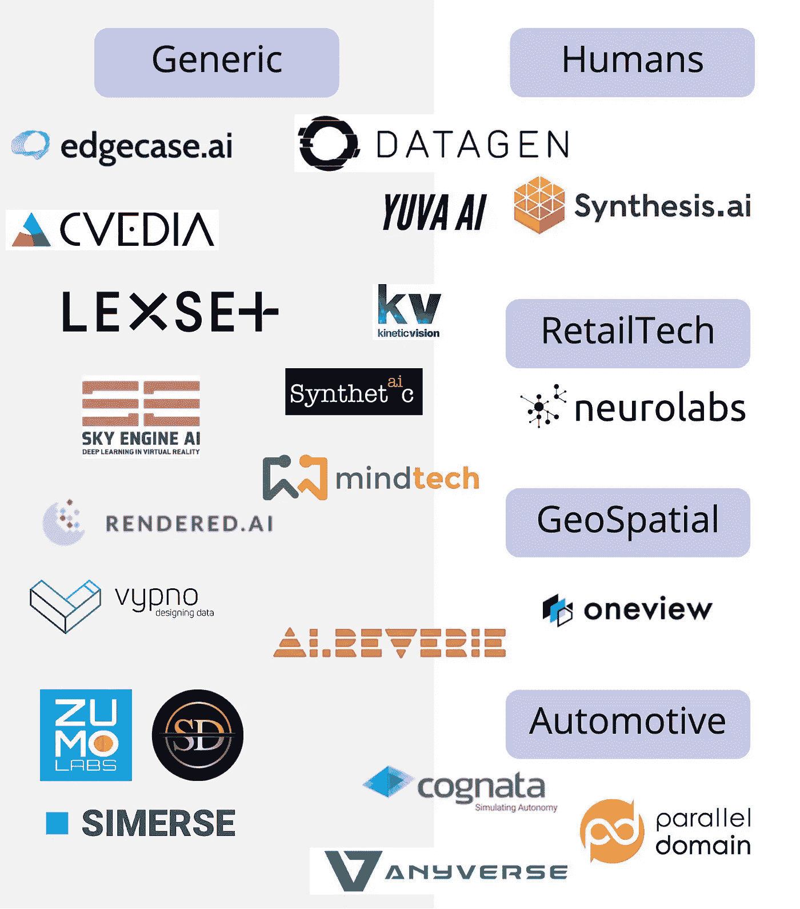

# 我们对算法的痴迷如何打破了计算机视觉

> 原文：<https://towardsdatascience.com/synthetic-computer-vision-c53742b4dee1?source=collection_archive---------26----------------------->

## **以及合成计算机视觉如何修复它**

合成计算机视觉旨在将虚拟世界中的内容翻译回现实世界。(图片由作者提供)

> 深度学习从整体上彻底改善了机器学习。以数据为中心的革命也将如此。在本帖中，我们将看看主流**计算机视觉(CV)** 的陷阱，并讨论为什么**合成计算机视觉(SCV)** 是未来。

# 🗣️计算机视觉的现状

根据 Crunchbase 的数据，截至今天，在过去的 8 年里，超过 1800 家计算机视觉初创公司获得了价值超过 150 亿美元的投资。据《福布斯》报道，这些公司中有 20 多家目前的市值超过了 1B，还会有更多的公司出现。

为什么这些公司被如此看重？简单地说，他们在教计算机如何看东西。通过这样做，他们正在自动化以前使用人类视觉完成的任务。

这一繁荣是在 2012 年计算机视觉的技术拐点之后，随着神经网络的出现——模仿人脑并使用大量人类标记的数据进行训练的算法。自 2012 年以来，算法一直在稳步改进，并在许多视觉任务中成为人类的对手，例如计数物体、[唇读](https://www.technologyreview.com/2016/11/21/69566/ai-has-beaten-humans-at-lip-reading/)或[癌症筛查](https://www.nature.com/articles/s41598-019-48995-4)。

在接下来的 10 年里，每个人都尽了自己的职责:学术界用更好的算法引领潮流；大公司投资了一大批人，他们勤奋地给这些图像数据集贴上标签。为了社区的利益，其中一些工作甚至是开源的，例如 1400 万图像数据集 ImageNet。

不幸的是，现在随着这些系统被部署到生产中，我们遇到了一个难题:

1.  我们拥有的标记为**的数据是不可靠的**。麻省理工学院研究人员对流行的 ML 数据集进行的[系统研究发现，ImageNet 的平均错误率](https://venturebeat.com/2021/03/28/mit-study-finds-systematic-labeling-errors-in-popular-ai-benchmark-datasets/)[错误标记率为 5.93%](https://l7.curtisnorthcutt.com/label-errors) ，其他数据集的平均错误率为 3.4%。
2.  很少有人致力于解决数据问题。学术界的智力努力几乎完全集中在算法开发上，忽略了对良好数据的基本需求——吴恩达的一项猜测认为，99%的算法关注与 1%的数据关注的比率为[。](https://www.youtube.com/watch?t=526&v=06-AZXmwHjo&feature=youtu.be)
3.  计算机视觉算法不能很好地从一个领域推广到另一个领域，一个被训练用来在法国南部检测汽车的算法将很难在多雪的挪威检测到同样的汽车。同样，在特定摄像机上训练的系统可能在另一个摄像机品牌和型号上失败。

# ♟️寻找灵感

早在 1946 年，艾伦·图灵就建议将国际象棋作为计算机能力的基准，此后这一问题得到了深入研究，并引起了媒体的广泛关注。

一种普遍接受的衡量国际象棋比赛表现的方法是通过 [Elo 评级系统](https://en.wikipedia.org/wiki/Elo_rating_system)，该系统提供了对玩家技能的有效比较。下图显示了世界冠军和国际象棋游戏引擎。在过去的 50 年里，人类的表现一直徘徊在 2800 点左右，然后在 2010 年被计算机压制。

直到最近十年，我们人类已经设计了象棋算法，根据我们可以设计和理解的规则进行游戏。深度学习革命让我们突破了人类的理解，带来了一次飞跃——就像它对计算机视觉的影响一样。

国际象棋引擎和人类 ELO 评级(图片由作者提供)

深度学习国际象棋游戏引擎的进展一样好，但它现在被下一级国际象棋引擎压制了:**来自 DeepMind 的 AlphaZero** 。更令人印象深刻的是， **AlphaZero 没有使用任何人工数据**来实现这一性能。它是在没有任何历史象棋游戏知识的情况下建造的，也没有任何寻找最佳走法的人类指导。AlphaZero 是老师也是学生——它通过与自己竞争并在这个过程中学习，教会了自己如何更好地玩游戏。

AlphaZero 赢了当时最好的引擎 Stockfish 8，没有输掉一场比赛，即使 Alpha Zero 给了[少一个数量级的时间](https://chess24.com/en/read/news/alphazero-really-is-that-good)来计算它的下一步行动。

考虑到 AlphaZero 的显著改进，人们不禁要问: ***我们能否将其在国际象棋中的成功转化为计算机视觉？***

# 📰新浪潮:以数据为中心的人工智能

在[以数据为中心的人工智能](https://www.forbes.com/sites/gilpress/2021/06/16/andrew-ng-launches-a-campaign-for-data-centric-ai/?sh=6d7fce8574f5)的新范式中，目标不是创造更好的算法，而是通过改变数据本身来提高性能。即使我们首先忽略获取和标记图像数据集的障碍，围绕数据质量的问题仍然存在:我们是否一致地覆盖了所有可能的用例？数据是否涵盖了边缘案例？

如果我们要走以数据为中心的计算机视觉之路，就必须控制数据源流程。数据需要平衡，我们需要很好地理解影响计算机视觉模型学习内容的参数。

让我们举一个简单的例子，看看如何控制 3 个这样的参数:摄像机角度、照明和遮挡。你能想象收集一个真实的数据集，其中你必须努力控制只有这 3 个参数的值，同时收集 1000 个相关的图像吗？对于真实数据，这项任务是永无止境的。

# 💾我们现在如何管理数据？

在过去的 5 年里，我们在优化数据收集流程和数据标签质量方面取得了巨大进步。此外，我们已经学会了通过使用各种*数据扩充*技术来充分利用数据集。给定我们数据集中的一幅图像，我们对其应用数学函数，以便在我们的数据中创建更多种类。

现在有超过 400 家公司，总市值为 1.3 万亿美元(略高于脸书的市值)，满足我们最新算法的数据需求。

但是现在的路径是不是通向一个死胡同？我们是否达到了建立在人类数据集之上的算法的极限？就像在国际象棋中一样，只要我们使用人类来源的数据作为算法的输入，我们就会被设计约束，不能明显超越我们自己的能力。

在国际象棋中，一旦我们停止建立在次优的人类数据上，并允许机器建立自己的数据以优化它们的学习，后深度学习的突破就来了。在计算机视觉中，我们必须做同样的事情，让机器生成优化自身学习所需的数据。

# 🏔计算机视觉的下一步是什么？

真正可扩展的创建训练数据的方式是通过**虚拟现实引擎**。就保真度而言，输出已经[变得与真实世界无法区分](https://www.youtube.com/watch?v=S3DEM6XDDTk)，给了用户完全的场景控制。这允许用户**生成智能数据**，这对计算机视觉模型的学习非常有用。**合成数据可以成为新的以数据为中心的人工智能框架所需的基石**。

我们有充分的理由相信，现在是广泛采用可视化合成数据的时候了。

*   虚拟现实引擎有专门的组件用于合成数据生成( [NVIDIA IsaacSim](https://developer.nvidia.com/isaac-sim) ， [Unity Perception](https://github.com/Unity-Technologies/com.unity.perception) )，生成的数据不仅赏心悦目，而且对于训练更好的算法也是必不可少的[。](https://www.prnewswire.com/news-releases/survey-of-industry-leaders-shows-synthetic-data-is-essential-to-building-more-capable-ai-models-301377167.html)
*   3D 资产正在迅速成为一种商品——最新的 [iPhone 配备了激光雷达](https://www.geoweeknews.com/news/apple-debuts-its-own-api-for-reality-capture-and-3d-object-creation-but-where-s-the-lidar)并且第一代 3D 扫描应用程序正在产生巨大的[效果](https://www.linkedin.com/posts/albandenoyel_photogrammetry-objectcapture-3dcapture-activity-6833436374952099840-MPTn)。
*   元宇宙即将到来，这是一件大事。如果《T2》预测的 600 亿美元增长中的一小部分成为现实，我们将生活在一个虚拟现实将成为习惯的世界中。数字双胞胎今天有了真正的应用:一个例子来自宝马，未来的[工厂](https://www.youtube.com/watch?v=6-DaWgg4zF8)，另一个例子是谷歌的[供应链双胞胎](https://venturebeat-com.cdn.ampproject.org/c/s/venturebeat.com/2021/09/14/google-launches-digital-twin-tool-for-logistics-and-manufacturing/amp/)。
*   该行业的创新者已经开始使用虚拟现实来改进计算机视觉算法:特斯拉[正在使用虚拟世界](https://www.youtube.com/watch?v=6hkiTejoyms)来生成驾驶场景的边缘案例和新颖视图。

# 👁️‍🗨️合成计算机视觉

通过使用正确的工具来构建我们自己的数据，我们可以想象这样一个世界，在这个世界中，计算机视觉算法的开发和训练不再需要繁琐的手动数据标记过程。 [Gartner](https://blogs.gartner.com/andrew_white/2021/07/24/by-2024-60-of-the-data-used-for-the-development-of-ai-and-analytics-projects-will-be-synthetically-generated/) 预测，在未来 3 年内，合成数据将比真实数据更占主导地位。

为什么不更进一步呢？一个不需要人类为计算机视觉标记图像的世界会怎么样？

# 🚀未来是光明的

通过合成计算机视觉，我们可以在虚拟现实中构建，并为现实世界进行部署。就像 AlphaZero 教会自己在国际象棋中什么是重要的一样，我们让算法决定它们需要看到什么，以便最佳地学习。

> *在* ***合成计算机视觉(SCV)*** *中，我们使用虚拟现实引擎训练计算机视觉模型，并将模型部署在* ***现实世界*** *中。*

# 🔬超越 RGB 图像

现实远不止肉眼所见。我们构建的算法主要关注人类能够理解和标记的东西。但事情并不一定是这样——我们可以为传感器构建算法，以超越人类的感知进行测量。我们可以在虚拟现实中有计划地训练这些算法，而不用怀疑它们的有效性。

# 🤓更聪明而不是更努力

与其建立更大的模型并使用更多的计算能力来解决我们的问题，我们可以明智地选择我们的算法学习的数据来源。算法不需要更多的相同数据来学习，它们需要各种各样的东西。

Deep Mind 表明 AlphaZero 只是这条路的开始，因为他们已经将相同的原则应用于[围棋](https://www.youtube.com/watch?v=WXuK6gekU1Y)、[星际争霸](https://www.youtube.com/watch?v=cUTMhmVh1qs)和[蛋白质折叠](https://deepmind.com/blog/article/alphafold-a-solution-to-a-50-year-old-grand-challenge-in-biology)。今天，我们已经拥有了为计算机视觉构建 *AlphaZero 的所有必要构件，这是一个在设计上不受**人类输入**限制的自我学习系统。一种能够创建和操纵虚拟场景的系统，通过它可以自学如何解决视觉自动化任务。*

# 🔭合成数据生成的先驱

合成计算机视觉的基础是建立在**合成数据**之上的。大约有 [30 家早期公司](https://drive.google.com/file/d/1xhgmO9U8WZoYFi7tviUDiyLWz-SYvRFe/view)在视觉合成数据生成领域运营。有些专注于一个垂直领域的特定用例，而大多数则在多个垂直领域横向运营。

按焦点分组的合成数据公司(图片由作者提供)。

现在是 2021 年，我们才刚刚开始。请记住，合成数据只是等待解决的谜题的一部分。

# 亲爱的读者，❓Questions 给你

1.很容易想象，10 年后，你的智能手机将比你的普通视觉感知能力更强，但我们如何实现这一目标？

*   (增强的)数据标签会一直存在下去，还是只是一块垫脚石？
*   标签会从 2D 转移到 3D 世界吗，或者我们可以完全不用这种方法吗？

2.在计算机视觉中使用深度学习算法可以获得最先进的结果——合成计算机视觉可以实现新一波以前无法实现的改进算法吗？

*由* [*保罗·波普*](https://www.linkedin.com/in/paul-pop/) *撰写，联合创始人兼 CEO 于*[*neuro labs*](https://medium.com/u/1888f854e2da?source=post_page-----c6078bf42def--------------------------------)*。*

[*neuro labs*](https://www.neurolabs.ai/)*为零售业打造合成计算机视觉软件。*