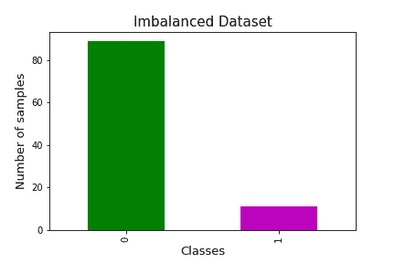
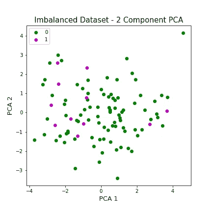
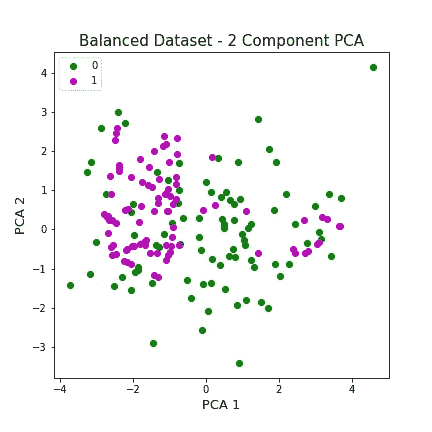
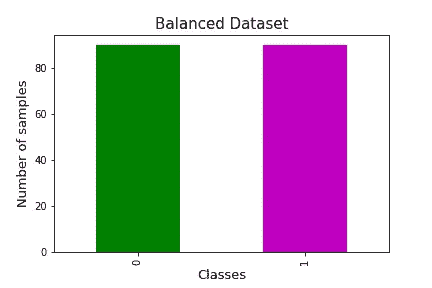

# 合成数据:在数据隐私和机器学习中的应用

> 原文：<https://towardsdatascience.com/synthetic-data-applications-in-data-privacy-and-machine-learning-1078bb5dc1a7?source=collection_archive---------26----------------------->

## 合成数据如何用于数据隐私保护和机器学习模型开发。

[去飞溅](https://unsplash.com/photos/gVSYfFsn-vU)

*“数据是数字时代的新石油”*。软件工程师和数据科学家经常需要访问大量真实数据来进行开发、实验和创新。不幸的是，收集这些数据还会带来安全责任和隐私问题，从而影响个人、组织和整个社会。包含个人身份信息(PII)和个人健康信息(PHI)的数据特别容易泄露，需要加以保护。

《通用数据保护条例》( GDPR)等法规旨在为用户数据提供一定程度的法律保护，但由于限制了数据的使用、收集和存储方法，因此带来了新的技术挑战。有鉴于此，合成数据可以作为一种可行的解决方案来保护用户数据隐私，遵守法规，并仍然保持发展和创新的速度和能力。

在本文中，我们将深入探讨合成数据提供的显著优势的细节:

1.  支持机器学习模型开发，允许实验和模型构建的更快迭代。
2.  以更加安全和隐私合规的方式促进数据所有者和外部数据科学家/工程师之间的协作。

# 什么是合成数据？

顾名思义，合成数据本质上是人工或编程生成的“假”数据，而不是通过真实世界的调查或事件收集的“真实”数据。合成数据的创建源于真实数据，一个好的合成数据集能够捕获底层结构，并显示与原始数据相同的统计分布，使其与真实数据无法区分。

***第一个*** 合成数据的主要好处是其支持机器学习/深度学习模型开发的能力。通常，开发人员需要灵活性来快速测试一个想法或尝试构建一个新模型。然而，有时需要数周时间来获取和准备足够数量的数据。合成数据为模型训练和实验的更快迭代打开了大门，因为它提供了如何在真实数据上建立模型的蓝图。此外，利用合成数据，ML 从业者获得了对数据集的完全主权。这包括控制类分离的程度、采样大小和数据集的噪声程度。在本文中，我们将向您展示如何使用合成数据来改善机器学习的不平衡数据集。

***第二*** 合成数据的主要好处是可以保护数据隐私。真实数据包含敏感和隐私的用户信息，不能自由共享，并且受到法律约束。保护数据隐私的方法，如 k-匿名模型，在一定程度上涉及省略数据记录。这导致信息和数据效用的整体损失。在这种情况下，合成数据是这些数据匿名化技术的绝佳替代方案。合成数据集可以更加公开地发布、共享和分析，而不会暴露真实的个人信息。

# 1.用于 ML 模型训练的合成数据

在本节中，我们将演示机器学习的合成数据的一个用例——修复不平衡的数据集，以支持更准确模型的训练。

# 什么是数据集不平衡，为什么它很重要？

> *“任何一个类分布不平等的数据集，在技术上都是不平衡的。然而，当问题的每一类的实例数量之间存在显著的，或者在某些情况下极端的不均衡时，数据集就被认为是不平衡的。”⁴*

当在不平衡的数据集上训练时，机器学习模型的准确性受到严重阻碍。这是因为模型在训练期间没有暴露于足够的少数类样本，抑制了它在测试和实际生产数据上评估时识别实例的能力。例如，在欺诈检测任务中，实际的欺诈记录总是属于少数类别，我们需要能够检测到这些记录。

我们可以用来解决不平衡数据集问题的一种技术是“重采样”。这可以通过欠采样多数或过采样少数来实现。下面，我们展示了如何使用 SMOTE(合成少数过采样技术)对少数类进行过采样，并修复不平衡的数据集。SMOTE 使用 k-最近邻算法，基于现有的少数观测值创建合成观测值。⁵

我们首先使用`sklearn`库创建一个不平衡的数据集，其中类 1 和类 2 的比率为(90:10)。

通过使用主成分分析(PCA)降低数据集的维度，我们可以在 2D 图中可视化我们的数据集。

接下来，我们应用 SMOTE 对少数类进行过采样，平衡我们的数据集，并绘制出我们的平衡数据集。

我们可以看到，类 1 和类 2 中的样本数量现在相等，数据集达到平衡。

**提示**

*   您应该只对定型数据集进行过采样。因此，在应用 SMOTE 之前，请确保将数据集分为训练和测试两部分。否则，测试数据集中会引入偏差，它不会反映对您的模型的真实评估。
*   解决不平衡数据集的其他方法包括:对多数类进行欠采样、收集更多数据、改变评估指标等。

# 2.用于隐私保护的合成数据

人们可以使用合成数据来保护数据隐私，而不是屏蔽或匿名原始数据。

**合成数据:**

*   保留原始数据的基础结构和统计分布
*   不依赖于原始数据的屏蔽或省略
*   提供强大的隐私保证，防止敏感的用户信息被泄露

下图显示了根据真实数据集样本创建的合成数据集。在下一篇文章中，我们将深入探讨使用条件生成对抗网络(GAN)从真实表格数据集生成合成表格数据集的方法，如下所示。

*样本合成数据:*

通过这样做，数据可以更自由地共享和发布，为政府机构、社会科学、卫生部门和软件公司之间的项目合作开辟了机会，在这些领域，数据受到隐私准则的严格监管。

# 结论

合成数据提供的最大优势之一是其保护用户数据隐私的能力。这为更大规模的数据共享、发布和协作提供了机会。此外，你可以转向合成数据作为支持机器学习模型和软件工具开发的手段，因为与收集真实世界的数据相比，这是一种更便宜、更快速的方法。

在下一篇文章中，我们将向您展示如何从真实数据集生成合成数据，并讨论一些限制、挑战和合成 data⁶.的未来

喜欢这篇文章吗？加入我们的 [**项目 Alesia**](https://projectalesia.com/) 以获得更多关于个人数据隐私、数字福祉、负责任的机器学习、工程等方面的资源！

<https://projectalesia.com/>  

# 参考

1.  [https://www . economist . com/leaders/2017/05/06/世界上最有价值的资源不再是石油而是数据](https://www.economist.com/leaders/2017/05/06/the-worlds-most-valuable-resource-is-no-longer-oil-but-data)
2.  [https://gdpr-info.eu](https://gdpr-info.eu/)
3.  路易斯安那州斯威尼市，2002 年 a。利用泛化和抑制实现 k-匿名隐私保护。里面的 j .不确定。绒毛。知道了。基于的系统。10 (05), 571–588.
4.  费尔南德斯、加西亚、加拉尔、普拉蒂、科劳兹克和埃雷拉(2018 年)。从不平衡的数据集中学习(第 1-377 页)。柏林:施普林格。
5.  舒拉、鲍耶、K. W .、霍尔、L. O .、凯格尔迈耶、W. P. (2002 年)。SMOTE:合成少数过采样技术。人工智能研究杂志，16，321–357。
6.  编辑评论[普拉特克·桑亚尔](https://medium.com/u/d94f61781a7?source=post_page-----1078bb5dc1a7--------------------------------)