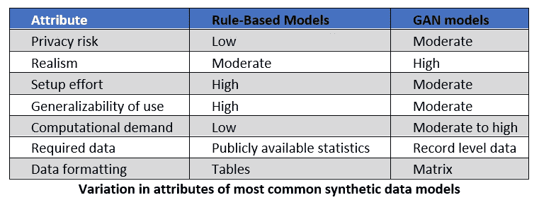
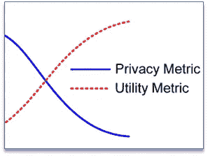
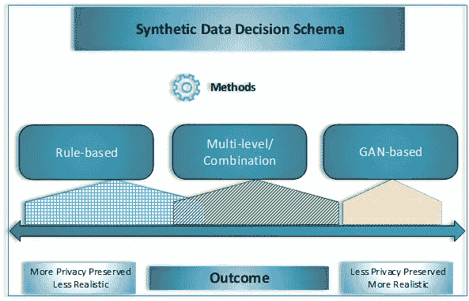

# VHA 的合成数据

> 原文：<https://towardsdatascience.com/synthetic-data-at-the-vha-8124989c7183?source=collection_archive---------37----------------------->

## 保护病人隐私的方法

供稿人(排名不分先后): [Purnell，Amanda L.](mailto:Amanda.Purnell@va.gov) (VHA 创新生态系统)；[豪沃思，加里 s .](mailto:gary.howarth@nist.gov)(NIST)； [Bhattacharya，Avik](mailto:Bhattacharya_Avik@bah.com) (博思艾伦汉密尔顿公司)；[麦考利、艾琳](mailto:McAuley_Erin@bah.com)(博思艾伦汉密尔顿公司)；[亨特·津克、哈利](mailto:haley.hunterzinck@sagebase.org)(Sage bio networks)；[沃特福德，肖恩](mailto:watford.sean@epa.gov)(环保局)；[任务，克里斯汀](mailto:christine.task@knexusresearch.com)(耐克森研究)。

克里斯·利维拉尼在 [Unsplash](https://unsplash.com?utm_source=medium&utm_medium=referral) 上拍摄的照片

# **简介**

数字健康数据的兴起正在推动医疗保健行业的重大变革。生物医学数据，包括临床笔记和成像、可穿戴健身追踪器以及基因组测序，可以被研究人员和临床医生用来寻找新的生物标记，从而潜在地提高医疗服务的效率。此外，收集健康的社会决定因素(SDoH)等非健康数据(如收入、教育水平、就业历史、食品安全和住房状况)有助于揭示地理或人口层面的医疗保健差异。

与此同时，这些数字数据财富带来的新机遇是以个人隐私为代价的。随着消费者、数据经纪人、技术平台等之间数据共享的广度。，患者隐私的风险增加了。

目前正在开发用于数字健康数据的统计和加密方法。这些保护隐私的数据挖掘(PPDM)技术可以给数据添加噪声，掩盖敏感细节，或者使研究人员能够在不移动数据的情况下使用数据进行机器学习。PPDM 技术旨在量化数据效用和隐私之间的权衡。例如，在科学效用受到损害之前，数据中可以加入多少噪声？在密码协议下哪些用例是可行的？

为了加快 PPDM 技术在医疗保健领域的采用，社区将从围绕这些技术的使用制定规范中受益。临床实践者和研究人员如何成功地将 PPDM 方法映射到具体的用例，标准是什么？健康隐私损失的标准和量化门槛是什么？

我们提供了一个在生物医学研究和临床企业中整合 PPDM 技术的问题和考虑的讨论。

# 什么是合成数据？

riefly，合成数据是模拟现实模式的数据，但与真实数据记录不一致。如果可以生成反映临床 EHR 数据中的模式的数据，而与生成这些数据时使用的实际数据记录没有任何可识别的相关性，这将对研究和临床环境中的数据隐私具有显著的益处。

合成数据有可能解决现实和隐私这两个看似矛盾的挑战。它必须反映用于生成数据集的基础真实数据中的特征频率和相关性，并且在训练模型和预测算法方面具有与使用真实数据集相当的效率。它还必须确保隐私风险的可能性最小化或理想情况下为零。因此，预测用于训练合成数据集的实际样本的能力应该保持尽可能低。

与该受众相关的合成健康数据的应用包括

研究小组和临床医生迄今无法获得的数据。

能够扩充训练数据集，以平衡数据集中代表性不足的组和结果。

能够从时间和日期的角度研究临床数据，以识别聚类和模式。

# ***生成合成数据***

由[马库斯·斯皮斯克](https://unsplash.com/@markusspiske?utm_source=medium&utm_medium=referral)在 [Unsplash](https://unsplash.com?utm_source=medium&utm_medium=referral) 上拍摄

合成数据通常通过不同的统计方法生成，具体取决于数据的使用案例。基于规则的方法(如 Synthea)和生成对抗网络(基于 GAN)的方法(如 CorGAN、medGAN 等。)被典型地使用，并且在卫生保健数据中受到了最多的关注。在医疗数据领域之外还使用了其他技术，如多个国家统计机构用于调查数据的多重插补。概率图形模型(PGM)也非常强大，并开始看到更多的用途。Syntegra.io、MDClone、Unlearn、Diveplane 等公司也开发了许多商业应用程序。

生成合成数据的不同模型在风险、收益、要求、工作和使用成本等方面提供了不同的权衡。我们试图在下面的图表中捕捉主要不同数据生成模型的合成数据输出的一些差异。

***选择合成数据的方法/工具***

【隐私与效用(刘等[1])

选择合适的算法和工具来生成合成数据，对于试图从患者数据中提取有意义信息的临床和研究项目的成功至关重要。成功的项目必须平衡个人在数据中被识别的低隐私风险和导致研究人员得出错误结论的嘈杂数据的低风险。通常，一个好的安全检查是将合成噪声与采样误差噪声进行比较。上图(隐私与效用)强调了这一点，来自刘等人的工作[1]。

因此，合成数据的用户必须沿着隐私-效用/真实性连续体选择方法，以找到最适合他们需求的数据生成算法。下面是一个简单的决策方案，用于根据具体项目的真实性和隐私需求，确定是采用基于 GAN 的方法、混合方法还是基于规则的方法来生成合成数据。

**选择合适的合成 PPDM(图片由作者提供)**

***评估合成数据的方法/工具***

对于所使用的任何方法，评估所生成的合成数据的质量是至关重要的。评估工具的一个例子是 k-边际度量。k-边际评估指标是为第一届 NIST 综合数据挑战赛开发的，在四年的比赛中，除了一场比赛外，其他比赛都使用了这一指标。它评估整个数据空间中两个数据集之间的分布相似性(k 个特征的每个可能组合的关系)。NIST 挑战赛发现 k-marginal 可以预测一系列其他分析的解决方案性能:如果一个综合解决方案在 k-marginal 测试中得分很高，它在其他数据质量指标或用例中也表现很好。此处列出了 k 边际评估的正式定义[。](https://nvlpubs.nist.gov/nistpubs/TechnicalNotes/NIST.TN.2151.pdf)

现代数据合成技术(如 GANS 或 r/synthpop 中使用的基于树的模型)通常使用完全条件合成，这意味着每个变量的模型都适合使用所有可用信息，以便捕捉数据中变量之间所有有意义的关系(包括令人惊讶或意想不到的关系)。这与开发模型时使用少量精选变量的旧方法有很大不同。当两个不同的数据子组在相同的变量上具有非常不同的分布模式时，一些模型可能很难正确地捕捉这两个组。在这种情况下，合成可以被划分以防止组冲突。NIST 的 k-边际度量对于识别数据中出现此问题的位置非常有效。反复评估合成数据质量，然后调整合成过程以解决任何未发现的问题的过程称为合成器调谐。

# **当前和最近的活动**

T 合成数据在保护隐私方面的潜在和有形优势已经导致了一些令人兴奋的新合作。它还刺激了为联邦卫生领域的临床医生和研究人员生成综合健康记录的研究。

*   NIST 的 PSCR 在 2018 年设立了两个连续的数据挑战。第一项是“不可链接的数据挑战”,向提出了保护个人身份信息同时保持数据集的分析效用的机制的概念论文颁奖。第二项是“差分隐私合成数据挑战”，要求参与者创造新方法，或改进现有的数据去识别方法，同时保留数据集的分析效用。所有解决方案都需要满足差分隐私保证，这是一种可证明的个人隐私保护保证。
*   NIH 在 2020 年年中宣布，MDClone 将为国家 COVID 群组协作(N3C)2 的合成工作流提供支持技术，这是一个用于托管新冠肺炎临床数据的集中式安全门户，可通过多种模型接受数据，并将其转换为通用的 OMOP 模型。
*   继 2018 年成功举办挑战赛后，NIST 于 2020 年举办了 PSCR 差分隐私时态地图挑战赛，该挑战赛提供公共安全数据集，并要求算法在保证保护个人隐私的同时最大限度地保护数据效用。

# **未来地区**

这一领域正在探索多个问题，包括:

*   量化生成数据的科学有效性。
*   量化根据生成的数据训练的模型的准确性和相关性，并与从真实数据集导出的模型进行比较。
*   验证所生成的数据实际上确实保护了隐私，并且真实数据样本中的成员关系推断仅最低限度地可能来自合成数据。上一节提到的 NIST 提出的挑战建立了介绍性基准，可以从隐私保护的政策角度进一步开发和利用这些基准。
*   评估生成和验证合成数据集的计算资源负载。

# 参考

[1]刘等.“差分隐私机制的隐私保持单调性”(2018).[来源网址](https://www.researchgate.net/publication/328587643_Privacy-Preserving_Monotonicity_of_Differential_Privacy_Mechanisms)

[2] Haley Hunter-Zinck，D-Lab 安全研究数据工作组“验证合成生成的电子健康记录数据的隐私保护属性”(2020)。

[3] Raths D .新闻文章-国家 COVID 群组合作准备向研究人员开放 Enclave(2020)。[来源网址](https://www.hcinnovationgroup.com/analytics-ai/big-data/article/21145744/national-covid-cohort-collaborative-preparing-to-open-enclave-to-researchers)

[4]d . Ridgeway，m . Theofanos，m . Manley，t .和 Task，c .挑战设计和从 2018 年差分隐私挑战中吸取的教训，技术说明(NIST TN)，马里兰州盖瑟斯堡国家标准与技术研究所(2021)。[来源网址](https://www.nist.gov/publications/challenge-design-and-lessons-learned-2018-differential-privacy-challenges)。 [PDF 出版](https://nvlpubs.nist.gov/nistpubs/TechnicalNotes/NIST.TN.2151.pdf)。