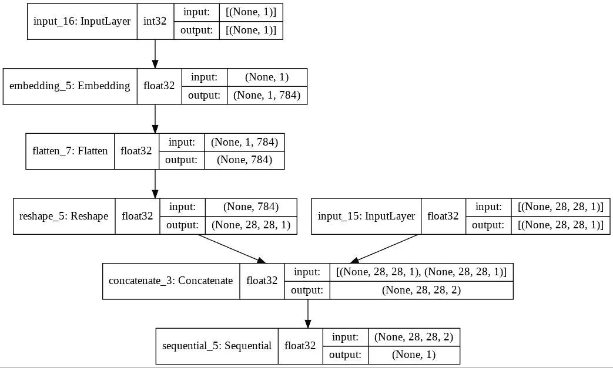

# 使用条件 GAN 的合成数据生成

> 原文：<https://towardsdatascience.com/synthetic-data-generation-using-conditional-gan-45f91542ec6b?source=collection_archive---------1----------------------->

## 修改 GAN 架构，以便更好地控制生成的数据类型


照片由 [Unsplash](https://unsplash.com?utm_source=medium&utm_medium=referral) 上的西提·拉赫马纳·马特·达乌德拍摄

# 为什么需要生成数据？

在信息技术领域，公司使用数据来改善客户体验，并为客户提供更好的服务。有时候，收集数据可能会很繁琐，而且成本很高。

在本文中，我们将讨论 GAN 和特殊条件 GAN，一种我们在 [Y-Data](https://syntheticdata.community/) 用于合成数据生成的方法。以及如何利用它们生成合成数据集。

# **甘**

GAN 是由 Ian Goodfellow 等人提出的。在 2014 年本文中。GAN 架构由两个组件组成，称为发生器和鉴别器。简单来说，生成器的作用是生成新的数据(数字、图像等。)与作为输入提供的数据集一样接近/相似，鉴别器的作用是区分生成的数据和真实的输入数据。

下面我们就来详细参观一下甘的算法工作原理:

o 生成器将一个随机数向量作为输入，并返回由其生成的图像。


**发电机输入(来源:** [**此处**](https://developers.google.com/machine-learning/gan/discriminator) **)**

o 发生器生成的图像与实像样本一起作为输入传递给鉴别器。


**鉴别器输入(来源:** [**此处**](https://developers.google.com/machine-learning/gan/discriminator) **)**

o 鉴别器采集两种类型的样本，来自真实数据集的图像和生成图像的样本。它返回一个介于 0 和 1 之间的概率值，其中越接近 1 的值表示属于真实数据集的图像变化越大，否则图像属于生成的图像样本的可能性越大。

o 当我们计算鉴频器损耗时，鉴频器的错误分类会受到惩罚。该*鉴别器损失*然后反向传播并更新鉴别器权重，这反过来改善了鉴别器预测。


**甘鉴别仪训练(来源:** [**此处**](https://developers.google.com/machine-learning/gan/discriminator) **)**

o 发电机然后在鉴别器分类的帮助下计算*发电机损耗*，并通过鉴别器和发电机反向传播以计算梯度。然后，它仅使用这些梯度更新发生器权重。


**甘发电机培训(来源:** [**此处**](https://developers.google.com/machine-learning/gan/generator) **)**

# **有条件——甘**

尽管 GAN 能够生成一些好的数据点示例，但是它不能生成具有目标标签的数据点，并且从其生成的数据集缺乏多样性。

有条件 GAN 是由 *M. Mirza* 在 2014 年末提出的。他修改了架构，将标签 ***y*** 作为参数添加到生成器的输入中，并尝试生成相应的数据点。它还向鉴别器输入添加标签，以便更好地区分真实数据。

以下是有条件 GAN 的架构:


**C-GAN 架构**

在这种架构中，随机输入噪声 ***Z*** 在联合隐藏表示中与标签 ***Y*** 相结合，GAN 训练框架允许在如何接收输入方面有很大的灵活性。

数据点 ***X*** 和 ***Y*** 连同生成输出***【G(z)***一起被传入鉴别器的输入，这与普通 GAN 架构中的情况相同

条件 GAN 的损失函数类似于 GAN:


**条件 GAN 损失功能**

# Python 实现

在这个实现中，我们将在时装-MNIST 数据集上应用条件 GAN 来生成不同服装的图像。该数据集包含 70，000 幅(60k 训练和 10k 测试)大小为(28，28)的灰度格式图像，像素值为 b/w 1 和 255。

数据集中有 10 个分类标签。它们中的每一个都用数字 b/w 0–9 来表示。下表列出了相应的标签:

0: T 恤/上衣

1:裤子

2:套头衫

3:着装

4:外套

5:凉鞋

6:衬衫

7:运动鞋

8:袋子

9:踝靴。

现在，让我们开始编写代码。首先，我们导入所需的模块，我们将 TensorFlow Keras API 来设计我们的架构。一些代码取自这个 book⁴:

现在，我们定义生成器架构，该生成器架构采用随机潜在向量和标签的组合作为输入，并生成该标签的图像。


生成器架构(源代码)

现在，我们定义鉴别器架构，该鉴别器架构将图像和标签作为输入，并输出它是真实的或生成的概率。



鉴别器架构(源代码)

下一步，我们将结合这两种架构，形成完整的 C-GAN 架构:

现在，是时候训练模型了，首先，我们定义采样函数，然后，我们训练模型。

```
2000 [D loss: 0.097897, acc.: 96.88%] [G loss: 4.837958]
4000 [D loss: 0.084203, acc.: 98.05%] [G loss: 5.004930]
6000 [D loss: 0.111222, acc.: 97.66%] [G loss: 4.664765]
8000 [D loss: 0.091828, acc.: 97.27%] [G loss: 5.158591]
10000 [D loss: 0.110758, acc.: 98.44%] [G loss: 5.750035]
12000 [D loss: 0.152362, acc.: 92.58%] [G loss: 4.261237]
14000 [D loss: 0.075084, acc.: 96.48%] [G loss: 5.566125]
16000 [D loss: 0.108527, acc.: 96.88%] [G loss: 9.546798]
18000 [D loss: 0.043660, acc.: 99.61%] [G loss: 6.730018]
20000 [D loss: 0.075157, acc.: 97.66%] [G loss: 6.238955]
```

现在，我们把生成的图片生成 GIF，他的一些代码是从[这里](https://www.tensorflow.org/tutorials/generative/dcgan)截取的。


Generated_Images(来源:代码)

# 结论

在本文中，我们讨论了用于合成数据生成的 GAN 和条件 GAN。而 GAN 则是合成数据生成领域的一个新发现。不同的研究者根据他们的需要修改了 GAN 背后的想法。一个这样的想法是 Conditional-GAN，它允许我们根据所需的标签生成数据。

# **参考文献**

[1]: Ian J. Goodfellow，J. Pouget-Abadie，M. Mirza 等人，(2014)。

[2]: M. Mirza，S. Osindero，[条件生成对抗网](https://arxiv.org/abs/1411.1784) (2014)。

[3]: H. Xiao，K. Rasul，R. Vollgraf， [Fashion-MNIST:一个新的图像数据集，用于对机器学习算法进行基准测试。](https://arxiv.org/abs/1708.07747)

[4]: J. Langr，V.Bok， [GANs in Action:深度学习与生成性对抗网络](https://www.amazon.com/GANs-Action-Learning-Generative-Adversarial/dp/B09237G4TH/) (2019)，Manning Publications

*本页面的部分内容是基于 Google* *创建和共享的* [*作品的修改，并根据*](https://developers.google.com/readme/policies) [*知识共享 4.0 归属许可*](https://creativecommons.org/licenses/by/4.0/) *中描述的条款使用。*