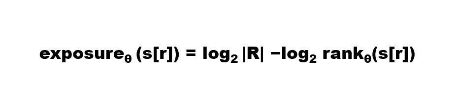
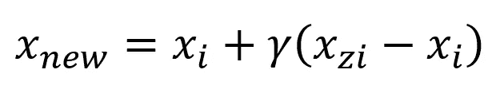

# 合成数据——数据保存人工智能的灵丹妙药？

> 原文：<https://towardsdatascience.com/synthetic-data-the-panacea-for-data-preserving-ai-298b48ec3189?source=collection_archive---------27----------------------->

## *生成合成数据的不同技术的比较分析*

[马太·亨利](https://unsplash.com/@matthewhenry?utm_source=medium&utm_medium=referral)在 [Unsplash](https://unsplash.com?utm_source=medium&utm_medium=referral) 上拍照

# 介绍

> **AI 改变了世界**

不管是好是坏，这完全是一个哲学上的争论，然而，上面的陈述几乎是真实的，是作为一个定律来陈述的。随着深不可测的数据量的无处不在的入侵，大量的 ML 算法，以及世界日益增加的复杂性，我们几乎处于这样一个点上，即我们快速增长的技术发展速度与计算要求的结合甚至可能使神圣的 [**摩尔定律过时**](https://www.technologyreview.com/2020/02/24/905789/were-not-prepared-for-the-end-of-moores-law/) 。

然而，正如每一次技术进步一样，我们现在正面临着来自数据爆炸性使用的迫在眉睫的威胁——数据隐私问题，它已经变得与被称为未来十年最重要的问题一样重要。通过这篇文章，我的目标是阐明数据隐私的综合含义，以及对当前技术的广泛观点，重点关注合成数据生成的方法，以及它们的定量-定性分析。尽管我已经尽力以一种简单的方式提出了我的发现，但我已经对人工智能领域有了一个总体的认识，并且通篇使用了其他专门的技术术语(主要是由于本文的简洁性质)。

# ***什么是数据隐私？***

尽管对数据隐私的简明定义还没有明确的共识，但它被宽泛地定义为处理敏感的个人数据所涉及的一系列实践，通常与 [**信息隐私**](https://en.wikipedia.org/wiki/Information_privacy) 领域重叠。正如 Patricia Thaine(联合创始人，私人 AI)在她的 [**文章**](/perfectly-privacy-preserving-ai-c14698f322f5)**中提到的，数据隐私一般有**四大支柱**—**

1.  ****培训数据隐私-** 对培训数据进行不良逆向工程以确定个人身份的相关风险。**
2.  ****输入隐私-** 与用户输入数据向外部参与者(包括模型创建者本身)泄露相关的风险。**
3.  ****输出隐私-** 与用户输出数据向用户本身以外的外部行为者泄露相关的风险。**
4.  ****模型隐私-** 与恶意方窃取模型相关的风险。**

**显而易见，对数据隐私的完整分析包括仔细分析与传统数据/模型管道的所有步骤相关的风险。自然，在人工智能的情况下，隐私问题不仅延伸到软件考虑，也延伸到硬件规范，这带来了自己的威胁。这篇文章将其讨论限制在训练数据隐私的领域，这是一个被认为与人工智能算法领域最兼容的概念。**

# ****数据隐私和人工智能****

**随着利用数据得出有意义结论的方法日益增多，定量执行这些计算的算法也日益增多。从简单的统计方法到监督算法领域，再到强大的深度学习领域，计算能力和得出的结论今天继续以非常高的速度增长。自然，随着这些算法的计算能力的提高，它使模型创建者能够使用比以往任何时候都多得多的数据特征，甚至有可能在一个算法中增加到数百万个特征。因此，这导致了恶性循环，如下所述。**

****

**技术的恶性循环(作者图片)**

**虽然从训练集和参数中获取敏感信息比简单的输入/输出相对更困难，但研究中有明确的证据表明逆向工程模型和重建数据的实际可能性。**

**例如，[1] Carlini 和 Wanger 在他们的研究中表明，一个模型在一个训练集中记忆罕见的信息是可能的。特别是，他们设计了一种算法，当在不考虑这种记忆的模型上实现时，可以很容易地从中提取稀有信息。暴露度量量化了信息的暴露，这在某种意义上显示了模型有多脆弱。**

**给定一个**金丝雀 s[r]** ，一个带**参数θ** 的模型，和**随机性空间 R** ，s[r]的曝光度为:**

****

**作者图片**

**等级是真实秘密(金丝雀)在所有可能秘密中的索引。虽然这里没有给出详细的分析，但是该度量与测试集的损失最小时暴露达到峰值的事实是一致的。**

# ****差分隐私** **来救援？****

**自然，为了防止这种数据泄漏，许多研究已经进入设计防止这种泄漏的方法，其中差分隐私的方法似乎是最有前途的一种。[2] Dwork、Nissim、McSherry 和 Smith 表明，如果某个校准(统计)噪声被引入数据集，那么几乎不可能到达数据集的发起者，因此在该方法中包含了设计隐私的概念。更具体地说，对于每个输出 O，任何对手都无法区分相差一个输入的两个数据集 D1 和 D2，即它们总是受到ε的度量的限制，如下所示。**

****

**作者图片**

**Pr=概率，E =ε(一个小的正实体)**

**尽管大肆宣传，差分隐私本身并不是一个完美的解决方案。关于什么是/不是私有的问题，该方法无法精确地在大型数据集上工作的问题还没有完全回答。**

**虽然**匿名数据**本身似乎是一个不错的选择，但它仍然容易遭到黑客攻击。臭名昭著的 [**用户身份识别事件**](https://www.securityfocus.com/news/11497) 当网飞向其提供匿名用户评级时，却发现它已被去匿名化，这向我们展示了与之相关的风险。因此，可以有把握地说**匿名化永远不够**。**

# ****合成数据——新范式****

**合成数据生成技术的出现极大地促进了数据隐私领域的发展。合成数据概念的历史根源可以追溯到 Little (1993 年)构想的部分同情数据概念，Rubin (1993 年)首先将其付诸实践，他使用多重插补生成十年一次的人口普查的合成版本。**

**虽然早期的方法使用参数建模，但根据开发精确模型的复杂程度，也使用非参数方法，即装袋、随机森林等。然而，正如我们前面提到的，就像预测完全被深度学习模型重新想象一样，这些模型现在也在生成合成数据方面发挥着重要作用。在本文中，我将讨论限制在合成数据的四种主要方法上。这些如下所述-**

## ****重击****

****合成少数过采样(SMOTE)** 是一种生成合成数据的方法，主要用于分类。[3] Chawla、Boyle、Hall 和 Kegelmeyer 在 2003 年引入了这一概念，以处理不平衡数据集，这种数据集往往会在数据集中引入隐含偏差。虽然它是其他深度学习方法的例外，但它的各种版本仍在使用，在实现中引入了轻微的修改。**

**在一个非常基本的方式中，它可以被概念化如下-**

****

**作者图片**

***考虑数据点的 k 个邻居，其中 y 是 0 到 1 之间的随机数。***

## ****VAE****

****可变自动编码器(VAE)** 是自动编码器的最新增强版本，这是一种基于神经网络的合成数据生成方法。它是一个前馈神经网络，其中数据集最初由编码器压缩为压缩表示，然后由解码器尝试解压缩。它使用瓶颈的概念来压缩数据，这实质上涉及到限制信息流。**

****

**作者图片**

## ****甘****

**也许没有算法比 Ian Goodfellow 和他的同事引入的生成式对抗网络(GAN)在人工智能领域产生的影响更大[4]。这些算法通常通过查看非常精细的级别来学习测试数据集的分布，以生成合成数据集。它们的本质是其中存在两个相互竞争的神经网络，称为生成器和鉴别器。他们采用了一种两人游戏理论方法，即生成器从噪声中模拟数据分布，鉴别器根据真实数据鉴定生成的数据是真实的还是虚假的，因此随着适应性的增加，当生成器在模拟真实数据方面变得越来越好时，鉴别器在鉴别它方面变得越来越好，从而生成看起来非常真实的合成数据集。**

## ****WGAN 和 WCGAN****

****Wasserstein GAN** 和**Wasserstein Conditional GAN**是 GAN 模型的最新扩展，其中用作鉴别器函数的正常 [**JS 散度**](https://en.wikipedia.org/wiki/Jensen%E2%80%93Shannon_divergence) 矩阵被 Wasserstein 矩阵替代，wasser stein 矩阵在某种意义上测量概率分布之间的距离，从而提供某种质量测量。当 WGAN 进一步以 C 类为条件以产生一个以上的标签时，WCGAN 开始生效，这进一步提高了进一步学习的质量，这是对通过早期方法产生的合成数据的显著改进。**

****

**作者图片**

*****边注* -** 上述算法的实现可以通过 Tensorflow 和 Keras 来完成。对于 WGAN 的工作实现，请查看本文[**。**](https://pub.towardsai.net/how-to-generate-synthetic-data-4ae4ff156344)**

# ****合成数据和数据隐私？****

**一开始，合成数据似乎是处理数据隐私的最有前途的方法。然而，要注意陈述，需要严格开发**质量**和**隐私**的参数，以给出明确的结论性事实。在质量领域，**成对皮尔逊系数**可用于确定合成数据与真实数据的质量【5】。该公式可以表述为-**

****

**作者图片**

**差异越小，合成数据就越接近真实数据。关于哪种模型最适合生成合成数据的问题需要解释一下。一般来说，已经观察到模型的选择取决于数据集。更正式地说，为了找出哪个模型效果最好，我们可以**设计一个系统**，它通过所有四个模型检查合成数据的质量和隐私，并以系统的方式得出结论。但是纯粹从隐私的角度来说，GANs 是最突出的。简单的原因是，与 VAE 和 SOTE 不同，GAN 不需要真实数据集作为核心输入，即它们的生成器完全与真实数据集分离。随着 WGAN 和 WCGAN 的进一步改进，我们可能会朝着正确的方向快速解决数据隐私问题。**

# ****结论****

**尽管合成数据集的调整可能是朝着正确方向迈出的重要一步，但仅靠它们并不能完全防止隐私泄露。真正的解决方案必须是各种技术的理想组合，如***【WCGAN+差分隐私*。尽管该研究领域还处于起步阶段，但是已经出现了许多新的解决方案，这些方案综合了学术界和工业界的关注。例如，[**Synthetic data . community**](https://syntheticdata.community/)，一个开源社区提供了像 WGAN、Time Synthetic GAN 这样的工作深度学习模型来生成合成数据。不仅如此，学术研究也在迅速赶上。虽然速度令人印象深刻，但这些技术层必须足够强大，以允许我们处理隐私的软件和硬件方面，并维护所谓的四个基本支柱(如上所述)。****

> **总之，虽然人工智能可能使我们能够扮演上帝之手，但数据的隐私需要得到确保，以便我们不会最终烧伤自己的手。**

## ****参考文献****

**[1] Carlini，Nicholas 等，*秘密分享者:评估和测试神经网络中的非故意记忆(2019)* ，第 28 届 USENIX 安全研讨会(USENIX 安全 19)。**

**[2] Dwork C .，McSherry F .，Nissim K .，Smith A. (2006) *在私有数据分析中校准噪声对灵敏度*。载于:Halevi S .，Rabin T .(编辑)密码学理论。TCC 2006。计算机科学讲义，第 3876 卷。斯普林格，柏林，海德堡。[https://doi.org/10.1007/11681878_14](https://doi.org/10.1007/11681878_14)**

**[3]舒拉、鲍耶、霍尔和凯格尔迈耶(2002 年)。 *SMOTE:合成少数过采样技术*。《人工智能研究杂志》*第 16 期*，第 321 至 357 页。**

**[4]古德费勒等人(2014)。生成对抗网络。*神经信息处理系统进展*，第 2672 至 2680 页。**

**[5] Beaulieu-Jones，Wu 等，(2019) *隐私保护的生成式深度神经网络支持临床数据共享，*心血管质量与结果杂志[、](https://doi.org/10.1161/CIRCOUTCOMES.118.005122)**