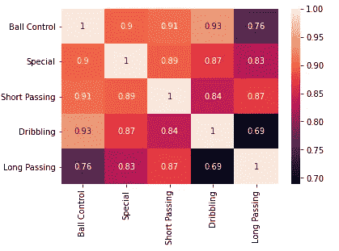
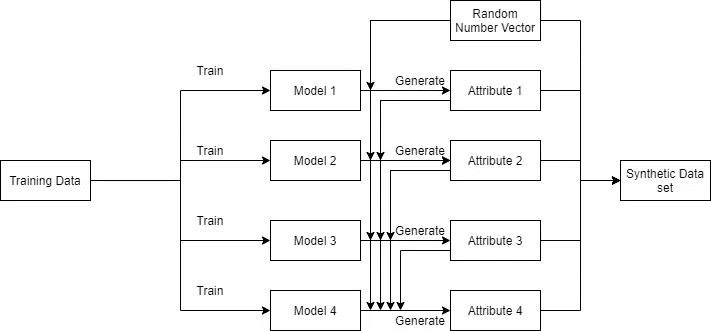
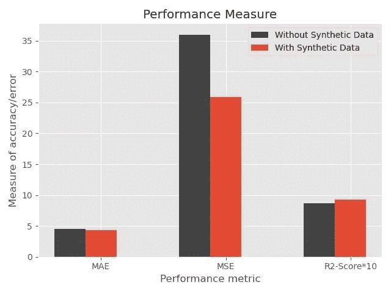

# 合成数据来拯救！

> 原文：<https://towardsdatascience.com/synthetic-data-to-the-rescue-2241f626303e?source=collection_archive---------27----------------------->

## 没有足够的数据？放心吧！合成数据在这里！

由于缺乏数据、隐私和保密性，数据短缺已成为卫生、体育、制造和法律等行业中需要解决的重要问题。我喜欢在 Linkedin 上联系。

由[卢克·切瑟](https://unsplash.com/@lukechesser?utm_source=medium&utm_medium=referral)在 [Unsplash](https://unsplash.com?utm_source=medium&utm_medium=referral) 上拍摄的照片

# **问题陈述:生成合成数据**

今天，社会的多个部门正在取得巨大进步，利用机器学习技术来执行预测、分类、分割等任务。虽然它在一些领域有很高的影响，但由于数据匮乏，机器学习技术在一些领域，即医疗保健和体育领域，还没有在最高级别使用。此外，由于缺乏数据，机器学习模型不会产生最佳结果，这不适合误差幅度很小的情况。因此，这里合成数据的生成成为必须。

产生的合成数据将充当真实数据的模仿，模仿其属性，并增加数据量以输入到机器学习模型中。此外，合成数据在产生可用于检查事件并确保事先采取必要行动和预防措施的情况方面发挥着重要作用。

有两种类型的合成数据——完全合成的和部分合成的。

如果一个数据集中没有原始数据，那么它就是一个完全合成的数据集。如果在新生成的数据集中有任何原始数据，那么它在一定程度上就是一个合成数据集。在部分合成的数据集合中，仅使用合成数据生成技术来再生敏感信息。

因此，意识到非常需要有足够的数据来训练具有更高精度和效率的模型，我们提出了一种使用随机数的迭代回归分析集来生成具有与真实数据集相似的统计质量的合成数据的方法。来自 [data.world](https://data.world/raghav333/fifa-players) 的 FIFA 视频游戏数据集已被用于支持这种方法并展示其用例。

照片由 [Jannik Skorna](https://unsplash.com/@jaenix?utm_source=medium&utm_medium=referral) 在 [Unsplash](https://unsplash.com?utm_source=medium&utm_medium=referral) 上拍摄

最初，对数据进行了深入了解。对不同属性之间的相关性进行了观察。选择可以被模仿以获得人工数据的五个最高度相关的属性。属性是-控球，运球，特殊，短传，长传。

观察到的相关性

接下来，我们确保通过检查任何缺失值、重复值或异常值来预处理数据。

***让我们深入了解一下方法、架构和结果的概况。***

系统结构

首先，使用一个随机整数的 M 维向量，使用一个模型来生成合成数据的 M 维向量。对于接下来的步骤，重复相同的过程，只确保第一步之后新生成的数据也作为第二步的输入数据。这个过程一直进行到所有新列都生成为止。

为了分析所获得的结果，我们提出了以下度量标准来衡量回归模型的准确性

1.  平均绝对误差

2.残差平方和

3.R2 分数

*绩效评估*

最后，我想说的是，这是我在 2020 年第四届 ICECA 上提交的论文的简要概述。它成功地在 IEEE Explore 上发表。

目的是使用一种简单而有效的叫做**迭代回归分析的技术生成合成数据。**

感谢您抽出时间阅读并简要概述我所做的工作；如果你有兴趣了解更多关于这个项目的信息，或者想要讨论它，请随时通过 Linkedin 联系我。

如果你有兴趣阅读这篇文章，请点击查看。

我和我的同事吉尔·科塔里和桑斯卡·沙阿一起写这篇论文。

**论文参考文献:**

1.  [https://ieeexplore.ieee.org/document/1611688](https://ieeexplore.ieee.org/document/1611688)
2.  [https://ieeexplore.ieee.org/document/6890935](https://ieeexplore.ieee.org/document/6890935)
3.  [https://ieeexplore.ieee.org/document/1197502](https://ieeexplore.ieee.org/document/1197502)
4.  [https://ieeexplore.ieee.org/document/8115698](https://ieeexplore.ieee.org/document/8115698)
5.  【https://data.world/raghav333/fifa-players 号

对文章的引用:

1.  【https://www.simerse.com/synthetic-data 