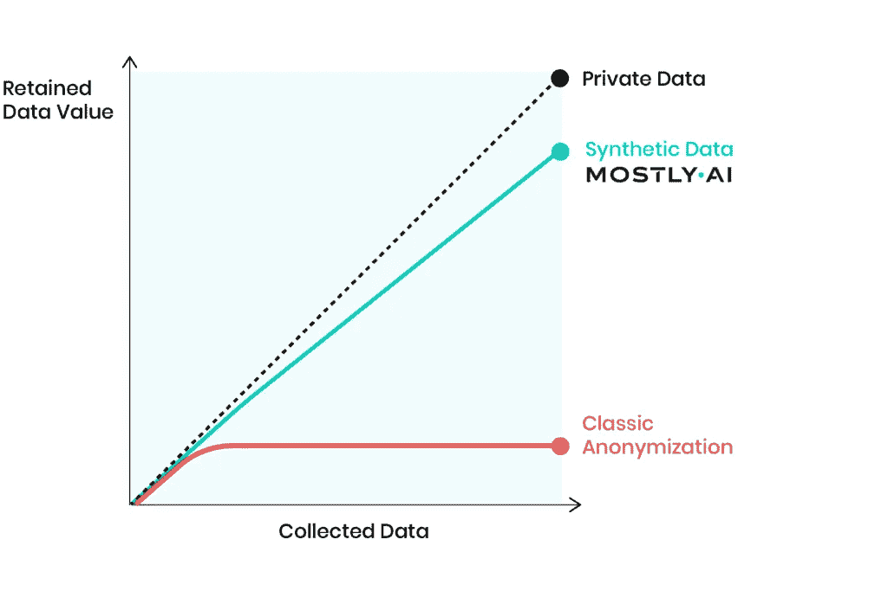

# 合成生成的数据—它将来会超过真实世界的数据吗？

> 原文：<https://towardsdatascience.com/synthetic-generated-data-will-it-surpass-real-world-data-in-the-future-bf6ef8b05e51?source=collection_archive---------41----------------------->

## 为什么每个公司都依赖于合成数据集，它是如何生成的

弗兰基·查马基在 [Unsplash](https://unsplash.com?utm_source=medium&utm_medium=referral) 上拍摄的照片

为任何数据科学项目找到合适的数据集都是一项具有挑战性的任务。机器学习模型依赖于数据集的质量和数量。而且，训练一个健壮的人工智能模型，需要大量的数据。

## 什么是合成数据集？

顾名思义，合成数据集类似于真实世界的数据集，但以编程方式生成。与现实世界的数据集不同，它不是通过任何现实生活的手段、调查或实验收集的。合成是根据数据科学项目的要求生成的，用于广泛的活动，包括训练健壮的人工智能模型、测试和验证模型。

(图片由作者提供)，合成数据

## 为什么合成数据集很重要？

合成数据集晚于真实数据集有几个原因:

*   **特定数据需求:**可以生成合成数据集，以满足任何数据科学项目对数据集的特定需求，这些项目无法使用真实世界的数据集来完成。
*   **科技巨头对海量数据的控制:**每次都会产生大量的数据，但是数据集的控制是由谷歌、微软、亚马逊、脸书等一些科技巨头来完成的。小公司或初创公司无法获得大量准确的数据集，因此他们必须依赖人工生成的数据集或合成数据。
*   **数据隐私:**数据隐私是需要考虑的一个重要方面。数据可能会被黑客滥用，因为他们可以通过对模型进行结构化查询来获取个人数据。可以对推断个人数据的模型执行白盒和黑盒攻击，并且可以改变模型输出。
*   **生成数据以处理边缘情况:**模型需要针对每种情况进行训练和测试。在某些情况下，现实世界的数据集可能无法用于训练或测试模型。对于自动驾驶汽车项目，为了处理有人突然出现在车辆前面的情况，记录这样的真实世界可能有风险，因此合成数据生成是可行的。
*   **昂贵的真实世界数据集:**在某些情况下，记录真实世界数据集可能非常昂贵，在这种情况下，生成符合项目要求的合成数据集可能是最经济的选择。为自动驾驶汽车记录真实世界的数据集可能很昂贵，相反，计算机生成的模拟可能是一种可行的替代方案。

合成数据可能会改变数据科学初创公司或小公司的游戏规则。大部分是。AI 是一个人工智能驱动的合成数据生成平台，它声称真实世界数据集中 99%的信息可以在人工生成的数据集中回收。这使得合成数据完全匿名，就像真实的一样。

(来源:[大部分是。AI](https://mostly.ai/why-synthetic-data/) ，保留数据与收集数据的关系图

# 合成数据生成:

有多种技术可以生成合成数据集。在确定生成合成数据的方法之前，必须弄清楚他们想要的合成数据的类型。大致有两大类:

*   全合成数据生成
*   部分合成数据生成

生成人工数据集的不同技术有:

*   重击
*   阿达辛
*   数据扩充
*   可变自动编码器
*   生成对抗网络

> 阅读下面的文章，了解更多关于如何使用开源 python 库创建人工影像数据集的信息。

 [## 使用 Python 为 AI/ML 项目创建自定义图像数据集

### 使用 Python 库的自定义影像数据集

medium.com](https://medium.com/swlh/create-custom-image-dataset-for-ai-ml-projects-using-python-72a62520f072) 

# 结论:

在机器学习中，对合成数据集的需求正在快速增长，因为机器学习模型是根据需求使用大量准备良好的数据来训练的，并且获得这样的真实世界数据集非常困难。

合成数据集还有几个额外的好处，例如标注的准确性、敏感信息的替换、数据生成的简便性等等。

> 感谢您的阅读