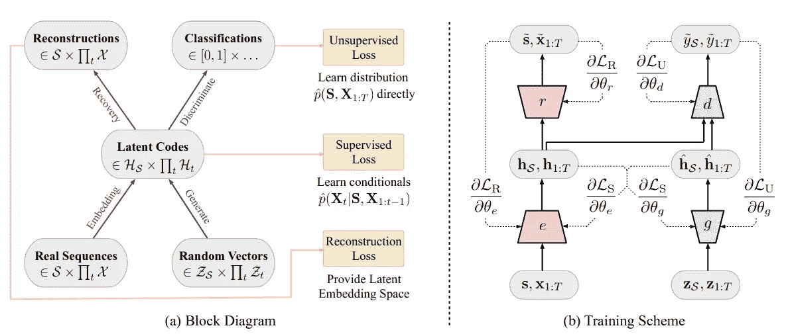
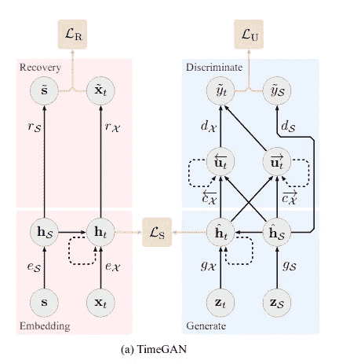
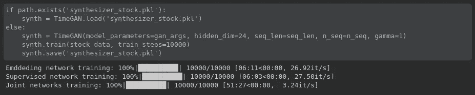
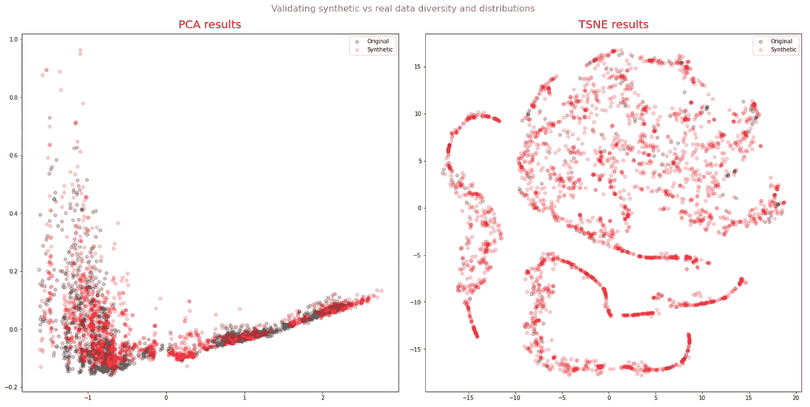
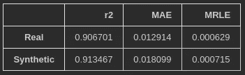

# 合成时间序列数据:GAN 方法

> 原文：<https://towardsdatascience.com/synthetic-time-series-data-a-gan-approach-869a984f2239?source=collection_archive---------1----------------------->

## [实践教程](https://towardsdatascience.com/tagged/hands-on-tutorials)

## 用*定时器*生成合成时序数据

时间序列或顺序数据可以定义为任何具有时间依赖性的数据。**很酷**，嗯，*但是哪里可以找到序列数据呢？嗯，无处不在，从信用卡交易、我的日常事务和行踪到医疗记录，如心电图和脑电图。尽管序列数据很容易找到并且非常有用，但是有很多原因导致没有利用它——从[隐私法规](https://medium.com/ydata-ai/synthetic-data-1cd0ba907609)到其存在的稀缺性。*

在我以前的一篇帖子中，我已经介绍了[生成对抗网络(GANs)学习和生成新的合成数据](/how-to-generate-synthetic-tabular-data-bcde7c28038a)的能力，这些数据保留了真实数据集的实用性和保真度，然而生成表格数据比生成应该保留*时间动态的数据集要简单得多。*到时间序列数据建模成功意味着一个模型不仅必须捕获每个时间点内的数据集特征分布，还应该能够捕获这些特征随时间变化的复杂动态。我们也不能忘记，每一个时间序列都是作为一个可变长度相关联的。

但是这是一项具有挑战性的任务，并不意味着它是不可能的！ [Jinsung Yoon](https://scholar.google.com/citations?user=kiFd6A8AAAAJ&hl=ko) 和 [Daniel Jarret](https://scholar.google.com/citations?user=Pczk-PQAAAAJ&hl=en) 在 2019 年提出了一种新颖的 GAN 架构来模拟顺序数据—[time GAN](https://papers.nips.cc/paper/2019/file/c9efe5f26cd17ba6216bbe2a7d26d490-Paper.pdf)——我将在这篇博文中通过一个实际例子来介绍这种架构。

# 时序生成对抗网络

TGAN 或时间序列生成对抗网络于 2019 年提出，作为一个基于 GAN 的框架，能够在各种不同的领域生成现实的时间序列数据，即具有不同观察行为的序列数据。与其他 GAN 架构(例如 [WGAN](/how-to-generate-synthetic-tabular-data-bcde7c28038a) )不同，在其他 GAN 架构中，我们对真实数据和合成数据都实施了无监督的对抗性损失，TimeGAN 架构引入了*监督损失的概念—* 鼓励模型通过使用原始数据作为监督来捕捉数据中的时间条件分布。此外，我们可以观察到一个*嵌入网络*的引入，它负责减少对抗性学习空间维度。

[TimeGAN](https://papers.nips.cc/paper/2019/file/c9efe5f26cd17ba6216bbe2a7d26d490-Paper.pdf) 框图和训练方案如文中所述

> ***time gan 有什么新特性？***
> 
> 与用于顺序数据的其他 [GAN 架构不同，](https://www.researchgate.net/publication/336147063_Generating_High-fidelity_Synthetic_Time_Series_Datasets_with_DoppelGANger)所提出的框架能够生成其训练以处理混合数据设置，其中静态*(属性)*和顺序数据*(特征)*能够同时生成。
> 
> 对超参数变化不太敏感
> 
> 与其他架构相比，这是一个更稳定的培训流程。

## 使用 TensorFlow 2 实现

如上所述，TimeGAN 是一个合成由 4 个网络组成的顺序数据的框架，这 4 个网络在数据建模的过程中扮演不同的角色:预期的*生成器*和*鉴别器*，以及通过*恢复*和*嵌入器*模型。

[用 RNNs 实例化的 TimeGAN](https://papers.nips.cc/paper/2019/file/c9efe5f26cd17ba6216bbe2a7d26d490-Paper.pdf) 框架

为了这个例子的目的，我决定用一个非常相似的架构来简化所有的 4 个元素:一个 3 层的 GRU 网络。但是这种架构可以改变为更多或更少的层，也可以在 **GRU** 和**lstm**之间选择。

用于实例化 TimeGAN 4 主要组件网络的代码

这导致了每个网络元素的定义，如下面的代码片段所示。

每个框架网络的结果类示例

所有 TimeGAN 类都已实现。

就损失而言，时间由三部分组成:

*   **重建损失**，指的是自动编码器(嵌入器&恢复)，简单来说就是比较编码数据与原始数据相比的重建情况。
*   简单地说，**监督损失**负责捕捉生成器在潜在空间中如何逼近下一个时间步长。
*   **无监督损失**，这个我们已经很熟悉了，它反映了生成器和鉴别器网络之间的关系(最小-最大博弈)

给定架构选择和确定的损耗，我们有三个训练阶段:

1.  在所提供的顺序数据上训练自动编码器以进行最佳重建
2.  使用真实序列数据训练管理者来捕获历史信息的时间行为，最后，
3.  四个分量的组合训练，同时最小化前面提到的所有三个损失函数。

详细说明训练阶段的完整代码可在[y 数据合成](http://github.com/ydataai/ydata-synthetic)中找到。

使用 TensorFlow 1 *可以在这里* 找到 TimeGAN 的原始实现。

# 合成股票数据

用于评估由 *TimeGAN* 框架生成的合成数据的数据，指的是[谷歌股票数据](https://finance.yahoo.com/quote/GOOG/history?p=GOOG)。数据有 *6 个时间相关变量*:开盘、盘高、盘低、收盘、调整收盘和成交量。

在合成数据之前，我们必须首先确保一些预处理:

1.  将序列缩放到[0，1]之间的范围。为了方便起见，我决定利用 scikit-learn 的**minmax scaler；**
2.  创建滚动窗口——根据最初的论文建议，我创建了包含 24 个数据点重叠序列的滚动窗口。

根据原始论文中的建议，我决定对合成器进行 10000 次迭代训练，但是要记住，为了返回最佳结果，这些值必须针对每个数据集进行优化。

10000 次迭代的合成器训练

你可以在本笔记本中找到包括数据下载、处理和合成的完整流程。

## 测量合成数据的保真度和效用

现在我们已经能够综合我们的数据，是时候检查新数据是否能够正确地再现原始股票数据中观察到的行为了。

**视觉对比**

我最喜欢的比较真实数据和合成数据的方法之一是通过可视化。当然，就自动化而言，这对于验证新合成数据的质量并不理想，但它已经给了我们一个很好的想法。为了确保结果的 2D 可视化，应用了具有两个组件的 **TSNE** 和 **PCA** 。

结果非常有希望，因为我们看到合成数据点和真实数据点之间几乎完美的重叠。

主成分分析和 TSNE，包含合成和真实股票数据的两个部分。

**综合数据实用程序——列车综合测试真实**

有很多不同的指标可以用来衡量数据的效用，如 [SRA 和 TSTR](https://arxiv.org/pdf/1806.11345.pdf) 。

在这个例子中，我们决定采用 [TSTR 方法](https://medium.com/ydata-ai/generating-synthetic-tabular-data-with-gans-part-2-a0aba150539#:~:text=With%20TSTR%2C%20the%20basic%20idea,quality%20of%20the%20synthetic%20dataset.)来验证我们合成数据的效用。为了用作回归模型，我决定采用一个简单的结构，有 12 个单元的单层 GRU。

回归网络定义

在训练模型之前，我们必须准备输入:

*   75%的数据被用作训练数据(对于合成和真实数据集)
*   25%的真实数据被用作测试集。

对于根据合成数据训练的模型和根据真实数据训练的模型，我都使用验证集损失作为早期停止标准。下面是测试集获得的总结结果。

真实测试集上的结果

# 结论

该实验获得的结果在合成序列数据的生成方面是非常有前途和令人兴奋的。然而，需要指出一些警告:研究中的数据可以被认为是非常简单的，因为它相对较小，具有每日时间频率，在缺失值方面没有意外，并且维度(列方面)相对较低。更不用说，**训练时间非常密集。**

但毫无疑问，生成性对抗网络是令人印象深刻的框架，可以用于比合成数据生成更广泛的领域。对于那些希望继续探索合成数据生成的人，可以看看我们的 [GitHub 库](https://github.com/ydataai/ydata-synthetic)。我们将用新的生成算法和新的数据更新它，我们邀请你来合作！

[*法比亚娜*](https://www.linkedin.com/in/fabiana-clemente/) *是 CDO*[*y data*](https://ydata.ai/?utm_source=medium&utm_medium=signature&utm_campaign=blog)*。*

**人工智能的改进和合成数据。**

YData 为数据科学家提供了第一个数据集实验平台。