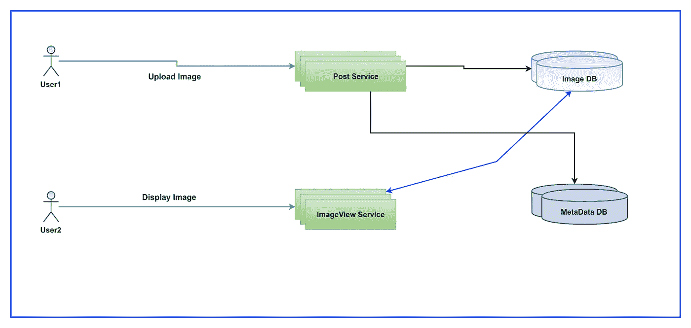

# Instagram 系统设计分析

> 原文：<https://towardsdatascience.com/system-design-analysis-of-instagram-51cd25093971?source=collection_archive---------1----------------------->

## 如何设计一个像 Instagram 这样的照片分享服务？

照片由[赞·李](https://unsplash.com/@zane404?utm_source=medium&utm_medium=referral)在 [Unsplash](https://unsplash.com?utm_source=medium&utm_medium=referral) 拍摄

系统设计是软件工程中 ***最重要的*** 部分之一。开始设计一个系统是令人生畏的。一个主要原因是软件架构书籍中描述的术语很难理解。而且没有固定的准则。你检查的每个地方似乎都有不同的方法。对于一个新的学习者来说，它变得令人困惑。

于是，我根据自己学习建筑课程的经验，着手设计一个系统。这是初学者系统设计系列的一部分(下面给出了链接)。对于这一个，让我们设计一个类似 Instagram 的照片分享服务。

## 系统的定义:

我们需要明确系统的目标。*系统设计是一个如此庞大的话题；如果我们不把它缩小到一个特定的目的，那么设计系统就会变得复杂，尤其是对于新手来说。*

Christian Wiediger 在 [Unsplash](https://unsplash.com?utm_source=medium&utm_medium=referral) 上拍摄的照片

Instagram 是一项照片分享服务，用户可以上传照片和视频，并与其他用户分享，大多数是他们的粉丝。由于这是一个练习，我们将设计一个 Instagram 主服务的简单版本。

在这项服务中，用户可以分享照片并关注其他用户。每个用户都有一个新闻源。“新闻订阅”由用户关注的所有人的热门照片组成。

## 系统的要求:

在这一部分，我们选择系统的功能。系统要求分为两部分:

**功能需求:**

这种类型的需求是系统必须交付的。你可能会说这是系统的主要目标。

首先，对于 Instagram，用户应该能够上传/下载/查看照片。用户可以根据照片/视频标题搜索图像。一个用户可以关注其他用户。另一个重要特性是，系统应该显示用户的新闻提要，其中包含用户关注的所有人的照片。

由于这是系统的惯例，我们不考虑照片中的标签、基于标签的搜索、喜欢和评论功能等。

**非功能需求**

性能、可用性、一致性、可伸缩性、可靠性等。，是系统设计中重要的质量要求。我们需要分析系统的这些需求。

作为一个系统设计者，我们可能希望有一个高度可用的设计，非常高的性能，系统中一流的一致性，高度安全的系统，等等。但是不可能在一个系统中实现所有这些目标。我们需要将需求作为系统设计的限制。那么，让我们定义一下我们的 nfr:

我们的系统应该高度可用。对于任何 web 服务来说，这都是一个强制性的要求。主页生成延迟应该最多为 200 毫秒。如果首页生成时间过长，用户会不满意，这是不能接受的。

当我们选择系统的高可用性时，我们应该记住这可能会妨碍整个系统的一致性。该系统还应该高度可靠，这意味着用户上传的任何照片或视频都不应丢失。

在这个系统中，照片的搜索和浏览不仅仅是上传。由于该系统将有更多的读取操作，我们将专注于建立一个可以快速检索照片的系统。在查看照片时，延迟需要尽可能低。

## 数据流:

***如果您不确定系统设计从哪里开始，请始终从数据存储系统开始。这将有助于使你的注意力与系统的要求保持一致。***

我们需要在高层支持两个场景，一个是上传照片，另一个是查看/搜索照片。我们的系统需要一些[对象存储](https://en.wikipedia.org/wiki/Object_storage)服务器来存储照片，还需要一些数据库服务器来存储元数据信息。

定义数据库模式是理解系统不同组件之间数据流的第一步。我们需要存储用户档案数据，如追随者名单，用户上传的照片。应该有一个表来存储所有关于照片的数据。如果我们想首先显示最近的照片，我们需要索引(PhotoID，CreationDate)。数据库中的表可以是:

> ***表格名称:表格索引 1、索引 2 等***
> 
> *照片:照片 ID (pk)、用户 ID、照片位置、创建日期*
> 
> *用户:用户标识(主键)，姓名，电子邮件，出生日期，最后登录时间*
> 
> 跟随:用户 ID1，用户 ID2(成对 pk)
> 
> FeedItem: FeedID(pk)，UserID，Contents， *PhotoID* ，CreationDate
> 
> * *主键=主键

我们可以将上面的表存储在像 MySQL 这样的 RDBMS 中，因为我们需要表之间的连接。但是关系数据库也有自己的挑战。尽管跨多个服务器扩展关系数据库是可能的，但这是一个具有挑战性的过程。我们可以将照片存储在分布式文件存储器中，如 [HDFS](https://en.wikipedia.org/wiki/Apache_Hadoop) 或 [S3](https://en.wikipedia.org/wiki/Amazon_S3) 。

当用户上传照片时，将它们存储在数据库中是一个缓慢的过程，因为它们存储在磁盘上。但是在读取的情况下，这个过程会更快，特别是如果我们从缓存中提供服务的话。

**图:独立的上传和下载服务**(图片由作者提供)

由于上传是一个缓慢的过程，如果我们把写和读照片放在同一个服务器上，系统可能会因为所有的“写”请求而变得太忙。在设计我们的系统之前，我们必须考虑网络服务器有一个连接限制。

假设一台服务器在任何时候最多可以有 5000 个连接。因此，它不能有超过 5000 个并发上传或下载。为了处理这种类型的瓶颈，我们可以使用**责任分离**。

我们可以将读取和写入分成两个独立的服务。因此，我们将有一些用于读取的服务器和不同的用于写入的服务器。这种分离也将使我们有机会独立扩展每项业务。

## 可用性和可靠性:

我们不能丢失用户上传的照片。可靠性是这个系统的一个重要因素。因此，我们需要每个文件有多个副本。在这种情况下，如果一个服务器坏了，我们仍然有这些照片的其他副本。

我们不能在系统中有单点故障。如果我们保留一个组件的多个副本，就可以消除系统中的单点故障。为了构建一个高度可用的系统，我们需要在系统中保存服务的多个副本。因此，即使一些服务器关闭，系统也可能保持可用。在系统中创建冗余还可以在危机中提供备份。

图:可用性服务和数据库的多个副本(图片由作者提供)

**可扩展性:**

为了支持数百万用户，我们需要对数据库进行分区，以便将我们的数据划分和存储到不同的数据库服务器中。我们可以对元数据使用数据库分片。

**基于用户标识的分区:**

如果我们基于“用户 ID”划分元数据数据库，我们可以将所有用户照片保存在同一个碎片中。一个用户似乎有将近 3 TB 的数据。如果一个数据库碎片是 1TB，我们将需要每个用户的三个数据碎片。

为了更好的性能和可伸缩性，我们可以保留十个碎片。在这种情况下，我们可以通过 UserId%10 找到碎片号，并在那里存储数据。

如果用户是一个受欢迎的名人，我们可能会面临一些问题。那部分碎片会被频繁击中。

此外，一些用户可能会上传比其他人更多的照片。在这种情况下，分布可能不均匀。

更重要的是，如果我们不能在一个碎片中存储所有的用户图片，我们可能需要将照片分布到不同的碎片中。

如果一个碎片宕机，我们可能会面临用户不可用的问题。

**基于 PhotoID 的分割:**

另一种划分 DB 的方法是使用 PhotoID。我们需要为每张照片创建一个唯一的 ID。每个 DB 碎片都需要有其 photo iD 的自动递增序列，但是每个碎片在其部分都有相同的 photoid。我们可以给每个 photoID 加上 ShardId 这可以使 photoID 在系统内是唯一的。

## 负载平衡器:

由于我们使用一台服务器的多个副本，我们需要高效地将用户流量分配给这些服务器。负载均衡器会将用户请求均匀地分发到各个服务器。我们可以将基于 IP 的路由用于 Newsfeed 服务，因为相同的用户请求会发送到相同的服务器，并且可以使用缓存来获得更快的响应。

如果没有这样的要求，那么对于负载平衡器的服务器选择策略来说，循环法应该是一个简单而好的解决方案。

## API 网关:

我们的系统有很多服务。有些会生成新闻提要，有些帮助存储照片，有些查看照片，等等。我们需要为所有客户提供一个单一的入口。这个入口点是 API 网关。

它将通过将请求发送到多个服务来处理所有请求。对于某些请求，它只会路由到特定的服务器。API 网关还可以实现安全性，例如验证客户端执行请求的许可。

## 新闻源生成:

任何用户的新闻提要都包含用户关注的人的最新、最受欢迎和相关的照片。如果我们实时生成新闻提要，那么延迟会非常高。因此，我们将尝试预先生成新闻提要。因此，邮政服务将照片存储在数据库中。新闻订阅服务为所有用户预先计算订阅源。

我们需要有特定的服务器，将不断产生用户的新闻提要，并将它们存储在数据库中。因此，当用户需要新闻提要的最新照片时，我们需要查询这个表。

图:新闻提要预计算和通知(图片由作者提供)

现在，用户如何从服务器获取最新的新闻提要呢？我们可以考虑以下方法:

## 拉动式方法

在这种方法中，每个用户可以定期轮询服务器，以检查是否有朋友有新的更新。服务器必须找到所有的用户连接，并检查每个朋友来创建一个新帖子。如果有新的帖子，数据库的查询将获得由用户的连接创建的所有最近的帖子，并在他们的主页上显示它们。

用户可以在规则的时间间隔之后向新闻订阅源服务器 ping 预先生成的订阅源。时间间隔越短，在提要中找到的最新数据就越多。

这种方法很费时间。由于用户定期轮询数据库，这会给数据库带来大量不必要的负载。

## 基于推送的方法

在这种方法中，服务器可以在新数据可用时立即将其推送给用户。用户必须维持与服务器的长轮询请求以接收更新。

由于 Newsfeed 服务正在预先生成提要，通知服务将通知活动用户关于新帖子的信息。会话数据库将保存在线用户的连接数据。

您可以在[链接](/designing-notification-system-with-message-queues-c30a2c9046de?sk=937b77db768eacc200af603914738a7f)查看各种通知方式。

我们可以为拥有大量追随者的所有用户实现基于拉的模型。对于那些有几百个追随者的人，我们可以使用基于推送的方法。

## 分页:

用户的新闻源可以是一个很大的响应。因此，我们可以设计 API 来返回提要的单个页面。比方说，每次发出提要请求时，我们最多发送 50 个帖子。

用户可以在下一次发送对下一页订阅源的另一请求。在此期间，如果没有足够的提要，新闻提要可能会生成下一页。这种技术被称为分页。

# 结论:

为了确保系统的可用性，我们使用了服务器复制，这样当一台服务器出现故障时，其他服务器仍然可以提供服务。数据库也被复制以确保数据的可靠性。因为我们不能丢失数据。我们可以对用户新闻提要使用基于拉和推的混合方法。我们正在预计算提要，因为实时预计算需要很长时间。

**资源:** *系统设计面试，* [*视频设计 Instagram*](https://www.youtube.com/watch?v=QmX2NPkJTKg)

本文是[系统设计](https://ashchk.medium.com/all-the-article-links-in-one-place-85c8526ead70?sk=7e6ee3a65895cc893a32f97d5496bed4)系列的一部分。*这里给出了该系列的一些文章链接:*

[**系统设计基础:缓存入门**](/system-design-basics-getting-started-with-caching-c2c3e934064a)

[***系统设计基础知识:客户端-服务器架构***](/system-design-basics-getting-started-with-the-client-server-architecture-b02f9c9daae8?sk=d186470a4df5355b9f405010e8c4150e)

[***系统设计基础知识:分布式系统可用性***](/availability-in-distributed-systems-adb43df78b9a)

[***系统设计基础知识:负载平衡器 101***](https://codeburst.io/system-design-basics-load-balancer-101-adc4f602d08f)

[***谷歌自动建议服务的系统设计***](https://codeburst.io/system-design-analysis-for-auto-suggestion-service-d28bf1701658)

[***系统设计分析***](/system-design-analysis-of-google-drive-ca3408f22ed3)

[***TinyURL***](/system-design-of-url-shortening-service-b325b18c8f88)系统设计分析

[**设计带消息队列的通知系统**](/designing-notification-system-with-message-queues-c30a2c9046de)