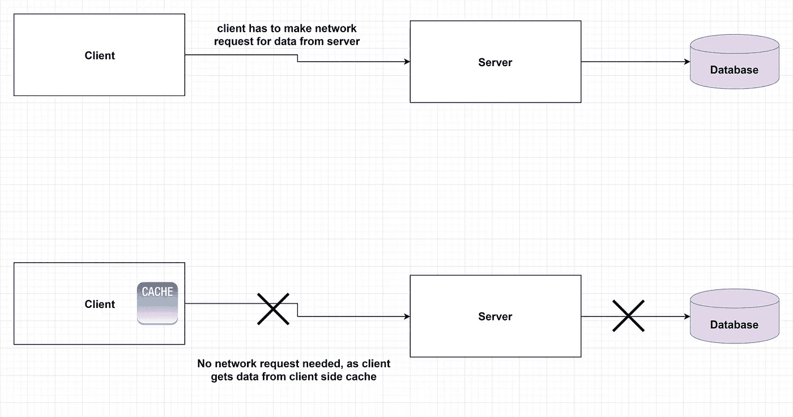
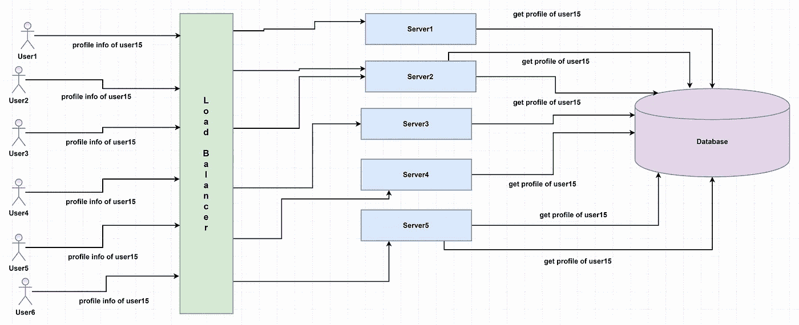
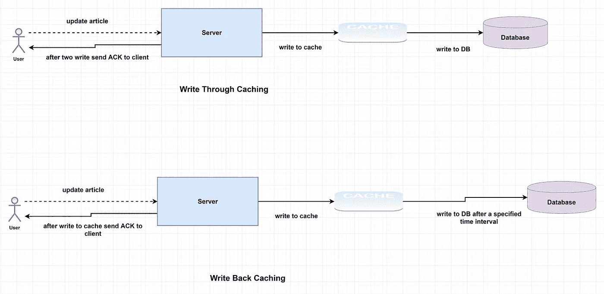

# 系统设计基础:缓存入门

> 原文：<https://towardsdatascience.com/system-design-basics-getting-started-with-caching-c2c3e934064a?source=collection_archive---------5----------------------->

## [系统设计 101](/system-design-101-b8f15162ef7c?sk=be3d26de1f9d1671b4abe379aae814f8)

## 在系统设计中什么时候使用缓存？

由[特尔纳瓦大学](https://unsplash.com/@trnavskauni?utm_source=medium&utm_medium=referral)在 [Unsplash](https://unsplash.com?utm_source=medium&utm_medium=referral) 上拍摄的照片

系统设计是软件工程最重要的概念之一。设计系统的主要问题之一是系统设计资源中使用的术语一开始很难掌握。此外，你需要知道哪个工具或术语用于哪个问题。熟悉系统设计的基本概念和术语对设计系统有很大的帮助。

本文探讨了系统设计的一个基本主题， ***缓存*** 。它是系统设计的基本技术之一。在几乎所有的系统中，我们可能都需要使用缓存。它是一种用于提高系统性能的技术。这个世界上没有一个系统不想拥有更好的性能。在本文中，您可能会了解它的属性和缓存技术以及缓存中数据的回收策略。

# 缓存:

缓存是一种硬件或软件，它存储的数据可以比其他数据源更快地检索到。缓存通常用于跟踪对用户请求的频繁响应。它还可以用于存储长时间计算操作的结果。缓存是将数据存储在与主数据源不同的位置，这样可以更快地访问数据。像负载平衡器一样，缓存可以用在系统的各个地方。

进行缓存是为了避免一次又一次地重复同样复杂的计算。用于提高算法的时间复杂度；例如，比方说动态编程，我们使用记忆技术来降低时间复杂度。在系统设计概念的情况下，缓存作为一个概念也有点类似。缓存用于加速系统。为了改善系统的延迟，我们需要使用缓存。减少网络请求也是使用缓存的一个原因。

**图:图片由** [**作者**](https://ashchk.medium.com/)

通常，缓存包含最近访问的数据，因为最近请求的数据可能会被反复请求。因此，在这种情况下，我们需要使用缓存来最小化从数据库中检索数据的操作。但是有不同的方法来选择哪些数据将留在缓存中。我们将在文章的后面部分讨论它。

## 缓存术语:

当在缓存中找到请求的数据时，这被称为**缓存命中**。当在缓存中找不到请求的信息时，它会对系统产生负面影响。这被称为**缓存未命中**。这是对糟糕设计的一种衡量。为了提高性能，我们需要增加命中次数，降低失败率。

如果主要数据源得到更新，而缓存没有更新，数据可能会变得**陈旧**。如果在系统中，陈旧数据不是问题，缓存可以快速显著地提高性能。假设我们正在设计一个 youtube 视频观看计数系统。如果不同的用户在 watch count 中看到不同的值，这真的没有多大关系。因此，陈旧对于这种情况来说不是问题。

## 客户端缓存:

可以进行客户端级缓存，这样客户端就不需要向服务器端请求。类似地，服务器也可以使用缓存。在这种情况下，服务器不需要总是访问数据库来获取数据。我们也可以在两个组件之间有一个缓存。

图:客户端缓存有助于减少网络呼叫

## 处理数据库压力:

使用缓存的另一个例子可以是一个流行的脸书名人档案访问。比方说，一位名人在脸书的个人资料中更新了一篇带有照片的新帖子。很多人都在查看个人资料更新。如果所有用户都请求相同的状态更新，而数据库每次都必须检索相同的数据，这将给数据库带来巨大的压力。在最坏的情况下，它可能会使数据库崩溃。在这种情况下，我们可以缓存流行概要文件的概要文件，并从那里获取数据，而不是冒着丢失主要数据源的风险。

图:许多用户请求相同的数据，这给数据库带来了巨大的压力

让我们想象我们正在用媒体写一篇文章。所以，我们有一个浏览器，它是系统的客户端，媒介是服务器。用户请求服务器写文章；然后，它被存储在数据库中。

现在，我们可以将文章存储在服务器缓存中。因此，同一篇文章有两个数据源。因此，问题是在编辑文章时，何时写入数据库，何时写入缓存。因此，我们需要了解缓存失效技术。否则，我们将获得客户端请求的陈旧数据。

## 缓存失效

我们通常使用缓存作为保存数据库副本的更快的数据源。在 DB 中修改数据的情况下，如果缓存包含以前的数据，那么这就称为陈旧数据。

因此，我们需要一种使缓存数据无效的技术。否则，应用程序将显示不一致的行为。由于缓存的内存有限，我们需要更新存储在其中的数据。这个过程被称为*缓存失效*。

我们可以使缓存数据无效；此外，我们必须更新缓存中的最新数据。否则，系统将在缓存中搜索，找不到数据，并再次到数据库中查找数据，从而影响延迟。一些技术用于高速缓存数据无效。我们将在下面讨论它们:

图:缓存技术

## 直写高速缓存:

在这种技术中，数据被写入缓存和数据库。在将数据写入数据库之前，先用数据更新缓存。

我们将有两个优势；缓存数据将提供快速检索，因此性能会更快。由于相同的缓存数据存储在数据库中，缓存和数据库之间的一致性将保持不变。因为我们也将数据保存在数据库中，所以我们有备份副本以防系统故障。因此，数据不会丢失。

但是，在系统设计中，没有完美的技术。一个方法总有不好的一面。我们也要考虑到这一点。尽管这种技术最大限度地降低了数据丢失的风险，但是在向客户端返回成功通知之前，我们需要将数据写入两个数据源。因此，写入或更新操作将具有更高的延迟。

## 回写高速缓存:

这个选项有点不同，因为在其他选项中，我们将数据存储在数据库中，但在这里，数据只写入缓存。数据写入缓存后，会向客户端发送完成通知。在一段时间间隔后，写入数据库。当应用程序需要大量写入时，这种技术非常有用。并且它为这样的应用提供了低延迟。使用这种策略可以降低数据库写入的频率。

但是，正如您已经猜到的，这种性能改进伴随着在缓存崩溃的情况下丢失数据的风险。因为缓存是写入数据的唯一副本，所以我们需要小心。如果在数据库更新之前缓存失败，数据可能会丢失。

## 缓存放在一边:

在这种策略中，缓存与数据库一起工作，尽可能地减少对数据库的命中。当用户发送请求时，系统首先在缓存中查找数据。如果找到了数据，就把它返回给用户。不需要涉及数据库。如果在缓存中找不到该数据，则从数据库中检索该数据，用该数据更新缓存，然后返回给用户。因此，下次任何人请求相同的数据时，它在缓存中是可用的。

这种方法更适用于*读取量大的*系统；系统中的数据不经常更新。例如,@Medium 中的用户简档数据，如用户名、邮件 id、用户 id 等。通常不需要经常更新。

这种方法的问题是缓存和数据库中的数据可能会不一致。为了避免这种情况，缓存上的数据有一个 TTL“生存时间”。在该时间间隔之后，数据需要从缓存中失效。

## 通读缓存

这类似于*缓存搁置*策略；区别在于缓存总是与数据库保持一致。缓存库必须负责维护一致性。

这种方法的一个问题是，当用户第一次请求信息时，这将是高速缓存未命中。那么系统必须在返回响应之前更新缓存。我们可以将有机会被用户请求最多的信息预加载到缓存中。

## 缓存回收策略:

缓存不像数据库那样有大量的空间。此外，对于陈旧的数据，我们可能需要将它们从缓存中删除。因此，缓存回收策略是设计缓存时要考虑的重要因素。下面我们可以检查一些最常见的缓存回收策略:

1.  **先进先出(FIFO):** 在这个策略中，缓存的行为方式与[队列](https://en.wikipedia.org/wiki/FIFO_(computing_and_electronics))相同。缓存会清除最先访问的数据。它不考虑以前访问它的频率或次数。
2.  **后进先出(LIFO):** 这是 FIFO 技术的反面。缓存会删除最近添加的数据。同样，也不考虑数据被访问了多少次。
3.  **最近最少使用(LRU):** 在此策略中，缓存会丢弃最近最少使用的数据。如果数据最近没有被使用，我们假设它们被调用的机会较小，因此删除它们为缓存中更新的数据提供了选项。
4.  **最不常用(LFU):** 这里，我们需要计算一个缓存项被访问的频率。那些使用频率最低的首先被丢弃。最少使用的数据是在浪费缓存空间，这是一个概念。因此，删除它们并用新数据更新缓存。
5.  **随机选择:**在这里，系统从缓存中随机选择一个数据项，并在需要时将其移除以腾出缓存空间。当缓存快满时，可以使用这个策略。否则，您可能会随意删除最需要的数据项。

驱逐策略取决于您正在设计的系统。根据需求，我们可以为系统选择一个驱逐策略。

## 结论:

*缓存是任何系统性能的关键组成部分。它确保了低延迟和高吞吐量。*缓存是主数据存储的备份；它的空间有限。从缓存中检索数据比从原始数据源(如数据库)中检索数据更快。缓存可以保存在系统的所有级别，但是我们需要将缓存保存在前端附近，以便快速返回请求的数据。缓存有利于提高性能，但也有一些缺陷。在设计系统时，我们需要小心缓存数据的陈旧性。

如果数据大部分是静态的，缓存是提高性能的一种简单方法。对于经常编辑的数据，缓存的实现有点棘手。缓存将使系统能够确保系统能够更好地使用其资源。

> 资源:系统设计访谈，系统专家

本文是[系统设计基础](https://ashchk.medium.com/all-the-article-links-in-one-place-85c8526ead70?sk=7e6ee3a65895cc893a32f97d5496bed4)的一部分。*这里给出了该系列的一些文章链接:*

[**设计限速器**](/designing-a-rate-limiter-6351bd8762c6)

[***系统设计基础知识:客户端-服务器架构***](/system-design-basics-getting-started-with-the-client-server-architecture-b02f9c9daae8?sk=d186470a4df5355b9f405010e8c4150e)

[***系统设计基础知识:负载平衡器 101***](https://codeburst.io/system-design-basics-load-balancer-101-adc4f602d08f)

[***谷歌自动建议服务的系统设计***](https://codeburst.io/system-design-analysis-for-auto-suggestion-service-d28bf1701658)

[***谷歌驱动***](/system-design-analysis-of-google-drive-ca3408f22ed3) 系统设计分析

[***TinyURL***](/system-design-of-url-shortening-service-b325b18c8f88)系统设计分析

[***分布式系统中的可用性***](/availability-in-distributed-systems-adb43df78b9a)