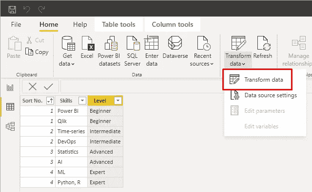

# 功率 BI 中的 T-profile

> 原文：<https://towardsdatascience.com/t-profile-in-power-bi-58d46b7ebed4?source=collection_archive---------30----------------------->

## [可视化](https://towardsdatascience.com/data-visualization/home)

## 概念实施的介绍

[字母 T 由来自](https://thenounproject.com/photo/letter-t-made-of-real-natural-flowers-and-leaves-0WKQp0/?download=true)[名词项目](https://thenounproject.com/)的扎姆洛维奇兄弟用真正的天然花和叶子制成

T 设计 T 型轮廓的概念属于**设计思维**流程，该流程基于以用户为中心的设计，有助于建立用户共情，并引导寻求突破性创新。T 型简介以一种创造性的方式展示了一个人在某个特定领域的专长以及他们在其他领域的经验或知识。准确地说，T 型轮廓描述了一个人知识或技能的广度和深度。换句话说,“T”中的竖线描绘了一个人在特定领域的专业领域,“T”中的横线描绘了这个人在他的专业领域之外的其他领域的知识或经验。这样的人通常被称为具有 T 型技能的 **T 型人**并且具有跨领域合作的交叉技能。因此，这样的人非常适合在敏捷团队中工作[3–5]。

正如人们正确地说的那样，一张图片胜过千言万语。通常情况下，T 型简历的设计是静态的，就像任何其他简历一样。但是想象一下，如果你能以一种互动的方式设计它，最终用户可以与你的个人资料互动，同时它也变得易于维护！这最终会让它更上一层楼，这也是本文所描述的使用 [Power BI](https://powerbi.microsoft.com/en-us/) 的原因。

因此，让我们快速深入了解它的实现细节，

## **设计 T 型型材**

这是任何创作过程中最主要也是最重要的部分。为了创建我们的个人资料，我们将需要两种类型的信息，一个是垂直栏的深厚专业知识和水平栏的知识领域。

作为我们设计的一部分，我们将保持水平栏静态，并在这里使用**文本框**作为我们的 Power BI 报告元素。我们将以**多排卡** 为元素，按照*初级、中级、高级、专家*的等级分类的技能，进一步将竖条动态化。此外，我们将使用元素**表** 来显示级别，这些级别将作为****多行卡**元素*的过滤器。*最后，我们将通过添加图像或说明性文本的形式来完成我们的设计。**

**在开始实施之前，最好先设计草图，因为它是在实施过程中即兴发挥的初始起点。因此，上面的设计蓝图看起来会像这样:**

****

**使用 MS 白板的 t 型剖面设计(来源:图片由作者提供)**

> **请记住，这个阶段是你的创造性的游乐场，你可以随时根据你的喜好或要求调整设计！**

## ****数据来源和数据处理****

**对于我们的输入数据，我们将不使用外部数据源，而是使用内置数据源。我们将为动态竖条创建一个输入表。**

****表格创建:**导航到**数据**视图，选择**输入数据**创建一个名为*深度知识*的表格，表格中有三列*排序号、技能、级别。*继续填写你在专业领域的技能，分为*初级、中级、高级、专家*。在*分类编号*栏中相应地填入从 *1 到 4* 的数字，每个数字代表*初学者-专家*的等级。我们将在后面的视图中使用这个列。最后，点击**加载**完成表格创建。**

****

**表深识(来源:图片由作者提供)**

****数据排序:**选择*排序号*列，导航到**列工具**，点击向下箭头，选择**升序排序**。另外，将**汇总**设置为**不汇总**。**

****

**排序排序号(来源:图片由作者提供)**

**对于剩下的两栏*技能和等级*，*，*设置**排序按*->-*排序号****

****

**排序技巧，水平(来源:图片由作者提供)**

****数据转换:**您可以随时使用超级查询编辑器通过**主页- >转换数据来编辑您的数据源。**您需要在这里再次对*排序号*列进行排序，剩下的两列会自动排序。为了编辑您的数据，您需要点击**应用步骤**中**源**旁边的图标。一旦完成，点击**关闭&应用**。**

****

**数据转换(来源:图片由作者提供)**

****

**电力查询编辑器(来源:图片由作者提供)**

## **T 型剖面的创建**

**导航到**报告**视图，从**可视化**窗格中选择**格式** *- >* **页面尺寸**，并将其设置为**自定义 900 x 1056** 。以下是设计所需的元素列表:**

****

**报告创建元素(来源:作者图片)**

****水平栏:**从**菜单**栏中选择**插入- >文本框**，以字母“T”的水平栏形式排列五个方块。继续输入你的技能/领域，中间部分是你的专业领域，然后你可以在垂直栏中详细说明。**

**我建议使用最佳数量的技能/领域，这样我们就不会过度拥挤。为了使轮廓更有创意，继续将您选择的相关 icons⁷作为**插入- >图像**添加到每个模块中。此外，不要忘记对你的模块进行适当的格式和颜色编码，使你的专业领域在视觉上清晰可辨。**

****

**单杠(来源:图片由作者提供)**

****竖条:**从**可视化**窗格中选择**多行卡片**，并以字母“T”竖条的形式排列四张卡片。每张卡片都代表你在专业领域的技能，并且等级不断上升。请记住，该栏是动态的，我们将动态显示来自输入表*深层知识*的信息。在卡片上，从**字段**窗格的输入表中选择*技能*栏。在**滤镜**窗格中添加列*关卡*作为该视觉上的**滤镜，并选择其中一个关卡。对其余的卡重复相同的过程，在每个卡上配置不同级别的过滤器。此外，继续用不同的颜色对你的每张关卡卡片进行颜色编码，添加相关的图标，并相应地对卡片进行格式化，以与你的单杠相协调。****

****

**竖条——带格式的初学者卡片(来源:图片由作者提供)**

****过滤器:**要在竖条上添加过滤器，从**可视化**窗格中选择**表格**。在**表格**上，从**字段**窗格的输入表格中选择列*级别*。接下来，在**过滤器**窗格的页面上添加列*级别*作为**过滤器。****

**接下来，我们需要对表视图中的每一行进行颜色编码，就像我们的多行卡片一样。为此，从**可视化**窗格导航到**字段**窗格，**值- >级别- >背景颜色。****

****

**过滤表(来源:作者图片)**

**根据列*分类编号*配置以下规则，并相应地设置您定义的颜色。**

****

**过滤表格条件格式(来源:图片由作者提供)**

**最后，加上箭头状的**形状- >六边形**作为总结，为知识的宽度和深度指明方向。另外，添加一段简短的关于你自己的信息。此外，你可以将你的图标链接到你的开源作品，包括仪表盘、外部 URL，比如你的 GitHub 库、出版物等等。，以便直接向最终用户展示您提到的技能。这可以通过**格式图像- >动作**来完成。**

****

**图片图标上的动作(来源:图片由作者提供)**

**这是您的 T 型个人资料的最终外观，您可以在创建的过滤器的帮助下轻松过滤技能，该过滤器还将作为一个图例，带有便于导航的图标:**

****

**Power BI 中的 T-profile(来源:图片由作者提供)**

**完成后，您可以继续将您的 T-profile 发布到 [Power BI service](https://docs.microsoft.com/en-us/power-bi/fundamentals/power-bi-service-overview) ，以便与其他人分享。在 [Microsoft Docs](https://docs.microsoft.com/en-us/power-bi/fundamentals/service-self-service-signup-for-power-bi) 中，您可以探索并找到更多与其注册和许可相关的信息。或者，如果您想将其作为文档发送，您可以使用**文件- >导出- >导出为 PDF** *在 Power BI 中轻松导出为 PDF。***

**综上所述，本文有助于理解 T-profile 的含义和重要性，并同样展示了如何使用商业智能(BI)工具设计交互式 T-profile。使用 BI 工具之一设计您的 T-profile 直接向最终用户展示您使用该工具的实践经验，该工具具有您的 T-profile 中列出的技能/领域。由于基本思想保持不变，本文中的实现步骤是说明性的，可以**根据您选择的任何 BI 工具进行相应的调整**。**

## **参考**

**[1] [用设计思维设计商业模式](https://labs.sogeti.com/using-design-thinking-to-design-business-models/#:~:text=The%20Business%20Model%20Canvas%20is,creates%2C%20delivers%20and%20captures%20value)**

**【2】[丁字技能](https://corporatefinanceinstitute.com/resources/careers/soft-skills/t-shaped-skills/)**

**【3】[丁字技能](https://en.wikipedia.org/wiki/T-shaped_skills)**

**【4】[如何留在前 1%的 T 型营销人员？(2018 版)](https://medium.com/growth-tribe/how-do-you-stay-in-the-top-1-of-t-shaped-marketers-2018-version-c3dbfa120434)**

**[5] [Scrum 团队——I 型和 T 型人](https://warren2lynch.medium.com/scrum-team-i-shaped-vs-t-shaped-people-569de6fa494e)**

**[6][T 型网络营销者](https://sparktoro.com/blog/the-t-shaped-web-marketer/)**

**[7]图标:根据[知识共享署名(CC BY)](http://creativecommons.org/licenses/by/3.0/) 获得许可。**

**[人工智能](https://thenounproject.com/term/artificial-intelligence/3239852/)图标由矢量指向来自[名词项目](http://thenounproject.com/)。**

**“[机器学习](https://thenounproject.com/term/machine-learning/3884609/)图标由托马斯·T 从[这个名词项目](http://thenounproject.com/)得来。**

**[时间序列](https://thenounproject.com/search/?q=TIME+SERIES&i=995090)图标由汤姆从[名词项目](http://thenounproject.com/)中获得。**

**[数据分析](https://thenounproject.com/term/data-analysis/849820/)图标由来自[的原符号组成，名词项目](http://thenounproject.com/)。**

**“[敏捷](https://thenounproject.com/term/agile/1546896/)图标来自[名词项目](http://thenounproject.com/)。**

**名词项目中 Setyo Ari Wibowo 的“[电子邮件营销](https://thenounproject.com/term/email-marketing/739683/)”图标。**

**[研究](https://thenounproject.com/search/?q=RESEARCH&i=1604747)图标由[名词项目](http://thenounproject.com/)的 Gregor Cresnar 创作。**

**[数据](https://thenounproject.com/term/data/53338/)图标由 OliM 从[名词项目](http://thenounproject.com/)中获得。**

**[网络音箱](https://thenounproject.com/term/web-speaker/108827/)图标由 Mazil 从[名词项目](http://thenounproject.com/)中获得。**

**[咨询](https://thenounproject.com/term/consulting/3501836/)图标由[图标标注](https://thenounproject.com/term/consulting/3501836/)来源于[名词项目](http://thenounproject.com/)。**