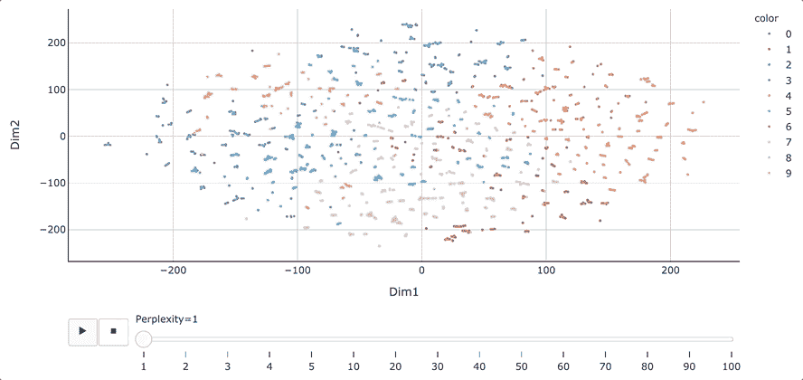
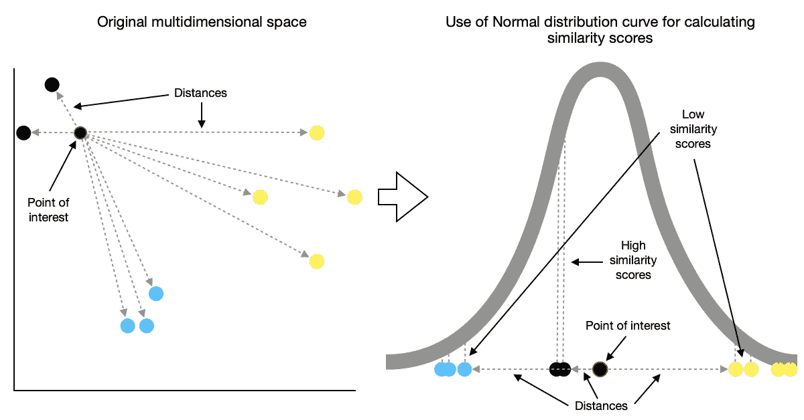
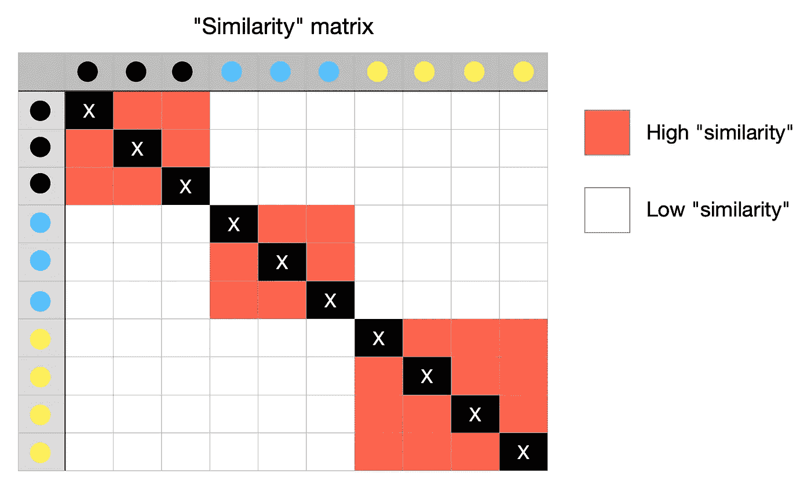
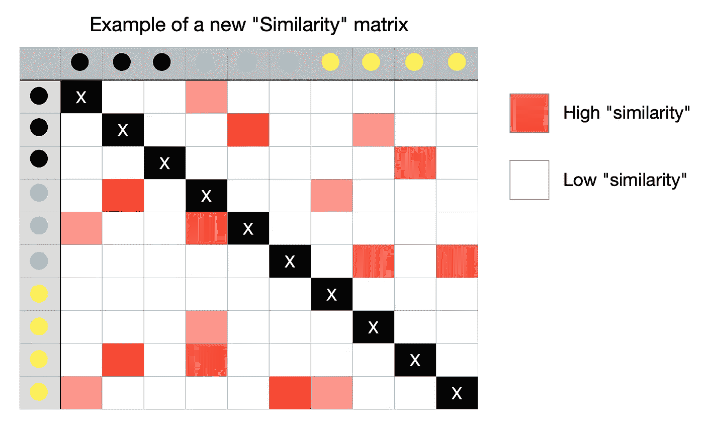
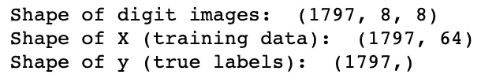
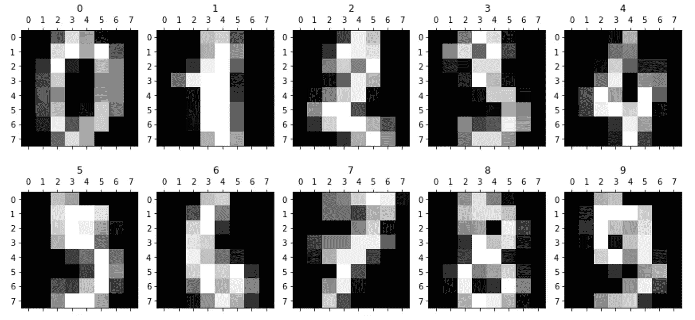
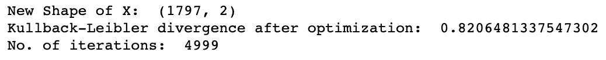
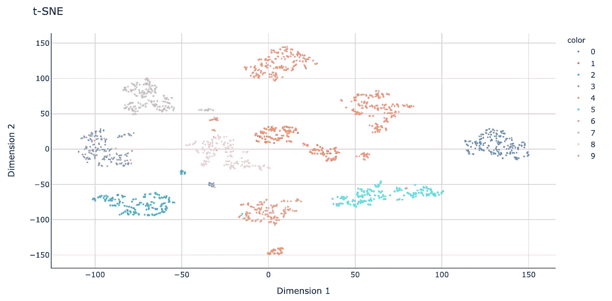

# t-SNE 机器学习算法 Python 中降维的利器

> 原文：<https://towardsdatascience.com/t-sne-machine-learning-algorithm-a-great-tool-for-dimensionality-reduction-in-python-ec01552f1a1e?source=collection_archive---------2----------------------->

## 机器学习

## 如何使用 t 分布随机邻居嵌入(t-SNE)来可视化高维数据？

t-SNE 可视化与不同的困惑。Gif 图片由[作者](https://solclover.com/)提供。

# 介绍

一个成功的数据科学家了解广泛的机器学习算法，并能向利益相关者解释结果。但是，不幸的是，并不是每个利益相关者都有足够的培训来理解 ML 的复杂性。

幸运的是，我们可以通过使用降维技术创建高维数据的可视化表示来帮助我们的解释。本文将带您了解一种叫做 t-分布式随机邻居嵌入(t-SNE)的技术。

# 内容

*   t-SNE 在机器学习算法领域的地位
*   对 SNE 霸王龙工作原理的直观解释
*   在 Python 中使用 t-SNE 的例子

# 机器学习算法领域中的 t 分布随机邻居嵌入(t-SNE)

由于特定算法表现出的灵活性，机器学习技术的完美分类并不总是可能的，这使得它们在解决不同问题时非常有用(例如，可以使用 k-NN 进行回归和分类)。

尽管如此，给 ML 世界带来一些结构仍然是有益的，下图就是我试图做的。请确保通过点击来浏览此**互动**图👇对各种类别进行**放大，揭示更多的**。

机器学习算法分类。由[作者](https://solclover.com/)创建的交互式图表。

***如果你喜欢数据科学和机器学习*** *，请* [*订阅*](https://solclover.com/subscribe) *每当我发布一个新的故事，你都会收到一封电子邮件。*

如你所见，t-SNE 是一种降维技术，属于机器学习算法的无监督分支。这意味着我们不需要标记数据来使用它。这与监督技术如线性鉴别分析(LDA)形成对比。

虽然上面没有说明，但值得一提的是，降维可以进一步分为两种类型:

*   **参数** —创建一个显式映射函数，我们可以在测试数据上使用该函数，也就是说，用它来获得低维嵌入中新点的位置(如 PCA)；
*   **非参数化** —不创建显式映射函数；因此，它不能容易地将新的点映射到低维嵌入。*尽管在实践中，有可能构建一些变通办法来实现新点的这种映射。*

t-SNE 属于一组非参数技术。因此，它的主要用途通常是可视化。

# t 分布随机邻居嵌入(t-SNE)是如何工作的？

## 分析 SNE 霸王龙的名字

让我们从剖析 t-SNE 的名字开始，这将让我们对算法应该做什么有一个大致的了解。我们将反向进行(即从右到左)。

> 注意，下面的陈述不是官方的定义，而是一组帮助我们理解 SNE 霸王龙背后的关键思想的描述。

*   **嵌入** —典型的高维数据在低维空间中表示；
*   **邻居** —位于感兴趣的数据点附近的数据点；
*   **随机**—当搜索代表性嵌入时，在迭代过程中使用随机性；
*   **t 分布** —算法用来计算低维嵌入中相似性得分的概率分布。

将上述陈述放在一起，我们可以将 t-SNE 描述为一种技术，该技术利用渐进迭代方法来寻找原始数据的低维表示，同时保留关于局部邻域的信息。

> 请注意，对于该算法的一般理解，您不需要太注意概率分布元素。t 分布用于下面描述的步骤 2 和 3，之所以选择 t 分布而不是正态分布，是因为它具有“更平”的形状和“更高”的尾部。这种形状有助于在低维空间中展开点。否则，你可能会得到一堆相互叠加的点。

## SNE 霸王龙采取的步骤

**第 1 步** t-SNE 首先根据点与点之间的距离确定点的“相似度”。附近的点被认为是“相似的”，而远处的点被认为是“不相似的”

它通过测量感兴趣的点和其他点之间的距离，然后将它们放置在正常曲线上来实现这一点。它对每个点都这样做，应用一些缩放来考虑不同区域的密度变化。

例如，下图中蓝色点所在的区域密度较高，黄色点所在的区域密度较低。

相似性得分。图片由[作者](https://solclover.com/)提供。

这些计算的结果是一个矩阵，该矩阵包含来自原始多维空间的每对点之间的相似性得分。

相似矩阵。图片由[作者](https://solclover.com/)提供。

**第二步**
接下来，t-SNE 将所有点随机映射到一个低维空间，并按照上述过程计算点之间的“相似度”。不过，这一次有一点不同，该算法使用了 **t 分布**而不是正态分布。

不过，不出所料，由于随机映射，新的“相似度”矩阵与原始矩阵有很大不同。这是一个可能的例子。

一个新的“相似度”矩阵的例子。图片由[作者](https://solclover.com/)提供。

**第三步** 现在算法的目标是通过使用迭代方法使新的“相似度”矩阵看起来像原始矩阵。随着每一次迭代，点从最初的高维空间向它们的“最近邻居”移动，并远离远处的邻居。

新的“相似度”矩阵逐渐开始看起来更像原始矩阵。该过程继续进行，直到达到最大迭代次数，或者不能进行进一步的改进。

用更科学的术语来说，上面的解释描述了一种算法试图通过梯度下降来最小化 kull back-lei bler 散度(KL 散度)的过程。

## 困惑

我还没有提到的一个重要方面是一个叫做困惑的超参数。它描述了每个点周围的预期密度，也就是说，与感兴趣点的目标最近邻数相关。

困惑参数在决定嵌入的最终结果中起着至关重要的作用。一般来说，您可能希望选择介于 5 和 50 之间的困惑度，但是您应该尝试不同的值。

在本文的开始，我包含了一个 gif 图像来演示当使用不同的困惑值时，最终的可视化效果是如何变化的。较低的值会使算法“关注”较少的邻居，从而产生许多小组。相比之下，高困惑值“扩展了邻域范围”，导致更少、更紧密的组。

# 如何在 Python 中使用 t-SNE？

最后，我们很好地理解了算法，所以是时候在 Python 中使用它了。

我们将在 MNIST 数据集(手写数字的集合)上应用 t-SNE 来说明我们如何成功地可视化高维数据。

## 设置

我们将使用以下数据和库:

*   [Scikit-learn 库](https://scikit-learn.org/stable/index.html)用于
    1)来自 sklearn 数据集的 MNIST 数字数据([load _ digits](https://scikit-learn.org/stable/modules/generated/sklearn.datasets.load_digits.html))；
    2)降维([t-SNE](https://scikit-learn.org/stable/modules/generated/sklearn.manifold.TSNE.html))；
*   用于数据可视化的 [Plotly](https://plotly.com/python/) 和[Matplotlib](https://matplotlib.org/stable/contents.html)；
*   [熊猫](https://pandas.pydata.org/docs/)进行数据操作。

第一步是导入我们上面列出的库。

接下来，我们加载 MNIST 数据。

导入数据的形状。图片由[作者](https://solclover.com/)提供。

现在，让我们显示前十个手写数字，以便更好地理解我们正在处理的内容。

前十个手写数字的图像(8×8 = 64 像素，即 64 维)。图片由[作者](https://solclover.com/)提供。

## 将 t-SNE 应用于我们的数据

在上一步中，我们将数据加载到形状为(1797，64)的数组 X 中，这意味着我们有 1，797 个数字，每个数字由 64 个维度组成。

我们现在将使用 t-SNE 将维数从 64 降低到 2。注意，我对大多数超参数使用默认值。然而，我也包括了每个参数的简短解释，以便您可以通过尝试不同的设置来进行实验。

上面的代码打印了一些基本的统计数据:

我们植入 t-SNE 的基本数据。图片由[作者](https://solclover.com/)提供。

最后，让我们在二维散点图中绘制新的 X 数组。请注意，我们还使用颜色来表示数字的实际标签。这有助于我们了解相似的数字如何聚集在一起。

64 维 MNIST 数字数据的 2D t-SNE 嵌入。图片来自[作者](https://solclover.com/)。

我们可以看到，SNE 霸王龙在识别相似的数字方面做得非常好，它们中的大多数形成了紧密的群体。然而，有几个小星团，即 1(红色)、3(紫色)和 9(黄色)，似乎离它们的主星团相当远。这样的结果可能表明存在书写相同数字的不同方式。

# 结论

t-SNE 是一个很好的工具，可以可视化不同数据点之间的相似性，这可以在多方面帮助您的分析。

例如，它可以帮助您找出书写相同数字的不同方式，或者使您能够在执行 NLP 分析时找到具有相似含义的单词同义词/短语。同时，在向利益相关者解释您的分析时，您可以使用它作为视觉辅助。

然而，与每一种机器学习方法一样，t-SNE 也有一些限制，你在使用它时需要记住:

1.  它是一种非参数的降维方法，这意味着它不会创建一个显式的映射函数供您在新的数据点上使用；
2.  您可能需要试验不同的困惑值，以找到最适合您的数据的值；
3.  由于其随机初始化和随机性，每次运行后您可能会得到不同的结果。如果您想要可重复的结果，请确保指定一个种子(random_state)。

我真诚地希望这篇文章给你一些新的见解 t-SNE 和帮助你扩大你的 ML 武器库。如果你有任何问题或建议，我很高兴收到你的来信。

干杯👏
**索尔·多比拉斯**

***如果你已经花光了这个月的学习预算，下次请记得我。*** *我的个性化链接加入媒介是:*

 [## 通过我的推荐链接加入 Medium 索尔·多比拉斯

### 作为一个媒体会员，你的会员费的一部分会给你阅读的作家，你可以完全接触到每一个故事…

solclover.com](https://solclover.com/membership) 

您可能感兴趣的其他文章:

 [## MDS:多维尺度 Python 中降维的聪明方法

### 用一个详细的 Python 例子解释了 MDS 算法

towardsdatascience.com](/mds-multidimensional-scaling-smart-way-to-reduce-dimensionality-in-python-7c126984e60b)  [## Isomap 嵌入——一种令人敬畏的非线性降维方法

### 如何用等距映射“展开瑞士卷”？

towardsdatascience.com](/isomap-embedding-an-awesome-approach-to-non-linear-dimensionality-reduction-fc7efbca47a0)