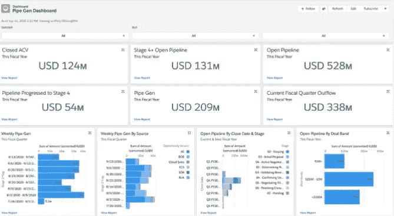
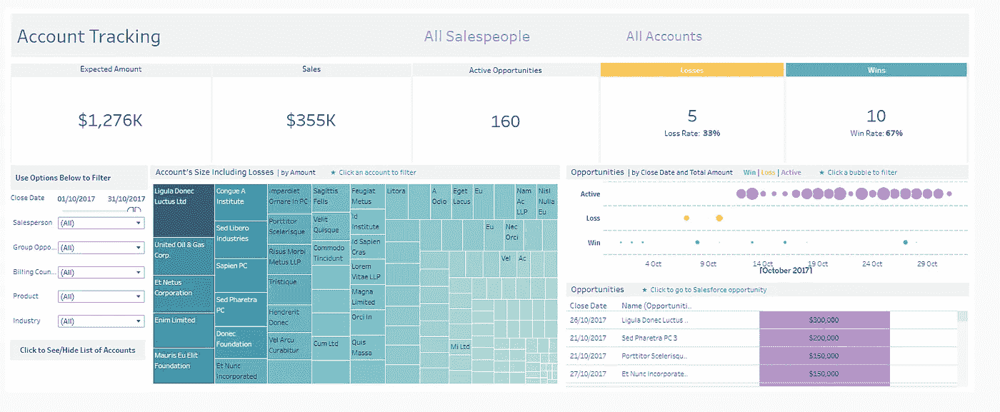
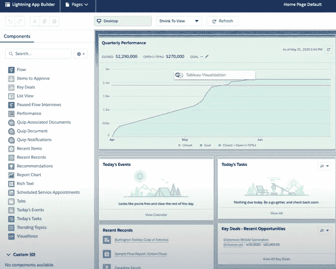

# Tableau + Salesforce —绝配(？)

> 原文：<https://towardsdatascience.com/tableau-salesforce-a-perfect-match-761895a430f0?source=collection_archive---------14----------------------->

## 这篇文章调查了您应该如何以及为什么利用 Tableau 中的 Salesforce 数据，以及 Salesforce 收购 Tableau 后的协同效应。

在 [Unsplash](https://unsplash.com/s/photos/love%3F?utm_source=unsplash&utm_medium=referral&utm_content=creditCopyText) 上由 [Belinda Fewings](https://unsplash.com/@bel2000a?utm_source=unsplash&utm_medium=referral&utm_content=creditCopyText) 拍摄的照片

(你也可以在 [**我的网站**](https://www.eliasnordlinder.com/blog/blog-post-two-d8s2j) 上找到这篇文章以及其他文章和更多有趣的东西)

# 介绍

本文的目的是对如何利用 Tableau 和 Salesforce 之间的协同作用给出一个**“简短”的解释。和往常一样，这篇文章试图抓住我在开始使用这些工具之前想知道的事情。**

在文章的最后，您可以找到参考资料来了解更多关于该主题的信息，以便能够在实践中使用该主题。

大多数阅读这篇文章的人可能听说过工具 **Tableau 和 Salesforce，这是**数据可视化**和 **CRM 世界中最流行的两个工具。****

自 2019 年**收购 Tableau 以来，Tableau 归 Salesforce 所有，这可能也是相当普遍的知识。**如果没有，现在你知道这两个工具之间的关系是什么样子了。

但是，如果上面的两个方面被广泛传播，第三个方面可能就不太为人所知了，这将是这篇博客文章的主要讨论点之一，也是为什么我认为市场上需要它，更确切地说:

> Tableau 和 Salesforce 之间的协同作用如何，您如何在另一个工具中利用一个工具？

这篇文章将讨论三个要点，希望能让你对如何(以及为什么)利用 Salesforce 和 Tableau 有所了解。让我们看看今天的议程。

照片由[丹尼斯·詹斯](https://unsplash.com/@dmjdenise?utm_source=unsplash&utm_medium=referral&utm_content=creditCopyText)在 [Unsplash](https://unsplash.com/s/photos/agenda?utm_source=unsplash&utm_medium=referral&utm_content=creditCopyText) 上拍摄

1.  从 Tableau 访问您的 Salesforce 数据有哪些不同的方式？
2.  为什么**在 Tableau/sales force 的主要限制中可视化您的数据？**
3.  如何在 Salesforce 中利用 **Tableau 仪表盘？**

# 1.从 Tableau 访问您的 Salesforce 数据的三种方式

由 [israel palacio](https://unsplash.com/@othentikisra?utm_source=unsplash&utm_medium=referral&utm_content=creditCopyText) 在 [Unsplash](https://unsplash.com/s/photos/connection?utm_source=unsplash&utm_medium=referral&utm_content=creditCopyText) 上拍摄

在 Tableau 中使用 Salesforce 数据的第一步是**以某种方式从 Salesforce 访问数据。**在讨论 Salesforce 的局限性以及如何将 Tableau 可视化嵌入到 Salesforce 之前，首先讨论这一点似乎是一个自然的途径。

本文将介绍如何从 Tableau 中访问 Salesforce 数据的三种一般方法。下面列出了每种数据访问方式的优缺点。需要注意的是，每一步的复杂性都在增加，但好处也在增加。

(利弊只与数据的连接有关，不包括本文下一章的利弊。因此，如果一个连接(如 Salesforce Connector)有“3 个优点和 3 个缺点”，那么 Tableau 中关于可视化的所有优点都将添加到这个连接中，从而使其成为“净正面”。)

**i)将 Salesforce 的摘录转换成 Excel、CSV 格式或 Google Sheets** ，然后将其中的数据放入 Tableau。

(赞成:1，反对:3)

照片由[米卡·鲍梅斯特](https://unsplash.com/@mbaumi?utm_source=unsplash&utm_medium=referral&utm_content=creditCopyText)在 [Unsplash](https://unsplash.com/s/photos/data-table?utm_source=unsplash&utm_medium=referral&utm_content=creditCopyText) 上拍摄

**优点**

*   在某种程度上，这可以被视为使用数据的最不复杂的方式。大多数人在日常工作中非常熟悉使用 Excel、或类似的报告工具。因此，这似乎是这些人利用这些工具连接到 Salesforce 的“正常方式”,这也是使用这些连接器的主要优点。

**缺点**

*   使用上述报告工具时的常见问题是，**手动负担相当大，**这次也不例外，例如，您是否设置了到工作表的连接(如果您想使用 Tableau)以及控制，以便如果您将来想再次使用它，工作表不会发生任何特定的变化。
*   每次您想要获得 Salesforce 数据并在 Tableau 中使用它时，您还需要手动下载和提取,这意味着许多手动时间可以自动化，这就是为什么大多数人后来可能会被下面的选项所吸引。
*   如果您想通过 Salesforce Cloud Connector 访问数据并利用 Tableau 中的数据，您将需要一个 **Salesforce 帐户**和一个 **Tableau 帐户。**如果您只想处理数据，而不是亲自进入 Salesforce，这可能不是最佳选择。

**ii)使用 Salesforce 云连接器从 Tableau 直接连接到 sales force**

(赞成:3，反对:3)

照片由[亚历山大·奈特](https://unsplash.com/@agk42?utm_source=unsplash&utm_medium=referral&utm_content=creditCopyText)在 [Unsplash](https://unsplash.com/s/photos/automation?utm_source=unsplash&utm_medium=referral&utm_content=creditCopyText) 上拍摄

**优点**

*   利用 Tableau 的直接连接器连接到 Salesforce 数据的好处之一是大大减少了前一步的手动负担。如果您将数据发布到 Tableau Server/Online，数据会自动刷新，这将在下面讨论。
*   使用 Salesforce 连接器的另一个好处是 Salesforce 已经创建了**现成的连接 Salesforce 表**，您可以在 Tableau 中直接使用。这一点很重要，将在后面关于 Tableau 和 Salesforce 之间的协同作用的章节中讨论。
*   您还可以利用 **Salesforce Starters** ，它们是很好的现成报告，将在后面的章节中解释。

**缺点**

*   这比使用 Salesforce 数据的第一种方式稍微复杂一些。如果您想对数据进行任何操作，或者如果有些东西工作不正常，那么了解一点 SQL 或查询语言(尤其是连接)会很有帮助。
*   Salesforce 云数据的**布局是为支持 CRM 应用程序而组织的，**不是为诸如 Tableau 之类的报告工具而组织的，这导致了数据处理的一些限制。
*   如果您想通过 sales force Cloud Connector to Tableau 访问数据，您将需要一个 **Salesforce 帐户**以及一个 **Tableau 帐户。**如果您只想处理数据，而不是自己在 Salesforce 中工作，这可能不是最佳选择。

**iii)** **将 Salesforce 集成到数据湖/数据仓库**中，并从那里访问数据。

(赞成:4，反对:2)

菲利普·施奈德巴赫在 [Unsplash](https://unsplash.com/s/photos/data-lake?utm_source=unsplash&utm_medium=referral&utm_content=creditCopyText) 上的照片

**优点**

*   数据在数据湖(Dara Warehouse 或您选择保存数据的其他应用程序)中被直接刷新**，在指定数据的布局方面有更多的自由度**。****
*   **可以在数据湖中直接合并不同数据源的数据。**
*   另一个好处是，**数据对于希望利用这些数据的人来说更容易获得，**因为您不需要 Salesforce 帐户，如果您希望在其他两个示例中直接利用这些数据，则需要 sales force 帐户。
*   最后，如果有人使用许多不同的 BI 工具，如果您在 Tableau 中使用 Salesforce Cloud connector，他们将无法使用任何数据。如果数据被转移到一个公共的数据集市，那么使用不同的工具连接数据就有了更多的自由。

**缺点**

*   其中一个主要的缺点当然是数据湖或数据仓库的设置，以及将 Salesforce 集成到这个平台中。当然，这是一个比直接连接到 Salesforce 更复杂的过程**,这可能是为什么利用 Salesforce Cloud Connector** 或将 Salesforce 数据下载到 Excel 的选项在当今实践中仍然流行的主要原因。
*   除此之外，如果你想在 Tableau 服务器中建立仪表板，当然还有 Tableau 帐户的费用。

# 2.为什么要在 Tableau/sales force 的主要限制中可视化数据？

Tetiana SHYSHKINA 在 [Unsplash](https://unsplash.com/s/photos/painter?utm_source=unsplash&utm_medium=referral&utm_content=creditCopyText) 上的照片

现在让我们深入了解一下**为什么您希望使用 Tableau 作为可视化工具**而不是在 Salesforce 中完成所有的可视化工作。以上段落中的所有不同连接器在从 Tableau 中的 Salesforce 访问数据的方式上都有一些缺点。

将数据从 Salesforce 转移到 Tableau 的好处是否足以抵消坏处？

(在指出下面的原因之前，先假设 Tableau 许可证不仅用于可视化 Salesforce 数据。如果是这样的话，成本会比你的公司已经有 Tableau Server/Online，并且你还使用 Tableau 许可来创建其他可视化效果要高得多。)

看下面的两个可视化，然后阅读为什么我更喜欢 Tableau 可视化而不是 Salesforce 中的可视化数据:

Salesforce 仪表板— Elias Nordlinder

Tableau 仪表板— Elias Nordlinder

**i)你的设计师大脑在画面上的限制要少得多，有无限的可能性**

*   上面是 Salesforce 数据的两种不同的可视化，第一种在 Salesforce 中，第二种在 Tableau 中。(您可以在我的 Tableau 公众页与上面的 Tableau 仪表盘互动，[此处](https://public.tableau.com/app/profile/elias.nordlinder/viz/SalesforceStarter-Example/AccountTracking))
*   对我来说，我真的很喜欢可视化的设计，在 Tableau 中有更多的可能性和自由来处理数据。自过去几年以来，Salesforce 可视化已经取得了长足的进步，它们比许多其他应用程序更好，随着 Tableau 的收购，这些应用程序现在可能会有更大的改进，但它们还没有达到 Tableau 的水平。
*   在 Tableau 中创建可视化效果的唯一限制是你的创造力。如果你想到你想做的事情，很有可能其他人已经在 Tableau 中做了，然后你可以逆向工程他们的仪表板，用你的数据做同样的事情。

**ii)易于使用计算字段和参数快速重塑数据，并在其他仪表板中重用。**

*   Tableau 中的另一个很大的可能性是，当您想要深入某个特定方面时，可以使用**动态创建计算字段或参数**或者为您的仪表板创建新的过滤器。
*   您还可以将其他报表中的高级计算字段复制并粘贴到您的 Salesforce 报表中，并利用它们在其中的构建方式。

**iii)利用其他表格报告的经验**

*   通过利用关于如何从其他 Tableau 报告中构建仪表板的经验，您当然可以利用这些经验来构建连接到 Salesforce 的仪表板。

**iv)“免费观看可视化效果”**

*   如果我们假设您的公司已经拥有 Tableau Server 或 Tableau Online 的帐户，公司中的每个人都可以免费看到这些报告。**他们需要一个 Salesforce 帐户才能在 Salesforce 中查看他们现在不需要的报告。**

**v)将数据连接到其他数据源**

*   如前几章所述，您需要将数据移动到数据仓库或数据湖中，以便能够将数据连接到其他数据源。这并不完全正确，因为当然也有可能**在 Tableau 中直接混合数据，这意味着您可以直接将其他数据源与您的 Salesforce 数据合并。**

**vi)利用 Tableau Salesforce Starters**

*   最后，还必须对**的销售人员首发**大声疾呼。这些是 Tableau 创建的入门仪表盘，可以在这里免费下载[。](https://www.tableau.com/products/dashboard-starters-downloads)
*   通过使用 Salesforce Cloud connector 连接到您的 Salesforce 帐户，您可以自动获得带有您的 Salesforce 数据的 **17 个预构建 Tableau 仪表板**以供进一步探索和构建。这是一个很好的方式来获得灵感，如何利用您的数据，并监控它的未来。

你必须自己权衡这五点与前几章提到的缺点，没有放之四海而皆准的方法。但我希望这能提供更多信息，说明为什么要将数据从 Salesforce 转移到 Tableau。

# 3.如何在 Salesforce 中利用 Tableau 仪表板？

照片由[劳伦提乌·约尔达切](https://unsplash.com/@jordachelr?utm_source=unsplash&utm_medium=referral&utm_content=creditCopyText)在 [Unsplash](https://unsplash.com/s/photos/inside?utm_source=unsplash&utm_medium=referral&utm_content=creditCopyText) 上拍摄

前面解释过的 Salesforce 的一些主要限制是**数据不能很好地与来自其他来源的数据融合**并且缺少**特定的报告工具。**这个问题的解决方案是将数据传输到 Tableau，利用前面段落中的所有 Pro。

但是，如果您想利用 Tableau 中所有这些令人惊叹的方面，但不是真的想将仪表板移出 Salesforce，该怎么办呢？答案是您现在可以"**将这些 Tableau 报告移回 Salesforce。"**这是 Tableau 和 Salesforce 合作的巨大成果。

将 Tableau 仪表板移动到 Salesforce 中称为嵌入。更多信息可以在 [Tableau 帮助文档](https://help.tableau.com/current/pro/desktop/en-us/embed_ex_lwc.htm)或[Tableau 的这个视频](https://www.youtube.com/watch?v=BliG1NbNg0w)中找到，但我会在下面简单解释一下。

*   **OBS —所需权限**:为了能够使用 Tableau Lightning Web 组件，您需要在 Salesforce 中拥有管理员或开发人员权限
*   **AppExchange - >设置- >编辑页面:**要将 Tableau 数据移入 Salesforce，您可以使用 **Tableau Viz Lightning** 组件，该组件可从 [Salesforce AppExchange 下载。](https://appexchange.salesforce.com/appxListingDetail?listingId=a0N4V00000GF1cSUAT)如果你点击右上角的“设置”,然后点击“编辑页面”,你将进入可以嵌入 Tableau 视图的地方。
*   **Tableau Viz Lightning:** 您现在可以将 Tableau Lightning 组件拖到您正在编辑的页面的画布上，见下图。您可以使用 **Tableau Viz Lightning 组件嵌入来自 Tableau Public、Tableau Server 或 Tableau Online 的视图。**

[Lightning Web 组件](https://www.youtube.com/watch?v=BliG1NbNg0w)的表格展示快照

*   现在您已经将 Tableau 视图直接嵌入到 Salesforce 中。除了添加视图来自哪个 URL 和视图的高度等正常功能，还有一些非常酷的组件也包括在内。一个是您可以**根据您在 Salesforce 中查看的 Salesforce 记录过滤 Tableau 视图**以及**添加新字段以过滤 Salesforce 内部。**

# 结论

本文的目标是对如何将数据从 Salesforce 连接到 Tableau、为什么您想这样做以及如何将数据从 Tableau 连接回 Salesforce 进行“简短”介绍。下面是每章的简短结论。

## **从 Tableau 访问您的 Salesforce 数据的不同方式？**

*   在 Salesforce 中有许多不同的方法来访问数据。如果您想让它不那么复杂，但又有**更少的好处/更多的手工操作**，您可以将数据下载到 **Excel。**稍微复杂一点的是在 Tableau 中使用 **Salesforce 连接器**，但是它有**自动刷新数据的好处。**第三种方式是将数据集成到**数据仓库/数据湖中，**这**消除了 Salesforce 许可**的成本，并使得使用**除 Tableau 之外的其他 BI 工具**成为可能。

## **为什么要在 Tableau/sales force 的主要限制中可视化数据？**

*   通过在 Tableau 中可视化数据，与在 Salesforce 中相比，您有**更多的创作自由**和选择。您可以轻松创建**计算字段，参数**和**利用您在**其他仪表板中使用的最佳实践**。**您还可以利用**Tableau Salesforce Starters**来帮助您开始可视化 sales force 数据的旅程。

## **如何在 Salesforce 中利用 Tableau 仪表盘？**

*   如果您有管理或开发权限，您可以利用 Salesforce AppExchange 的 **Tableau Viz Lightning** 。当您在 Salesforce 中编辑页面时，您可以添加一个带有 URL 的 Tableau 视图，甚至可以根据您在 Salesforce 中查看的内容过滤此 Tableau 视图，太棒了！

我希望结合使用 Tableau 和 Salesforce 的这三个方面能够给你一些提示，告诉你如何在你的组织内部利用这些工具。如果您想讨论任何关于此数据或其他数据的具体问题，请联系我！

# 参考

## **文章**

**Tableau:** [将 Tableau 视图嵌入 Salesforce](https://help.tableau.com/current/pro/desktop/en-us/embed_ex_lwc.htm)
**Tableau:**[Tableau Viz Lightning web 组件:将 Tableau 分析引入 sales force 的新方法](https://www.youtube.com/watch?v=BliG1NbNg0w)
**Senturus:**[Tableau Dashboard Sarters for sales force—18 条经验教训](https://senturus.com/blog/salesforce-dashboard-starters-18-lessons-learned/)

## **其他**

**Tableau 即闪电:**[sales force App Exchange](https://appexchange.salesforce.com/appxListingDetail?listingId=a0N4V00000GF1cSUAT)

## **Youtube**

**Senturus:**[sales force 的 Tableau 仪表板启动器](https://www.youtube.com/watch?v=DY6QXy9GnJw&t=2535s)

# 感谢您的阅读

非常感谢你阅读我的博客！

请在下面发表您对内容的看法，或者想讨论与 Tableau 和 Salesforce 相关的内容。

我很想听听其他人是如何看待这些事情的。

如果你喜欢阅读我的故事，并愿意支持我成为一名作家，可以考虑使用[**这个链接**，](https://elias-nordlinder.medium.com/subscribe)注册成为一名媒体会员，我可以赚取一小笔佣金，不需要你额外付费。

# 问题或询问

如果您有任何问题或建议，请联系我

**领英:**[www.linkedin.com/in/elias-nordlinder](http://www.linkedin.com/in/elias-nordlinder)
**邮箱:**Elias.Nordlinder@gmail.com
[**网页:**](https://www.eliasnordlinder.com/blog/blog-post-two-d8s2j)eliasnordlinder.com

祝大家这周过得愉快