# Tableau 与 Python 构建 COVID 跟踪器仪表板

> 原文：<https://towardsdatascience.com/tableau-vs-python-building-a-covid-tracker-dashboard-b920c70202d3?source=collection_archive---------27----------------------->

## 构建简单 Tableau 仪表板的教程


作者为[博客的视频](https://youtu.be/EeMfwaPf4IQ)版本制作的缩略图。

我没有在我的数据科学工作中使用 Tableau，但我做了几个迷你项目来检查界面和宣传的内容。昨天(2021 年 3 月 13 日)，我决定用 Tableau 创建一个完整的仪表盘。

为了能够比较仪表板的构建简易性、耗时和质量，我选择构建世界上新冠状病毒病例的仪表板，因为我使用 Python、Jupyter Notebook 和 Voila 构建了一个类似的[仪表板来显示 COVID 病例。](/building-covid-19-analysis-dashboard-using-python-and-voila-ee091f65dcbb)

## 本快速教程的先决条件

没什么大不了的，只要确保你有 [Tableau public 安装](https://public.tableau.com/en-us/s/download)。为了更好地理解这两种方法之间的明显区别，即使用编程构建[仪表板](https://covid-19-voila-dashboard.herokuapp.com/)与使用 Tableau 构建仪表板，只需浏览一下我在 Jupyter Notebooks 上发表的关于构建新冠肺炎交互式仪表板的[文章，或者在这里观看视频](/building-covid-19-analysis-dashboard-using-python-and-voila-ee091f65dcbb)。

你可以在这里查看我的基于 Python 的仪表盘。

让我们开始构建…

# 数据源

鉴于我们所选话题的严肃性，第一步是找到一个可信的数据来源。

为此，我们将利用约翰·霍普金斯大学系统科学与工程中心(CSSE)的[新冠肺炎数据库](https://github.com/CSSEGISandData/COVID-19)。

该网站由该大学的一些投稿人维护，并定期更新。

有许多不同类型的数据集，但为了简单起见，我们将使用特定国家的数据，为我们提供不同类型的最新数量(活动、已确认、死亡、已恢复等)。)世界不同国家/地区的案例。

以下是该文件的原始链接:

```
[https://raw.githubusercontent.com/CSSEGISandData/COVID-19/web-data/data/cases_country.csv](https://raw.githubusercontent.com/CSSEGISandData/COVID-19/web-data/data/cases_country.csv)
```

它是一个 CSV 文件，如下所示:

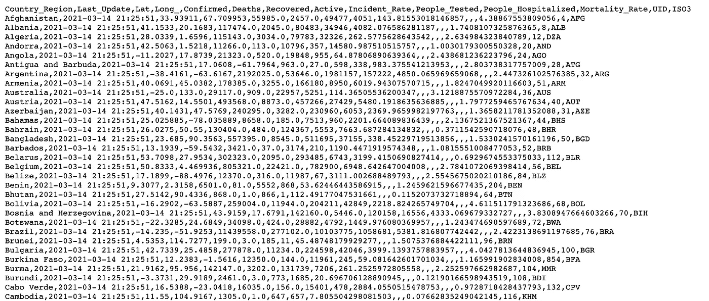

图片由作者使用[此链接](https://raw.githubusercontent.com/CSSEGISandData/COVID-19/web-data/data/cases_country.csv)。

# 将数据加载到 Tableau

将数据加载到 Tableau 有几种方法，包括:

*   从本地机器上传文件 Excel、CSV、text、JSON、PDF、Spatial 等。
*   连接到存储在服务器上的数据—您可以直接从 Tableau Server、Google Cloud Storage/Analytics、MS SQL server 等加载数据。
    您可以使用现有的数据连接器。
*   您也可以连接到以前连接过的信号源。

在我们的例子中，我们希望将 GitHub 上的原始 CSV 文件直接加载到 Tableau，为此，我们可以使用 Keshia Rose 开发的 CSV web [数据连接器](https://basic-csv-wdc.herokuapp.com/)。


作者图片

链接到连接器:[https://basic-csv-wdc.herokuapp.com/](https://basic-csv-wdc.herokuapp.com/)

以下是加载数据的步骤:

*   在连接窗格下，点击`**Web Data Connector**`。
*   在弹出的字段中添加连接器 URL 并点击`Enter`。

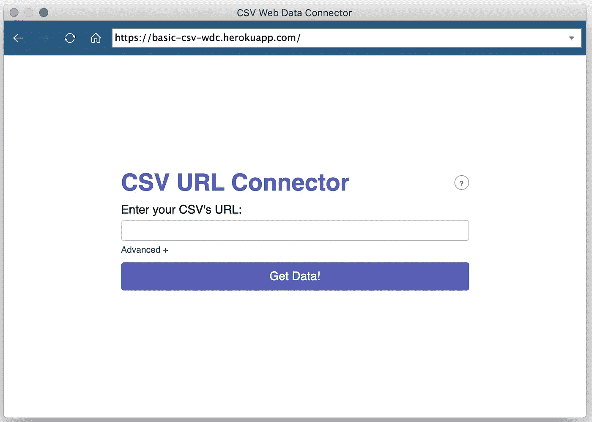

作者图片

*   现在，在搜索字段中添加原始 CSV 文件的链接，并点击`**Get Data!**`。

加载数据需要几秒钟，然后您可以点击`Update now`查看文件中的可用数据:

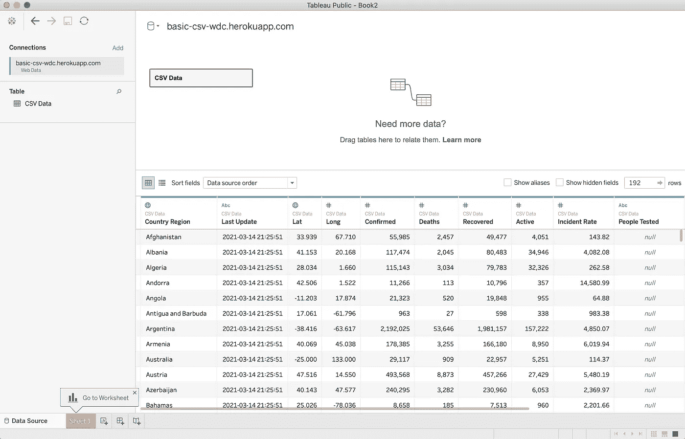

作者图片

# 探索数据

Tableau 以非常直观的方式呈现数据。我们可以从预览和元数据中了解数据的基本属性及其类型。

从预览中，我们可以找到数据集中的特征，这些特征进一步定义了我们有兴趣回答的关于手头问题的问题。

从元数据视图中，我们可以找到这些特征的数据类型(分类/定量/日期时间等),这些数据类型告诉我们如何结合其他特征来分析这些特征。

单击元数据视图会显示列及其名称和类型:

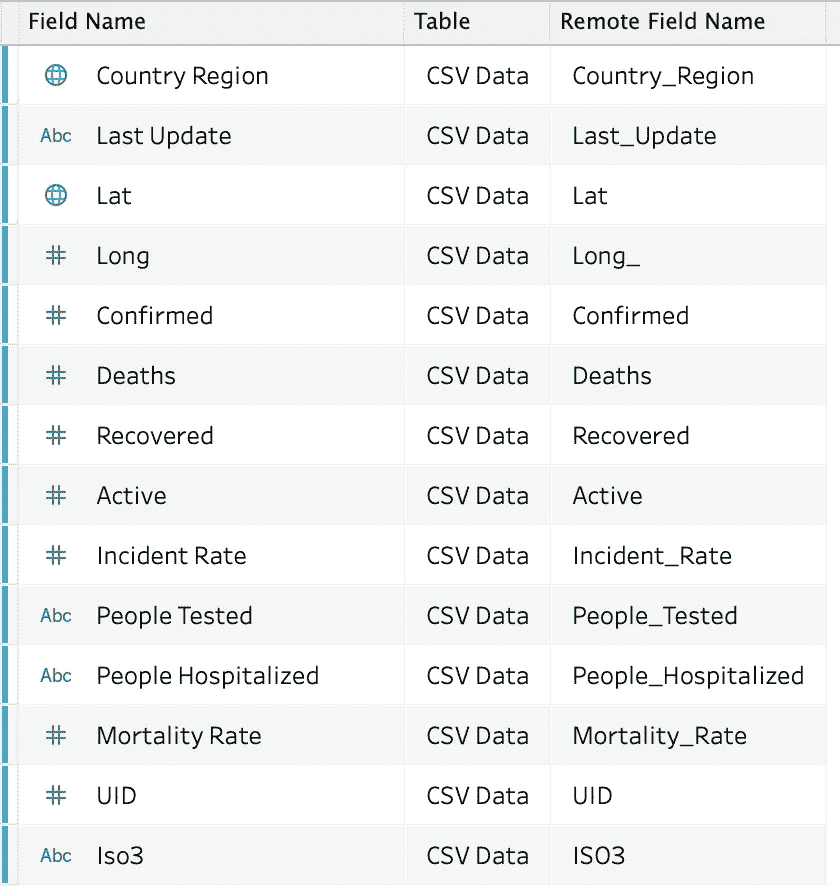

作者图片

了解要素的含义及其数据类型非常重要:

**如何找到变量的数据类型**——用符号表示。
`**#**` —表示数值数据类型。
`**Abc**` —表示分类/字符串数据类型。
`🌐` —表示地理值。
除了这些，我们还有日期时间、集群和布尔符号。

这应该让我们对这个数据集能做些什么有所了解。

由于数据已经被清理和格式化，我们可以跳过争论的部分，继续定义我们想要从这个分析中得到什么。

那么，让我们进入下一步。

# 基于列定义问题

根据我们所拥有的功能及其数据类型，我们可以回答以下简单的问题:

*   就病例总数(活跃、确诊、死亡)而言，目前世界上 COVID 病例的情况如何？
*   国家的现状是怎样的——如果我们能在一个框架内将它形象化？
*   就病例数和死亡率而言，哪些国家受影响最大？

您可以添加/定义更多/不同的问题，但现在我将带您浏览这些问题。

是时候认真回答这些问题了。

# Tableau 界面

下面是 Tableau 界面的快速浏览。

→在底部，您会看到有许多图标，它们是为了:


作者图片

*   检查连接的数据源
*   添加新工作表
*   添加新仪表板
*   添加新故事。

→点击默认情况下为我们创建的第 1 页。

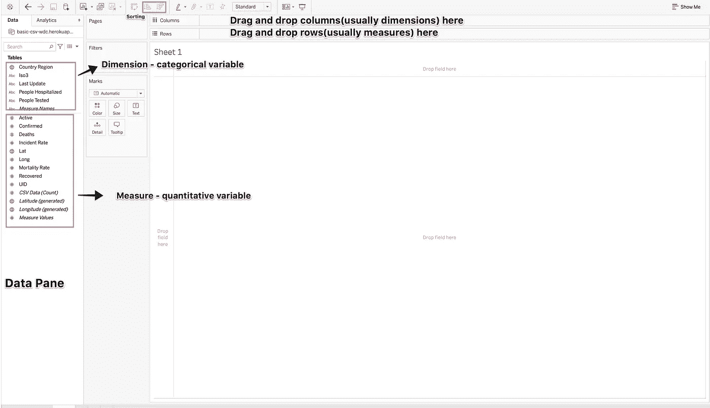

作者图片

在上图中，我只标注了界面的重要部分。大多数分析都是通过将要素拖放到列和行中来完成的。

# 创建可视化

我们现在将迭代每个问题，并创建一个专用表来分析数据，以便回答这个问题。

## 案例总数第一

为了回答这个问题，我们将利用以下几个栏目:

*   确认的
*   死亡
*   活跃的

现在，Tableau 知道这些是定量的度量，只要您尝试拖放其中的任何一个，它就会添加一个默认的聚合器(在本例中是 SUM)。您可以使用标记随时更改聚合器。

要直观显示案例的总数，只需拖动上述每个功能，并将其放在顶部的列字段中。

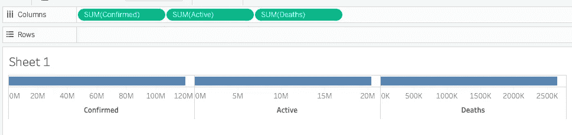

作者图片

> 在任何时候，如果出现任何问题，您都可以使用`Cmd/Ctrl + z`来撤销。

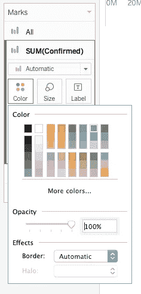

此外，您可以使用左窗格中的标记来更改每个条形的颜色。

您还可以通过右键单击想要格式化的数据可视化来试验字体、文本颜色、阴影等。

这是我的格式化可视化在一些改变(颜色和宽度)后的样子。

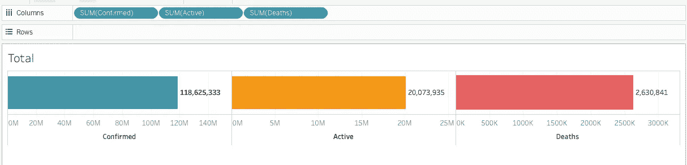

格式化后—按作者排序的图像

→对于我们付出的努力来说，已经足够好了。编写这个需要更多的时间。

太棒了，让我们继续下一个。

## #2 显示每个国家/地区 COVID 病例的世界地图

因为我们在数据中有地理空间维度，我们可以在世界地图上绘制数字，以可视化每个国家的情况。

我将使用纬度和经度(*生成的*)列在世界地图上绘制病例数(确诊、活跃和死亡)。这些是由 Tableau 从 Lat/Long 变量生成的。这些在“表格”窗格中以斜体显示。

步骤:

*   第一步是通过点击`Sheet 1`旁边的图标添加新的工作表
*   拖动*经度(已生成)*并将其放入列中
*   拖动*纬度(生成)*，逐行拖放。这样做之后，你会在主视图中有一个空白的世界地图。
*   要添加国家名称，请将`Country Region`列放在标记窗格的详细信息框中。这样做将在工具提示中显示带有国家名称的符号地图。
*   现在，我们在右上方有一个`Show Me`窗格，向我们显示所有您可以使用的可视化效果。灰色的图表不适用，当您将鼠标悬停在这些图表上时，它会告诉您需要哪些类型的列来使该图表适用。对世界地图这样做，你会了解到我们至少需要 1 个地理空间维度，0 个或更多维度，以及 0 个或 1 个度量。
*   是时候添加度量了，即我们想要可视化的变量。我在选择确诊病例的数量。将确认列拖放到标记窗格中的标签框上。

如果您想将其他变量添加到细节框中，也可以将它们添加到细节框中。

以下是我的符号地图的外观:

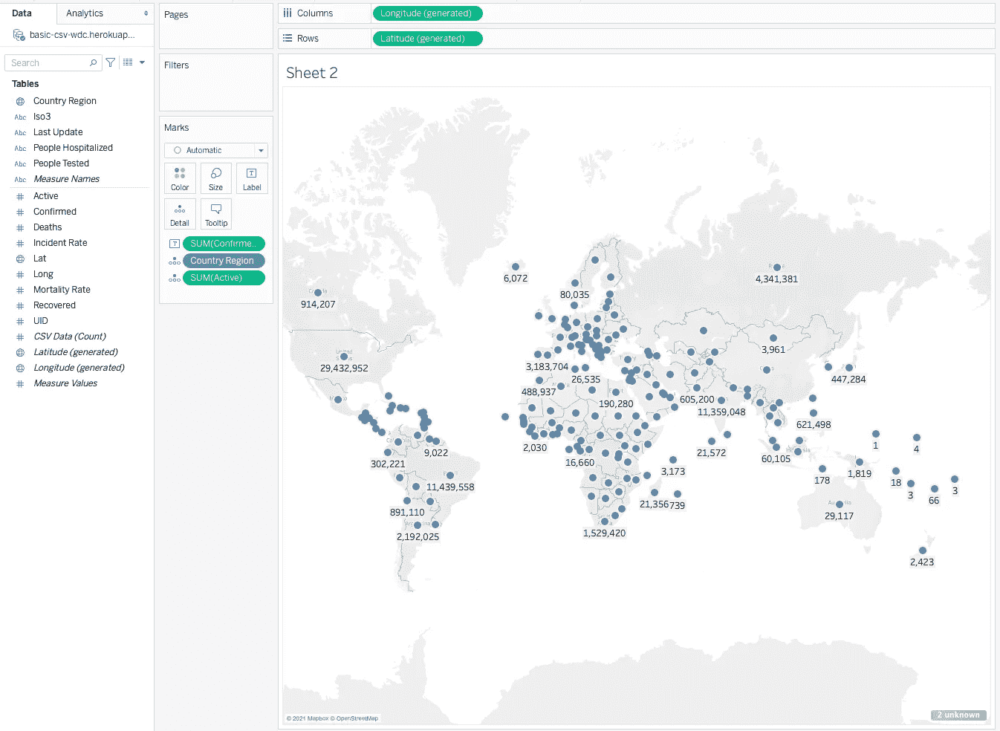

作者图片

您可以随意使用另一张地图，添加颜色，或者设置您想在地图上看到的内容的格式。

## #3 受影响最严重的国家

总人数和世界地图只能给你一个疫情的简要概述。所以，让我们再深入一点，看看哪些国家在确诊病例、死亡人数、死亡率方面受影响最大，哪些国家恢复率高。

这些很容易绘制。以下是步骤:

*   添加新工作表。
*   将`Country Region`功能拖放到列中。
*   将`SUM(Confirmed)`拖放成行。您将在主视图中看到一个条形图，X 轴表示国家，Y 轴表示确诊病例数。
*   因为我们应该查看受影响最严重的国家，所以我们需要对数据进行排序，Tableau 使我们很容易做到这一点。我们所需要做的就是点击顶部任务栏中的`Sort descending`图标。
*   随着所有的棒线按降序排列，我们现在只想挑选几个高于某个阈值的，或者说前 10 个。将光标保持在点击状态，并将其拖动到您想要列入候选名单的钢筋数量上。
*   将鼠标悬停在入围栏上，并在出现的弹出窗口中单击仅保留。这会给你一个整洁的图表。
*   您可以从任务栏打开标签或将 SUM(已确认)放到标签框中。

同样，您可以添加颜色、格式、注释，等等。

以下是我使用上述步骤创建的图表:

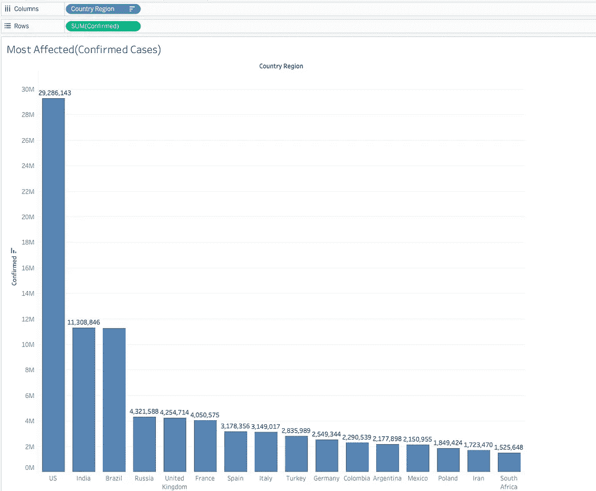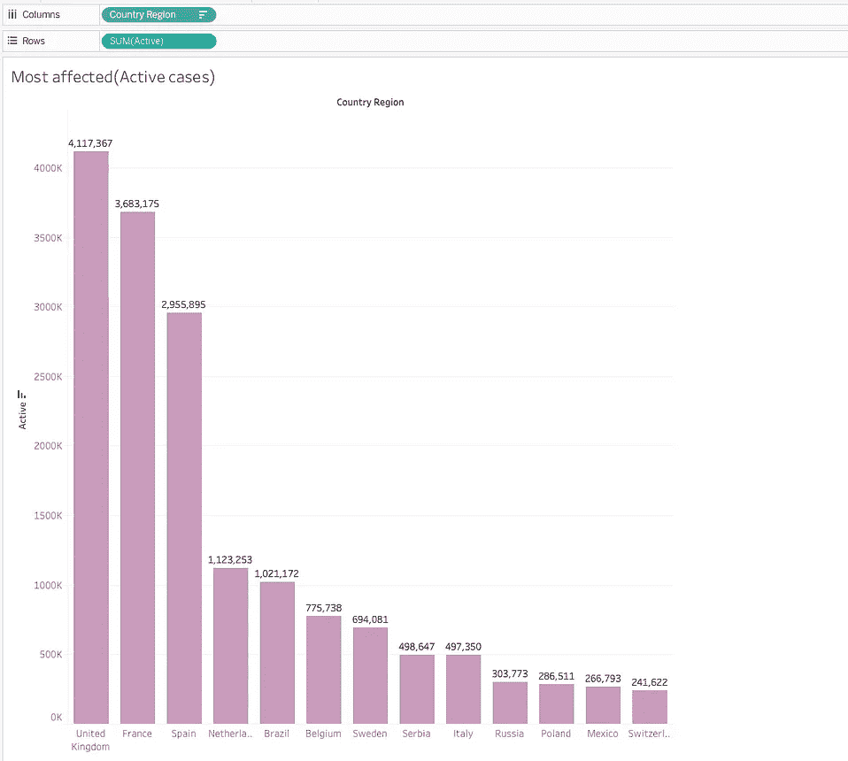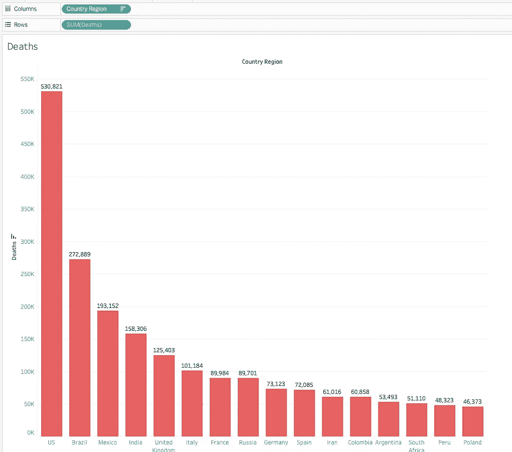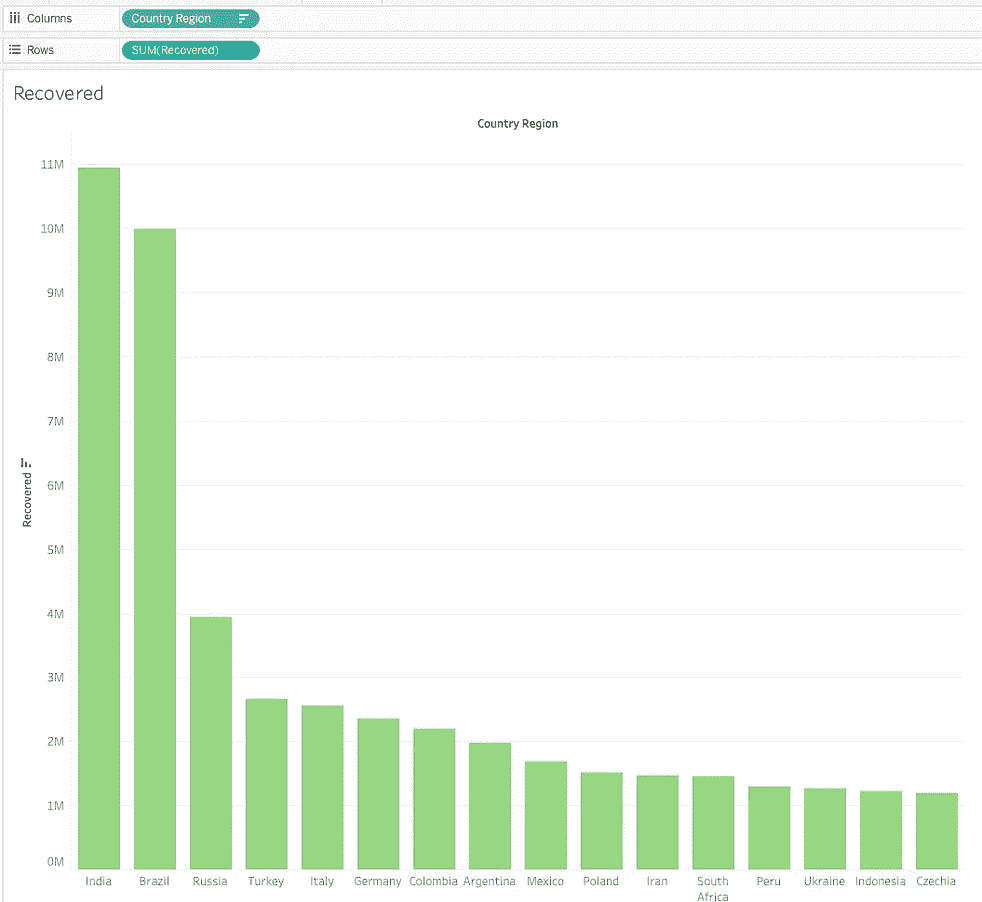

作者图片

> 不要忘记根据它们的使用情况重命名您的工作表。

## 用这些表创建仪表板

有了足够的可视化效果和数字，我们现在可以将它们全部显示在一个屏幕上，从而创建一个快速的交互式仪表盘。

这最后一步非常简单，你需要做的就是点击底部的`New Dashboard`图标。

这将创建一个空的仪表板视图，提示您从左侧窗格中删除要在仪表板中显示的工作表。

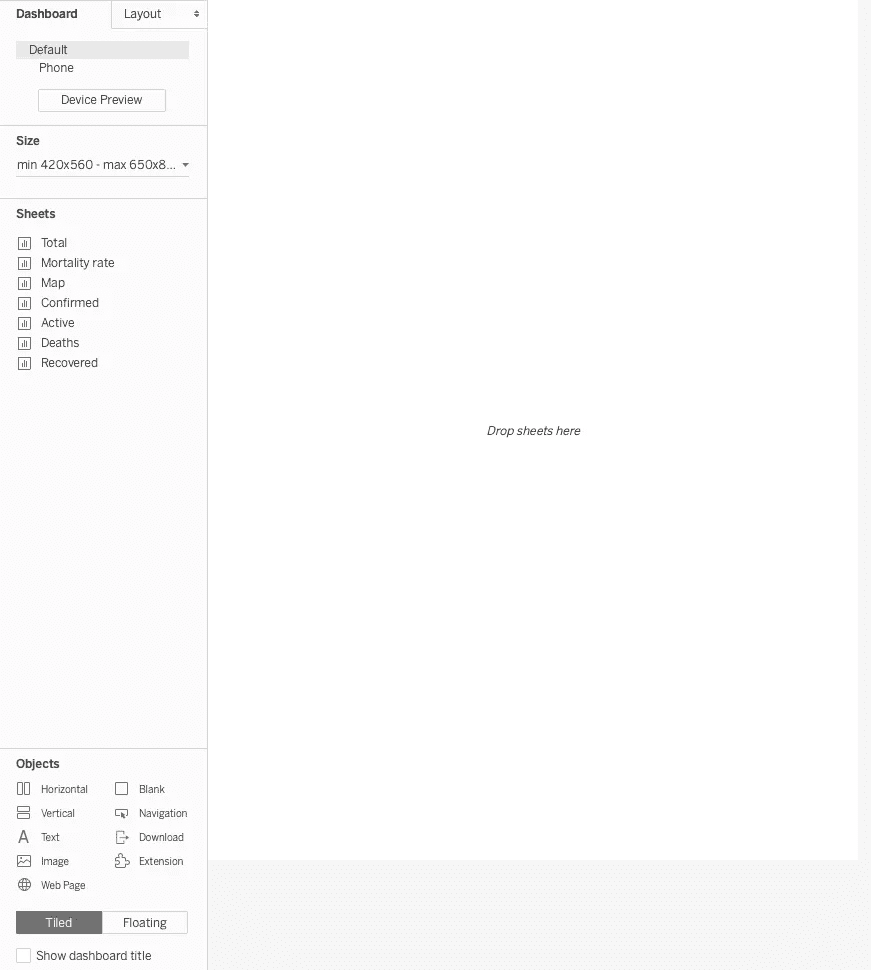

作者图片

您可以将工作表拖放到仪表板上，然后定位它们，使您的仪表板看起来更有洞察力和吸引力。

这是我最后的仪表板:

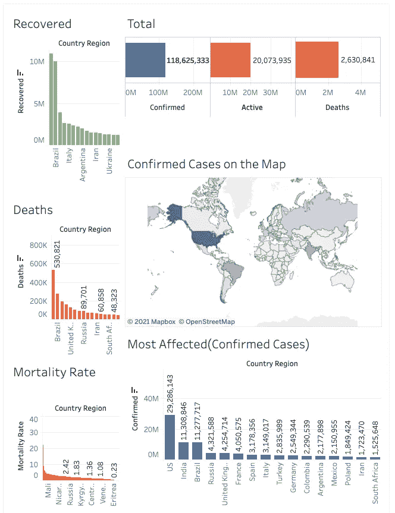

作者图片—[https://public.tableau.com/profile/harshit.tyagi#!/viz home/covid _ book/dashboard 1](https://public.tableau.com/profile/harshit.tyagi#!/vizhome/covid_book/Dashboard1)

如果您想要对任何可视化进行更改，您可以返回到该表，更改将自动反映在仪表板中。

## 共享您的仪表板

您可以创建自己的个人帐户，将所有更改保存到 Tableau 公共服务器上的笔记本/仪表板中。

保存仪表板将创建一个公共链接，您可以与您的分析师同事、合作者或朋友共享。

你可以在这里看我的仪表板:

[https://public.tableau.com/profile/harshit.tyagi#!/viz home/covid _ book/Dashboard](https://public.tableau.com/profile/harshit.tyagi#!/vizhome/covid_book/Dashboard1)。

# 结论

在使用 Tableau 构建了这个仪表板，并将其与我使用 python 和 jupyter notebook 创建该仪表板所花费的工作量进行了比较之后，我尝试在不同的指标上对这两种方法进行评分，5 分表示最好，1 分表示最差:

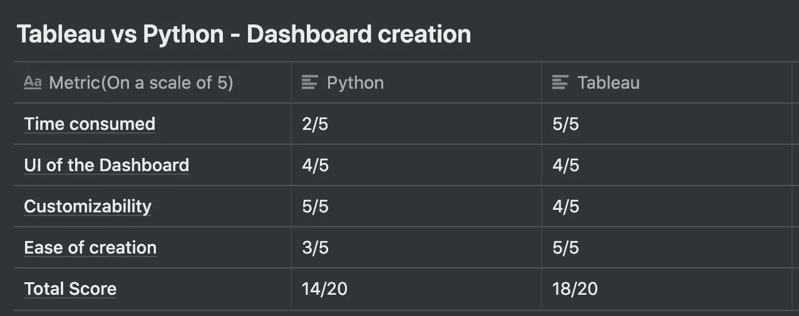

一个有趣的比较——分数是根据我在每个方面的经验给出的。

Tableau 显然是这里的赢家！

我可以说，Tableau 似乎是一个明智和省时的选择，至少对于这些类型的场景是如此。

同样，这是我基于我的经验的个人观点，你应该选择最适合你的用例的。

## Liveproject

如果你想做一些类似但先进的东西，你应该看看我在 [Manning](https://www.manning.com/liveproject/predicting-disease-outbreaks-with-time-series-analysis?utm_source=harshit&utm_medium=affiliate&utm_campaign=liveproject_tyagi_predicting_3_11_21&a_aid=harshit&a_bid=f5119f17) 上的直播项目。

引文:

[1]: Dong E，Du H，Gardner L .一个基于 web 的交互式仪表盘，用于实时跟踪新冠肺炎。柳叶刀新闻杂志。20(5):533–534.doi:10.1016/s 1473–3099(20)30120–1

## **本博客视频版！**