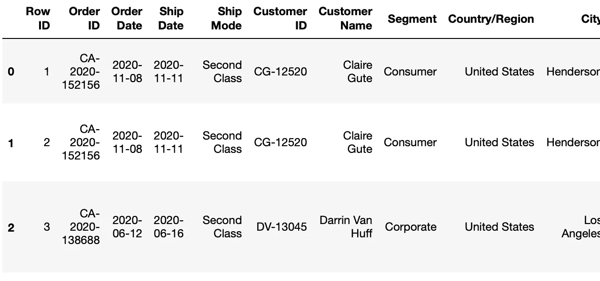
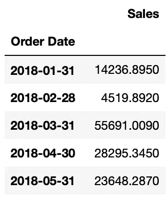
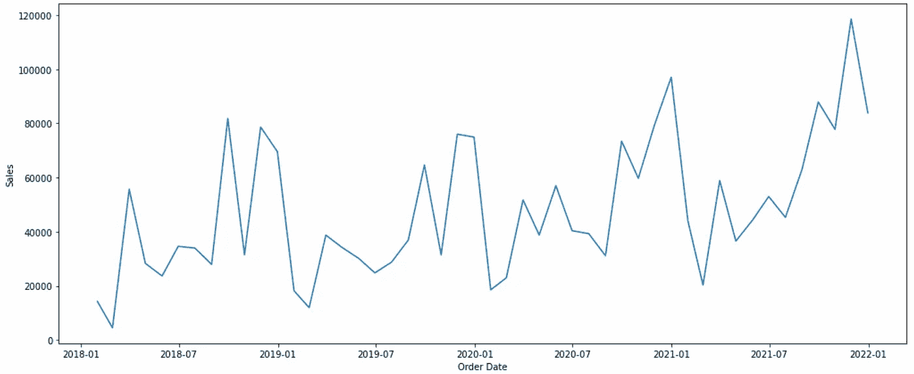
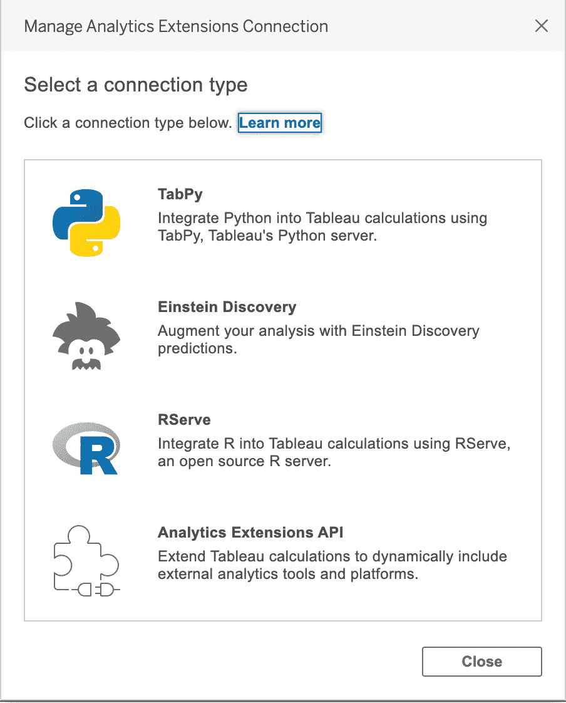
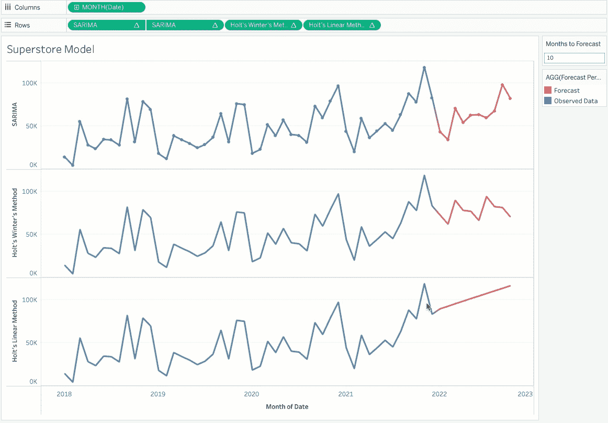
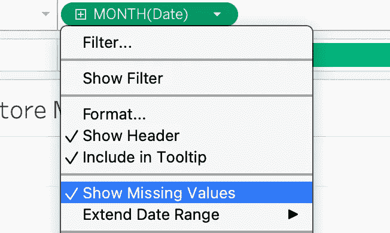
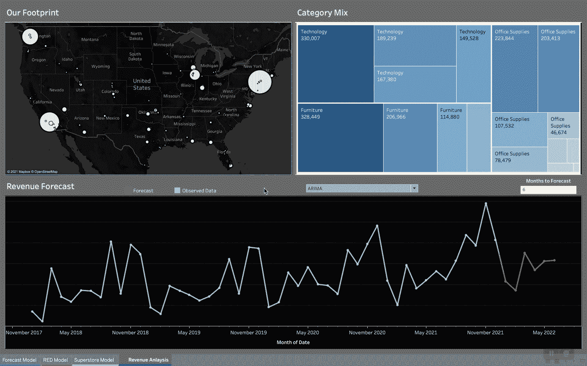

# 用 TabPy 制作你的时间序列预测表！

> 原文：<https://towardsdatascience.com/tableau-your-time-series-forecast-with-tabpy-5c09c151477f?source=collection_archive---------5----------------------->

## 用 Tableau 的速度洞察来补充您的预测！


Julian Hochgesang 在 [Unsplash](https://unsplash.com?utm_source=medium&utm_medium=referral) 上拍摄的照片

欢迎观看一个简短(希望如此)的演示，演示如何使用 TabPy 将数据科学模型与 Tableau 集成在一起。在这个故事中，我们将特别关注时间序列预测。

> 我们将使用三个时间序列模型，这些模型是使用 superstore 数据集(零售业数据)在 python 中构建的。我们将使用 Jupyter notebook 构建我们的 python 代码，然后继续学习 Tableau。

本文旨在展示如何将一个模型与 Tableau 的分析扩展相集成，并使其无缝用于消费。

> 为什么是 Tableau？好吧，我喜欢它，我不能强调它是多么容易探索你的数据。

让我们先来看看数据:



我们只保留日期和销售额列，用于构建时间序列对象。以下代码按升序对销售数字进行排序，并按月对数据进行聚合。

```
#fetching required columns
data = superstore[[‘Order Date’,’Sales’]] 
data = data.sort_values(by = 'Order Date')#creating a ts object
data['Order Date'] = pd.to_datetime(data['Order Date'])
data.index = data['Order Date']
data = data.resample('M').sum()
```



我们准备好可视化时间序列:

```
import matplotlib.pyplot as plt
import seaborn as snsplt.subplots(figsize = (17,7))
sns.lineplot(x = “Order Date”, y = “Sales”, data = data)
plt.show()
```



以上是我们的时间序列图。时间序列有三个重要组成部分:趋势、季节性和误差。我们可以将该系列视为“加法模型”或“乘法模型”,这取决于该系列的性质和我们假设的假设。我将把模型构建和预测方法放在[的下一篇文章](/a-blueprint-for-time-series-9f865609bfa2)中，作为这篇文章的延续，在这篇文章中，我们将涵盖不同的技术、分解、平稳性测试、自相关和部分自相关因子以及模型总结。

现在，在我切换到 Tableau 之前，我将分享我为最终确定模型而编写的代码。

> 正如文章开头提到的，我们将使用三种模型。这些是霍尔特的线性模型，霍尔特-温特的模型和 ARIMA。前两种是指数平滑法，ARIMA 代表自回归综合移动平均法，这是一种回归方法。

以下是霍尔特线性方法的 python 代码:

该模型在 42 个月内进行训练，最后 6 个月用于预测。可以调整模型参数以提高精度。该模型将两者相加，并将整个系列返回给我们。

# 我们怎么把这和画面联系起来？

Tableau 具有内置的分析扩展，允许与其他平台集成。



在我们的例子中，我们选择 TabPy。


请确保安装 TabPy，并在您的终端中启动，如以下资源所示:

 [## TabPy 安装说明

### 动态执行 Python 代码并在 Tableau 可视化中显示结果:在 GitHub tableau/TabPy 上查看项目…

tableau.github.io](https://tableau.github.io/TabPy/docs/server-install.html) 

您可以在上述弹出窗口的 Tableau 中测试连接。

我们还在 python 环境中导入了 TabPyClient 来创建一个连接对象。

我们将使用这个连接对象在我们启动的 TabPy 服务器上部署我们的模型。

让我们看看可以部署在 TabPy 上的 Holt 线性方法的修改代码。

***霍尔特线性法***

我们已经创建了一个返回模型输出的函数。因为我们将从 Tableau 中读取数据，所以我们使用了接受我们将从 Tableau 中传递的值的参数。您将会注意到，我们已经使用了 connection 对象来在 TabPy 中部署模型。同样，您可以为其他模型创建函数。

***霍尔特-温特的方法***

***ARIMA***

现在我们已经在 TabPy 中部署了这些模型，让我们在 Tableau 中使用它。我们将创建如下所示的计算字段:


> Tableau 使用四个函数，即 SCRIPT_REAL、SCRIPT_STR、SCRIPT_BOOL 和 SCRIPT_INT，分别用于返回类型 REAL、string、boolean 和 integer。上面的代码告诉 Tableau 运行“季节性 ARIMA 方法”,该方法部署在 TabPy 上，带有 3 个参数(日期、销售额和预测月份),并将“响应”返回给 Tableau 的计算字段。

同样，我们为其他两个模型定义了计算字段。如果我们想在 Tableau 中一览无余，它看起来会是这样的:



请注意，您可以根据需要动态更改预测周期并查看预测。您希望选择最精确的模型。您可以选择在 Tableau 中创建一个参数来在模型之间切换。

需要注意的一个关键点是，我们需要容纳 Tableau 中的预测周期(在我们的例子中是几个月),以便为 TabPy 的返回值腾出空间。这是因为当我们从 Tableau 传递值时，原始数据集没有这些未来日期的空记录。我调整了数据以扩展日期范围，如下所示:


上述代码在将所需月份添加到 forecast 中并将其传递给 TabPy 之后，基本上扩展了日期范围。此外，我们为此计算日期字段选择“显示缺失值”。



> 这里有一个小交易。因为我们扩展了日期范围，所以最后的日期和销售数字被推到新的预测结束日期。然而，我们只对预测感兴趣；我们可以排除这个数据点，或者在过滤框中使用 LAST()=FALSE。请随意提出相同的想法。

***让我们最后把它插入我们的仪表板:***



这就对了。在 Tableau 的可视化发现中，我们有一个集成良好的预测模型。你绝对可以在 Tableau 中引入准确度分数和模型参数，让它变得更加活泼！

如前所述，在我的[下一个故事](/a-blueprint-for-time-series-9f865609bfa2)中会有更多。