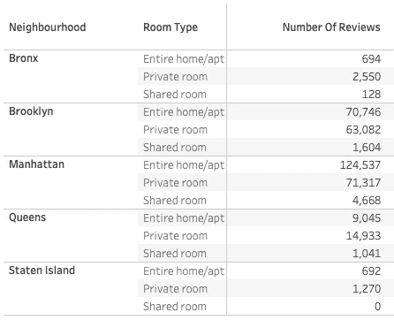
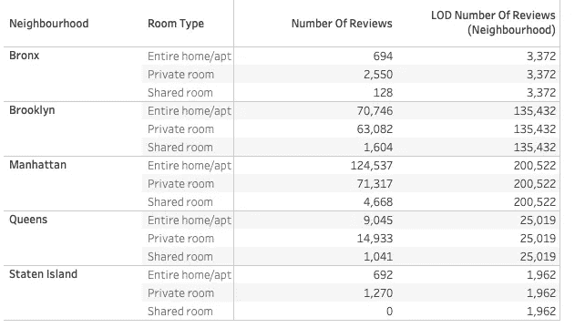
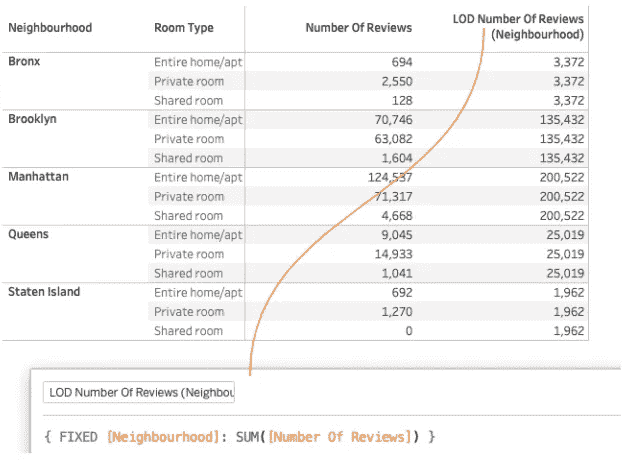
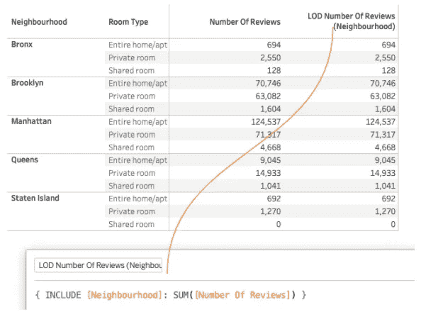
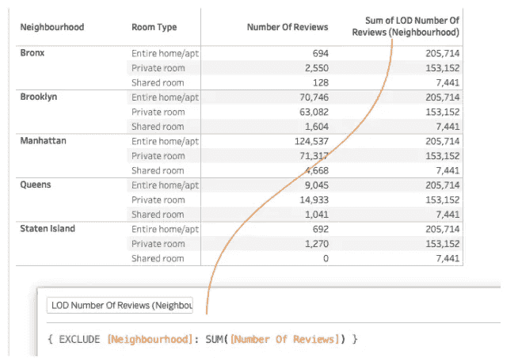
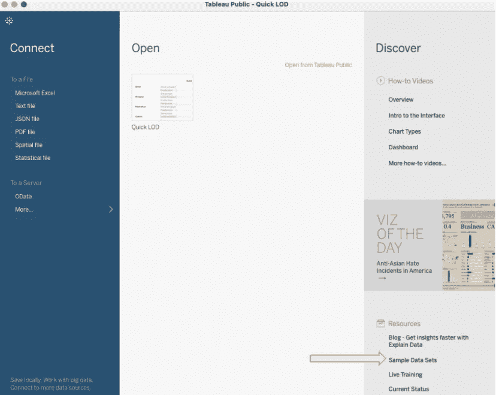
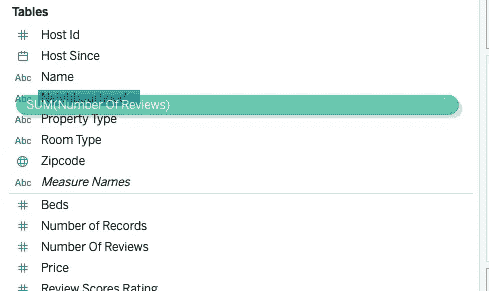
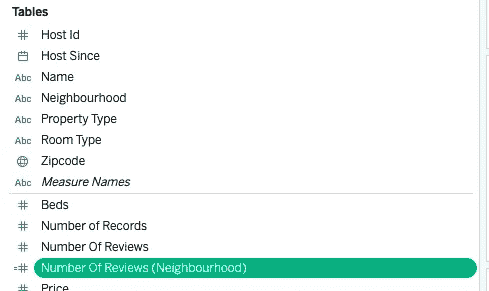

# Tableau 的新“快速 LOD”审查

> 原文：<https://towardsdatascience.com/tableaus-new-quick-lod-reviewed-47de0c0ad936?source=collection_archive---------31----------------------->


图片来自 Patrick Tomasso 由作者编辑

Tableau 最近发布了一个新特性“快速 LOD ”,它应该可以更容易地构建 LOD 计算。作为一个密集的 LOD 用户，我想尝试一下这个特性，并与您分享我的想法。

内容:

```
**·** [**Quick reminder about LOD expressions**](#29cb) **·** [**Testing "Quick LOD**](#1e3a)**"
·** [**Testing Outcomes**](#a0f3) **·** [**In a nutshell…**](#d1e1)
```

# 关于 LOD 表达式的快速提醒

当我们构建数据可视化时，我们经常需要通过使用 LOD 计算来同时处理同一度量的多个聚集级别。

如果我们在概念上与 SQL 相似，LOD 表达式允许在同一个查询中定义多个不同的 GROUP BY 子句。或者，使用更高级的 SQL 概念，LOD 将允许在同一个数据集上使用多个窗口函数(尽管有一些差异)。

例如，让我们考虑一个关于住宿的 viz，我们有一个关于每个房间类型和邻居的评论数量的数据。这里我用了一个丑陋但清晰的表示法:



作者截图—示例数据集

如果在同一个数据 viz 中，我们还想只显示邻域的聚集，我们将需要一个 LOD 表达式。



作者截图 LOD 示例

好吧，乍一看，它看起来不是很有用，但是我们可以使用“LOD 评论数”进行其他更复杂和有趣的计算(例如，按邻居加权平均，占总数的百分比，等等)。).

有 3 种类型的 LOD 计算，用于指定应如何构建数据组:

*   **固定**LOD 定义了一个静态的独立分组。它仅使用计算中指定的维度来计算聚合度量，而不引用数据可视化中的任何其他维度。此外，固定表达式忽略 viz 中的所有过滤器，除了上下文过滤器、数据源过滤器和提取过滤器。



作者截图—固定 LOD 示例

*   **包含**LOD 组数据，达到一个**以上**的粒度级别。除了视图中的维度之外，它还使用计算中指定的维度来计算聚合度量值。因此，当您需要包含视图中不存在的维度的计算时，这是非常有用的。



作者截图—包含 LOD 的示例

*   " **EXCLUDE** " LOD 组数据达到比**更小的**粒度级别。它从表达式中显式删除维度，这意味着指定的维度从分组中排除。



作者截图-排除 LOD 的示例

对 LOD 的深入解释超出了本文的范围，但是如果您需要更多的信息，可以在这里找到:

[](https://www.tableau.com/learn/whitepapers/understanding-lod-expressions?_ga=2.205069776.1331838473.1617091658-1235017356.1614089650&_fsi=kmTEmxG0) [## 了解详细等级(LOD)表达式

### Tableau 的目录，我们的目标是让数据分析成为一种愉快的体验。人们告诉我们，当他们…

www.tableau.com](https://www.tableau.com/learn/whitepapers/understanding-lod-expressions?_ga=2.205069776.1331838473.1617091658-1235017356.1614089650&_fsi=kmTEmxG0) [](https://help.tableau.com/current/pro/desktop/en-us/calculations_calculatedfields_lod_overview.htm) [## 概述:详细等级表达式

### 本文解释了细节层次表达式是如何计算的，以及它们在 Tableau 中的作用。更多信息…

help.tableau.com](https://help.tableau.com/current/pro/desktop/en-us/calculations_calculatedfields_lod_overview.htm) 

# 测试“快速 LOD”

我使用 Tableau 已经有 5 年了，就表达的复杂性和提供的可能性而言，LOD 是一个让我花了更长时间才能理解和流利使用的概念。现在，由于我经常提供包含 Tableau 的培训，我尝试了新的快速 LOD 功能，看看它是否真的可以帮助初学者使用 LOD，或者至少开始使用。

快速 LOD 所做的是通过将一个度量拖放到一个维度上，用标准 LOD 表达式创建一个新的度量。根据我所做的测试，默认的 LOD 类型是“固定的”。

如果你想测试它们:

1.  打开 Tableau Public 并下载样本数据集“**纽约市的 Airbnb 房源**”。

注:如果你是一个完全的初学者，我描述了如何获得 Tableau 公共(免费)[在这里](https://medium.com/analytics-vidhya/create-a-real-world-data-science-environment-at-home-7a4255ff6fa5)。



作者截图—在 Tableau Public 中获取免费数据集

2.在一个新的工作表中，按住 Ctrl 并单击(在 Mac 上按住 Command 并单击)度量“**评论数**”，将其拖放到维度“**邻域**



作者截图—尝试快速 LOD

由于快速 LOD 特性，您应该会看到一个新的对象度量出现。



作者截图—尝试快速 LOD

它的表达式是一个 LOD:


# 测试结果

好吧，但是..就这些吗？是的:除此之外对开发者没有额外的帮助，或者至少我找到的就是这些。

一个很酷的特性是一个新的专用 LOD 编辑器，帮助用户定义 LOD 范围和聚合方式，但新的“快速 LOD”完全不是这样。它只是一个表情生成器，除了节省 5 秒的开发时间之外没有任何智能。

此外，在现实生活中的仪表板和数据可视化中，LOD 表达式通常处理不止一个维度，因此即使是自动生成的表达式也需要编辑和增强。

另外，我也不清楚为什么固定 LOD 是默认的快速 LOD 类型。

总之，数据可视化开发人员仍然需要学习 LOD 语法、类型和逻辑来正确完成他们的工作，新的快速 LOD 特性几乎没有帮助。

# 简而言之…

在这篇文章中，我测试了新 Tableau 的“快速细节层次”功能，这是为了帮助开发者处理细节层次的表达。我发现 Tableau 试图夸大其词，因为它相对于手动 LOD 编写的优势可以忽略不计。

感谢阅读。

[随时订阅我的**【分享数据知识】**简讯**。**](http://eepurl.com/humfIH)


如果你想订阅《灵媒》,请随意使用我的推荐链接[https://medium.com/@maw-ferrari/membership](https://medium.com/@maw-ferrari/membership):对你来说，费用是一样的，但它间接有助于我的故事。