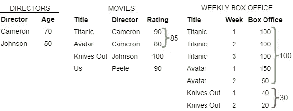
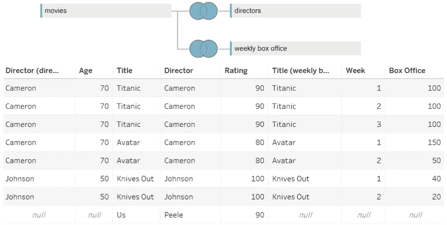
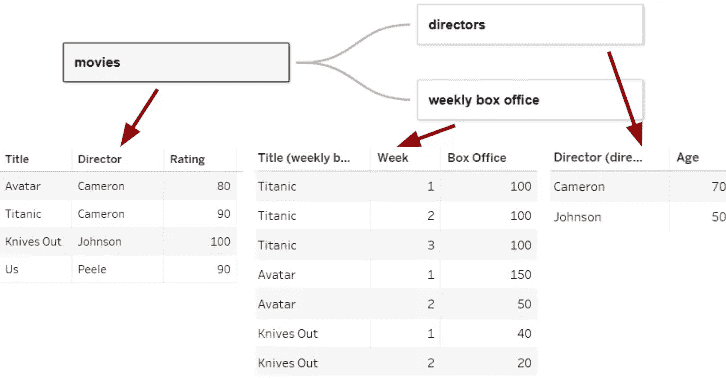
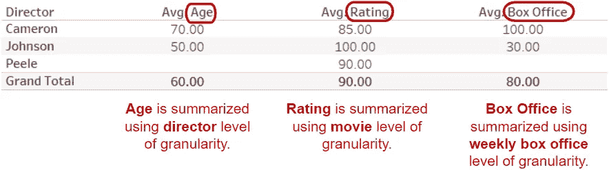
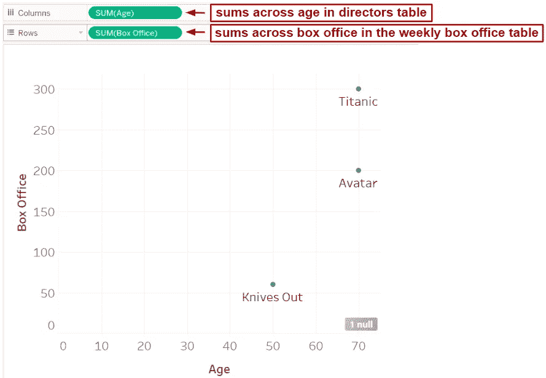
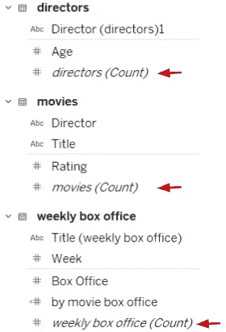
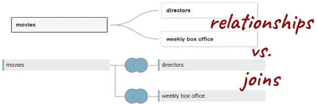

# Tableau 的关系很酷

> 原文：<https://towardsdatascience.com/tableaus-relationships-are-pretty-cool-517f0201535b?source=collection_archive---------20----------------------->

## 与连接不同，关系保留了数据的原始粒度，减少了对 LOD 表达式的需求。

去年夏天，Tableau 引入了一种新的数据整合方式。它叫做[关系](https://www.tableau.com/about/blog/2020/5/relationships-part-1-meet-new-tableau-data-model)。使用*连接*组合数据的老方法仍然可用，我想我们中的许多人可能会暂时坚持使用熟悉的连接。然而，人际关系有很多值得推荐的地方，这篇文章将展示它们的一些来龙去脉。考虑下面的三个表:

图片作者。

使用*连接* Tableau 将这些表组合成一个*平面*文件，如下所示:

将表合并到一个平面文件中会改变一些数据的粒度。图片作者。

将具有不同粒度级别的表连接起来，会在具有更多聚合粒度级别的表中复制观察结果—在本例中，是 director 和 ratings 表。正确总结这些表格中的测量值需要使用 [LOD 表达式](https://help.tableau.com/current/pro/desktop/en-us/calculations_calculatedfields_lod_overview.htm)，这可能具有挑战性。

**关系**保留每个表的原生粒度级别。用户只需定义表之间的关系，并根据需要执行连接。

关系保留了数据的原生粒度。图片作者。

当我们创建包含这些表中的度量的汇总时，每个度量都使用其固有的粒度级别进行汇总。

图片作者。

我们两位导演的平均年龄是 60 岁——尽管詹姆斯·卡梅隆有五部每周票房收入，而莱恩·约翰逊只有两部。由于年龄来自本机粒度为控制器的控制器表，因此平均值是跨控制器计算的。对于 Tableau 的新手来说，这是很自然的，但是对于我们这些习惯于使用 LOD 表达式来纠正重复，并且习惯于将我们的数据视为一个合并的平面文件的人来说，这是相当具有革命性的。

让我们在下面的散点图中再次说明这个想法。我们正在绘制导演年龄与电影票房总和的关系图。Tableau 从票房表中累加每部电影的票房收入，但它从导演表中取出导演的年龄，因为每个导演在该表中只出现一次，所以年龄不会重复。

图片作者。

还要注意，对于关系，我们不必担心是使用右连接、左连接、全连接还是内部连接。如果一个维度存在于视图中使用的任何一个表中，那么这个维度就包含在 viz 中。对于在一个表中存在而在另一个表中不存在的维度度量，不会生成空值。

图片作者。

关系带来的另一个变化是*记录数量*字段的消失。现在，有一个(计数)字段与每个表相关联。这很有意义，因为每个表都保留了自己的粒度级别，因此有自己的记录数。

关系并不完美。目前，它们[不支持计算“联接”](https://kb.tableau.com/articles/issue/Unable-to-Define-Relationships-Based-on-Calculated-Fields-or-Geographic-Fields)，也就是说，不可能基于计算来定义关系。这意味着建立关系所需的任何操作，如拆分一个字段或拼接两个字段，都需要在连接到源之前完成。让我们希望 Tableau 很快将计算融入到关系中。

同样值得注意的是，数据源过滤器扩展到了相关的表中。您可能认为这两个表是分开的，但事实并非如此:对一个表中的值进行筛选将适用于相关表中的匹配值。例如，添加一个仅包含 50 岁的导演的筛选器，不仅会将詹姆斯·卡梅隆从导演表中排除，还会将他的所有电影从电影表中排除。(它也不包括乔丹·皮尔的美国，除非我们指定包括空值。)

Tableau 很好地解释了关系[在这里](https://help.tableau.com/current/pro/desktop/en-us/datasource_dont_be_scared.htm)。虽然习惯关系的逻辑需要一些时间，但绝对值得一试。

图片作者。