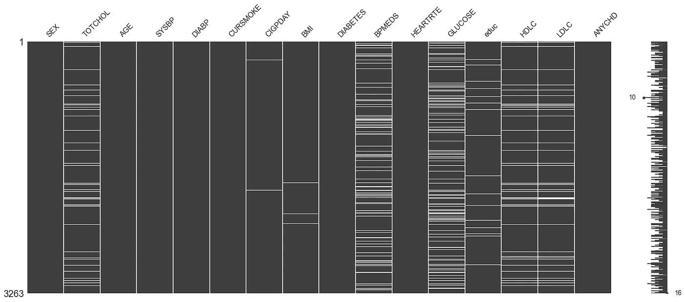
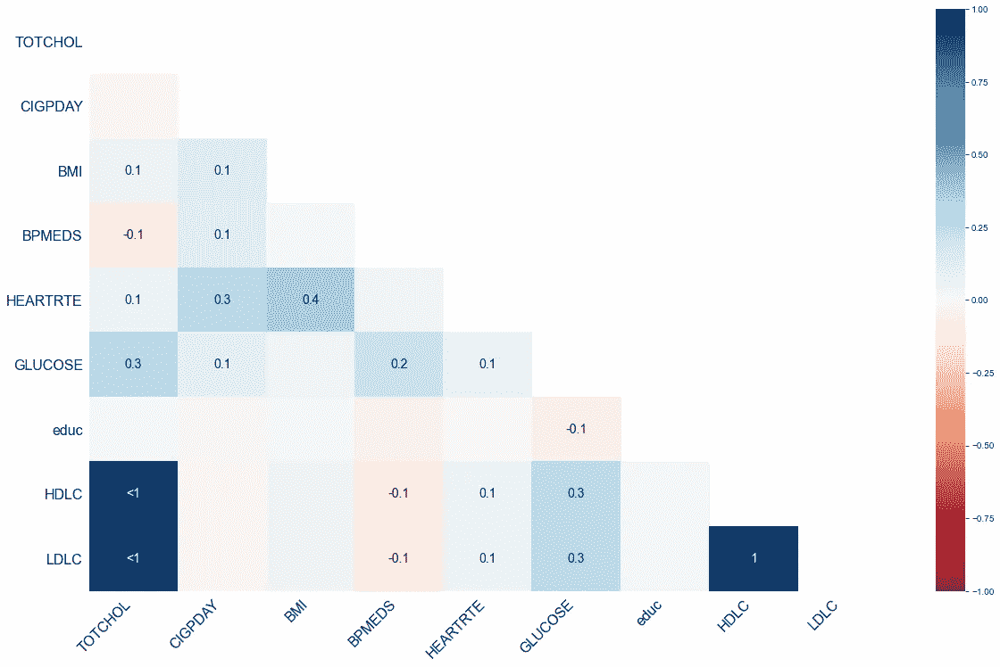
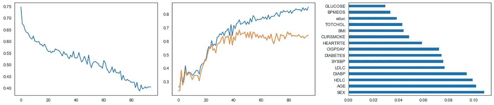
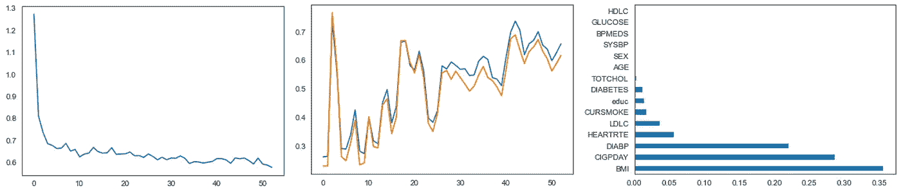
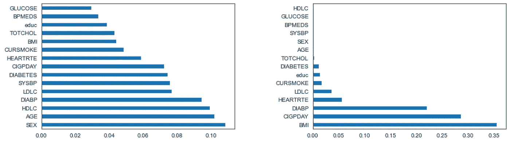

# TabNet —用于结构化表格数据的深度神经网络

> 原文：<https://towardsdatascience.com/tabnet-deep-neural-network-for-structured-tabular-data-39eb4b27a9e4?source=collection_archive---------6----------------------->

里卡多·戈麦斯·安吉尔在 [Unsplash](https://unsplash.com/?utm_source=unsplash&utm_medium=referral&utm_content=creditCopyText) 上的照片

在这篇文章中，我将带你看一个使用 Google 的 TabNet 解决分类问题的例子。

尽管最近图像、音频和文本的深度神经网络(DNNs)激增，但似乎使用良好的结构化表格数据的任务在某种程度上被忽略了。

虽然今天的大部分数据确实是非结构化的([大约 80%](https://www.altexsoft.com/blog/structured-unstructured-data/) ，但重要的是要正确看待绑定到行和列的*少得可怜的* 20%的数据仍然代表着巨大的数量。事实上，在 2020 年， [IBM](https://www.ibm.com/blogs/journey-to-ai/2020/11/addressing-data-growth-with-scalable-immediate-and-live-data-migration/) 估计全世界的数据收集总量将达到 350 亿兆字节(或 350 亿兆兆字节)。

这使得 **7，000，000，000，000，000，000 字节的结构化数据需要一些深层的神经关注！**

平心而论，正如 TabNet 最初的[论文](https://arxiv.org/pdf/1908.07442.pdf)中指出的，这是由于当前的集合决策树(DT)变体(XGBoost、LightGBM、CatBoost 等)的事实。，)在表格数据方面比 DNNs 有一些优势。

然而，这一切都消失了，因为 TabNet 的发布在多个基准数据集上超过了基于 DT 的模型。

# 弗雷明汉心脏研究

今天，我将通过一个例子来说明如何使用 TabNet 来完成分类任务。该数据集包含来自弗雷明汉心脏研究的结果，该研究始于 1948 年，已经提供(并且仍在提供)对心血管疾病风险因素的重要见解。对于那些有兴趣了解更多关于这项研究的人，请查看此[链接](https://framinghamheartstudy.org/fhs-about/)。

如果你有兴趣了解更多关于 TabNet 架构的知识，我鼓励你看看我上面链接的原始论文。额外的资源包括这个 [repo](https://github.com/google-research/google-research/blob/master/tabnet/tabnet_model.py) ，在这里你可以看到原始的 TabNet 代码。

最后，在我们深入讨论之前，你可以使用我在这个[回购](https://github.com/ryancburke/framingham)找到的笔记本。

## 数据

用于该分析的数据由 16 个变量组成，包括目标变量 ANYCHD。每一个的描述可以在下面找到。

表 1-数据集中变量的描述。

这是我们的数据帧的样子。

表 2 —表格形式的数据视图

## 调查缺失值

接下来，我想看看丢失了多少数据。使用 df.isnull()很容易做到这一点。sum()，它将告诉我们每个变量丢失了多少数据。另一种方法是使用一个软件包 [missingno](https://github.com/ResidentMario/missingno) ，它允许我们非常快速地可视化缺失数据之间的关系。

在图 1 中，变量的缺失值(白色)的矩阵表示。这是按行垂直组织的，这允许我们查看丢失的值之间是否有任何关系。例如，HDLC 和 LDLC 的缺失值是相同的，这表明这些值不是为该数据集中的部分患者收集的。

图 1 —按变量排列的缺失数据矩阵。作者图片

我们还可以从另一个角度得到缺失值之间关系的热图，如图 2 所示。在这里，我们可以更容易地看到 HDLC 和 LDLC 之间的关系。值<1 means that it is slightly less than 1\. Since al 3 of these variables are measure of cholesterol, it suggests that cholesterol data was not collected for certain patients in the dataset.

Figure 2 — A heatmap demonstrating the relationship between missing values. Image by author

## Imputing missing values

Now that we have gathered information about our missing values, we need to decide what to do about them. There are many options depending on your data, and you can read more about the various imputation algorithms available on [sklearn](https://scikit-learn.org/stable/modules/impute.html) 的网页。

我选择了 KNN 估算器，您可以使用下面的代码实现它。总而言之，在第一个模块中，我简单地将数据分为特征和目标。

第二个模块使用 KNN 估算器变换特征。正如您在打印报表中看到的，最初有 1812 个缺失值被估算。

图 3-使用 KNN 估算器处理数据集中的缺失值。

最后一步是分割我们的数据。使用下面的代码，我最初将数据分成 70%用于训练集，30%用于验证集。然后，我将验证集分为验证集和测试集两部分。打印声明为我们提供了关于裂缝形状的信息。

图 4 —将数据分为训练集、验证集和测试集

## TabNet

您可以用几行简单的代码来运行 TabNet，如下所示。这是 TabNet 的 pytorch 实现，所以您必须导入(或者安装，如果您还没有导入的话)torch、pythorch_tabnet 和您希望使用的模型(二进制分类器、多分类器、回归器)。

您还需要某种度量来评估您的模型。以下是从 [sklearn](https://scikit-learn.org/stable/modules/model_evaluation.html) 获得的列表。我还包含了一个标签编码，以防您的数据与我的略有不同。我的分类变量都是二进制整数，但是如果你有存储为字符串的类别，你会首先使用这个(或者一个替代的，比如一个热编码)。

图 5 —导入必要的库

接下来，我们必须定义我们的模型，这可以在下面的第一个代码块中看到。在第一行，我们定义了我们的优化器，[亚当](https://arxiv.org/abs/1412.6980)。接下来的几行安排了我们学习速度的逐步衰减。让我们打开它的内容:

*   学习率最初设置为 lr = 0.020
*   10 个时期后，我们将应用 0.9 的衰减率
*   结果仅仅是我们的学习率和衰减率的乘积 0.02*0.9，这意味着在第 10 个时期它将减少到 0.018

在下一个代码块中，我们使模型适合我们的数据。基本上，它说训练和验证集将使用 *auc* (曲线下面积)和*准确性*作为总共 1000 次迭代(*时期*)的度量来评估。

*耐心*参数表示，如果在连续 50 个时期后没有观察到度量的改善，则模型将停止运行，并将加载来自最佳时期的最佳权重。

256 的*批量*是根据 TabNet 论文的建议选择的，他们建议批量不超过总数据的 10%。他们还建议*虚拟批量*小于批量，可以均分为批量。

工人*的数量*保持为零，这意味着将根据需要装载批量。据我所知，增加这个数字是一个非常消耗内存的过程。

*权重*可以是 0(无采样)或 1(自动采样)。最后， *drop_last* 是指在训练过程中，如果没有完成，则丢弃最后一批。

值得注意的是，其中许多都是默认参数。你可以在这里查看参数[的完整列表](https://github.com/dreamquark-ai/tabnet)。

图 6——定义和拟合我们的 TabNet 分类器

这个分析的结果可以在图 8 中看到，并且可以使用下面的代码重现。前三个代码块绘制了损失分数、准确性(对于训练集和验证集)和特征重要性(对于测试集)。

最后的块简单地计算验证和测试集达到的最佳精度，分别是 68%和 63%。

图 7 —绘制损失分数、准确性和特征重要性

图 8 —(左)损失分数；(中间)训练(蓝色)和验证(橙色)集的准确性；(右)相对特征重要性

## 无监督预训练

TabNet 也可以作为无监督模型进行预训练。预训练包括有意屏蔽某些单元格，并通过预测屏蔽值来学习这些单元格和相邻列之间的关系。然后，可以保存学习到的权重，并将其用于监督任务。

让我们看看使用无监督的预训练如何影响我们的模型精度！

虽然类似，但代码有一些差异，所以我在下面列出了这些差异。具体来说，您必须导入 TabNetPretrainer。您可以在第一个代码块中看到，TabNetClassifier 被替换为 TabNetPretrainer。

当您拟合模型时，请注意最后一行 *pretraining_ratio* ，它是在预训练期间被屏蔽的特征的百分比。值为 0.8 表示 80%的要素被遮罩。

下一个代码块引用从 TabNet 的编码表示中生成的重构特征。这些被保存，然后可以在单独的监督任务中使用。

图 9 —使用 TabNet 的无监督表示学习

当对该数据集使用预训练时，验证集和测试集的结果分别为 76%和 71%的准确度。这是一个显著的进步！下面，您可以看到损失分数、训练集(蓝色)和验证集(橙色)的准确性，以及为测试集确定的特性重要性。

图 10 —(左)损失分数；(中间)训练(蓝色)和验证(橙色)集的准确性；(右)相对特征重要性。图片作者。

## 摘要

在本文中，我们通过一个例子演示了如何为分类任务实现 TabNet。我们发现使用 TabNet 的无监督预训练显著提高了模型的准确性。

在下面的图 11 中，我绘制了有监督(左)和无监督(右)模型的特征重要性。有趣的是，无监督的预训练能够提高模型的准确性，同时减少特征的数量。

当我们考虑特性之间的关系时，这是有意义的。例如，使用 TabNet 进行预训练可以了解到血压药物(BPMEDS)、收缩压(SYSBP)和舒张压(DIABP)是相关的。因此，无监督表示学习作为监督学习任务的高级编码器模型，具有更清晰和更可解释的结果。

图 11-有监督(左)和无监督(右)TabNet 模型的特征重要性值。图片作者。

我希望你喜欢这篇文章！试试看，让我知道它对你有什么效果。