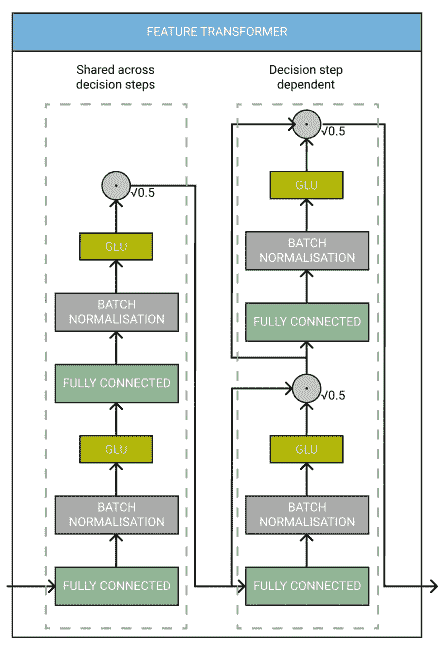
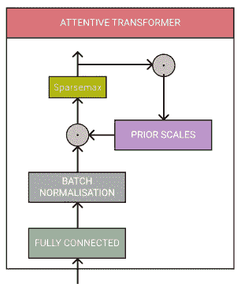
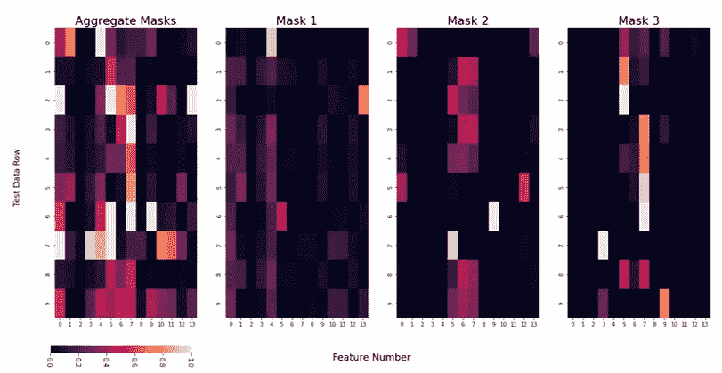

# TabNet:梯度推进的终结？

> 原文：<https://towardsdatascience.com/tabnet-e1b979907694?source=collection_archive---------5----------------------->

## TabNet 平衡了表格数据的可解释性和模型性能，但是它能取代 boosted 树模型吗？

TabNet 模型架构。图片作者。灵感来自[https://arxiv.org/pdf/1908.07442.pdf](https://arxiv.org/pdf/1908.07442.pdf)。

# 介绍

XGBoost、LightGBM 和 Catboost 等梯度推进模型一直被认为是[表格数据领域的最佳选择](https://www.kaggle.com/shivamb/data-science-trends-on-kaggle)。即使在 NLP 和计算机视觉方面取得了快速进展，神经网络仍然经常被基于表格数据的树型模型超越。

2019 年进入谷歌的 [TabNet](https://arxiv.org/abs/1908.07442) 。根据这篇论文，这个神经网络能够**在各种基准测试中胜过领先的基于树的模型**。不仅如此，它比增强的树模型更容易解释，因为它有内置的解释能力。也可以不经过任何特征预处理使用**。如果是这样的话…为什么它没有流行起来？**

> TabNet 平衡了可解释性和最先进的性能。它易于实现，并且需要有限的超参数调整。那么为什么 XGBoost 仍然是 Kaggle 特级大师的首选武器呢？

本文研究了 TabNet 的理论，并展示了如何实现该模型的一些例子。

## 先决条件

这篇文章是给你的，如果…

*   你知道什么是神经网络，它是如何工作的。
*   你了解诸如*批量标准化*、 *ReLU* 和 G *梯度下降*等术语。
*   你在神经网络中遇到过*注意力*的概念。

# 目录

*   [什么是 TabNet](#07d0)
    - [概述](#79c3)
    - [它是如何工作的？](#2b7f)
*   [实现](#66f0)
    - [代码](#fa51)-
    -[为什么是可交代的？](#173f)
    - [自我监督学习](#ee15)
*   [结论](#7ffa)

# 什么是 TabNet？

## 概观

1.  TabNet 输入未经任何预处理的原始表格数据**，并使用基于**梯度下降**的优化进行训练。**
2.  **TabNet 使用**顺序注意力**在每个决策步骤中选择特征，启用**可解释性**和更好的学习，因为**学习能力用于最有用的特征。****
3.  ****特征选择是基于实例的**，例如，对于训练数据集的每一行，它可以是不同的。**
4.  **TabNet 采用**单一深度学习架构**进行特征选择和推理，这被称为软特征选择。**
5.  **上述设计选择允许 TabNet 启用两种可解释性:**局部** **可解释性**，它可视化了特征的重要性以及如何将它们组合成一行；以及**全局** **可解释性**，它量化了每个特征对整个数据集的训练模型的贡献。**

## **要点**

**尽管它提供了可解释性，但这是一个复杂的模型。我将尝试总结主要概念，但我强烈推荐阅读[原始 TabNet 论文](https://arxiv.org/pdf/1908.07442.pdf)以获得技术细节。**

**下面的架构图概述了 TabNet 中的不同组件。**

****

**TabNet 模型架构。图片作者。受到 https://arxiv.org/pdf/1908.07442.pdf 的启发。红线是为了防止重叠箭头造成的混淆。**

****步骤****

**每个**步骤**都是一组组件。训练模型时，**步数**是一个超参数选项。增加这将增加模型的*学习能力*，但也会增加训练时间、内存使用和过度拟合的机会。**

**每个**步骤**在最终分类中获得自己的投票，这些投票的权重相等。这模仿了一个*集合分类。***

****特征转换器****

****特征转换器**是一个拥有自己架构的网络。**

**它有多个层次，其中一些是每个**步骤**共有的，而另一些是每个**步骤**独有的。每层包含一个*全连接层*、*批量规格化*和一个*门控线性单元*激活。如果你不熟悉这些术语，[谷歌的 ML 词汇表](https://developers.google.com/machine-learning/glossary)是一个很好的起点。**

****

**TabNet 特征转换器模型架构。图片作者。灵感来自[https://arxiv.org/pdf/1908.07442.pdf](https://arxiv.org/pdf/1908.07442.pdf)。**

**TabNet 论文的作者指出，在决策**步骤**之间共享一些层会导致*“具有高容量的参数高效且鲁棒的学习”*，并且使用根 0.5 的归一化*“通过确保整个过程中的方差不会发生显著变化，有助于稳定学习”。*特征转换器的输出使用一个 *ReLU* 激活功能。**

****功能选择****

**一旦特征被转换，它们被传送到**关注转换器**和**屏蔽**用于特征选择。**

****关注变压器**由*全连接层、批量归一化*和*稀疏最大化*归一化组成。它还包括**先前比例**，这意味着**知道每个特征在前面的步骤**中使用了多少。这用于使用来自先前**特征转换器**的已处理特征来导出**掩模**。**

****

**注意变压器模型结构。图片作者。灵感来自[https://arxiv.org/pdf/1908.07442.pdf](https://arxiv.org/pdf/1908.07442.pdf)。**

****掩码**确保模型聚焦于最重要的特征，也用于推导可解释性。它本质上掩盖了特征，这意味着模型只能使用那些被**关注变压器**认为重要的特征。**

**我们还可以通过查看某个特征在所有决策和单个预测中被掩盖了多少来了解特征的重要性。**

> **TabNet 在端到端学习中采用稀疏度可控的软特征选择**

**这意味着一个模型联合执行特征选择和输出映射，这导致更好的性能。**

> **TabNet 使用基于实例的特征选择，这意味着为每个输入选择特征，并且每个预测可以使用不同的特征。**

**这种特征选择是必不可少的，因为它允许将决策边界概化为特征的线性组合，其中系数决定每个特征的比例，最终导致模型的可解释性**

# **PyTorch 中的实现**

**使用 **TabNet** 的最佳方式是使用 [Dreamquark 的 PyTorch 实现](https://github.com/dreamquark-ai/tabnet)。它使用 scikit-learn 风格的包装器，并且与 GPU 兼容。回购有大量的模型在使用中的例子，所以我强烈建议检查一下。**

**训练模型实际上非常简单，只需几行代码就可以完成，TabNet 也没有太多的超参数。**

## **密码**

**Dreamquark 还提供了一些非常棒的笔记本，它们完美地展示了如何实现 TabNet，同时也验证了原作者关于模型在某些基准上的准确性的声明。**

****分类****

**<https://github.com/dreamquark-ai/tabnet/blob/develop/census_example.ipynb>  

**回归**

<https://github.com/dreamquark-ai/tabnet/blob/develop/regression_example.ipynb>  

这两个例子都是可重复的，并且包括一个 XGBoost 模型来与 TabNet 的性能进行比较。

## 可解释性

TabNet 相对于 Boosted 树的一个关键优势是它更容易解释。如果不使用类似 **SHAP** 或**石灰**的东西，我们就无法剖析梯度推进中的预测。因为有了掩码，我们可以了解我们的 TabNet 模型全局使用**(跨整个数据集)和局部使用**(用于单个预测)的特性。****

**为了探究这一点，我将使用上面的分类示例，该示例使用了人口普查收入数据集。**

**特征重要性**

我们可以查看我们个人特征的重要性，它们加起来正好等于 1。当我们从基于树的模型中获取这些数据时，它可能偏向一个变量，或者具有大量唯一值的分类变量。在某些情况下，这可能会歪曲模型实际正在做的事情。

在这个例子中，当使用 TabNet 时，我们看到了更大的重要性分布，这意味着它更平等地使用特性。这不一定更好，TabNet 过程中可能存在缺陷。然而，原始论文的作者确实将特征重要性与合成数据示例进行了比较，并发现 TabNet 使用了他们预期的特征。

根据人口普查数据集训练的 TabNet 和 XGBoost 模型的要素重要性。图片作者。

**注:**以数字作为特征名称的特征(如 2174)似乎是匿名特征。

**口罩**

通过使用掩码，我们可以了解在预测级别使用了哪些特征，我们可以查看所有**掩码**或单个**掩码**的集合。

因此，对于第 0 行，即我们测试数据的第一行，似乎**掩码** 1 优先考虑数据集中的第 4 个特征。，而其他的**面具**使用不同的功能。

这可以让我们了解模型使用了哪些特征来进行预测，这给了我们更多的信心，因为我们可以找出模型预测背后的“为什么”,并可以帮助我们了解它如何处理看不见的数据。

然而，尚不清楚这与实际特征值的关系，我们不知道模型使用该特征是因为它是高还是低。更重要的是，我们不能轻易理解交互术语。

Census TabNet 模型中口罩的热图。较浅的颜色表示正在使用该功能。图片作者。

## 通过自我监督学习改善结果

TabNet 论文还提出了自我监督学习作为预训练模型权重和减少训练数据量的方法。

为此，数据集中的要素被屏蔽，模型尝试预测它们。然后使用解码器输出结果。

这也可以在 Dreamquark 的包中完成

<https://github.com/dreamquark-ai/tabnet/blob/develop/pretraining_example.ipynb>  

使用自我监督学习应该用更少的训练数据产生更好的结果。

# 结论

> TabNet 是用于表格学习的深度学习模型。它使用顺序注意来选择有意义特征的子集，以在每个决策步骤中进行处理。基于实例的特征选择允许模型的学习能力集中在最重要的特征上，并且模型掩码的可视化提供了可解释性。

希望你能看到，TabNet 让我们在保持可解释性的同时实现了最先进的结果。随着人工智能监管变得更加严格，理解我们的模型如何工作在未来只会变得更加重要。我强烈建议在你的下一个项目或 Kaggle 竞赛中尝试 TabNet！

## 了解更多信息

</generalised-additive-models-6dfbedf1350a> [## 什么是广义加性模型？

towardsdatascience.com](/generalised-additive-models-6dfbedf1350a) 

## 将我的内容直接发送到您的收件箱！

<https://adamsh.substack.com/p/coming-soon> **