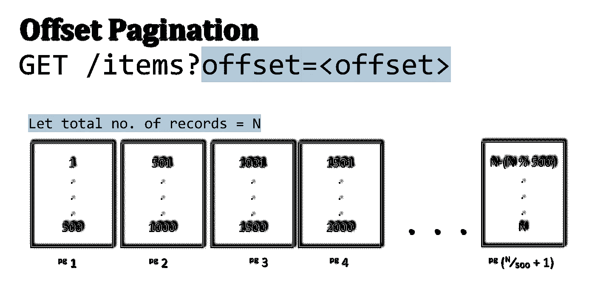
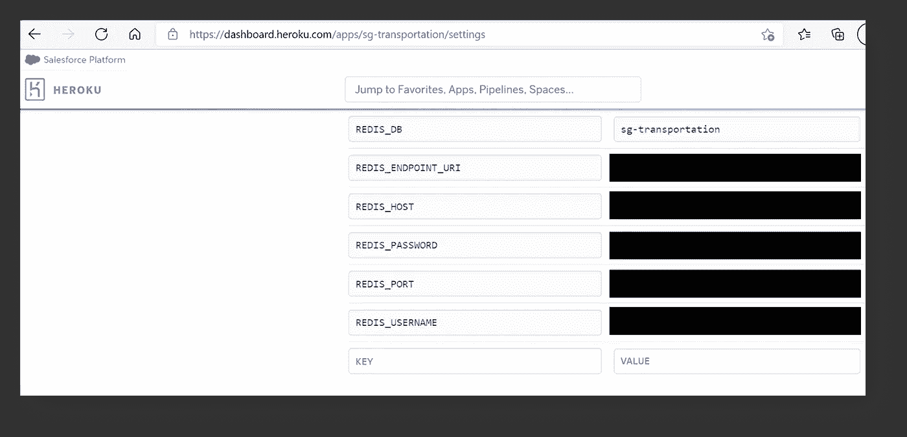
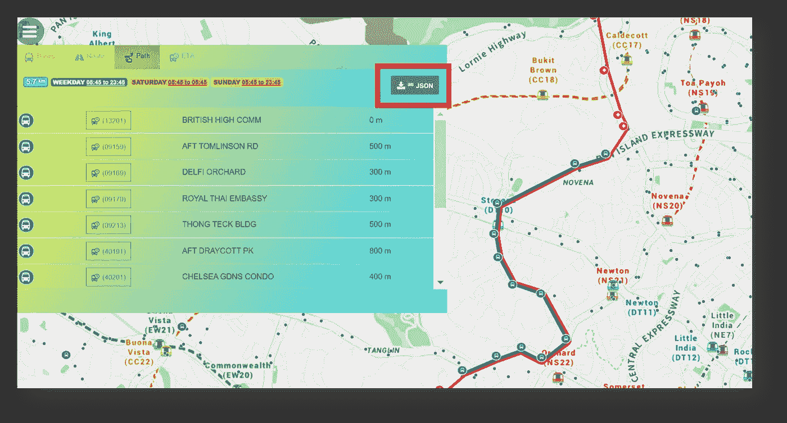

# 解决 Node.js Web APIs 的 Heroku H12 超时错误—处理长响应时间

> 原文：<https://towardsdatascience.com/tackling-heroku-h12-timeout-errors-of-node-js-web-apis-handling-long-response-times-8fbafe46cd40?source=collection_archive---------20----------------------->

## 带有 Redis 缓存的混合(服务器+客户机)API 分页

虽然 Heroku 是 NodeJS 开发人员部署小型项目的一个流行平台，但我还没有遇到任何实用的或深入的解决 h12 请求超时❞问题的方法，这促使我分享我最近处理这个错误的方法。首先，确定这个错误的根本原因是很重要的，即 **Heroku 的 web 服务器被设置为当处理 API 响应的时间超过 30 秒时自动终止 HTTP web 请求(通常是 API GET/POST)**。

> 假设 API 服务器启动并运行，这将可能的方法列表缩小到只有 ***，将每个 API 调用花费的时间减少到 30 秒以内(关键字为*** *❛* ***每个****❜****)****)。*

# 用例:我的公交路线可视化网站

为了更好地理解公共交通通勤者的出行行为，几个月前我受命进行一项分析，其中涉及一系列公共汽车出行的出行链。与大多数自动售检票系统一样，公共汽车从起点到终点的行程是根据乘客的上车和下车信息推断出来的。**因此，这促使我开发了一个** [**公交路线可视化网站**](https://sg-transportation.herokuapp.com/) **，它允许选择始发地——目的地**,以帮助我进行即将到来的公交路线分析:


图片作者|公交路线可视化网站[上的起点-终点选择功能](https://sg-transportation.herokuapp.com/) |注:粉色公交路线指的是完整的公交服务路线。绿色公交路线仅包括特定于用户选择的始发地-目的地的公交车站

虽然数据提供者已经在其[公共 API](https://datamall.lta.gov.sg/content/datamall/en/dynamic-data.html#Public%20Transport) 中包含了空间坐标和公交车站序列，但是考虑到在新加坡有超过 *~* **25K 条唯一的公交路线**，并且每个 API 响应调用**最多返回 500 条记录**，我必须在我的端实现**数据串联**，以便在第一次加载时呈现所有嵌入的公交路线信息**。**

*注意:提供的 API 遵循“偏移分页”格式:*



作者插图|如果偏移量=0，则应检索记录 1-500。如果偏移量=1600，则应检索记录 1601–2100。

# 尝试 1:实现 100%的客户端分页

> 参考一篇关于[客户端 vs 服务器端分页](https://buildthis.com/client-side-vs-server-side-pagination/)， ***客户端分页是指当进行查询时，服务器将所有数据以一大块的形式返回给客户端。***

由于所有可用的总线服务都必须在第一次加载时被检索以供用户选择，所以实现客户端分页的决定是很直观的:


作者图片|首次加载 web 应用程序时侧面板上的公交服务列表

作者的代码片段|用 NodeJs 异步等待语法编写的客户端分页**(服务器端代码，即 app.js)** |数据块的串联(每个数据块的最大记录数=500)在此文件中完成，直到**所有**记录都已聚合，作为数据对象的单个数组返回。

作者代码片段| **实现客户端分页后从前端获取数据**| ` bus _ stops _ mapping obj '是 API 请求后端拼接完成后返回的 JSON 对象

然而，在部署时我很快意识到我必须进行的 3 个主要 API 调用所花费的时间— **(1)公共汽车站**； **(2)公共汽车服务；Heroku web 服务器上的公交路线**比我在本地主机上花费的时间要多得多。

# ⚠这对于 API 调用 **(3)总线路线来说尤其如此，其中最初从数据提供者**检索到超过 25K 条记录，轻松超过触发 H12 超时 error‼ ☹的 30 秒超时规则

# 尝试 2:实现 100%的服务器端分页

> 参考[客户端 vs 服务器端分页](https://buildthis.com/client-side-vs-server-side-pagination/)、**服务器端分页是当托管数据的服务器只返回客户端请求的数据的子集。**

由于服务器超时，在单个聚合数组中返回 **(3) Bus Routes** 的所有记录是不可行的，所以我继续实现服务器端分页，其中多个 Ajax 请求是从前端完成的。每个 Ajax 请求从数据提供者检索 500 条记录，所有聚合代码逻辑都转移到了浏览器端:

作者代码片段|在 NodeJS 中使用异步等待语法的服务器端分页**(服务器端代码，即 app.js)** |从数据提供者调用每个数据块(每个数据块的最大记录数=500)并返回到前端|变量` client_offset '确定从数据提供者调用 API 的哪个'页面'

作者代码片段| **实现服务器端分页后从前端获取数据**| ` service _ routes _ mapping obj '是通过` callAPI()`函数聚合所有 API 请求后返回的 JSON 对象

# 虽然最终解决了 H12 错误，但用户体验受到了影响，因为初始加载速度慢得令人失望**😐**

# 尝试 3:实现混合(客户机+服务器)分页

为了减少从前端发出的调用数量，我尝试在客户端和服务器数据请求量之间取得平衡，而不是直接从后端向前端返回 500 条记录进行聚合。最终，我决定将 500 条记录的每个 API 请求聚合到服务器(app.js)代码中的多个数组中，其中每个数组包含 5000 条记录，并返回到前端进行处理:

作者的代码片段|在此版本的“app.js”中设置了一个附加变量“LIMIT_PER_CALL ”,以便在返回数组以便在前端进一步聚合之前预聚合数据对象

作者代码片段| **实现服务器端分页后从前端**取数据| `service_routes_mappingObj '是通过` callAPI()`函数聚合所有 API 请求后返回的 JSON 对象。|请注意，与以前版本的“100%服务器端分页”相比，变量“PAGE_SIZE”已被设置为 5000，而不是 500。然后，每个最大 5000 条记录的数组在前端进一步聚合所有 25K 条公交路线记录。

# 使用 Redis 缓存提升整体性能

虽然我最终设法平衡了服务器端和客户端发送的 API 请求的数量，但为了进一步改善用户体验，我决定通过 [Redis 缓存](https://redis.com/)存储 API 结果，这样在初始加载之后，同一用户的后续访问将使相同的 API 结果能够通过 Redis 实例检索到，并最大限度地减少加载时间。要集成 Redis 缓存，首先需要在[https://redislabs.com/](https://redislabs.com/)设置一个 Redis 账户*(自由层版本存储 30MB)*。关于设置 Redis 帐户的详细步骤，可以在 [Host 和免费使用 Redis-DEV 社区](https://dev.to/ramko9999/host-and-use-redis-for-free-51if)获得由 [Ramki Pitchal](https://ramapitchala.medium.com/) a 撰写的深入文章🙃

检索 Redis 凭证后，Redis 节点包通过`npm install redis`安装并导入到服务器文件(app.js)中。所需的 Redis 凭证在一个`.env`文件中指定，该文件默认包含在`.gitignore`文件中。 **⚠这一点非常重要，因为这些凭证是保密的，不应该以纯文本形式暴露给其他人来窃取和利用开发人员的帐户。该规则适用于其他令牌，如 Google API 密钥或其他 API 访问密码。为了通过文件检索凭证，还应该安装 dotenv 节点包，并将其作为** `**require("dotenv").config()**` **包含在服务器文件中。**为了成功连接到 Redis 实例，`.env`至少应该包含以下内容:

```
REDIS_USERNAME=<email linked to Redis account>
REDIS_PASSWORD=<password token linked to Redis account>
REDIS_ENDPOINT_URI=<Redis instance endpoint provided>
REDIS_DB=<name used to refer to the Redis instance>
```

作者代码片段|注意，代码首先检查 API 请求调用的结果是否存储在 Redis 实例中。**如果是，则检索并返回缓存的值。**否则，将对数据提供者进行 API 调用，同时**将结果的副本存储在 Redis 实例中**

考虑到新加坡公交路线的偶尔变化，我决定将 Redis 内存存储设置为 60 天后(约 2 个月)到期。在将其部署到 Heroku 服务器上的生产环境之前，**Redis 凭证必须在 Heroku 的服务器配置页面** *进行配置(因为。env 文件用于在开发环境中进行测试)*:



Image by Author |注意，变量的命名应该与它们在。环境文件

耶！我的 web 应用成功部署到 Heroku 上，没有出现 H12 超时错误:



图片作者|预览目前部署在 Heroku 上的[公交路线可视化应用](https://sg-transportation.herokuapp.com/)

**关于构建该应用的基本原理的小说明:**虽然有其他可用的公交路线可视化网站，但我无法找到任何可供用户检索特定公交路线数据的导出功能，以便自定义始发地-目的地配对。哦，威尔斯…

**参考消息:完整的源代码可以在** [**我的 GitHub repo**](https://github.com/incubated-geek-cc/sg-transportation) **找到，该应用程序目前部署在:**[https://sg-transportation.herokuapp.com/](https://sg-transportation.glitch.me/)

非常感谢您的阅读，如果您想阅读我即将发布的应对工作挑战(包括人员和技术问题)的文章，请跟我来！会非常感激😀

[](https://geek-cc.medium.com/membership) [## 通过我的推荐链接加入灵媒——李思欣·崔

### 获得李思欣·崔和其他作家在媒体上的所有帖子！😃您的会员费直接…

geek-cc.medium.com](https://geek-cc.medium.com/membership)